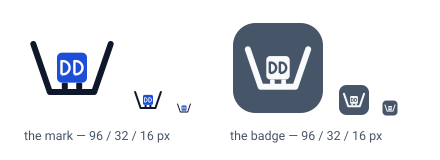

# Drydock brand mark — design note

**Status: settled, v1.1.** Battered basin, container, `DD` stencilled on its face, steel badge.
v1.1 adds the GitHub App logos — the same geometry, no change to the mark. Remaining work is a
wordmark, which is a separate asset.

This note covers one asset: the Drydock icon. It exists because Phase 1 ships a LAN-facing web UI that
needs a favicon and a header mark, and because `claude.ai/code?environment=<id>` sends people back and
forth between the Claude app and Drydock — the tab has to be identifiable at 16 px.

<picture>
  <source media="(prefers-color-scheme: dark)" srcset="icons/01-mark-dark.svg">
  
</picture>

**Fig 1** — the two forms the product ships. The bare mark is for in-page use, where the ground is
already known; the badge brings its own ground, for the favicon and anywhere the surface belongs to
someone else. Note what happens across the size ramp: the stencilled letters are a header-size detail
and are gone by 20 px, while the badge keeps a shape all the way down.

## The idea the mark encodes

A dry dock is a basin you float a ship into and then **drain**. The water leaves, the hull settles onto
keel blocks, and work that is impossible afloat becomes ordinary: you can walk under the thing and
change it. The dock is not the ship and it does not sail — it is the prepared, isolated, drained place
where the ship is worked on.

That is exactly what Drydock is to a repo. A workspace is a clone on host disk, a container brought up
around it, and an agent inside with scoped credentials — a prepared place where work on the repo
happens, separate from the repo itself. The container survives nothing; the clone survives rebuild and
delete (§1 of the overall design). The dock persists, the vessel comes and goes.

So the mark is a **section through a drained basin** with a **container resting clear of the floor on
keel blocks**. The container does double duty on purpose: it is the vessel in the dock and it is the
dev container. The gap under it is the whole point of a dry dock — it is fixed at 2.1 units and no
revision was allowed to spend it.

The `DD` is stencilled on the container's face because that is what real containers carry: the owner's
mark, painted on the side. It is the one placement where the letters do something the subject actually
does.

Rejected, with reasons worth keeping:

- **A whale, or anything Docker-adjacent.** Drydock shells out to the `devcontainer` CLI and treats
  Docker as an implementation detail it never scrapes. Borrowing Docker's animal would claim a
  relationship the design explicitly refuses.
- **An anchor, a wheel, a porthole.** Nautical decoration with no mapping to anything in the system.
  An anchor is for holding a vessel in place at sea; it is the opposite of a dry dock.
- **A waterline.** Every version read as "harbour" rather than "dry dock". The drained basin is the
  distinguishing feature, and drawing water in it destroys the only idea the mark carries.

## Assets

| File | What it is | Where it is used |
| --- | --- | --- |
| `icons/drydock-mark.svg` | The mark. Self-adapting light/dark | Header, in-page, README |
| `icons/drydock-badge.svg` | The mark knocked out of a steel rounded square | Favicon, app icon |
| `icons/drydock-mark-mono.svg` | One colour, inherits `currentColor` | Buttons, disabled states, print |
| `icons/01-mark-{light,dark}.svg` | Fig 1 above, as a light/dark pair | Markdown `<picture>` embedding |
| `icons/apple-touch-icon-180.png` | Full-bleed badge, 180 px | `<link rel="apple-touch-icon">` |
| `icons/favicon-{16,32}.png` | Badge with its corners, transparent outside | Fallback favicons |
| `icons/github-app-200.png` | Full-bleed badge on lifted steel, opaque, 200 px | Logo of the App `krelinga-drydock` |
| `icons/github-app-dev-200.png` | The same, inverted: steel mark on the knockout | Logo of the App `krelinga-drydock-dev` |
| `render-icons.mjs` | Regenerates the PNGs from the geometry | Re-run after any path change |

The three SVGs each carry their light palette as presentation attributes *and* a `<style>` block that
overrides it under `prefers-color-scheme: dark`, so a renderer that strips `<style>` still gets the
light mark rather than a black silhouette.

The PNGs are rasterised by `render-icons.mjs` from the same numbers as the SVGs — every shape in the
mark is expressible as a signed distance, so the renderer is about a hundred lines with no dependency
on a rasteriser being installed. **The two are not generated from one source.** If a path in `icons/`
changes, change it in the renderer too and re-run; nothing will warn you when they drift.

## How each decision was reached

Four questions were settled in order, each by measurement where measurement was possible. The
alternatives are all in git history.

### The basin: battered

v1 drew stepped walls — one altar step per side, every corner square — and was rejected for its right
angles. Three replacements were drawn with none: **battered** (straight walls battered inward to a flat
floor, joining at 109°), **cradle** (one smooth curve), and **flared** (a curve with lips leaning 8°
open). Battered won.

Worth recording what the steps were doing, because nothing since has it: they read as *masonry* — cut,
built, load-bearing — and they were the detail that made the enclosure say *dock* rather than bowl or
bin. Battered keeps most of that, since battered walls are what real dock walls do.

The measured finding from that round: the curved basins needed their horizontal control arm at x 5.5.
At the first-draft 8.5 the curve rose into the keel-block zone, cutting side clearance to the container
to 0.99 and the air gap under it to 1.71 — the curve was quietly closing the gap the whole mark depends
on.

### The letters: stencilled, not structural

A `D` reads as a `D` at a width-to-height ratio of roughly 0.6–0.8. Below that it reads as a leaf. That
one number decided where letters could go:

| Placement | Letter box | w : h | Verdict |
| --- | --- | --- | --- |
| Basin wall, bowl on the full wall | 5.4 × 16 | 0.34 | Reads as a leaf |
| Basin wall, bowl on the top half | 4.5 × 8 | 0.56 | A `D` with a leg — closer to a thorn |
| Vessel drawn *as* two `D` blocks | 5.55 × 8 | 0.69 | Reads, but the vessel stops being a container |
| **Stencilled on the vessel's face** | 3.5 × 5.2 | **0.67** | **Chosen** |

Letters in the basin walls were tried first and are the only version that would survive to 16 px,
because the walls *are* the silhouette. They fail on two structural counts: the proportions above, and
the fact that a symmetric basin needs mirrored walls while a mirrored `D` is not a `D`. Making both
face the same way means an asymmetric dock with one wall shelved inward and the other bulging outward,
which stops reading as a basin at all.

The price of the stencil, paid knowingly: the letters are a header-size detail. By 32 px they are a
texture and by 20 px they are gone.

### The badge ground: steel

A badge brings its own ground, which is the whole reason to have one — it stops depending on a page
whose colour Drydock does not control. But the badge still *sits* on that page, so its ground has to
hold an edge against **four** surfaces, not two: a white page, a light tab strip, a near-black page,
and a dark tab strip.

Measuring that kills the obvious answer, a dark navy badge. Drydock's own ink scores **1.05** against a
dark page, which is to say it is the same colour.

| Ground | White page | Light strip | Dark page | Dark strip | Worst |
| --- | --- | --- | --- | --- | --- |
| **Steel `#475569` → `#64748b`** | 7.58 | 6.92 | 3.93 | 3.39 | **3.39** |
| Dock teal `#0f766e` → `#0d9488` | 5.47 | 5.00 | 5.00 | 4.31 | 4.31 |
| Accent blue `#1d4ed8` → `#2563eb` | 6.70 | 6.12 | 3.62 | 3.12 | 3.12 |
| Violet `#6d28d9` | 7.10 | 6.49 | 2.64 | 2.27 | 2.27 |
| Graphite `#334155` | 10.35 | 9.45 | 1.81 | 1.56 | 1.56 |
| Ink navy `#0f172a` | 17.85 | 16.30 | 1.05 | 1.11 | 1.05 |

Steel is a deliberate choice against the brand-colour instinct: a dock is a grey structure, and a
neutral badge leaves `#1d4ed8` to go on meaning *API traffic* in the architecture diagrams and
`#6d28d9` to go on meaning *preview origin*, rather than making a brand colour and a semantic colour
the same colour. The known cost is that a grey badge in a tab strip can read as a page that has not
finished loading; the small luminance lift in dark mode is there to fight that.

**The badge is a single knockout, and measurement forced it rather than taste.** Keeping the accent
container and knocking the letters out in the badge ground gives a contrast of **1.00** on a blue
badge — the letters and the ground are then literally the same colour — and 1.82 even with a lifted
blue. So on the badge the container is the near-white and the letters are the ground. One consequence:
the basin, keel blocks and container are all the same near-white, and because the blocks touch both the
container and the floor they merge into one mass. The air gap survives as three holes of ground colour
under the vessel.

If that flattening ever matters, exactly one two-tone survives the numbers: drop the **basin** to
`#93c5fd` and keep the vessel at full knockout. Every paler tint lands within 1.4 of white, too close
to separate from the vessel. It must be a fixed value rather than a themed one, or the hierarchy
inverts between themes.

### The GitHub App logo: full bleed, opaque, lifted steel

The two GitHub Apps — `krelinga-drydock` and the CI-only `krelinga-drydock-dev` — each carry a logo
(PNG, under 1 MB, 200 × 200 recommended). GitHub shows it on the App's page, in installation lists,
and as the bot's avatar beside commits and comments, down to about 20 px, on both its light canvas
(`#ffffff`) and its dark one (`#0d1117`).

**Badge, full bleed.** It is a surface that belongs to someone else, so it is the badge — and like iOS
with the apple-touch icon, GitHub applies its own corner rounding to the square it is given. Corners
of our own would be rounded a second time inside GitHub's, leaving a transparent sliver around a
smaller tile. So `bleed`: the ground fills the square and GitHub supplies the shape.

**Opaque.** One image is shown on both themes. A transparent logo would be the bare mark on a page
Drydock does not control, which is the situation the badge exists to avoid — the ink navy that scores
1.05 against a dark page is the same failure.

**Lifted steel, `#64748b`, not `#475569`.** The favicon's steel switches value with the theme; an
uploaded PNG cannot, so it has to hold an edge against both canvases at once. Measured:

| Ground | Light `#ffffff` | Dark `#0d1117` | Worst edge | Mark at 20 px |
| --- | --- | --- | --- | --- |
| **Lifted steel `#64748b`** | 4.76 | 3.98 | **3.98** | 4.46 |
| Steel `#475569` | 7.58 | 2.50 | 2.50 | 7.06 |

The last column is the brightest pixel of the mark against the tile after a 10× box downscale of the
committed 200 px file, which is roughly what GitHub's `?s=20` serves. The lifted value trades knockout
contrast it can spare (7.06 → 4.46) for the edge it cannot (2.50 → 3.98, against the 3:1 a graphical
object needs). It is already the palette's dark badge value, so nothing new is introduced.

**The dev App gets a variant: the same image, inverted.** Ground `#f8fafc`, mark `#475569`, the
stencil knocked out in the ground — the badge's single knockout, mirrored. Both Apps are listed side
by side in the account's App and installation settings, and those are exactly the pages where acting
on the wrong one is costly (permissions, a new private key). The names differ only by a suffix that
is truncated first; a logo that differs at a glance is cheap insurance.

The variant is a **value** swap rather than a new hue, because the colour rules above leave no hue
to spend:

- `#1d4ed8` and `#6d28d9` mean *API traffic* and *preview origin*; the diagrams' green, amber and
  brick mean healthy, in-progress and failed. Dock teal measured well as a ground (worst 4.31 in the
  badge table) but sits next to the diagrams' green and would make "the dev App" look like "running".
  Amber is the usual staging colour and is already *degraded*.
- A `DEV` label or corner flag fails at the size that matters: the stencilled letters are gone by
  20 px, and a corner flag is the first thing GitHub's rounding crops.
- At 20 px a dark tile and a light one are still two different objects. Two hues at similar value
  are not.

The cost, accepted: on GitHub's light canvas the dev tile's edge is 1.05 — it reads as the bare mark,
which itself scores 7.58 against the page and 6.92 against its ground at 20 px. On the dark canvas the
edge is 18.09. The absence of a tile on a light page *is* the distinguishing feature, so it is not
mitigated; GitHub's own 1px avatar border recovers some edge, but nothing here relies on it.

### The one-colour form drops the letters

At one colour there is nothing for a stencil to be knocked out *of*. An outlined container with
same-colour letters inside it is mush by 24 px, which is the size that form exists to serve — so
`drydock-mark-mono.svg` carries the basin, the blocks and an outlined container, and no `DD`.

## Construction

- **32-unit `viewBox`**, 2 units of clear space on every side. Everything is placed on halves of a unit
  so a 16 px render lands on pixel edges rather than straddling them.
- **Basin:** `M3.1 8 8.6 24H23.4L28.9 8`, stroke 2 units, round caps and joins — 1 px at a 16 px render.
- **Container:** 10 × 10 at x 11, y 10.9, corner radius 1.6. **Keel blocks:** 2 × 2.2 at x 12.6 and
  17.4, overlapping the floor stroke by a tenth of a unit so no hairline seam opens up at fractional
  zoom. **Air gap:** 2.1 units, constant across the vessel's underside.
- **Letters:** a stem, a flat run, then a semicircular bowl whose radius is exactly half the letter
  height — making the bowl a true half-circle means the letter cannot go lopsided when resized. 3.5 ×
  5.2 behind a 0.8-unit stroke, 1.1 clear of the container's edge, centred on the container's own
  centre at y 15.9.
- **Badge:** `rect x=1 y=1 w=30 h=30 rx=7.5` — one unit of bleed inside the box, 25% radius. iOS masks
  the apple-touch icon to its own shape regardless, so this radius governs the favicon and direct SVG
  use only; `apple-touch-icon-180.png` is therefore rendered full-bleed with no corners of its own.
- **Mark inside the badge:** scaled `0.78` about the centre. The mark's ink is 27.8 × 18 units, so
  width is the binding constraint; 0.78 leaves 4.16 units of padding, about 14%, in line with how
  platforms pad app icons.
- **Stroke compensation:** every stroke inside the badge is divided by the scale so the knockout keeps
  the weight it has at full size — the basin's 2 units become `2.56`, the stencil's 0.8 becomes `1.03`.
  Skipping this is the usual way a scaled-down mark comes out visibly thinner than its standalone
  version.
- **Symmetry** is checked rather than eyeballed: every paired element sums to 32 across the mark.

Two measured near-misses, kept because both are easy to reintroduce:

- A round cap reaches a full unit past its endpoint in every direction, so **lip positions are set by
  the cap, not the path**. This is why the battered lips sit at x 3.1 rather than 3.5.
- An outlined element has to pay for its stroke out of its own box. An early outlined container kept
  the 10-unit footprint and overlapped its neighbour by 0.1 units; the fix is to shrink the path rect,
  not the spacing.

## Palette

Taken from the design diagrams (`docs/design/*/diagrams/`) so the icon and the documentation are
visibly the same product; the badge ground is the one addition, reasoned above.

| Role | Light | Dark |
| --- | --- | --- |
| Ink | `#0f172a` | `#e2e8f0` |
| Accent | `#1d4ed8` | `#60a5fa` |
| Ground | `#ffffff` | `#0b1220` |
| Badge ground | `#475569` | `#64748b` |
| Badge knockout | `#f8fafc` | `#f8fafc` |
| Basin tint, if ever two-tone | `#93c5fd` | `#93c5fd` |
| GitHub App ground (one PNG, both themes) | `#64748b` | `#64748b` |
| Dev GitHub App ground / mark | `#f8fafc` / `#475569` | `#f8fafc` / `#475569` |

The knockout is a hair off pure white so it does not vibrate against a saturated ground.

## Still open

1. **A wordmark.** The letters always read beside the mark and never inside it — the stencilled `DD`
   is gone by 20 px. A lockup, the mark plus "Drydock" set alongside, is the only thing that makes the
   name unambiguous at any size, and the UI header needs one regardless. Separate asset, separate
   round.
2. **The `>_` prompt payload.** An early variant put a shell prompt on the container's face — the
   *session* rather than the *workspace*. It lost to the letters for the same surface, and is worth
   revisiting only if the UI ever needs a second mark meaning "a session is live".

## When the mark changes

`icon-preview.html` renders every form on both grounds down to 16 px, in a simulated tab strip beside
the Claude and GitHub favicons, with the measured clearances and contrast ratios. Re-render it after
any geometry change — it is what caught every measured problem in this note. Then re-run
`render-icons.mjs` so the PNGs do not drift from the SVGs.

Accessibility: every file carries `role="img"` with `<title>`/`<desc>` referenced from
`aria-labelledby`. Inline uses in the UI should set `aria-hidden="true"` when adjacent text already
names the product, so the mark is not announced twice.
