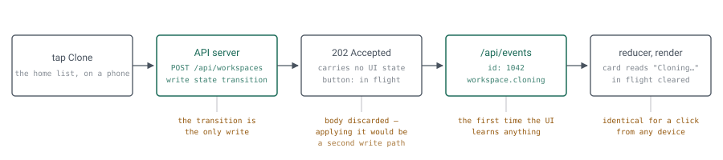
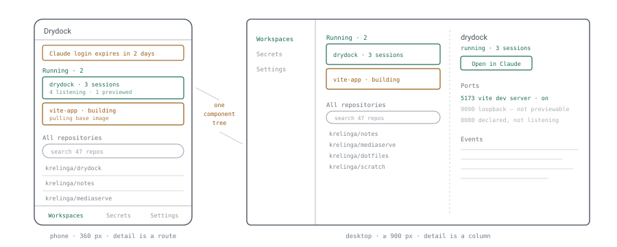
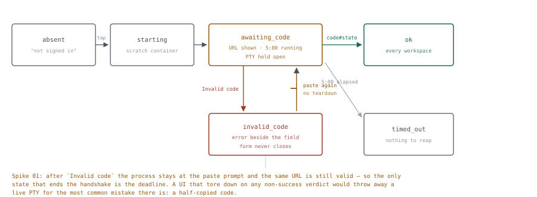

# Drydock frontend

*A Vue single-page app, built once and embedded in the Go binary, whose central design rule is that it owns no state machine of its own: every mutation is a `202` and a wait, and the server's event stream is the only thing that ever changes what you see.*

**Status** living design document — its history is the git log (`git log -p -- docs/design/frontend/frontend-design.md`).

**Runtime** no runtime. A `dist/` directory in `go:embed`, served from the same Unix socket as the API

**Reach** phone, tablet, laptop on the LAN, behind Caddy — mobile-first, not mobile-tolerant

**Out of scope** a web terminal · a session browser · a file browser or editor · theming · i18n · offline use

## 1. Problem & goals

The overall design says the UI is "a list and a button" and then, correctly, spends its pages on the parts that are hard: the broker, the supervisor, the login handshake. What it leaves implicit is that **the UI is where every one of those mechanisms becomes legible or doesn't**. Ten workspaces going dark because one shared credential was blanked (§7.1) is an architectural footnote and a 2am support call; which one it becomes is a frontend decision.

Five flows carry essentially all the value. Everything else in this document exists to serve them.

| Flow | Where it happens | What makes it hard |
|---|---|---|
| **Glance.** Is anything broken, and what is running? | Home list, from a phone, in five seconds | Two state machines per workspace (§4 `workspace` and `supervisor`) must collapse into one honest badge |
| **Clone.** Pick a repo, tap once, watch it come up. | Home list → workspace detail | Three minutes of build with nothing to show but events; a double tap must not make two clones |
| **Hand off.** Open the workspace in the Claude app. | Workspace card → `claude.ai/code?environment=env_…` | The link is useless if the supervisor is `awaiting_login`; the card has to say which thing to fix |
| **Sign in to Claude.** The §7.2 handshake. | A dedicated view, usually on a phone | It spans an app switch — the page may be discarded between showing the URL and pasting the code |
| **Stop something.** Free capacity, or clean up. | Card action → confirm | Destructive, and the live session count is the only thing that makes it an informed choice (§12) |

### Functional requirements

- **One home screen** that answers "what is running, what is wrong" above the fold on a 360 px viewport, and holds the repo catalog below it.
- **Live without refreshing.** Every state change arrives on the SSE stream; nothing polls, and nothing requires a reload to become true.
- **Survive the network.** A dropped stream reconnects, replays what it missed, and says so — it does not silently show stale state.
- **The login handshake, reliably.** Including the case where the operator leaves the tab to authorize and comes back to a reloaded page.
- **Secrets with the friction intact.** The `reach` field and the grant decision are the security control (§10.4); the form is where that control actually lives.
- **Ports without a prompt.** Ambient counts, decisions made in a panel the operator opened (port forwarding §8.2).
- **Say what §12 says.** Every failure mode in the overall design has a specific sentence. The UI uses that sentence, not a generic one.

### Non-functional targets

| Dimension | Target | Why this number |
|---|---|---|
| Initial JS, gzipped | < 100 KB | Vue + router + store is ~40 KB of it. The rest is a budget, enforced in CI, so the list screen never grows a chart library. |
| First meaningful paint | < 1 s on a four-year-old phone | Served off the LAN by a Go binary, so the network is free and the only cost that can grow is parse and hydrate. |
| Smallest supported viewport | 360 × 640 | A phone in a case in one hand. The design target, not the degraded case. |
| Browsers | Last two majors of iOS Safari, Chrome, Firefox | `__Host-` cookies, `SameSite`, `EventSource`, and `dvh` units all assume current-ish. iOS Safari is the binding constraint. |
| Largest list | ~50 repos, ~15 workspaces (§1) | Two orders of magnitude below needing virtualization. Plain `v-for`, and the budget above is what keeps it that way. |
| Offline capability | None, deliberately | §7. A cached shell for a tool whose entire content is live server state is a liability. |
| Build output | One `dist/`, embedded | No Node on the dev server, no second thing to supervise, no static-file route to misconfigure. |

### Non-goals

- **Not a terminal.** §1 of the overall design already rules this out. Interactive work happens in the Claude app; the UI shows status and the one handshake that cannot be automated.
- **Not a session browser.** §8 is explicit: a count and one link. The Claude app is better at browsing sessions and keeping a mirror of remote state accurate buys nothing.
- **Not an iframe host.** No preview is ever embedded in the UI. §8 explains why this is a security decision and not a layout preference.
- **Not themeable, and not localized.** One operator, one language, two color schemes driven by `prefers-color-scheme`. A theme picker is a setting to maintain for an audience of one who already has an OS-level one.
- **Not a component-library showcase.** About twelve components carry the whole app. §3.1 argues that is below the threshold where a framework pays for itself.
- **Not server-rendered.** There is no crawler, no cold-start SEO concern, and one authenticated user. SSR would add a Node runtime to a design whose shipping story is a single static binary.

## 2. Binding constraints

The frontend analogue of §2. Five facts, none of them a preference, and the first one determines the shape of everything else.

### 2.1  Every mutation is `202`, so the client has no idea what happened

> [!WARNING]
> **Load-bearing constraint**
>
> §5: *"Every mutating call is asynchronous: it validates, writes a state transition, returns `202` with the workspace, and lets the client follow along on the stream."*

A `202` is not a result. It means the request was accepted and that the consequences will arrive later, out of band, on a stream that may not even be connected at that moment. So the reflex most Vue apps are built on — mutate, await, patch the store from the response, render — is unavailable here, and faking it is worse than not having it.

This kills the obvious implementation: a store where `stopWorkspace()` sets `state = 'stopped'` on success. That store would be lying a quarter of the time (the stop can fail at the container step), and it would diverge the moment a second device did anything. The rule that replaces it is §4's whole subject: **the frontend invents no state.** A click produces exactly one piece of local state — *a request is in flight* — and everything else is rendered from what the stream said.

The payoff is worth stating because it is the reason this is a feature rather than a tax: **the UI renders your own click through exactly the same path as another device's.** There is no second code path to keep consistent, no "did I do this or did my laptop" ambiguity, and reloading mid-operation loses nothing.

### 2.2  The session cookie is invisible to JavaScript

`__Host-drydock` is `HttpOnly` (§13.2), which is correct and means the app cannot ask whether it is signed in. There is no token to inspect, no expiry to read, no decode. The only way to know is to make a request and see whether it comes back `401`.

So authentication state is *derived from traffic*, not stored: the app boots by calling `GET /api/auth/session`, and a global fetch wrapper treats any `401` from anywhere as the authoritative "you are signed out now" — including the `401` that arrives mid-session when the 14-day idle window lapses while the tab was in the background.

### 2.3  `EventSource` cannot tell you why it failed

This one is a genuine trap. `EventSource.onerror` carries no status code and no body. Worse, the two failures that matter look nothing alike in consequence but arrive at the same callback:

| What happened | `readyState` after the error | Right response |
|---|---|---|
| Wifi dropped, Caddy restarted, laptop slept | `CONNECTING` — the browser is already retrying | Nothing visible for a few seconds. Then a quiet "reconnecting" marker. Never a modal. |
| `401` — the session expired | `CLOSED` — per spec a non-200 fails the connection permanently and does **not** retry | Classify it with an ordinary `fetch`, then show sign-in |

Reading `readyState` distinguishes them, and a probe request confirms it. Getting this wrong produces one of two bad apps: one that flashes a scary banner every time a phone changes cell, or one that sits on a dead stream showing confidently stale state forever. §4.3 specifies the handling.

The second half of the same constraint: a reconnect is a *gap*, and events that occurred during the gap are gone unless the server replays them. `EventSource` sends `Last-Event-ID` automatically if the server sets `id:` on each event — which the schema already supports, since `event.id` is an autoincrementing integer. §4.5 makes that a requirement rather than an accident.

### 2.4  The login handshake spans an app switch

§7.2 step 3: the operator authorizes in *their own browser* and gets a code. On a phone, that is a tab switch or an app switch, and iOS Safari is free to discard the backgrounded page. So any design that keeps the handshake's identity in a JavaScript variable — or in `sessionStorage`, which survives less than people assume — produces a UI that comes back from the authorize step with no idea what it was doing, holding a code it cannot submit.

The fix is the same rule as 2.1, applied to the handshake: the server owns it, at most one is in flight, and the client re-reads it (§4.5). The client persists nothing. Notably it must not persist a *draft of the code* — a one-time credential in `localStorage` is precisely the artifact §13.5's redaction rule exists to prevent.

### 2.5  No secret, token, or value ever comes back

§13.5: *"Nothing returns or pre-fills a stored secret value. No route, response body, SSE event or form carries one back out: not to pre-fill an edit form, not for a 'reveal' button, not behind a re-auth prompt."* An edit form for the metadata, and an empty field that writes a new value, are allowed; the stored value travelling back out is what is not. This is a frontend constraint as much as an API one, because the pressure to break it comes from the UI side: an edit form naturally wants to prefill, and a rotation naturally wants to show what it is replacing.

It does neither. The secret form is write-only, the rotate form opens empty and says so, and there is no component in the app that can render a secret value because none is ever in the store. The same applies to GitHub tokens (there is no route) and to the Claude login code (it goes up, never comes back down).

## 3. Shipping shape

One Vite build, output embedded. Nothing is served from a CDN, nothing is fetched at runtime from anywhere but Drydock's own origin, and there is no Node process on the dev server.

```
web/                           # not shipped; built
  index.html
  src/
    main.ts                    # mount, router, store install
    app.vue                    # shell: nav, banner slot, <router-view>
    routes.ts
    api/
      client.ts                # the fetch wrapper: 401, Origin (and the referrer policy it needs), error envelope
      stream.ts                # EventSource lifecycle, replay, classify
      types.ts                 # generated from the Go types; see §4.5
    stores/
      session.ts               # auth state, device list
      catalog.ts               # repos + joined workspace state
      workspaces.ts            # workspace detail, supervisor, ports, events
      secrets.ts
      identity.ts              # Claude login state — fleet-wide (§6.6)
      stream.ts                # owns the EventSource; the only writer
    components/                # ~12; see §6
    views/
    styles/
      tokens.css               # the design system, such as it is (§3.1)
      base.css

internal/web/
  embed.go                     # //go:embed dist
  dist/                        # build output, committed (see below)
```

**`dist/` is committed** (settled in v5, when Phase 1 built it). The constraint was always that **the Go build must not require Node**, and of the two answers that honor it, a committed `dist/` is the one that also keeps `go install`, a plain `go build`, and the release workflow free of a Node step — the release builds from the tag with Go alone. The cost of committing build output is drift: a binary could ship a UI no source in the repository describes. `npm run check:dist` closes that by rebuilding into a scratch directory and failing on any byte of difference, and CI runs it on every pull request. Never hand-edit `dist/`; change the source and rebuild. A `go generate` that shells out to `npm` remains ruled out.

#### Serving it

Three rules, and the second one is the bug everyone writes once.

1. **Hashed assets are immutable.** Vite emits `app-4f3c1a.js`; serve those with `Cache-Control: public, max-age=31536000, immutable`.
2. **`index.html` is `no-store`.** It is the only unhashed file and it names the hashed ones. A cached `index.html` after a Drydock upgrade requests assets that no longer exist, and the app fails to boot in a way that looks like a server problem.
3. **The SPA fallback must not swallow `/api`.** Unknown paths under `/api/` return a JSON `404`; unknown paths elsewhere return `index.html`. Falling back on `/api/typo` hands the fetch wrapper an HTML document to parse as JSON, and the resulting error names neither the route nor the typo.

`/preview/authorize` (port forwarding §6) is a server handler on this mux, not a client route — it issues a `302` and must never reach the SPA fallback.

### 3.1  Choices worth defending

- **Framework — Vue 3, Composition API, `<script setup>`, TypeScript.** Requested, and a good fit: the app is mostly one list and one detail view reacting to a push stream, which is reactivity's home turf. TypeScript is not ceremony here — the store is a reducer over a dozen event kinds against a normalized entity map, which is exactly the code where a wrong field name fails silently and late. Types are generated from the Go structs (§4.5) so the contract has one source.
- **Build — Vite, single bundle, no SSR.** Two lazy chunks (secrets, logs) and nothing else split; at this size route-level splitting costs more in round trips than it saves in parse.
- **Store — Pinia, with one store owning the stream.** Not because the app needs a state-management library for its size, but because §4's architecture is "one writer, many read models", and Pinia makes that shape explicit and testable. The reducer is the single most test-worthy unit in the frontend (§10) and it wants to be a plain function in a store, not logic smeared across components.
- **Router — `vue-router`, history mode.** History rather than hash because the UI is a real origin with a real certificate and deep links into a workspace are genuinely useful — "the build failed, look" is a URL you paste to yourself. The cost is the fallback rule above, which is five lines.
- **Styling — plain CSS with design tokens, scoped per component. No utility framework, no component library.** The honest comparison: twelve components is roughly six hundred lines of CSS, which is less than the configuration and class-soup surface of the alternatives, and it reads as a diff. Tailwind's productivity argument is real but it is a velocity argument, and the binding constraint here is *legibility to whoever (or whatever) reads this code in six months*, where one tokens file beats utility classes inlined across thirty templates. A component library (Vuetify, PrimeVue, Quasar) is ruled out harder: all three cost more in bundle than the entire budget in §1 and all three impose a mobile idiom rather than letting §7 pick one.
- **Fonts — the system stack, no webfont.** `system-ui, -apple-system, Segoe UI, Roboto, …`, which is also what the design doc's diagrams use, so the UI and its documentation look related. Zero network, zero layout shift, and nothing to add to the CSP.
- **No runtime dependency beyond `vue`, `vue-router`, `pinia`.** Everything else — date formatting, the few hundred bytes of relative-time logic, the clipboard call — is written. Three dependencies is an auditable surface for an app behind the only credential standing between a device on your wifi and code execution on your dev server (§13.5).
- **Color scheme — `prefers-color-scheme`, no toggle.** Light and dark token blocks, same convention as the diagrams.

### 3.2  The loop everything goes through

<picture>
  <source media="(prefers-color-scheme: dark)" srcset="diagrams/01-mutation-loop-dark.svg">
  
</picture>

**Fig 1** — *The `202` is a receipt, not a result. Between the tap and the first event the UI knows one thing — a request is outstanding — and it says exactly that. Because the render path begins at the event and not at the response, the UI behaves identically whether the click came from this device, the laptop in the next room, or a `curl` on the host; and a reload mid-operation loses nothing, because there was nothing local to lose.*

## 4. State architecture

### 4.1  One writer

The stream store is the only thing that writes entity state. Everything else reads.

```
EventSource ──▶ stream store ──▶ reducer ──▶ normalized entities
                     │                          │
POST/PATCH ──────────┘ (in-flight set)          └──▶ catalog / workspaces /
                                                      secrets / identity (read models)
```

| Store | Owns | Written by |
|---|---|---|
| `stream` | The `EventSource`, connection phase, last seen event id, the in-flight request set, the normalized entity maps | Itself, from events and from request lifecycle |
| `catalog` | Repos joined to workspace state; search and sort for the home list | Read model over entities; refetched on `repo.*` events |
| `workspaces` | The detail view's composition: supervisor, environment id and capacity fraction, ports, recent events, disk | Read model; fetches `GET /api/workspaces/:id` on entry, then lives off the stream |
| `secrets` | Names, reach, grants, last access. Never a value. | Fetch + `secret.*` events |
| `identity` | Claude login state for the whole fleet, and the in-flight handshake | Fetch + `auth.*` events |
| `session` | Signed-in-ness, device list | `GET /api/auth/session`, and any `401` from anywhere |

Entities are normalized by id — `workspaces: Record<string, Workspace>`, `repos: Record<number, Repo>` — so an event naming one workspace touches one key and every view of it updates. Lists are arrays of ids computed in the read models.

*As built (Phase 2):* the reducer takes three snapshots — `GET /api/repos`, `GET /api/workspaces` and `GET /api/workspaces/:id` — each tagged with the last event id seen when it was asked, and merged by the same rule (a field an event newer than the tag wrote is kept). **Only the workspace list decides which workspaces exist**: it lists every row, `deleting` included, so it alone drops a workspace it does not name. The catalog joins only each repository's newest workspace and never a `deleting` one, so its silence is no evidence, and the detail names one. Each workspace also carries a step timeline — every step's latest status, versioned per step, so a late event for an earlier step still lands in its own row — its container id, versioned on its own because two events carry it (the `workspace.state` that moves it to `running`, and `workspace.adopted`, which changes no state), so nothing refetches a workspace to learn it — and a **feed**: the workspace's last 50 events, fed by every event naming it (`token.issued` included) and by the detail body, merged by id. The feed lives in the entities and is written only by the reducer; the detail view renders it and stores nothing.

*As built (Phase 4):* secrets are entities too, keyed by name, and written by exactly two inputs: a `GET /api/secrets` snapshot (the authority on which secrets exist, merged by the same newer-event-wins rule) and the `secret.*` events. `PUT /api/secrets/:name` and its `/grants` answer **200 with the secret's metadata, not 202**, and that body is deliberately not an input. It carries no event id, so the reducer could not order it against an event from another device that beat the response here. Applying it would also be exactly the second write path §2.1 rules out, and the event the same write emitted brings the same metadata within milliseconds. What the PUT body *does* uniquely carry is `stale`: which running workspaces the rotation reached. That is the answer to "what did my rotation cost?", so it belongs to the screen that asked, and it is neither persisted by the server nor kept in the store. `api/client.ts` gained `sendForResult` for this one case, and `stores/secrets.ts` drops the body's `secret` before returning. A deleted name is versioned rather than tombstoned, because unlike a workspace ULID a name can come back: a `secret.created` newer than the delete recreates it, and a snapshot older than the delete cannot. The reducer copies a secret's fields by name and spreads nothing, so even a `value` a server bug sent could not reach the store. `last_access_at` changes on every `GET-SECRETS` and emits no event, which is one more reason the list is refetched on entry, reopen and resync.

*As built (§4.5 #12):* the delivery fault is one more entity field, `secretFault`, with its own version, `secretFaultAt`. Exactly three inputs write it: the list's `undeliverable` (a fault, or `null` for none), `secret.undeliverable`, and `secret.deliverable`. It follows the same rule as every field. A snapshot taken at position *n* applies unless a delivery event above *n* was already applied, and an event applies only above the field's version. So a snapshot asked before a repair landed cannot bring the banner back, and a replayed report cannot either. A body without the field (an older server) leaves it alone. The fault holds names and reasons, copied field by field like a secret. It replaces Phase 4's `secretsWrittenAt`, which existed only so the banner could say a report *predated* a later write. The banner now knows when the fault ends, so it no longer has to hedge.

### 4.2  The action lifecycle, and the state it is not allowed to invent

Every mutating action follows the same four steps, and the third one is the discipline:

1. **Mark in flight.** `stream.begin(key)` where `key` is e.g. `workspace:01J…:stop`. The button reads this and disables, showing a spinner — not a label.
2. **Send.** `POST`, expect `202`. A non-202 is an error (§9); a `409` from the API is specifically "something already in progress", which is a message and not a failure. (Do not confuse it with the `409` *Claude Code* returns to a restarting supervisor — that one is a 60–200 second wait, it surfaces as a workspace state rather than a response, and §6.1 is emphatic that it must not read as a failure either.)
3. **Do nothing with the response body.** The `202` carries the workspace, and it is tempting. It is also already stale by the time it is parsed, and applying it introduces a second write path for entity state. Discard it, or use it only to confirm the id you already had.
4. **Clear in flight when the state actually moves,** i.e. when an event for that workspace arrives — not when the response lands.

> [!NOTE]
> **The timeout that must not be a failure**
>
> If no event arrives within a few seconds of the `202`, the operation is still running — the server accepted it. So the in-flight marker stays, and after about ten seconds the UI adds a quiet *"no response yet"* beside it. It never flips to an error, and it never re-enables the button, because the one thing that is certainly true is that a stop was accepted. Timing out into a failure state here is how a user ends up pressing stop twice.

*As built (Phase 2):* one component, `ActionButton`, carries this lifecycle for every mutating button, reading only the in-flight set. A **create** has no workspace id to wait on — the only id in hand before the `202` is the repository's, and reading the `202`'s `{"id"}` is exactly step 3's temptation — so a clone is settled by the create's own `workspace.state`, which carries `repository_id`. A create from another device settles it too, which is correct: the server answers ours `409`. A start was at first settled by any state or step event for its workspace, which made the move into `building` — the receipt the server commits before it answers — its end; it now settles as a rebuild does (Phase 6, below). Double-tap is guarded three times — the disabled button, the button's own check, the store's — and a spec proves each store guard alone; the server's `409` remains the guard across devices.

*As built (Phase 4):* the secret writes are synchronous, so their in-flight mark ends when the response lands. The 200 or 204 is the outcome rather than a receipt. What the write did to the secret still renders only from its event.

*As built (Phase 6):* Stop, Rebuild and Delete are `202 {}` and go through the same component; the work is in choosing what settles each, because each has an event that means *accepted* and a later one that means *done*, and settling on the first is the timeout-into-failure mistake by another route. **Stop** settles on the move to `stopped`, or on the failure's annotation — a `running` → `running` state event with the server's sentence, written right after the failed sub-step — and the workspace then stays `running` and the button is Stop again. (It first settled on the failed `workspace.action` itself; the annotation is one event later and is what the row keeps, so a snapshot can see the same end.) **Rebuild** settles when the workspace *leaves* its build (`running`, `failed`, or a delete), not on the move into `building`: the server commits that move before it answers, so it is the receipt. **Delete** settles on `workspace.gone`, or on the stuck delete's annotation — a `deleting` → `deleting` state event with a detail — and not on the move into `deleting`, which is likewise written before the `202`. A sub-step event settles none of them. Each settle rule has a mutation that moves it to the receipt, and a spec fails for each.

*As built (after the post-merge review, #20 and #33):* a mark could stick for good. A stream more than the replay window behind gets a `resync`, not a replay, and a settling event inside that gap never arrives; the refetch repaired the entities, but nothing ended the mark, so the button stayed disabled, spinning, *"no response yet"*, and a tap sent nothing until a reload. Each action's end is now **one predicate over an outcome** — gone, the state, a stuck delete, a failed stop (`OVER` in `stores/workspaces.ts`) — and it is asked two ways: of each event (the outcome that event describes, which is the `settles*` function), and of the entities after every snapshot (the outcome the entities hold). The second asks only for marks whose request was **accepted before the snapshot was requested**: the server commits an action's receipt before its `202`, so only a body read after the `202` can tell *not begun* from *over*, and a read made earlier — a slow `GET` racing a fast `POST` — could see a failed workspace's `failed` and end its rebuild before it began. Acceptance is the `2xx` alone; its body is still not read. A snapshot that shows the action still going keeps the mark, so *"no response yet"* still never becomes anything else. Clone's form is *some workspace holds the repository*. A session server restart has only the workspace half (the workspace left `running`): the server writes nothing about the supervisor before answering, so a body showing it `serving` cannot say whether that is before the restart or after it, and that mark still waits for the next `supervisor.state`. Two consequences of making the paths agree: a start settles when the workspace leaves its build, like a rebuild, never on the move into it; and a failed stop settles on its annotation, not on the failed sub-step a moment before it, since a body read between the two cannot yet see the end. A spec plays every stop, rebuild, start and delete script one event at a time and asserts the two paths agree after each; others reproduce the gap for every action, keep the mark while a snapshot shows the action under way, and refuse a snapshot tagged before the `202`. Mutation-checked: without the snapshot path ten specs fail, without the acceptance tag one does, and with the old start rule two do.

*As built (after #81's review):* a settling event must be one the server **always** writes for that request, and *Check now* waited on one it wrote only sometimes. It settled on any `auth.identity*` newer than the press, but the expiry watch announces `auth.identity` only when the stored verdict changes or a failure clears — so the common press, a healthy login checked and found the same, wrote nothing, and the button stayed disabled until a reload. The specs passed because the mock announced every check, which no server ever did. The rule now: **a request answered only by a change needs its own answer for no change.** The watch writes `auth.identity_checked` (the stored view, `last_checked_at` moved) for every *requested* check that had nothing else to say, and a press made while a check is running is answered by one more check after it (overall §7.3) — though if the running check, unasked, changes the verdict, its `auth.identity` is newer than the press and settles it first, as it always has. The interval's and boot's checks stay silent when nothing changed — the log is not filled every six hours — and the supervisors, which wake on `auth.identity`, are not woken by a check that changed nothing. The store settles on exactly the three kinds (`settlesCheck`), and the mock answers as the watch does — no event for an unchanged interval check, `auth.identity_checked` for an unchanged requested one, a press during a check answered by the check queued after it — with `identityCheckMode: 'manual'` to hold a check for a spec. Mutation-checked: without the mock's answer, or without the kind in `settlesCheck`, the unchanged press and the press during a check both fail; a mock that announces every check fails three specs. A press the server cannot answer is refused instead: once the watch has shut down the check is `503 unavailable`, an ordinary refusal that ends the mark and shows *"Drydock is shutting down. Try again in a moment."* (the mock's `identityWatchStopped`), rather than a `202` spinning on *"no response yet"* until a reload. The audit of every other mark against what the server writes found one more that can hang, by a different route: a session server restart whose stop half fails writes no `supervisor.state` (reported separately).

*As built (R2 of the concurrency study, after #85 and #86):* the rule above holds only if every path remembers it, and #86 was a path that did not — a session server restart whose stop failed wrote nothing its mark settled on. So every workspace **job** now ends with one `workspace.job` event, `{kind, outcome}` (overall §5), written by the wrapper that runs every job (`provision.launch`), not by each path through it, after the job's other events. The store adds one clause to each job action's settle predicate (`settlesJob` in `stores/workspaces.ts`): *a `workspace.job` of this kind, for this workspace, newer than the mark* — the stream position when it was made — ends it. The `OVER` predicates stay: they still turn what happened into card state, and the snapshot backstop still needs them, since a `workspace.job` changes no entity and a snapshot has none to show. A restart's job returns once the new server has said its first state, so its end never lands on the stop's `exited`. Clone and decline keep their own rule: a clone's mark has no workspace id to match, and a decline runs no job. *Check now* and the catalog refresh are not workspace jobs and keep theirs, until a worker that ends each request the same way (R3). The mock ends each script with the same event, and a job cut off by a delete ends `cancelled` after the move to `deleting` and before the delete's first sub-step, as the server's does. Mutation-checked: without the clause, three specs fail; without the "newer than the mark" bound, two.

Building these in a real browser found a Phase 2 bug every spec had missed: the stream store kept its runtime (the settlers, the timers) in a `WeakMap` keyed by the action's `this`, and Pinia's devtools plugin — present in any dev build, so in `npm run dev:mock` — calls every action with `this` set to a fresh `new Proxy(store, …)`. `begin` and `receive` therefore never shared a runtime, and every in-flight button spun until a reload. The runtime is now keyed by `toRaw(store)`, with a spec that calls both through such a proxy. jsdom never loads the devtools plugin, which is why only the click-through could see it — one more argument for the browser tier (testing §10).

Three things are legitimate local state, and they are the whole list: the in-flight set, transient view preferences (sort order, which sections are collapsed, whether hidden ports are shown — `localStorage`, non-sensitive, disposable), and the content of a form field the user is currently typing into.

### 4.3  Reconnect, replay, and classify

```
connect ──▶ open ──▶ live ──┬──▶ error, readyState CONNECTING ──▶ degraded ──▶ (browser retries) ──▶ open
                            │                                       └─ after 5 s: show "reconnecting"
                            └──▶ error, readyState CLOSED ──▶ probe GET /api/auth/session
                                                                ├─ 401 ──▶ signed out
                                                                └─ ok  ──▶ hard retry with backoff
```

On every `open` after the first, the client does two things:

- **Trusts the replay for the gap.** The browser sent `Last-Event-ID` automatically; the server replays events with a greater id (§4.5). Those flow through the normal reducer, so the gap closes with no special case.
- **Resyncs as a backstop.** Refetch whatever the current route needs — the catalog, or the open workspace. Replay is bounded and a long sleep can outrun it; the server says so with a `resync` event, but refetching on reconnect regardless costs one request and removes an entire class of "the page was wrong after my laptop woke up" bug.

*As built (Phase 2):* a **hard retry** after a `CLOSED` stream is a new `EventSource`, and a new one cannot send `Last-Event-ID` — only the browser's own reconnects do. So it asks for the replay in its URL instead, `/api/events?last_event_id=<n>`, which the server treats as the header (overall §5). The refetch stays as the backstop for a gap wider than the replay window. The refetch is handed to the reducer as a *snapshot* tagged with the last event id seen when it was requested: a workspace an event newer than that has touched keeps the event's state, anything else takes the snapshot's, and every field carries the id that last wrote it, so a replayed or late event at or below it is a no-op. A `resync` keeps the entities on screen, marks them *may be out of date* in the header, and is cleared only by a snapshot taken at or after it.

*As built (after the post-merge review, #20):* the **first** `open` refetches too when a snapshot was requested before it. A first connection has no position to resume from, so it sends no `last_event_id` and the server replays nothing; a `GET` served before the server subscribed the stream could miss an event written in between — the final `running` of a build during a reload, say — and nothing would ever repair it. The server subscribes before it sends the headers, so `open` is the moment from which nothing is missed, and a snapshot requested after it needs nothing more. The cost is one extra `GET` per page load, and only when the page asked before the stream was up. A server-issued position on every snapshot would let the client resume from it instead, but the first stream is already open by then, and re-opening it costs more than the refetch.

The visible treatment matters as much as the mechanism. A phone switching networks produces a `CONNECTING` error constantly, so **nothing appears for the first five seconds.** After that, a small marker in the header — not a toast, not a modal, nothing that moves the layout — and the data on screen stays visible and is not greyed out. Stale-but-labelled beats blank.

### 4.4  The `401` path

Any `401` from any request, at any time: `session.signOut()`, which clears entity state, closes the stream, and routes to `/signin` with the current path kept as `return`. After a successful sign-in the router restores it.

Entity state is cleared rather than kept, deliberately. The alternative — sign back in and find the old data still rendered — is friendlier and wrong: between the `401` and the new sign-in the server may have been restarted, workspaces may have been reconciled (§6 of the overall design), and the one state the UI must never show is a confident rendering of a world that moved on.

### 4.5  What the API must add

The routes in §5 of the overall design are a backend contract and mostly complete. A UI built on §2.1's rule needs nine additions, listed here rather than there so that table stays the server's own. None is a redesign; three of them are the difference between a correct UI and a plausible one.

| # | Addition | Why the UI cannot work without it |
|---|---|---|
| 1 | ✅ *Built in Phase 2: see overall §5.* **`GET /api/events` sets `id:` on every event**, supports `Last-Event-ID` replay from a bounded window, emits a `resync` event when the requested id has fallen out of that window, and sends a `: ping` comment every ~20 s. | §2.3. Without ids there is no replay and every reconnect is a silent gap; without `resync` the client cannot tell a closed gap from an unclosed one; without the heartbeat a dead-but-open connection looks live. |
| 2 | *Closed in Phase 5: the body is `{identity, login}`, and `login` is the handshake in progress or one that ended within ten minutes — `login_id`, `phase`, `url`, `deadline`, `attempts`, `problem`, `message` — written to the reducer beside the identity, so a reload or a discarded tab finds the login where it was (overall §5, §6.2 below).* **`GET /api/auth/claude` returns any in-flight login** — `login_id`, phase, the scraped URL, the deadline. ~~And reports `blanked` and `absent` distinctly~~ — **settled in v7**: `claude_identity.state` is a stored column holding exactly `ok\|expiring\|expired\|blanked\|absent`, so the route has the five-way verdict to return and the classification happens once, in the poller. Only the in-flight login half remains. | §2.4 and §7.3. The handshake must be recoverable after an app switch. The identity half was the more important ask and it is now schema, not prose — which matters because `auth status --json` reports `loggedIn:false` for blanked and missing alike, so a derived-per-reader verdict would have differed between the banner and the card. |
| 3 | ✅ *Phase 2 contract: `409 in_progress` for a repository with a workspace in **any** state — `failed`, `stopped` and `deleting` included — until a delete finishes (design §5: one repository, one workspace), and a separate `409 at_capacity` at the cap. So a catalog row offers Clone only when no workspace holds the repository at all; a failed or stopped one offers Start instead (`rowAction` in `lib/workspaceCard.ts`), and the mock refuses the same creates.* **`POST /api/workspaces` rejects a second create** for a repo that already has a workspace, with `409`. | A disabled button is not a concurrency control. Double-tap on a phone is a real input, and two clones of one repo is a wasted three-minute build plus a confusing list. |
| 4 | ✅ *Built in Phase 5: `{lines: [{n, at, text}], truncated, held}`, the lines redacted when the server wrote them, and a minimal view at `/ws/:id/logs` (a lazy chunk).* **`GET /api/workspaces/:id/logs?tail=n`** reads the supervisor ring buffer (§8), redacted, never persisted. | §14 Phase 6 promises a log viewer and §5 has no route for it. The buffer is in process memory by design, so the UI has no other way in. |
| 5 | **`PUT /api/secrets/:name`'s stale-workspace list says which *kind* of stale** per workspace: `new_commands` or `needs_supervisor_restart`. | §10.3 requires the UI to distinguish these and says Drydock knows from the resolved configuration. The UI must not infer it — guessing wrong here produces exactly the twenty minutes of confusion the §10.3 warning is about. |
| 6 | **`GET /api/auth/session` marks the current device** with `is_current`. | So the device list's revoke button can warn that this one is you, rather than signing you out as a surprise. |
| 7 | **A consistent error envelope** — `{"error":{"code":"…","message":"…","detail":"…"}}` — with a stable machine-readable `code`. | §9 maps the §12 failure modes to specific sentences. The alternative is matching on prose, which breaks the first time a message is reworded. |
| 8 | **`GET /api/workspaces/:id` includes whether the resolved config declares MCP servers**, and the installation-settings URL appears in `GET /api/repos`. | The first drives #5's message on a live workspace; the second is what makes §9.4's "link straight to the installation settings page" a link rather than a sentence. |
| 9 | ✅ *Built in Phase 5: the view's `session` carries `capacity_used`/`capacity_total` from the last `Capacity: N/M`, and `supervisor.reason` is the matched signature as a code (`wait_registration`, `not_trusted`, `no_organization`, `bad_command_line`, and the two hung gates).* **`GET /api/workspaces/:id` returns the capacity fraction (`used` / `total`), and for a refused supervisor start the matched signature** — not the raw message. ~~And the `environment_id`~~ — **settled in v7**: it is a `workspace` column, described there as "the card's only link". | §6.1. The card renders a capacity fraction, so it needs both numbers rather than a session list. And §8 gives four refused-start causes behind one exit code, each needing a different card message; classifying them from prose in the client is the string-matching §9's error envelope exists to avoid. |

Two more surfaced when Phase 1 built the device list and the sign-in screen against the real route table, and neither is a route yet:

| # | Addition | Why the UI cannot work without it |
|---|---|---|
| 10 | **Revoke one device**: a `DELETE` on a single session by its id. Today `DELETE /api/auth/session` signs out the current device, or with `?all=true` every device. | §5's device list exists so a lost phone can be signed out. With only "this one" and "all", the operator's only move against one lost device is to sign out everything — workable, and what the Settings screen offers until this lands, but not the design. |
| 11 | **The failed-attempt notice reaches the client.** The server already counts bad-password attempts since the last successful sign-in, and their sources (`auth.SignInResult`), but the sign-in `POST` answers `204` with no body, so the count is computed and dropped. Either a body on that response or a field on `GET /api/auth/session`, shown once. | §8's last bullet and overall §12: a stale saved password on a forgotten device shows up only here. A count nobody sees is the same as no count. |

Three more surfaced when Phase 4 built the secrets screens against `internal/api/secret_routes.go`:

| # | Addition | Why the UI cannot work without it |
|---|---|---|
| 12 | ✅ *Built: `GET /api/secrets` carries `undeliverable` — `null`, or `{since, secrets: [{name, reason}]}` — read from the broker's own snapshot, and the condition's changes are events: `secret.undeliverable` (`{undeliverable}`) when delivery breaks or the broken set changes, `secret.deliverable` when it is fixed. A repairing write announces it within the request; a restart that finds the rows repaired announces it too (overall §5, §10.3). The reducer holds the fault as one versioned field written by the snapshot and both events (§4.1), and the banner names each broken secret with its repair (§6.6).* **`secret.undeliverable` is readable, and its end is announced.** It was an event with no data and no counterpart: no `GET` reported that delivery is broken, and nothing said when it worked again. | It is the one fleet-wide fault Phase 4 has (every workspace's commands fail at once), and a page loaded after the event never learnt of it. The banner (§6.6) could only say a report *predated* a later change, never that the fault was gone. |
| 13 | ✅ *Built: `PUT` without `value` keeps the stored value and changes only the prose — never a rotation, so both stale lists are empty and the event is `secret.updated`. Absent, `""` and `null` are three requests decoded explicitly (`optionalValue` in `internal/api/secret_routes.go`): `""` is still `secret_value_empty`, `null` is `bad_request`, and absent on a name with no secret is `secret_value_required`. The form's edit mode sends no `value` key when the field is empty, and its button says *Save changes* rather than *Replace value* (§6.4).* **Change the reach or description without the value.** | Rewriting what a secret reaches is the §10.4 control, and the UI could only offer it by asking the operator to paste the current value again, which is a credential handled for no reason. |
| 14 | ✅ *Built: `secret_reach_required` is a blank reach and `secret_reach_too_long` one over 2000 bytes; the description's audit split `secret_description_too_long` from `secret_description_invalid` (not UTF-8, which a JSON body cannot carry). Each has its own sentence, `lib/secretRules.ts` returns the new codes, and its spec reads them from `validate.go`.* **A distinct code for an over-long reach.** `secret_reach_required` was sent for both a blank reach and one over 2000 bytes. | Minor. The sentence covered both, and the form's own check and `maxlength` keep the second from reaching the server. |

Three of these went from asks to schema in v7 — `claude_identity.state`, `workspace.environment_id`, and `supervisor.state`'s `waiting_registration` value — and the overall design's own reasoning for all three is the one this document argues from: *"a state the prose requires and the schema cannot hold is a state that gets inferred differently by every reader."* A UI is simply the reader where that divergence becomes visible.

Three more surfaced when Phase 6 built Stop, Rebuild and Delete against `internal/provision/lifecycle.go`:

| # | Addition | Why the UI cannot work without it |
|---|---|---|
| 15 | ✅ *Built: a failed stop annotates the running row — `state_detail` is the sub-step's sentence framed (*"The stop did not finish: … Stop again to retry."*), written as a `workspace.state` event with `from` equal to `state` — and the view carries `last_action`, the newest `workspace.action` event, so a card read from the list alone knows the detail is a stop's and which sub-step, without parsing the sentence (`stopFailed` in `reducer.ts`). It lives on the row because the row is what every reader has; the action events reach only a detail body. Any move replaces it; a stop asked again clears it before its first sub-step (overall §6). The card says the same live and after a reload; the detail view keeps the failed run's sub-steps under the card.* **A failed stop is visible in the workspace view.** It leaves the workspace `running` with no `state_detail`, so only its `workspace.action` events say it happened. | The detail view folds the body's events and shows it after a reload; the home list, which reads only `GET /api/workspaces`, cannot, so a reloaded home card says *"Running"* with a Stop button where it said *"Stop failed while stopping the container"* before. A `state_detail` (Annotate, as a stuck delete gets) would make the two agree. |
| 16 | ✅ *Built: a resume — asked again, or at boot — clears the annotation under the provisioner's lock before its first sub-step, as a `workspace.state` event with no detail (`ClearDetail`), and a resume that sticks writes a new one. `deleteStuck` needs the detail, so a page with only the list shows *"Deleting…"* with nothing to press during a resume.* **A resumed delete clears, or replaces, its stuck annotation.** Asking again starts the sub-steps over but leaves `state_detail` saying *"Delete again to retry."* | The card tells a resume from a stuck delete by whether an action event is newer than the last state event (`liveAction`). That works live and from a detail body, but a page with only the list snapshot shows *Delete again* during a resume. Harmless — the server joins the delete in flight — but a claim the server's state does not support. |
| 17 | ✅ *Built: `GET /api/workspaces` carries `capacity: {cap, occupied}`, `occupied` being the listed rows counted by `workspace.Occupying`. The reducer keeps the cap (configuration: no event changes it) and **counts** the occupied number from the entities (`lib/capacity.ts`) rather than storing it or taking an event of its own: every move that changes it is a `workspace.state` event the reducer already applies, so counting is live for free, and on any list snapshot it equals the server's count of the same rows. Counting risks the client's rule drifting from the server's, so `capacity.spec.ts` reads `Occupying`'s case list out of `internal/workspace/state.go` and fails when they differ, and checks the count against the mock backend's own count of a snapshot holding every state. The `at_capacity` refusal's detail names the cap.* **The cap's value and the occupied count are readable.** No route returns them. | §9's *"the clone button is disabled with the cap in the label"* and the stoppable-first sort both need the number; until then the refusal is the only place the cap shows up. |

TypeScript types for all of this are **generated from the Go structs**, not hand-written. Two hand-maintained copies of a contract between two languages in one repository drift, and the drift shows up as a field that is `undefined` at runtime and fine at compile time.

## 5. Screen map and navigation

<picture>
  <source media="(prefers-color-scheme: dark)" srcset="diagrams/02-screen-map-dark.svg">
  
</picture>

**Fig 2** — *One component tree, two layouts. The workspace detail is a route on a phone and a column on a desktop, which is a layout decision rather than two views to keep in sync. The `Running` section exists because the home screen's job is "what is wrong" and a catalog of fifty repos answers a different question — with fifteen workspaces and fifty repos, putting the catalog first means scrolling past forty-five idle rows to find the one that is building.*

| Route | Screen | Notes |
|---|---|---|
| `/signin` | Password, and the failed-attempt notice from §12 | The only route reachable without a cookie. Carries `return`. |
| `/` | Home: `Running` cards, then `All repositories` with search | The glance flow. Deep-linkable, but it is the default. |
| `/ws/:id` | Workspace detail: state, sessions, ports, events, actions | A route on mobile; a column beside the list at ≥ 900 px. |
| `/ws/:id/logs` | Log viewer (lazy chunk) | Separate route so a 200-line buffer is never in the detail payload. |
| `/secrets` | Secret list with reach, grants, last access | Lazy chunk. |
| `/secrets/new`, `/secrets/:name` | Create / rotate / grants | §6.4. |
| `/settings` | Claude identity, device list, capacity, refresh catalog | Where `GET /api/auth/claude` and the device list live. |

Navigation is three destinations, which is what makes a bottom tab bar the right mobile idiom rather than a hamburger: **Workspaces · Secrets · Settings.** At ≥ 900 px the same three become a left rail. There is no nested navigation anywhere, and no modal that can be navigated out from under.

## 6. The components that are more than glue

Most of the app is a card, a badge, a button, and a list row. Six things are not, and they are where the design doc's reasoning either survives into the product or is quietly lost.

> [!NOTE]
> **Four of the six are drawn; all six are clickable**
>
> `prototype/prototype.html` is a working harness for every surface in this section at 360 px, with a switch for the fleet-wide login state so §6.6's override can be watched rather than argued. It is the thing to open first; the figures below are distilled from it.
>
> Two surfaces are deliberately *not* diagrammed. The **secret form** (§6.4) and the **destructive confirm** (§6.5) are ordinary forms whose entire design is which words appear and whether a field is required — a wireframe of either would show a labelled textarea and teach nothing the prose does not. Drawing them would be decoration, which the repo's diagram convention is meant to exclude.
>
> One palette note: these figures add a desaturated brick (`#9C3729` light / `#E08C7C` dark) to the three colors the existing diagrams use. The card is the first diagram in this repository that has to separate *degraded* from *failed*, and amber cannot carry both.

### 6.1  The workspace card: two state machines, one badge

§4 of the overall design gives a workspace seven states and its supervisor six, and they are independent. A card that renders them as two badges pushes the join onto the reader at exactly the moment they are least able to do it, which is while something is broken. So the card renders **one** line of status and **one** primary action, derived from the pair.

That the sixth supervisor value is called `waiting_registration` rather than `failed` is a schema decision made for this card's benefit: v7 added it so that, in the overall design's words, *"the `409` wait in §8 is not stored as a failure."* The UI is downstream of that choice rather than compensating for its absence, which is the right direction — a UI that has to infer "this failure is actually a wait" from an error string is a UI that will get it wrong once and then stay wrong.

<picture>
  <source media="(prefers-color-scheme: dark)" srcset="diagrams/03-card-states-dark.svg">
  
</picture>

**Fig 3** — *The card has room for one status line and one action, and that scarcity is the design. Reading left to right along the bottom: the capacity fraction is actionable where a bare count is not; `waiting_registration` offers nothing to press because pressing is the mistake; `awaiting_login` points at a fleet-wide fix rather than a local one; `failed` names the step; and `stopped` says what survived. The grey pair above each card is the state it came from — it would not ship.*

| `workspace.state` | `supervisor.state` | The card says | Primary action |
|---|---|---|---|
| `pending` / `cloning` / `building` | — | The step, from `state_detail`: *"Building image…"* | none |
| `running` | absent | *"Container up, no session"* | Start session |
| `running` | `starting` | *"Starting session…"* | none |
| `running` | `awaiting_login` | *"Claude is not signed in"* | **Sign in to Claude** — see §6.6 |
| `running` | `waiting_registration` | *"Waiting for the previous session server to release the folder"* + elapsed | none — **not a failure** |
| `running` | `serving` | *"Capacity 1 / 4"* + the environment link | Open in Claude |
| `running` | `degraded` | *"Session degraded"* + `last_error` | Restart session server |
| `running` | `exited` | *"Session stopped"* | Start session |
| `stopped` | any | *"Stopped"* | Start |
| `failed` | any | *"Failed while "* + the step that failed | Rebuild |
| `deleting` | any | *"Deleting…"* | none |

Four details that are not cosmetic.

**`running` + `serving` is the only combination that shows the link** — §1's whole promise is a session you can drive from your phone, and a link that opens a session server which is not serving is a worse outcome than no link.

**The link is one environment, not a session.** Spike 02 settled this: the server advertises a single `claude.ai/code?environment=env_…` per workspace and reprints `Capacity: N/4` on every repaint, so the card needs no session enumeration and `rc_session` never has to be accurate for the card to be right. The card shows the capacity fraction rather than a bare count, because the denominator is the thing that makes it actionable — *"Capacity 4 / 4"* is why a new session from the phone will not start. Note the pre-created session counts toward it, so `--capacity 4` buys three on-demand ones; the card must not imply otherwise by showing *"3 sessions"* when one of the four slots is the primary checkout.

**`waiting_registration` is not `failed`, and the design says so in those words.** A `SIGKILL`ed server with no live session blocks the next start with a `409` for a measured 60–200 seconds. That is a wait, it is retried on a flat interval, and it is explicitly not charged to the crash-restart budget — so the card shows elapsed time and no action, and never the word *failed*. This state exists on the card for one reason: it is the window in which an operator who sees "failed" will start pressing rebuild on a workspace that is about to recover on its own.

**`failed` names the step**, because §6 writes an event for every step precisely so that the UI can; "failed" alone throws away the only thing that makes a rebuild an informed choice. The same applies one level down to a refused supervisor start, which §9 breaks into its four distinct causes rather than one message.

*As built (Phase 2):* `lib/workspaceCard.ts` is the table as a pure function of a workspace entity, tested row by row. Only the workspace half exists: there is no supervisor entity yet, so `running` says *"Running"* and offers nothing, and `supervisorHalf()` is an explicit seam returning null. It is deliberately not filled from `workspace.state` alone — *"Container up, no session"* with a Start session button would be a claim, not a reading. Two rows differ until Phase 6: `failed` offers **Start** (the server accepts a start from `failed`) where the table says Rebuild, and `stopped` adds Fig 3's *"The clone is intact."* The failed step is named from the last step event, or — after a reload — from the timeline in the workspace snapshot, so a card loaded cold still says *"Failed while starting the container"*.

*As built (Phase 6):* the two rows that differed now match the table: **`failed` offers Rebuild** (a start from `failed` also replaces the container now, overall §5, so Start there was Rebuild under another name), and **`running` offers Stop** while the supervisor half is a seam — when Phase 5 fills it, its action takes the card and Stop moves to the detail view's Actions beside Rebuild. A third input joins the join: the stop or delete in progress (`liveAction` in `reducer.ts`), because both run while the state stands still. A stopping workspace says *"Stopping · stopping the container…"* and offers nothing — a second Stop is a `409` and Start cannot work yet; a stop whose sub-step failed says *"Stop failed while …"* with the sub-step's sentence and offers Stop again; a deleting one says *"Deleting · removing the clone…"*. A delete that stuck says *"Delete stopped part-way"*, the server's annotation under it, and offers **Delete again** — never a disabled Delete, and never nothing, since asking again is the only way forward short of a restart. `deleting` joined the `Running` section: a delete may still hold a container, and a stuck one is waiting on the operator, which is what that section is for. The detail view lists the run's sub-steps under the card, beside the step timeline, and keeps a stuck delete's there so the failed sub-step is named. Rebuild sits in an Actions block below the feed, beside *Delete workspace…*, wherever it can work and is not already the card's action.

*Steps after a start.* The server's `steps` — and the reducer's timeline — is the latest event per step, but a start resumes at step 3 (step 2 if the clone never finished), so a step the earlier run reached and this one has not keeps the earlier run's status: the `failed` that a start was pressed to fix, or a `done` from before a stop. Shown as-is, a start that fails at step 3 would read *"up failed"* below it, and the card loaded cold would name the wrong step. So the timeline, the card's progress line and the failed step all read the **current run** (`runSteps` in `reducer.ts`): take the latest-written step, *L*; every run walks the steps in order, so a step **after *L* in run order but written before it** belongs to an earlier run and shows as *not run*. Steps before *L* in run order stay as they are, whether this run wrote them or they are the prefix it resumed after — allocate and clone happened, and the run is standing on them. "Latest" is by the server's `at`, then event id, then run order: a snapshot versions every row at one position, so ids alone cannot order rows from one. Two rules were rejected. "Hide everything older than the attempt's first step" needs to know where the attempt began, which no row says, and would blank allocate and clone, which did happen. "Clear the timeline on a move out of `stopped`/`failed`" works live but not on a reload, since the snapshot carries the stale rows. A create needs none of this: its `pending` event clears the timeline outright.

*As built (§4.5 #15–#17):* a stop that failed is no longer told by its run alone. The server annotates the running row, and that state event ends the run as a stuck delete's annotation ends its; `stopFailed` then reads `running`, the detail, no run in progress, and a `lastAction` that is a failed stop — `lastAction` being the newest sub-step, from the events or the list's `last_action`, versioned like any field. So the card says *"Stop failed while stopping the container"*, the server's sentence under it, and Stop, whether the page saw it happen or was loaded afterwards from the list alone; an adopted orphan's note on a running row stays *"Running"*. The detail view keeps the failed stop's sub-steps under the card until something moves the workspace or a retry clears the annotation. **The Running section sorts stoppable workspaces first** — those whose card action is Stop, a failed stop included — then the rest, each newest first, so at the cap the cards that free a slot are the first read (overall §1).

*As built (Phase 5):* `supervisorHalf()` is filled, from a supervisor entity the reducer keeps per workspace — written by `supervisor.state` events and the views' `supervisor` field, versioned like every field — and never from `workspace.state`. The rows are the table's, with three refinements. **`degraded` splits by reason**: a missing trust record or consent key (and the two hung gates that mean the same) reads *"Container misconfigured"* and offers **Rebuild**, since the Feature writes both keys at create and a restart cannot help — and so does `stale_broker_mount`, a container an earlier Drydock made with its broker socket mounted as a file (overall design §6), which only a rebuild re-mounts; `container_paused`, a container boot found paused and left without its access or its server (overall §8), reads *"Container paused"* and offers **Stop**, whose Start gives both back, and like the config faults keeps its card under a signed-out fleet; a bad command line reads *"Drydock built a bad command line"* and offers nothing, since it is a bug; everything else is *"Session degraded"* with **Restart session server** — but two reasons say what a restart's failed stop half left (overall §8): `stop_failed`, *"Session server did not stop"* with **Restart session server** again, since Docker could not be asked and asking again is the fix once it answers; and `survived_kill`, *"Session server would not stop"* with **Rebuild**, since the server outlived SIGKILL and only replacing the container ends it (a restart that stopped the old server and could not start the new one is `start_failed`, read as any other *Session degraded* with Restart) — a fault a sign-in cannot fix, so it keeps its card under a signed-out fleet, where `stop_failed` waits behind the banner like any restart. Each is the event that ends the press: `settlesSession` already ended a restart on any state but `exited`, and the server now always writes one. Until then a failed stop wrote nothing and the button spun until a reload; a spec presses Restart with the mock's `supervisorStopFails` set and requires the mark to end on the `degraded` alone, with the card's new action, and without it fails. **`awaiting_login` offers no button**: the fix is fleet-wide, and the banner holds the one Sign in to Claude (§6.6). **A server older than Phase 5** sends no `supervisor` field, and its running card keeps the workspace half — *"Running"*, Stop — rather than claiming *"no session"* on the strength of a field it does not have. The link is built in the client from an id matching `env_[A-Za-z0-9]+`, so nothing on the wire can make the card's href point elsewhere. `cardStatus(w, fleet)` takes the fleet login from the identity store (`stream.entities.identity`, §6.6's one field), and under `blanked`, `absent` or `expired` every running card drops its session half — its line is the container's own *"Running"*, with no session action — except one whose fault is its own (a config fault, a bad command line). The *"Waiting on Claude sign-in."* under it is `WorkspaceIdentityNote`'s alone (`lib/identity.ts`, on the home card and now the detail card too), so the sentence has one source and each card says it once; a view spec over ten degraded session servers under a blanked login counts exactly one per card and no *Restart session server*, with the same fleet under `ok` as its control. Stop has left the card for the detail view's Actions — except at the cap, where each Running card that can free a slot still carries it, since MakeRoom sends the operator there — and while sessions are live it asks first, naming how many (design §12). A waiting card shows how long it has waited.

The detail is a route (`/ws/:id`) at every width for now; the ≥ 900 px side-by-side column is still to come.

The card also carries, when known: disk usage, the §7.3 expiry warning dot, and the ambient port count from port forwarding §8.2 — *"4 listening · 1 previewed"*. Nothing else.

*As built (Phase 6, memory and disk):* one quiet monospace line under the status, *"mem 1.2 GB · disk 3.4 GB"* (`components/ResourceLine.vue`, the text from `lib/resources.ts` — a pure function, spec'd row by row). Memory is shown only for a `running` workspace — a stopped one is using none, and a stale figure there would be a claim — while disk is shown for every workspace with a directory, stopped ones included, since those are what an operator deletes to free some; the catalog row of a workspace that is not under Running carries the same line. Its honesty rules: no reading is *"—"*, never 0 (*"mem — · disk —"* on a workspace not measured yet); a figure the server marked stale says *(stale)*; a directory walk that could not read everything is a lower bound, *"disk ≥ 3.4 GB"*. Sizes are decimal (GB is 10⁹ bytes), as the label says. The detail view adds what the disk figure counts — *"the clone and Drydock's files 3.1 GB, the container's own changes 300 MB. Deleting the workspace frees it; images and the shared Claude login are not counted."* The values reach the reducer from the views' `resources` and from the stream's named `resources` frame (overall §6 *Resources*), which has no id: they are kept beside the workspaces (`entities.resources`, `entities.hostDisk`), not in them, and versioned by the server's `(boot, round)` — never the wall clock, which can step back — so a list fetched before a frame cannot roll a card back, and a workspace the entities do not hold — or one deleted — gets nothing. A memory figure names its container, and is shown only while that is the workspace's container, so a rebuild landing inside one round never shows the replaced container's figure. The card is read at a glance from a phone; everything that is not read at a glance belongs in the detail view.

### 6.2  The login handshake view

The most intricate screen, for the reason §2.4 gives. It is a linear flow with a visible deadline, and its state lives on the server.

<picture>
  <source media="(prefers-color-scheme: dark)" srcset="diagrams/04-handshake-loop-dark.svg">
  
</picture>

**Fig 4** — *The arc back from `invalid_code` is the whole point of the diagram. Only two things leave `awaiting_code` for good — a valid code and the deadline — so a bad paste is a loop rather than an exit, and the form, the PTY, and the URL all survive it. The state machine a UI reaches for by instinct has a terminal failure node here, and that instinct would discard a live login for a half-copied code.*

| Phase | Shows | Recovery |
|---|---|---|
| `absent` | *"Claude is not signed in"* and a Sign in button | — |
| `starting` | *"Starting a login container…"* | Reload re-reads the in-flight login (§4.5 #2) |
| `awaiting_code` | The scraped URL as a big tap target, a Copy button, and a countdown to the five-minute deadline (§7.2) | Same |
| `submitting` | Spinner on the code field | Same |
| `invalid_code` | The error **inline on the still-open form**, countdown still running | Paste again — no restart |
| `ok` | *"Signed in as "* and the expiry | — |
| `timed_out` / `failed` | What happened, and Start over | — |

Six rules on this screen specifically, three of them from Spike 01's measurements:

- **A wrong code is not a dead end.** Spike 01 found the process stays at the paste prompt after `Invalid code` and accepts another attempt with the same URL still valid. So the form stays open, the countdown keeps running, and the error appears beside the field. Tearing the handshake down and making the operator start over — which is what a naive state machine does on any non-success verdict — would throw away a live PTY and a valid URL for the most likely user error there is.
- **Validate the code's shape client-side before sending.** It is `<code>#<state>`, and a truncated copy that lost the `#state` half is the likeliest mistake. `^[^#\s]+#[^#\s]+$` in the form turns a terminal round-trip into instant feedback — *"that looks like only half the code; copy the whole value"*. The server validates it too (§7.2); this is about where the operator finds out.
- **The URL is ~450 characters.** It is a tap target and a copy button, never raw text the operator is expected to read or retype. It must wrap without overflowing a 360 px viewport, and the copy button is the primary affordance on desktop, where the operator may want their other browser.
- **Nothing about the code is persisted.** No draft in `localStorage`, no autofill, `autocomplete="off" autocapitalize="off" spellcheck="false"`, cleared on submit. §2.4. Spike 01 removed the original reason — the prompt does not echo, so the PTY buffer never holds the code — and supplied a better one: Drydock receives the code over HTTP and holds it in memory, where a request log, an error string, or a crash dump can still leak it.
- **The deadline is shown, not implied.** A five-minute PTY timeout the operator cannot see is a flow that mysteriously stops working while they are reading their authenticator.
- **This is not a per-workspace action even when reached from a card.** Login is global to the shared volume (§7.2), so the screen says so — *"signs in every workspace"* — and §6.6 explains why that sentence is load-bearing.

> [!NOTE]
> **As built, Phase 5 (`components/ClaudeLogin.vue`, `lib/login.ts`, `stores/identity.ts`)**
>
> - **Where it is.** Settings' Claude section, under the identity: the fleet banner's one **Sign in to Claude** leads there (§6.6), and on Settings the banner keeps its sentence but drops its link, so the section's own button is the one on the page. The button says *Sign in to Claude* when the login is missing or dying, *Sign in again* beside a good one, and *Start over* after a timeout, failure or cancel.
> - **State is the server's.** One reducer field, `login`, written by `GET /api/auth/claude`'s `login` (a `null` there clears an older one) and by `auth.login`, which carries the whole view on every phase change, versioned by event id like the identity. A reload mid-handshake comes back to the same link and countdown — proved in the browser tier (testing §10.2 item 12) as well as here.
> - **Three ActionButtons, each settled by the event that ends it** (§4.2): a start by the first `auth.login` past `starting` — the URL is up, or it ended — and never by the `starting` receipt, which the server writes before its `202`; a code by its verdict, never by `submitting`; a cancel by the end.
> - **The URL** is a link out (`target="_blank"`, `rel="noopener noreferrer"`) labelled *Open the Claude sign-in page*, beside *Copy link*; the raw URL is never text to read. The countdown is computed from the server's `deadline` with a local one-second clock.
> - **The code.** One `ref` in this component; an `<input type="text">` with `autocomplete`, `autocapitalize`, `autocorrect` and `spellcheck` off, no `name`, inside no `<form>`. A code that breaks the shape rule (`lib/login.ts`, a copy of `classify.ValidateCodeShape` whose spec reads the Go rule and the route's rule names) is refused in the field and never sent, and the field keeps it so the operator can see what is missing. A well-shaped one is trimmed, taken out of the field, and the field cleared — before the request, not on its answer. A canary spec proves it is then in no DOM, field, store, storage, history entry, URL, request URL or event, and the control is the one request body that carried it.
> - **A wrong code** reopens the empty field beside *"Claude did not accept that code. Paste it again: the link is still valid."*, with the same link and the countdown still running.


### 6.3  The ports panel

Port forwarding §8.2 is unusually prescriptive about the UI, and all of it is adopted:

<picture>
  <source media="(prefers-color-scheme: dark)" srcset="diagrams/05-ports-panel-dark.svg">
  
</picture>

**Fig 5** — *Three rows, three different relationships between "something is listening" and "something is reachable" — which port forwarding §5 keeps as independent columns for exactly this reason. The middle row is the one that earns the panel: a loopback bind is a diagnosis the scan already has, so the fix is printed in the row and the preview is never offered, which means the refused connection never happens.*

- **No prompt, no toast, no badge that demands attention.** A port appearing changes the panel next time it is read. The reason given there is the one that matters: a prompt you see often enough buys habituation rather than safety.
- **Loopback rows are listed, greyed, and have no enable control** — not a disabled one, which reads as "try again". They carry the diagnosis verbatim: *"listening on loopback — start it with `--host 0.0.0.0` to preview it."* The bind address turns the most common failure into something known before anyone clicks.
- **Declared-but-not-listening rows stay visible and greyed**, which is what makes the panel useful on a running workspace whose dev server is not.
- **Provenance is a set, not a choice.** A port can be badged `declared` and `observed` at once; the panel shows both because the declaration supplies intent and the scan supplies truth.
- **Enabled rows show the full preview host**, not a friendly label hiding it. Port forwarding §10.5's residual risk is lookalike phishing, and a UI that hides the hostname it is teaching the operator to trust is working against the only defense there is.
- **Previews open in a new tab** with `rel="noopener noreferrer"`. Never in an iframe — see §8.

*As built (port forwarding §13 step 4, `components/PortsPanel.vue`, `stores/ports.ts`):* the panel is on the workspace's page, under its card. Each row has its number, label and provenance badges; off, *Not previewed* and **Preview this port**; on, the full preview host as the link and **Turn off preview**. Under **More**: the `Host` the dev server is sent and its switch, **Check the port** (the probe's sentence, which is the proxy's own), **Hide from the list**, and **Remove…** behind a confirm saying the address is retired for good. An add-by-number form refuses a bad or already-listed number before sending. With no preview domain the panel says so and offers no switch rather than a disabled one. Port entities are the reducer's — the list (`?hidden=true`, so "show hidden" is a `localStorage` filter) and the `port.*` events, versioned per row, a retired row tombstoned — and each switch is an `ActionButton` that ends on its event or a snapshot showing it over, never the `202`. Discovery is step 5, so nothing is *observed* yet and the loopback row waits for step 6; the card's ambient count waits with them.

### 6.4  The secret form, where `reach` is the feature

§10.4: *"Drydock will not store a secret until you have written down what someone could do with it… a small friction, deliberately placed at the moment you are most able to answer the question."* A form can honor that or defeat it, and the difference is entirely presentation.

- `reach` is a **multi-line field whose visible label is the literal question** — *"What can someone do with this?"* — not a placeholder in a one-line input. Placeholders disappear when you start typing, which is when the question matters.
- **§10.4's four rules of thumb are rendered next to the field**, in the form, at the moment of the decision. They are the actual control; a document nobody rereads is not.
- The **value field is write-only and says so.** On edit it opens empty: *"The current value is not shown. Leave this empty to keep it and change only what is written below; a value entered here replaces it."* No reveal, no prefill, no re-auth escape hatch (§2.5) — and since §4.5 #13, no reason to paste the value again just to narrow what it reaches.
- **Reserved names are rejected client-side with the reason** — *"disables Remote Control"* for the §2.1 four, *"shadows the `gh` shim's token"* for `GH_TOKEN` — while the server remains authoritative. A client-side check here is not security, it is the difference between learning why at keystroke time and learning that at save time.
- **`all_repos` is a decision, not a checkbox.** It takes a separate confirm naming the count: *"This grants to all 47 repositories."*
- After a successful rotate, the **stale-workspace list is shown with its two kinds separated** (§4.5 #5): *"picks it up on the next command"* versus *"needs a session server restart"*, the latter with the restart button beside it and the §10.3 warning about what a restart ends. Drydock never restarts on its own and the UI never offers to do it for all of them at once.
- **Changing a grant is not a rotation, and the UI must not imply it needs a restart.** Spike 03 confirmed `CLAUDE_ENV_FILE` runs once per Bash command, and the grant set is resolved in the broker on each call — so adding or revoking a repository's access to a secret reaches the next command with nothing to restart and nothing marked stale. Only a rotated *value* produces the two-kinds list above, and only an MCP server or a background process inside the workspace needs the restart. Showing a staleness warning on a grant change would train the operator to restart sessions for no reason, which is the habit that eventually costs someone an agent mid-task.

*As built (Phase 4)*, in `views/secrets/`, with every rule above in place. These are the decisions the bullets left open:

- **Where the value lives.** It is held in the form component's own `ref` and nowhere else. It is not in a Pinia store, a prop, the URL or `localStorage`. It is cleared on a successful save and on unmount, so leaving the page drops it. The canary spec (`secrets.spec.ts`, *THE CANARY*) types a high-entropy value, submits it, and asserts it is absent afterwards from the DOM, every field's `.value`, all Pinia state, both storages, `history.state`, the URL, every request URL and the event log. Its control is that the PUT body carried it. Mutation-checked: keeping the value in a store field fails it.
- **A `<textarea>`, not an `<input>`.** An input's value sanitization strips newlines. A pasted PEM would therefore be stored joined into one line and appear to work. A textarea keeps the newline, so the check refuses it with the server's sentence and the operator learns that multi-line credentials go in as base64. It is masked with `-webkit-text-security` where the engine supports it. `spellcheck` (some spelling services are a network request), autocorrect, autocapitalize and autocomplete are all off. The last also disables the form restoration that would bring the value back on reload.
- **No `<form>` element and no `name` attributes.** A native submission is a GET of the named fields into the URL, and §8 forbids one anyway. With neither present, there is nothing it could carry.
- **The client-side checks are the server's, in the server's words.** `lib/secretRules.ts` mirrors `internal/secrets/validate.go`: the name pattern, the full reserved list with each reason, Unicode Cc with the UTF-8 byte offset, and the 32 KiB, 2000-byte and 4000-byte limits. Each check returns the server's code and detail character for character, and the sentence is the same `api/messages.ts` lookup either way. The list is hand-copied, but `secretRules.spec.ts` reads `validate.go` and fails on any drift. The server remains the authority: every refusal it can send is forced in a spec on a write the form passed, and each lands on its field. `api/messages.ts` now shows the envelope's `detail` for exactly three codes (`secret_name_reserved`, `secret_value_control_character`, `unknown_repository`), because there the detail *is* the specific. The server's `message` is still never shown.
- **Routes.** `/secrets`, `/secrets/new` and `/secrets/:name` import one module, so they form one lazy chunk. Editing is behind a button on the secret's page, so no value field exists until it is asked for. It opens empty and pre-fills only the reach and description, which are metadata.
- **One edit form, and the empty value field means "keep"** (§4.5 #13, as built). Left empty, the save sends no `value` key — not `""`, which the server refuses, and not `null`, which it rejects as malformed — and the button reads *Save changes*; with a value typed it reads *Replace value*. The result says *"The value was kept as it is"* for the first, so a prose edit is never mistaken for a rotation. `stores/secrets.ts`'s `put` takes `null` as its only spelling of "keep". A spec asserts the body's keys are exactly `reach` and `description`, with a value edit as its control; mutation-checked by sending `value: ''` for `null`.
- **The rotate result renders both kinds always.** Until Phase 5 the server has no `StaleKind` hook and *needs a session server restart* is always empty. It is shown as "None." rather than hidden, so the structure the operator learns now is the one Phase 5 fills. There is no restart button, because no route restarts a session server and a button that cannot work is not shown (§6.6).
- **`all_repos`** is a separate button, then a sheet naming the repository count and stating that repositories added to the installation later are included. The explicit grants are sent along unchanged, so limiting it again returns to them. **Delete** is §6.5's sheet scaled down to one confirm button, with no typing. It says the value and every grant go, the access record stays, and deleting here does not revoke the credential at its source.
- **Undeliverable secrets are a fleet-banner fault (§6.6).** The condition fails every workspace's commands at once and none of them is at fault, so it is one banner on every screen. It is not a per-card or per-page notice. Since §4.5 #12 it is entity state: the banner loads `GET /api/secrets` itself (it is on every screen, so it cannot rely on the secrets views to), refetches on reopen, shows a standing fault after a reload, names each broken secret with its repair — *"Drydock's secrets key cannot open it. Store its value again."* or *"…Delete it."* — and goes when `secret.deliverable` arrives, from this device's repair or another's. A write that repairs nothing leaves it as it is: the banner no longer guesses that a later change might have fixed it.
- **New secret never replaces one** (after the post-merge review, #29). `PUT /api/secrets/:name` is create-or-replace, and the create form once sent a taken name straight through: the old value — never to be shown again, so never recoverable — its reach and its description were replaced in one request, every granted repository started receiving the new value, and the result screen reported a rotation. On a write-only store that is the one destructive edit with no confirm. Now the create form checks the name against the loaded list as it is typed and refuses a taken one with *"A secret by this name already exists, and a new secret never replaces it."*, beside **Edit NAME instead**, which leads to the secret's own page, where replacing the value is the labelled act (*Replace value*). Save then sends nothing. The list can be behind — another device may store the name after it loaded — so the create is also sent as one: `If-None-Match: *`, which the server refuses `412 secret_exists` with nothing written (overall §5), checked inside the write's own transaction. That refusal lands on the name field in the same sentence, with the same link. The edit form sends no such header: it is the replace, and it still replaces.

### 6.5  The destructive confirm

§13.5 settles the mechanism: typing the repo name, and nothing else — no re-auth prompt, because on a single-operator system that buys habituation rather than safety. The UI's job is to not add friction of its own and to make the one friction effective:

- **A sheet, not a modal dialog.** On a phone, a modal plus the software keyboard plus a text input is the layout that breaks; a full-height sheet with the input above the fold does not.
- **The input is compared to `full_name` exactly**, and the request carries `?confirm=<full_name>` as §5 requires.
- **Stop shows the live session count** and asks for confirmation only when it is not zero (§12). Zero sessions is the common case and should cost one tap.
- **The sheet says what survives.** Stop: *"the clone and its worktrees survive; only the conversation is lost."* Delete: *"the container, the clone, and every worktree."* §8's note that worktrees are created without asking is the reason the delete sentence has to be the longer one.

*As built (Phase 6):* the delete sheet is in place in the detail view, like the secrets' — a bordered block below the Actions label that focuses its one input on opening, not an overlay. It says what goes (*"its container, its clone, and any unpushed work in that clone: commits not yet pushed, uncommitted changes, and every worktree"*) and what survives (*"Nothing of the workspace survives. The repository on GitHub is untouched, and whatever was pushed is safe there."*). Its button stays off until the typed text equals `full_name` exactly — no trim, no case folding, matching the server — and the request carries what was *typed*, not the name the page holds, so the server's `400 confirm_mismatch` stays the authority (the store's spec sends near misses and watches them refused). The input sets `autocapitalize`, `autocorrect` and `spellcheck` off, because a phone that capitalises the first letter would make the exact match feel broken. There is no password field. **A stuck delete's *Delete again* asks for nothing**: the workspace is already `deleting`, which is the record of the confirm, and the server's own boot resumes it with none (`ResumeDelete`); making the operator type the name a second time for a removal already chosen and half done is friction with no decision behind it. The stop confirm waits for Phase 5: there is no session count yet, and with none live, Stop is one tap.

### 6.5a  The host-access approval

Overall §6 stops a run whose configuration asks for host access — `privileged`, `runArgs`, `initializeCommand`, a bind mount, Compose, and anything Drydock does not know — beyond what was approved for the repository: a new setting, a changed value, or a list that gained an element. Less than was approved runs without asking, so a request always has something under *New* or *Changed*; *No longer asked for* is informational. The workspace is `stopped`, not `failed`, with the request on its row. This is the one approval the UI asks for, and it is easy to make worthless: a button the operator presses to make the build go is a button pressed without reading.

- **The request is the action.** Where the card's action would be — on the card, the catalog row and the detail view alike — stands the request (`components/HostAccessApproval.vue`), never a bare button: *"Needs approval: this configuration asks for host access"*, then what is **new**, what **changed since the last approval** (both values) and what is **no longer asked for**, each setting with its source (*the repository's devcontainer.json* or *a Feature or the image*) and its value as JSON text. Never the whole configuration.
- **It says what approving means.** Anything in the container can use what is approved, without changing the configuration again; when `privileged` is among it, the warning says it is root on the host. Approve only what you trust for this repository.
- **Approve sends the hash it shows**, and the server refuses any other (`409 approval_stale`): a configuration that changed between the display and the click is never approved unseen, and the refusal's sentence asks the operator to review the new request. *Approve and continue* is settled when the start or rebuild it continues leaves its build — never by the `202` — and *Cancel* when the request is gone from the workspace.
- **No state is invented.** The request is the reducer's `approval`, written by the `workspace.state` event that stopped the run (`data.approval`) and by the views' `approval`; every other `workspace.state` event carries none, which is what takes it away. Versioned with the state, so a late event or an old snapshot cannot bring a request back.
- The step timeline shows resolve config as *needs approval*, in the warning colour, not *failed*.

### 6.6  One fault, ten cards

This is the frontend's answer to the thing §15.1 names as most likely to look like a Drydock bug at 2am: a blanked shared credential takes every workspace down at once, and none of them is at fault.

A naive UI shows ten degraded cards with ten *Restart session server* buttons, every one of which is the wrong action and all ten of which will be pressed. So the Claude identity state is **fleet-wide state that overrides per-card presentation**:

<picture>
  <source media="(prefers-color-scheme: dark)" srcset="diagrams/06-fleet-override-dark.svg">
  
</picture>

**Fig 6** — *The left panel is not a strawman; it is what you get by rendering each card from its own row, which is the obvious implementation. Two things go wrong at once: five buttons appear that cannot work, and the one card with a genuinely different fault is buried among them. The right panel keeps the override narrow — only what the credential actually broke is replaced, so the build failure keeps its own status and its own action.*

| `GET /api/auth/claude` | The app does |
|---|---|
| `ok` | Nothing. |
| `expiring` | A persistent, dismissible-per-session header banner with the countdown to `login_expires_at` — the login's own end, never `expires_at`, the access token's hours (design §2.4, §7.3) — and a warning dot on every card. Cards otherwise behave normally. An `expiring` without `login_expires_at` (stored before v0.4.5, when the word meant the access token) is rendered as `ok`. |
| `expired` | *As built:* nothing on the banner or the cards. The access token on the volume has lapsed, and the next session server to start renews it from the refresh token beside it (design §2.4); a login that is really over is `blanked`, not this. Settings says so in a sentence. *(The design first had a non-dismissible banner here and every card waiting on a sign-in — which, with the supervisors parked, left nothing to do the refresh.)* |
| `blanked` | Non-dismissible banner. Every card's session area is replaced with *"waiting on Claude sign-in"* and its restart action is replaced by the one global **Sign in to Claude**, with §7.3's wording: ***"Signed out. Sign in again."*** Not a countdown, not "expired" — the two conditions have different fixes and the UI must not blur them. |
| `absent` | ***"No one has signed in yet."*** The first-run state, and a different sentence again. |

The last two rows are one distinction the API cannot make for the UI and the UI must not collapse. §7.3: `claude auth status --json` reports `loggedIn:false` for a blanked credential *and* for a missing one, and they are told apart by the file — present with empty token strings means **everyone just lost access**, absent means **no one ever had it**. On a first run the second is the expected state and nothing is wrong; on a Tuesday afternoon the first means ten workspaces died in the same second. Rendering both as "not signed in" is how a routine first-run screen and the worst failure in the system end up looking identical.

The rule generalizes: **a fault with one cause gets one message and one button, wherever it manifests.** Per-card actions that cannot work are not shown disabled; they are replaced by the action that can.

> [!NOTE]
> **As built, Phase 5 (`lib/identity.ts`, `FleetBanner.vue`, `WorkspaceIdentityNote.vue`)**
>
> - **One field, every reader.** The identity is one reducer field, written by the `GET /api/auth/claude` snapshot and the three `auth.identity*` events, versioned by event id like any other. The banner, the card overlay and Settings all read it, so they cannot disagree — the property the stored column exists for.
> - **The sentences.** Blanked: *"Signed out. Sign in again."* — *"Claude was signed out on the shared volume, so every workspace lost access at once."* Absent: *"No one has signed in yet."* — *"Sessions start once someone signs in to Claude."* Expired: no banner; Settings: *"Signed in. The access token has lapsed; the next session server to start renews it."* Expiring: *"The Claude login expires in 2 days."*, counted to `login_expires_at`; Settings: *"Signed in. The login expires in 2 days; sign in again before then."* Ok, with the access token eight hours out as after every real sign-in: nothing anywhere — no banner, no dot, and Settings *"Signed in as …"* with *Login expires* from `login_expires_at`. The access token's `expires_at` is shown only once it has lapsed, as *Access token lapsed*. Once `login_expires_at` itself has passed, Settings shows *Login date passed* — never *expires … ago* under *Signed in* — and says the next refresh either works or signs Claude out, which the banner then reports; nothing warns meanwhile, as in Claude Code. Blanked never says "expired" and never counts down.
> - **"Not yet known" is its own case.** A watch that has never read the volume has no state (`null`), which is not `absent`: the banner says *"Drydock could not check the Claude login yet."* with the server's reason and offers no sign-in, since signing in is not known to be the fix.
> - **One button.** The banner's **Sign in to Claude** links to `/settings#claude`, where frontend §5 puts the identity and §6.2's handshake view lives. On that page the banner keeps its sentence and drops its link, so the handshake's own button is the one *Sign in to Claude* there too; *Check now* (`POST /api/auth/claude/check`, in flight until the check's event lands — `auth.identity`, `auth.identity_check_failed`, or `auth.identity_checked` when it found nothing new, §4.2) sits beside it.
> - **The overlay is narrow.** Only a running card changes — a warning dot while expiring, *"Waiting on Claude sign-in."* once a session cannot run — and it carries no button. A failed, stopped or building card keeps its own status and action. The test is ten running cards and one failed one: one banner, one *Sign in to Claude* on the page, ten waiting lines, and the failed card's own *Rebuild*. A running card's container actions (*Stop*) stay: they do not depend on the login.
> - **Dismissing the countdown** lasts for that countdown only: it is keyed by `login_expires_at`, held in memory, and a new login date brings it back. Nothing is persisted, so a reload or another device shows it again. (Keyed by `expires_at`, it would also have come back after every eight-hour refresh; `views/identity.spec.ts` refreshes the access token alone and watches it stay put away.)

## 7. Mobile-first specifics

§1 of the overall design lists a phone as a first-class client, so these are requirements rather than polish.

| Concern | Decision |
|---|---|
| Viewport | `<meta name="viewport" content="width=device-width, initial-scale=1, viewport-fit=cover, interactive-widget=resizes-content">`. The last value is what keeps the keyboard from overlaying the field being typed into. |
| Height units | `dvh`, never `vh`. iOS Safari's collapsing toolbar makes `100vh` taller than the viewport, which puts a bottom tab bar underneath the browser chrome. |
| Safe areas | `env(safe-area-inset-bottom)` padding on the tab bar, `inset-top` on the header. |
| Tap targets | 44 px minimum, and `touch-action: manipulation` on every button to kill the 300 ms double-tap-zoom delay — which also halves the window in which a double tap becomes two clones (§4.5 #3). |
| Hover | No affordance may exist only on hover. Every action is a visible control; there are no hover-revealed row menus. |
| Modals | None. Sheets that slide from the bottom, dismissible by swipe and by a visible Cancel. |
| Pull to refresh | Not implemented. The stream makes it meaningless, and intercepting the gesture to do nothing is worse than leaving the browser's own. A manual Refresh catalog button lives in Settings for the one thing that genuinely polls (§5's `POST /api/repos/refresh`). |
| Install | A `manifest.webmanifest` with `display: standalone`, icons, and `theme-color`, so add-to-home-screen gives a reasonable app. |
| Service worker | **None, deliberately.** A cached shell for a tool whose entire content is live server state buys nothing and costs a whole class of "I upgraded Drydock and the phone is still running the old UI" bug. §1's offline target is "none" and this is what honoring it looks like. |
| Long content | Build logs and event streams scroll inside their own container, not the page, with the newest at the bottom and an explicit Jump to latest once the user has scrolled away. Never auto-scroll under a reading user. |
| Reduced motion | `prefers-reduced-motion` removes sheet transitions and spinner animation; nothing conveys state through motion alone. |
| Focus | On route change, focus moves to the view's `<h1>`. One `aria-live="polite"` region announces state transitions — *"vite-app is building"* — so the stream is perceivable without sight. |
| Color | Status is never color alone: a shape or a word accompanies every badge. |

## 8. What the frontend is responsible for, security-wise

The app holds no credential, which is most of the answer. The rest is a short list of things it must not do, each of which would undo something §13 bought.

- **No iframes, in either direction.** The UI never embeds a preview, and the UI must never be embeddable. A hostile repo's dev server rendered inside Drydock's own chrome can draw a convincing sign-in form, and port forwarding §10.5 already identifies lookalike phishing as the residual risk of the separate preview domain. Enforced by CSP below, not by convention.
- **`Origin` must be the UI's own, and the client sets what makes it so.** `fetch` on a same-origin `POST`/`PUT`/`PATCH`/`DELETE` sends `Origin`, which is what §13.3's exact-match check needs — but *what* it sends depends on the request's referrer policy. The Fetch standard's "append a request `Origin` header" serializes the origin of a non-`GET` request whose mode is not `cors` through that policy, and under `no-referrer` the result is **`null`**. The client's requests are `mode: 'same-origin'`, and the page's policy is `no-referrer` (below), so v0.2.1 sent `Origin: null` on every mutation, sign-in first, from Safari and Firefox; the server refused each one with `forbidden_origin`. Chromium sends the real origin regardless, which is why a Chromium-only browser tier passed (testing §10). The client therefore sets **`referrerPolicy: 'same-origin'` on every request**: the serialization then yields the real origin for a same-origin request, under both the older and the current text of that algorithm. The alternative, dropping `mode: 'same-origin'` so the mode is `cors`, also fixes it, but only through the newer clause, and gives up a guard: `mode: 'same-origin'` is what makes a request to any other origin fail in the browser, and so it is also what keeps the request's `Referer` — now sent, carrying the page's URL — addressed to Drydock alone. The server is unchanged: still one exact match that fails closed, with no fallback to `Sec-Fetch-Site` or `Referer`. Two prohibitions stand as before: never `mode: 'no-cors'`, and no state change may ever be a native `<form>` submission, whose `Origin` behavior is not something to depend on. All mutations go through the one client in `api/client.ts`, so its init is the one place this holds or fails; `client.spec.ts` pins it, and the browser tier's `engines.spec.ts` asserts the `Origin` the server received from the real form in Chromium, Firefox and WebKit. The event stream is a `GET`, which carries no `Origin` same-origin and needs none (the gate checks `Origin` on mutating routes only).
- **`localStorage` holds view preferences and nothing else.** Not a token (there is none), not a form draft, not a login code (§2.4), not a log buffer. Anything whose leak would matter is not in the browser's storage.
- **The UI does not echo what it is handed.** Error `detail` strings are rendered as text, never as HTML, and the log viewer is `white-space: pre-wrap` text — §8's buffer can contain repo content, and §13.5 requires redaction server-side, which the client must not undo by interpreting the result.
- **No third-party anything.** No analytics, no error reporting service, no CDN, no font host. A tool guarding host-level code execution does not make outbound requests to places its operator did not choose. This also makes the CSP trivially strict:

```
Content-Security-Policy:
  default-src 'self'; script-src 'self'; style-src 'self'; img-src 'self' data:;
  connect-src 'self'; font-src 'self'; object-src 'none'; base-uri 'none';
  form-action 'self'; frame-src 'none'; frame-ancestors 'none'
Referrer-Policy: no-referrer
X-Content-Type-Options: nosniff
```

`frame-ancestors 'none'` and `frame-src 'none'` are the two halves of the first bullet. `Referrer-Policy: no-referrer` on the whole UI complements port forwarding §7's requirement for the handshake specifically — the UI links out to `claude.ai` and to preview hosts, and neither needs to know where the link was. It stays the document's policy; the API client's per-request `same-origin` (the `Origin` bullet above) overrides it only for Drydock's own API, and changes nothing a link or a navigation sends.

- **The sign-in screen reports failed attempts.** §12's last-but-one row: repeated failed sign-ins are usually a stale saved password on a device you forgot about, and you want to see it either way. The count and the source appear after a successful sign-in, once. *As built:* the sign-in's `200 {failed_attempts, failed_sources}` (a `204` when none) is kept in the session store only until dismissed, and `components/SignInNotice.vue` says it above the routed view, linking to Settings' Sign out everywhere.

## 9. What every surface says when it goes wrong

§12 of the overall design pairs each failure with a specific sentence, and the point of specificity is lost if the UI renders a generic one. The error envelope (§4.5 #7) exists so this is a lookup rather than string matching.

| Condition | What the UI shows, and where |
|---|---|
| Claude login blanked or never established | §6.6. Fleet banner, per-card replacement, wordings kept distinct. (An `expired` access token is not a fault: the next server renews it.) |
| Supervisor refused to start | Four causes behind one exit code (§8), so four messages. `409` → *"waiting for the previous session server"*, with elapsed time and no action. `Workspace not trusted` → *"container misconfigured"*, pointing at a rebuild, since §11 has `postCreate` write the key. `Unable to determine your organization` → the §6.6 sign-in path, not a restart. `cannot be used with --spawn` → *"Drydock built a bad command line"*, which is a bug report and says so. One message for all four would make the only retryable one indistinguishable from the three that must not be retried. *As built:* a restart whose stop half failed is two more — *"Session server did not stop"* with Restart session server, or *"Session server would not stop"* with Rebuild (overall §12), the server's sentence under each. |
| Image build failed | Card: *"Failed while building"*. Detail: the last 50 build lines inline, Rebuild as primary. The clone is retained and the UI says so, because that is what makes rebuild feel safe. *As built:* the card's *"Failed while starting the container"* with the step's sentence (*"…The clone is kept: fix the dev container configuration and Rebuild…"*) and Rebuild; the detail view's *Build output* block, from `GET …/build-log`, fetched only while the workspace is failed at `up` — saying *"Drydock holds no output from this build — it has restarted since"* when none is held, and that it is withheld when the secrets to mask it of cannot be read. A Remote Control variable is named instead (overall §12). |
| Broker socket missing or stale | *"GitHub access unavailable for this workspace"* — never a raw git error. §12 is explicit about this one. *As built:* a start whose socket did not answer fails at `up` or `verify` with *"GitHub access unavailable for this workspace…"*; later refusals are the detail view's *GitHub access* row (`lib/githubAccess.ts`), read from the newest `token.issued`/`token.refused` by its `reason`, never its message — after the catalog: a repository marked removed or archived says so whatever the feed's last token event, so the row never says *Working* beside the read-only badge. |
| GitHub rate limited or App suspended | *"GitHub is refusing requests: "*. Never phrased as a Drydock fault, and never offering a retry that will also fail. *As built:* that row says *"GitHub is refusing requests: the App's rate limit is spent, or the App is suspended. Tokens already issued work until they expire; check the App on GitHub…"*, with no button. |
| Repo removed from the installation | Card badged read-only, with *"unpushed work in the working tree survives"* and a link to installation settings (§9.4, §4.5 #8). *As built:* `components/ReadOnlyNote.vue` on the Running card and the detail view, joined from the catalog's `removed` (the detail view loads the catalog if it has not); the catalog row keeps its own badge. |
| A repo the operator expected is missing | An empty-state line under the catalog search: *"Repos appear here when the GitHub App is installed on them"*, linking to installation settings. |
| No GitHub App configured | The catalog says so where the list would be, with the flags to start `drydock serve` with. A refused clone, start or rebuild — the other routes that answer `503 app_not_configured` — says *"No GitHub App is set up yet, and Drydock needs one to list repositories and to clone, start or rebuild a workspace."*: one sentence that is true on every route, where the first draft's (*"…no repositories to show"*) read oddly beside a Rebuild button. |
| Concurrency cap reached | The clone button is disabled with the cap in the label, **and the list sorts stoppable workspaces to the top** — §14 Phase 6: the UI shows you which one to stop rather than just saying no. *Phase 2:* the refusal is `409 at_capacity` — for a start as well as a create, since a start takes a slot — and the UI says *"Drydock is at its cap: as many workspaces as it allows are already building or running. They are listed under Running."* *Phase 6:* the sentence is now *"… Stop one under Running to make room — its clone survives, and Start brings it back."*, since every running card there carries Stop. *As built (§4.5 #17):* the sentence ends with the server's detail, *"The cap is 10."* The Running label reads *"n of cap slots"*, and the list sorts stoppable workspaces first. **At the cap the clone button is replaced, not disabled**: §6.6's rule — an action that cannot work is replaced by the one that can — wins over this row's original wording, so Clone, a Start, and a Rebuild that would take a slot (from stopped or failed) become *"At the cap: n of cap workspaces are building or running. Stop one under Running to make room."*, linking to the section (`components/MakeRoom.vue`). The page knows the cap once it has read `GET /api/workspaces`; a detail view loaded cold has not, offers the button, and shows the refusal with its number. |
| Disk above threshold | Banner with per-workspace disk, list sortable by it. *As built (Phase 6):* `components/DiskBanner.vue`, beside the fleet banner on every screen, from `entities.hostDisk` alone: *"The workspace disk is 93% full. Drydock refuses to clone, start or rebuild a workspace at 90%, so nothing new can start. Delete a workspace you no longer need; pushed work is safe on GitHub."* and the three largest workspaces, largest first, each linking to its detail view, where Delete is — the sort that matters, rather than a sortable list. A refused clone, start or rebuild (`507 disk_full`) says *"The disk that holds the workspaces is too full to clone or build another, so nothing was started. Delete a workspace you no longer need — each one shows the disk it holds."* (not worded around the banner, which follows the last sampling round and can lag the refusal by one) with the server's two percentages. |
| Stream disconnected | §4.3. A header marker after five seconds; data stays visible and labelled, never blanked. |
| `409` on an action | *"Already in progress"* as an inline note, not an error. It means the state machine beat you to it. |
| Rotated secret not picked up | §6.4. The two kinds of stale, separated, with the restart warning attached to the one that needs it. |
| Caddy down | Nothing — the UI is unreachable. Worth noting because the UI must not try to be clever about it: containers keep working and the design explicitly refuses a fallback listener (§13.5). |

Empty and loading states get the same attention as errors: a first-run install with no repos, a repo list mid-refresh, a workspace with no ports and no sessions yet. Each says what will make it non-empty.

## 10. Testing

The [testing plan](../testing/testing-design.md) already owns the tiers that reach a browser, and this section deliberately does not restate them. What it adds is the one tier that plan has no reason to carry: **the frontend's own units, which never start a server.**

| Layer | Tool | What it covers | Whose tier |
|---|---|---|---|
| The reducer | Vitest, plain functions | The single most valuable unit in the frontend: a recorded event sequence in, an entity map out. Includes out-of-order ids, replay after a gap, a `resync`, and an event for an unknown workspace. | **this document** |
| Components | Vitest + Vue Test Utils | The §6.1 state table as a parameterized test — every `(workspace, supervisor)` pair renders one status and one action. The §6.6 overrides. The reserved-name rejections. The §6.2 retry-in-place. | **this document** |
| The API client | Mock Service Worker | The `401` path, the error envelope mapping, and the rule that a `202` body is discarded. | **this document** |
| Budget | `size-limit` in CI | §1's 100 KB. A budget without a gate is a wish. | **this document** |
| Accessibility | `axe` on every route | §7's focus and `aria-live` requirements are testable and will rot without a test. | this document, but it wants a real browser, so it rides the browser tier |
| Flows and cookie semantics | Playwright | Sign-in with `return`, a mid-session `401`, the handshake reloaded between URL and code, `EventSource` replaying a gap, the cross-site preview handshake. | the [testing plan](../testing/testing-design.md) §10.2, items 10–13 |

> [!NOTE]
> **The split, and where it is written down**
>
> **If an assertion needs a server, a cookie jar, or a real navigation, it is a browser test; if it needs only a function and a DOM, it is a frontend test.** That rule, the per-assertion table behind it, and the four UI flow tests the browser tier picked up all live in the [testing plan](../testing/testing-design.md) §10.3 — the tier taxonomy is that document's job, and a second copy here would be the drift this repository's own convention warns about.
>
> Two things changed there because of this document, and they are recorded there rather than argued here. The frontend tier was added to its §3 and joins the fast lane in its §12, since a `jsdom` suite over pure functions finishes before a Docker daemon starts. And its `chromedp` fallback is withdrawn: it existed to avoid a second language, and §3.1 above puts TypeScript in the repository regardless, so Playwright's cost was already paid and it now shares a toolchain with the tier above it.

**MSW plus a scripted event stream is also how the frontend gets built before the backend exists.** A fixture file of events replayed on a timer against a mocked API reproduces a three-minute cold build, a failed build, an `awaiting_login` supervisor, a `waiting_registration` one, each of the four refused-start signatures, and a blanked credential — all of which are tedious or destructive to produce for real, and all of which the UI has to get right. §11's phase 1 work depends on this existing first.

This is the same instinct the testing plan applies to Claude Code's terminal output: a recorded corpus beats arranging the real thing. Here the corpus is cheaper, because an SSE event is a line of JSON rather than a PTY transcript — and `prototype/prototype.html` is already a hand-driven version of it.

## 11. Build plan

Mapped onto §14 of the overall design, so the UI arrives with the thing it displays rather than as a phase of its own. Phase 1's rule — *nothing else gets built until every route without a cookie returns 401* — applies here too: the shell exists to prove the gate.

| Overall phase | Frontend deliverable | Done when |
|---|---|---|
| **1 — Front door** | Vite + embed pipeline, CSP and cache headers, the SPA fallback rule, tokens and base CSS, app shell with nav, sign-in view, the `401` path, device list in Settings. The MSW fixture harness from §10. | You sign in from your phone over HTTPS, the app boots from the embedded bundle, and letting the session lapse in a background tab lands you on sign-in rather than on stale data. |
| **2 — Walking skeleton** | The stream store and reducer, normalized entities, home list with `Running` + catalog, the workspace card's state table, workspace detail, event feed, reconnect and replay. | A clone you start on a laptop renders identically on a phone that was never touched, and a reload mid-build loses nothing. |
| **3 — Credentials** | Mostly invisible: a GitHub-access health row on the detail view, the broker-socket message from §9, the installation-settings links. | A workspace whose socket is stale says *"GitHub access unavailable"* and never shows a git error. |
| **4 — Secrets** | Secrets list, the create/rotate form with `reach` and §10.4's rules inline, grants with the `all_repos` confirm, reserved-name rejection, the two-kinds-of-stale result. ✅ *Built (v8, §6.4); the second kind fills in Phase 5.* | Rotating a secret tells you exactly which workspaces need a restart and which do not, and you cannot save one without saying what it reaches. |
| **5 — Claude** | The login handshake view including app-switch recovery, retry-in-place on a bad code, and client-side code-shape validation; the identity banner's five states; §6.6's fleet override; the capacity fraction and environment link on the card; the `waiting_registration` state and the four refused-start messages. ✅ *The card half built (§6.1 As built, Phase 5): the capacity fraction, the environment link, `waiting_registration`, the refused-start rows and §6.6's override in `cardStatus`; the handshake view is still to come.* | You complete a login from a phone, switching to another app to authorize; a mistyped code keeps the form open; and a blanked credential produces one banner and one button rather than ten. |
| **6 — Livability** | Stop / rebuild / delete sheets, the cap and disk messaging with stoppable-first sorting, the log viewer route, the §12 message table. ✅ *Stop, Rebuild, Delete and its confirm built (v10, §4.2, §6.1, §6.5); the cap in the label, the sort and the log viewer built (§4.5 #17, #4, Phase 5); memory and disk on the card and the disk banner built (v20, §6.1, §9).* | You stop using the terminal to clean up, and the cap tells you what to stop. |
| **Port forwarding** | The ports panel, the ambient card count, loopback diagnosis, enable toggle, full-host preview links. | A dev server on loopback is diagnosed before anyone clicks, and no port change ever interrupts you. |

Phases 1 and 2 are the ones that cannot be reordered: the reducer and the state table are what every later phase renders into.

## 12. What this deliberately gives up

- **No optimistic UI.** A stop takes a moment to visibly become a stop. The alternative is a UI that is right most of the time and lies the rest, and §2.1 explains why there is no third option here.
- **No offline anything.** Close the laptop lid, reopen it, and the page resyncs. It does not work on the train.
- **No session browsing, no file browsing, no terminal.** All three are the overall design's non-goals; the UI does not reintroduce them by accident, and the session link plus the Claude app covers the case.
- **No preview embedding.** Checking a dev server means a new tab. §8 trades the convenience for the one defense against the phishing surface a separate preview domain leaves.
- **A design system of one developer's taste.** No component library means no accessibility audit someone else did, which is why §10 gates `axe` in CI rather than trusting it.
- **No per-device preferences beyond sort order.** Five devices, one operator; a settings sync story would be more machinery than the thing it syncs.

## 13. Open questions

### 13.1  Worth a decision before Phase 1

| Question | Leaning |
|---|---|
| ~~Is `dist/` committed, or built in CI?~~ | **Settled in v5: committed**, guarded by `npm run check:dist` in CI. See §3. |
| Does the home list default to `Running` collapsed or expanded when nothing is running? | Expanded, with an empty state pointing at the catalog. A collapsed empty section on first run reads as a broken app. |
| Tailwind after all? | No, per §3.1 — but the reopen trigger is honest: if the component count passes roughly twenty-five, the tokens file stops being the cheaper option. |

### 13.2  Deferred, and what would reopen each

| Deferred | Reopen when |
|---|---|
| **A theme toggle.** System preference only today. | The operator wants light during the day and dark at night on one device that does not switch on its own. Two lines and a `localStorage` key; it is deferred because it is a setting to maintain, not because it is hard. |
| **Virtualized lists.** Plain `v-for` over fifty repos. | The catalog passes a few hundred rows — which §15.3 of the overall design already identifies as the point where listing every repo stops being free, so the two reopen together. |
| **A real log viewer** with search, follow, and level filtering. | The 200-line ring buffer stops being enough to diagnose a supervisor, which is also the point where §8's "never persist the full buffer" would have to be revisited. The UI is not the blocker. |
| **Push notifications** for a failed build or a dying login. | You miss an expiry and lose a day of unattended work. It needs a service worker, which §7 rules out for good reasons, so this reopens as a pair of decisions rather than one. |
| **Multi-operator UI** — attribution on actions, per-device audit. | §1 says one operator and §13.2 says no RBAC. If that ever changes, the event feed needs a "who" column before the UI needs anything else. |

---

#### What I would revisit first as this grows

The reducer. Everything else here is a layout decision or a sentence that can be reworded, but the reducer is where the design's central claim — that the server owns the state machine and the client only renders it — is either true or quietly not. The failure mode is specific and familiar: one urgent bug gets fixed by patching an entity directly from a `202` response, that works, and six months later nobody can tell which state on screen came from the stream and which came from a guess. The §10 test suite exists mostly to make that patch visible in a diff. If any of the rest turns out to be load-bearing in a way I did not expect, my bet is on §6.6 — the fleet-wide override is the only place where the UI has to understand that several things which look independent are one thing, and that is the kind of understanding that gets dropped the first time a new state is added.
