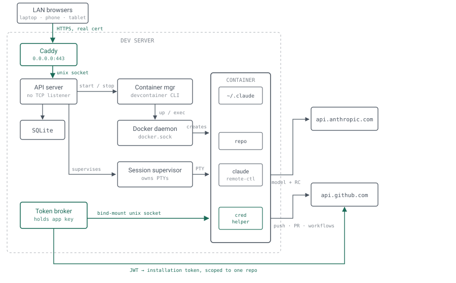
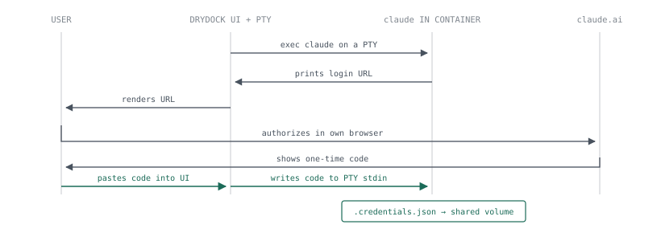
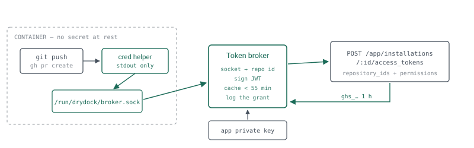
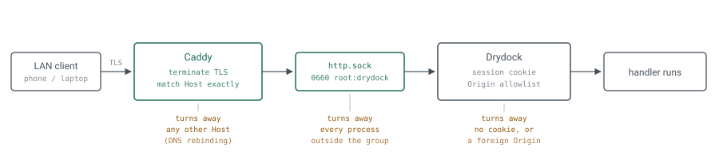

# Drydock

*A single-host server that turns any GitHub repository into a running dev container with a supervised, remote-controllable Claude Code session inside it — one click from a repo list, with push credentials scoped to that repo alone.*

**Status** design document, draft v3 · **Date** 25 August 2026

**Runtime** single dev server, local Docker socket · **Reach** LAN, behind Caddy

**Out of scope** k3s · containerizing Drydock itself · packaging and installation

## 1. Problem & goals

Today a new agent workspace is a manual sequence: open VS Code, run *Clone Repository in Container Volume*, wait, open a terminal, start Claude Code, log in if the container is fresh, and hope the GitHub credentials that happen to be forwarded are the ones you wanted. It works, but it requires a VS Code window as the entry point, and it produces containers whose git access is whatever the SSH agent happened to be carrying.

Drydock replaces that sequence with a list and a button. The list is every repository the GitHub App is installed on. The button provisions a container, wires credentials into it, and leaves a Claude Code session running inside under Remote Control — reachable from a phone, a browser, or a laptop, with no VS Code process anywhere in the picture.

### Functional requirements

- **Repo list.** Show every eligible repository with its current Drydock state (none / cloning / running / stopped / failed).
- **Clone.** One action clones the repo to host disk, builds and starts its dev container, applies the Claude feature, and starts a session server inside it.
- **Auth surfacing.** If Claude Code in the container is not logged in, the UI shows the login URL and accepts the code the browser hands back.
- **Remote Control.** Every session registers with claude.ai so it can be driven from the Claude app; the UI links straight to it.
- **GitHub credentials.** Claude inside the container can `push`, open pull requests, and read or dispatch workflow runs — for *that repo only*.
- **Lifecycle.** Stop, restart, rebuild, and destroy a workspace; survive a server reboot without orphaning containers.
- **Service credentials.** A workspace can hold the secrets its test suite needs — a database URL, a staging API key — granted per repository rather than shared by default (§10).
- **Reachable from the house.** Usable from a laptop, phone, or tablet on the LAN — without an SSH tunnel, and without putting Drydock's own HTTP server on the network (§13).

### Non-functional targets

| Dimension | Target | Why this number |
|---|---|---|
| Operators | 1 | Single account. No tenancy and no RBAC — but authenticated, because the UI is reachable from the LAN (§13). |
| Client devices | ~5 | Laptop, desktop, phone, tablet. Each holds its own session; all revocable at once. |
| Repos in catalog | ~50 | Tens of repos today; the list is a cached GitHub App installation listing. |
| Concurrent containers | 5–15 | Bounded by dev-server RAM, not by Drydock. Enforce a configurable cap. |
| Clone → usable session | < 3 min cold | Dominated by image build. Warm rebuild should be under 30 s. |
| Availability | Best effort | A home dev server. Restart-safe matters far more than uptime. |
| Secret at rest | App private key only | Everything else is minted on demand and expires within the hour. |

### Non-goals

- **Not a VS Code replacement.** The existing *clone into container* workflow stays untouched and separate. Drydock containers are headless-first; attaching an editor later is a convenience, not a design driver.
- **Not scheduled across the home lab.** One host, one Docker daemon. §3 keeps an orchestration seam, but k3s is explicitly deferred.
- **Not CI.** Drydock does not run tests on push or react to webhooks beyond refreshing its repo list.
- **Not containerized itself.** Drydock runs directly on the dev server as a supervised service. It creates containers; it does not live in one. Doing so would buy no isolation — a process holding the Docker socket is host-equivalent either way — while forcing every path Drydock hands to Docker to resolve identically inside and outside its own mount namespace, a constraint whose only purpose is to undo the container.
- **Not a packaging or installation spec.** How Drydock and its runtime dependencies reach the host, how they are upgraded and rolled back, and how the process is supervised are deliberately deferred to a separate document. This one assumes the binary is running, the Docker socket is reachable, and its credentials have been supplied.
- **Not a scheduler, and not an idle reaper.** Nothing stops a workspace automatically. Fifteen idle containers is real memory, but automatic stopping would have to distinguish “idle” from “an agent thinking”, and getting that wrong destroys work. Capacity is managed by hand: a cap that refuses new workspaces, a stop button, and enough on the card to know what to stop. Cheap to live with because stopping is not destructive — the clone and its worktrees survive, so restarting costs a container start (§14).
- **Not a certificate manager.** Issuing, renewing, and delivering the TLS certificate to Caddy is handled by existing automation. Drydock depends on the result (§13.1) and owns none of the mechanism.
- **Not a terminal multiplexer.** The UI shows status and the login handshake. Interactive work happens through Remote Control, not through a web terminal.

## 2. Binding constraints

Four facts about Claude Code shape this design more than any architectural preference. They are worth stating before the boxes and arrows, because two of them rule out the obvious implementation.

### 2.1  Remote Control requires a full login, not a token

> [!WARNING]
> **Load-bearing constraint**
>
> A long-lived token from `claude setup-token` / `CLAUDE_CODE_OAUTH_TOKEN` **can only make model requests**. It cannot establish a Remote Control session. The documentation is explicit: run `claude auth login` for a full-scope session token instead.

This kills the design most people reach for first — mint one token, bake it into the image, never think about auth again. Drydock must instead carry a real `/login` credential into every container, which is why §7 exists at all and why it is the most intricate part of the system.

Two related constraints ride along:

- `ANTHROPIC_BASE_URL` must be unset or pointed at `api.anthropic.com`. Any gateway or proxy disables Remote Control.
- `DISABLE_TELEMETRY`, `DO_NOT_TRACK`, `CLAUDE_CODE_DISABLE_NONESSENTIAL_TRAFFIC`, and `DISABLE_GROWTHBOOK` each disable the feature-flag evaluation Remote Control depends on. The Drydock feature must actively *ensure these are unset* in the container, including in any `settings.json` `env` block it writes.

### 2.2  Container login is a two-way handshake, not a URL

Inside a container the browser cannot reach Claude Code's local callback server. The documented behavior for exactly this case: the browser displays a login *code*, and the user pastes it back at the `Paste code here if prompted` prompt. So the flow is not “show the user a URL and wait” — it is:

1. Drydock starts `claude` in the container attached to a PTY it owns.
2. It reads the login URL off that PTY and renders it in the UI.
3. The user authorizes in their own browser and receives a code.
4. The user pastes the code into the Drydock UI.
5. Drydock writes that code back into the PTY's stdin and waits for `Login successful`.

Steps 2 and 5 mean screen-scraping a TUI. That is the single most brittle dependency in the system, and §12 treats it as such.

### 2.3  Credentials live in one relocatable file

On Linux the credential is `~/.claude/.credentials.json`, mode `0600`, and it moves with `CLAUDE_CONFIG_DIR`. That relocatability is the hook Drydock hangs the whole auth story on (§7) — and it is the same hook already in use for per-container Claude config, so the pattern is familiar rather than novel.

### 2.4  Logins expire, and unattended sessions die when they do

Claude Code warns three days out and `/status` reports an `Expired` state. The docs call out this exact scenario: a Remote Control session that outlives its login *stops making progress and cannot recover* until someone signs in again. Drydock is a machine for creating long-lived unattended sessions, so credential expiry is a first-class monitored condition, not an edge case.

### 2.5  What the tooling gives us for free

| Capability | Mechanism | Note |
|---|---|---|
| Inject a feature not in `devcontainer.json` | `devcontainer up --additional-features` | Since CLI v0.18.0. Not written to the lockfile as of v0.86.1 — good, the repo stays clean. |
| Find a container again after restart | `--id-label drydock.workspace=<id>` | Label is the durable handle; container IDs are not. |
| Pass secrets without baking them in | `--secrets-file <json>` | Available for `up` and `run-user-commands`. |
| Extra mounts / env | `--mount`, `--remote-env` | How the credential volume and the broker socket get in. |
| Machine-readable result | JSON `{"outcome","containerId","remoteUser"}` | Parse it; never scrape `docker ps`. |
| Repo-scoped GitHub tokens | `POST /app/installations/:id/access_tokens` | 1-hour TTL, scopable by `repository_ids` *and* a `permissions` subset. |

## 3. Architecture

A single Go binary on the dev server, a SQLite file beside it, the Docker socket, and Caddy out front. Everything else is a subprocess or an HTTP call. The two pieces that are more than glue are the **session supervisor**, which owns long-lived PTYs, and the **token broker**, which is the only component that ever holds a GitHub credential.

One structural rule shapes the picture below: **Drydock binds no TCP port.** It listens on a Unix socket, Caddy is the single process holding a LAN-facing listener, and the token broker listens on per-container sockets. The same mechanism that keeps a container from asking about another container's repo also keeps everything but Caddy from reaching the API at all. §13 covers what that buys.

<picture>
  <source media="(prefers-color-scheme: dark)" srcset="diagrams/01-architecture-dark.svg">
  
</picture>

**Fig 1** — *Every arrow into the system is a Unix socket except the one at the top. Caddy owns the only LAN-facing port; Drydock itself binds no TCP address, and the token broker binds none either — so the socket a request arrives on *is* the claim of who is asking and which repo they may touch. The container talks to Anthropic and GitHub directly; Drydock is not in the data path.*

### 3.1  Component responsibilities

| Component | Owns | Explicitly does not |
|---|---|---|
| **Caddy** | The only LAN listener. TLS termination with a real certificate, strict host matching, forwarding to Drydock's Unix socket. | Know anything about Drydock. It is a dumb, well-audited front door, not an auth layer. |
| **API server** | REST endpoints, SSE event stream, serving the UI, session authentication (§13.2). | Bind a TCP port. Talk to Docker or GitHub directly. |
| **Repo catalog** | Cached listing from `GET /installation/repositories`, refreshed on demand and every 15 min. | Store any GitHub token. |
| **Workspace manager** | Host-side clone directory per workspace, branch state, disk reclamation. | Know anything about containers. |
| **Container manager** | Every `devcontainer` invocation; label-based reconciliation against the Docker daemon on boot. | Hold long-lived processes. |
| **Session supervisor** | The `claude remote-control` process per workspace, its PTY, restart backoff, log ring buffer, the login handshake. | Parse GitHub anything. |
| **Token broker** | The App private key, JWT signing, installation-token minting and caching, the per-container socket listener. | Have an HTTP surface on the network. |

### 3.2  Choices worth defending

- **Language** — **Go, single static binary.** Long-lived supervised subprocesses, PTYs, and Unix socket servers are all first-class; deployment is one file plus a systemd unit.
- **Store** — **SQLite, WAL mode.** One writer, tens of rows. A Postgres container here would be more infrastructure than the thing it stores.
- **Container driver** — **Shell out to `devcontainer`.** Reimplementing feature resolution and lifecycle commands against the Docker API is months of work and drifts from the spec.
- **Clone location** — **Host bind-mount, not a container volume.** Backups, `grep`, and disk accounting all keep working, and a rebuild does not risk the working tree.
- **Front door** — **Caddy on `:443`, Drydock on a socket.** LAN reach without exposing Drydock's own HTTP stack, and TLS handled by software whose job that is.
- **Live updates** — **SSE, not WebSockets.** Traffic is server→client status only; the one client→server push (the login code) is an ordinary POST. Caddy proxies it without buffering.
- **Orchestration seam** — **A `Runtime` interface.** One implementation today. Enough to make a future k3s backend a port rather than a rewrite — and no more.

> [!NOTE]
> **Why bind-mount the clone**
>
> The existing VS Code flow uses container volumes with `${devcontainerId}`-derived names. Drydock deliberately diverges: it needs to inspect and reclaim working trees from outside the container, and it needs a clone to survive `--remove-existing-container`. Host directories give both. The Claude *config* directory still uses a named volume (§7) — different data, different lifetime, different answer.

## 4. Data model

Six tables. The design rule throughout: **Drydock stores no credential that is not the App private key**, and every mutable container fact is treated as a cache that can be rebuilt by reconciling against Docker labels.

```bash
-- Exactly one row. Set by the `drydock passwd` CLI, never by an HTTP route.
operator(
  id INTEGER PRIMARY KEY CHECK (id = 1),
  password_hash TEXT NOT NULL,   -- argon2id, params stored in the encoded hash
  updated_at TEXT
)

-- One row per signed-in device. The cookie value is never stored.
auth_session(
  id TEXT PRIMARY KEY,           -- sha256 of the cookie's random token
  label TEXT,                    -- user-agent digest: "iPhone", "Mac Firefox"
  created_ip TEXT,               -- from Caddy, trustworthy because of the socket
  created_at TEXT,
  last_seen_at TEXT,
  absolute_expires_at TEXT       -- hard ceiling; idle timeout is derived from last_seen
)

-- Failed sign-in attempts, for lockout and for the "who tried" view.
auth_attempt(
  id INTEGER PRIMARY KEY AUTOINCREMENT,
  source_ip TEXT, outcome TEXT,  -- ok | bad_password | locked_out
  at TEXT
)

-- Cached from the GitHub App installation. Refreshable, never authoritative.
repository(
  id INTEGER PRIMARY KEY,      -- GitHub repo id, stable across renames
  installation_id INTEGER NOT NULL,
  full_name TEXT NOT NULL,     -- krelinga/foo
  default_branch TEXT NOT NULL,
  has_devcontainer INTEGER,    -- probed; drives a badge, not a filter
  private INTEGER, archived INTEGER,
  pushed_at TEXT, refreshed_at TEXT
)

-- One per clone. The unit the UI operates on.
workspace(
  id TEXT PRIMARY KEY,         -- ULID; also the devcontainer id-label value
  repository_id INTEGER NOT NULL REFERENCES repository(id),
  host_path TEXT NOT NULL,     -- /srv/drydock/ws/<id>/repo
  branch TEXT NOT NULL,
  config_path TEXT,            -- resolved .devcontainer/devcontainer.json
  state TEXT NOT NULL,         -- pending|cloning|building|running|stopped|failed|deleting
  state_detail TEXT,
  container_id TEXT,           -- cache; reconciled from labels at boot
  remote_user TEXT,
  created_at TEXT, last_active_at TEXT
)

-- The supervised `claude remote-control` process. One live row per workspace.
-- This is a process, not a conversation; the states below are process states.
supervisor(
  id TEXT PRIMARY KEY,
  workspace_id TEXT NOT NULL REFERENCES workspace(id),
  state TEXT NOT NULL,         -- starting|awaiting_login|serving|degraded|exited
  pid INTEGER, restart_count INTEGER DEFAULT 0,
  capacity INTEGER NOT NULL,   -- what --capacity was set to for this process
  last_error TEXT,
  started_at TEXT, last_heartbeat_at TEXT
)

-- Conversations the server is serving. Many per supervisor, created from
-- claude.ai or the phone — never by Drydock. Observed, not owned; starts empty.
-- Deliberately thin: this feeds a count and one link, not a session browser (§8).
rc_session(
  id TEXT PRIMARY KEY,         -- the id from the claude.ai/code/<id> URL
  supervisor_id TEXT NOT NULL REFERENCES supervisor(id) ON DELETE CASCADE,
  name TEXT,
  is_primary INTEGER,          -- the pre-created one in /workspace; its URL is the card link
  first_seen_at TEXT, last_seen_at TEXT
)

-- Not the credential. Just what we know about it, for expiry warnings.
claude_identity(
  id INTEGER PRIMARY KEY CHECK (id = 1),
  volume_name TEXT NOT NULL,   -- shared credential volume
  account_email TEXT,
  logged_in_at TEXT,
  expires_at TEXT,             -- parsed from /status; drives the renewal nag
  last_checked_at TEXT
)

-- Short-lived, in-memory-first; persisted only for observability.
token_grant(
  id TEXT PRIMARY KEY,
  workspace_id TEXT NOT NULL,
  repository_id INTEGER NOT NULL,
  permissions TEXT NOT NULL,   -- json, the subset actually requested
  issued_at TEXT, expires_at TEXT,
  requested_by TEXT            -- "git-credential" | "gh" | "api"
)

-- Values are ciphertext. Nothing here is readable back through the API.
secret(
  id TEXT PRIMARY KEY,
  name TEXT NOT NULL UNIQUE,     -- also the env var name; [A-Z_][A-Z0-9_]*
  ciphertext BLOB NOT NULL,      -- xchacha20-poly1305, AAD = id
  nonce BLOB NOT NULL,
  reach TEXT NOT NULL,           -- required prose: what can someone do with this?
  description TEXT,
  all_repos INTEGER DEFAULT 0,   -- widens every repo at once; the UI says so
  inject_hosts TEXT,             -- unused; reserved for §10.5
  created_at TEXT, rotated_at TEXT
)

-- Default deny lives here: no row, no secret.
secret_grant(
  secret_id TEXT NOT NULL REFERENCES secret(id) ON DELETE CASCADE,
  repository_id INTEGER NOT NULL REFERENCES repository(id),
  granted_at TEXT,
  PRIMARY KEY (secret_id, repository_id)
)

-- Answers "which workspaces ever held this?" after a key leaks somewhere.
secret_access(
  id INTEGER PRIMARY KEY AUTOINCREMENT,
  secret_id TEXT NOT NULL, workspace_id TEXT NOT NULL,
  at TEXT
)

-- Append-only. Feeds the SSE stream and the per-workspace activity view.
event(
  id INTEGER PRIMARY KEY AUTOINCREMENT,
  workspace_id TEXT, level TEXT, kind TEXT,
  message TEXT, at TEXT
)
```

Four notes on what is deliberately absent. There is no plaintext secret value — and no route that returns one, which is why the schema has no `value` column to be tempted by. There is no plaintext session token — `auth_session.id` is the SHA-256 of the cookie value, so a stolen database file yields no usable cookie. There is no `github_token` column — tokens live in a bounded in-memory cache keyed by `(workspace_id, permission_set)` and are dropped at their expiry. And `token_grant` records that a token was issued and to whom, never the token itself, so the table is safe to read, export, and keep.

## 5. API surface

REST over a Unix socket, plus one SSE stream. Every mutating call is asynchronous: it validates, writes a state transition, returns `202` with the workspace, and lets the client follow along on the stream. Nothing blocks on a container build.

**Every route below except the three auth routes requires a valid session cookie** — enforced by middleware that wraps the whole mux, so a new handler is protected by default rather than by remembering to protect it. Every state-changing route additionally checks `Origin` (§13.3).

| Method & path | Does | Returns |
|---|---|---|
| `POST /api/auth/session` | Sign in. Body: `password`. Rate-limited and lockout-guarded (§13.2). | `204` + cookie |
| `GET /api/auth/session` | Current session plus the list of signed-in devices. | Session list |
| `DELETE /api/auth/session` | Sign out. `?all=true` revokes every device at once. | `204` |
| `GET /api/repos` | Every repo in the installation with its workspace state joined in. Repos without a `devcontainer.json` are listed and badged, not hidden (§6). | Repo list |
| `POST /api/repos/refresh` | Re-read the installation listing from GitHub. | `202` |
| `POST /api/workspaces` | **The clone button.** Body: `repository_id`, optional `branch`. | `202` + workspace |
| `GET /api/workspaces/:id` | Full state: the supervisor, how many sessions it is serving and the primary session link, last events, disk usage. | Workspace |
| `POST /api/workspaces/:id/start` | `devcontainer up` on an existing clone. | `202` |
| `POST /api/workspaces/:id/stop` | Stop the supervisor, then the container. Ends every live session; the clone and its worktrees survive, so starting again is cheap. | `202` |
| `POST /api/workspaces/:id/rebuild` | `up --remove-existing-container`. Clone survives. | `202` |
| `DELETE /api/workspaces/:id` | Container, then clone. Requires `?confirm=<full_name>`. | `202` |
| `POST /api/workspaces/:id/supervisor` | Start or restart the `remote-control` server process. A restart ends every session it was serving (§8). | `202` |
| `GET /api/secrets` | Names, reach, grants, last access. **Never values.** | Secret list |
| `PUT /api/secrets/:name` | Create or rotate. Body: `value`, `reach` (required), `description`. Rejects reserved names (§10.1). | `200` + stale workspaces |
| `DELETE /api/secrets/:name` | Remove it and every grant. | `204` |
| `PUT /api/secrets/:name/grants` | Set which repositories may receive it. | `200` |
| `GET /api/auth/claude` | Login state: `ok` / `expiring` / `expired` / `absent`, with account and expiry. | Identity |
| `POST /api/auth/claude/login` | Begin the handshake. Runs `claude` on a PTY in a scratch container. | `202` + `login_id` |
| `POST /api/auth/claude/login/:lid/code` | Submit the pasted code. Written to the PTY's stdin. | `200` / `409` |
| `GET /api/events` | SSE. `workspace.*`, `session.*`, `auth.*`, `token.issued`. | `text/event-stream` |

#### Broker socket protocol (not on the network)

The broker speaks a deliberately tiny line protocol over the per-container Unix socket — small enough that the in-container client is a shell script with `nc` as a fallback, and small enough to audit at a glance.

```text
→ GET-TOKEN scope=git          # or scope=gh
← OK token=ghs_xxxxxxxx expires_at=2026-08-25T19:04:11Z
← ERR reason=repo_archived      # or rate_limited | revoked
```

There is no `repository` parameter, and the `GET-SECRETS` verb in §10.3 takes no arguments at all. The broker derives both the repo and the grant set from which socket the connection arrived on, so a compromised container cannot ask for a different repo's token or another repo's secrets — it can only ask for its own, which it already had.

## 6. Clone → container

What happens between the click and a usable session. Every step writes an event, so a failure at step 6 tells you it was step 6 rather than “failed”.

1. **Allocate.** Insert the workspace row in `pending`, mint a ULID, create `/srv/drydock/ws/<id>/`. Reject if the concurrent-container cap is already met.
2. **Clone.** Ask the broker for a `contents:read` token scoped to this repo, then `git clone https://x-access-token:<tok>@github.com/<full_name>.git repo`. The token is never written to `.git/config` — the URL is rewritten to the plain HTTPS form immediately after, and the credential helper (§9) takes over from there.
3. **Resolve config.** `devcontainer read-configuration --workspace-folder repo`. No `devcontainer.json` is not a disqualification — every repo in the installation is listed and clonable. Drydock writes a minimal config into `.drydock/devcontainer.json` and passes it with `--override-config`, leaving the repo untouched, so a repo that has never been containerized still gets a working session.
4. **Ensure the credential volume.** Create the shared Claude config volume if absent (§7).
5. **Open the socket.** Broker creates `/run/drydock/sock/<workspace_id>.sock`, mode `0660`, bound to this workspace's repo.
6. **Bring it up.** The one long call. See below.
7. **Verify.** `devcontainer exec` a probe: `claude --version`, `git -C /workspace remote -v`, and one broker round-trip. A green probe is what moves the workspace to `running`.
8. **Start the session server.** Hand off to the supervisor (§8).

#### Step 6, in full

```bash
devcontainer up \
  --workspace-folder /srv/drydock/ws/$WS/repo \
  --id-label drydock.workspace=$WS \
  --id-label drydock.repo=$FULL_NAME \
  --additional-features '{"ghcr.io/krelinga/features/drydock-claude:1":{
      "brokerSocket":"/run/drydock/broker.sock",
      "configDir":"/home/vscode/.claude"}}' \
  --mount "type=volume,source=drydock-claude-config,target=/home/vscode/.claude" \
  --mount "type=bind,source=/run/drydock/sock/$WS.sock,target=/run/drydock/broker.sock" \
  --remote-env DRYDOCK_WORKSPACE=$WS \
  --remote-env DRYDOCK_REPO=$FULL_NAME \
  --secrets-file /run/drydock/secrets/$WS.json \
  --json
```

> [!WARNING]
> **Sharp edge**
>
> `--additional-features` composes with whatever the repo already declares; it does not replace it. If a repo's own `devcontainer.json` pins a conflicting `remoteUser` or sets `containerEnv` for any of the four Remote-Control-killing variables in §2.1, the feature must detect that at `postCreate` time and fail loudly rather than produce a container whose sessions silently never connect.

### Reconciliation on boot

Drydock restarting must not orphan containers or double-start sessions. On startup it lists containers by `label=drydock.workspace` and reconciles in one direction — **Docker is the truth, the database is the cache**:

| DB says | Docker says | Action |
|---|---|---|
| `running` | Running | Adopt. Restart the supervisor; the previous session is resumable with `claude remote-control --continue` in the same directory. |
| `running` | Exited | Mark `stopped`, emit an event. Do not auto-start — the exit may have been a crash loop. |
| `running` | Absent | Mark `stopped`, clear `container_id`. Clone is intact; `start` rebuilds. |
| Absent | Running | Orphan from a lost DB. Log it, adopt the row from labels rather than killing someone's work. |
| `deleting` | Any | Resume the delete. This is why `deleting` is a persisted state and not a flag in memory. |

## 7. Claude Code auth

§2.1 established that Remote Control needs a real `/login` credential, and §2.2 that obtaining one inside a container is an interactive two-way handshake. The design question is therefore: **how many times must a human do that handshake?** The answer should be “once every few weeks, for all containers”, not “once per clone”.

### 7.1  One shared credential volume

Every container mounts the same named volume at its `CLAUDE_CONFIG_DIR`. Login happens once, in whichever container asks first (or in a dedicated scratch container), and the resulting `.credentials.json` is immediately visible to every other container that mounts it.

| Option | Logins required | Cost |
|---|---|---|
| **Shared volume** at `CLAUDE_CONFIG_DIR` | One, for all containers | Containers share config *and* history/state files. Concurrent token refresh is serialised by Claude Code itself (Spike 00). |
| Per-container volume, credential copied in | One, then copies | Drydock reads the plaintext credential to copy it, and refreshed tokens in one container never reach the others. |
| Per-container login | One per clone | Defeats the point of the button. |

> [!NOTE]
> **Resolved by Spike 00 — the shared volume is safe.**
>
> The worry was that two containers refreshing at once could interleave and write a credential the other had already rotated away from. They cannot. Claude Code serialises refreshes with a `proper-lockfile`-style lock at **`$CLAUDE_CONFIG_DIR/.oauth_refresh.lock`** — inside the shared volume itself, so cross-container exclusion falls out of the sharing for free. Before refreshing it re-reads the credential (twice: once optimistically, once under the lock) and *adopts a peer's newer token* rather than issuing a second refresh. Writes are temp-file + `fsync` + `rename()`, so a reader never sees a torn file. Measured: four contending containers serialised cleanly; 16,185 reads across a live write, zero torn.
>
> **Take mitigation (a). Mitigation (b) is now struck** — giving each container its own writable config dir would put each lockfile in a *different* directory, destroying the exclusion that currently comes for free, and a read-only credential could never persist a rotated token. It is worse than the problem. Mitigation (c) is unnecessary.
>
> Two constraints follow. The credential volume **must be a local Docker volume, never NFS/CIFS** — the guarantee rests on `mkdir(2)` atomicity. And this is undocumented behaviour, measured against **Claude Code `2.1.246`**, so **re-run the spike on every Claude Code bump**. See [Spike 00](../spikes/00-shared-credential-volume.md).

Note also that the shared volume carries more than credentials: session history, project trust records, and settings all live under `CLAUDE_CONFIG_DIR`. Sharing them across containers is mostly a *feature* — workspace trust and settings apply everywhere without re-answering prompts — but it means one container's `/logout` logs out all of them. The UI should say so.

That shared fate has a second, sharper form. On a definitive `invalid_grant` — a genuinely dead login, a revoked session, someone typing `/logout` — Claude Code does not delete the credential, it **blanks it in place**: `accessToken` and `refreshToken` become `""` and `expiresAt` becomes `0`. Every container on the volume loses auth in the same instant. Spike 00 confirmed this is not a race artifact (the write is compare-and-swap guarded, so a container that lost a refresh race cannot blank a winner's fresh token, and a mere network failure leaves the file untouched) — but the blast radius is the whole fleet, so §7.3 has to treat a blanked credential as its own condition rather than folding it into "expired".

### 7.2  The login handshake

<picture>
  <source media="(prefers-color-scheme: dark)" srcset="diagrams/02-login-handshake-dark.svg">
  
</picture>

**Fig 2** — *The two green hops are the ones Drydock cannot avoid owning: a human must carry the code from their browser back into a process Drydock holds the stdin of. Everything else could be automated; those two cannot.*

Implementation notes that matter:

- **Run it in a scratch container, not a workspace container.** Login is global to the shared volume, so binding it to one workspace makes the UI lie about scope. A tiny `drydock-auth` container that mounts only the credential volume is cleaner and can be started on demand.
- **Workspace trust first.** Claude Code's startup trust dialog must be accepted in a project directory, and the docs note the trust dialog never saves trust for a home directory. The feature's `postCreate` runs `claude` once in `/workspace` to clear it before the supervisor ever tries Remote Control.
- **Timeout and cancel.** The handshake holds a PTY open. Give it a five-minute deadline, a cancel endpoint, and a hard kill on the subprocess — a wedged login must never require restarting Drydock.
- **Never log the PTY buffer verbatim.** It contains the one-time code. Scrape, match, redact, then store.

### 7.3  Expiry watch

A poller runs `claude /status`-equivalent output in the auth container every six hours and records `expires_at`. Three days out, the UI shows a persistent banner and every workspace card carries a warning dot. On expiry, supervisors are marked `degraded` rather than restarted — restarting cannot fix a missing credential, and a restart loop would just burn the log.

A **blanked** credential (`accessToken: ""`, §7.1) is a different condition from an expiring one and needs its own message. Expiring is a countdown the user can ignore for three days; blanked means every workspace is already dead and the only fix is a new login handshake. Detect it on the same poll — an empty `accessToken` is unambiguous — and say "signed out, sign in again", not "expired".

## 8. Session supervision

One supervised process per workspace — which serves *many* sessions, not one:

```bash
devcontainer exec --id-label drydock.workspace=$WS \
  --remote-env CLAUDE_REMOTE_CONTROL_SESSION_NAME_PREFIX=$REPO_SHORT -- \
  bash -lc 'eval "$(drydock-secrets export)" && cd /workspace && \
    exec claude remote-control \
      --spawn worktree \
      --capacity 4 \
      --verbose'
```

`remote-control` server mode is the right shape here rather than `claude --remote-control`: it is designed to run headless in a terminal, and `--spawn worktree` gives each on-demand session its own git worktree so two conversations against the same repo do not fight over the working tree. Since the clone is a real git repository on a host bind-mount, worktrees just work.

Three details in that invocation are load-bearing, and two of them exist because **the server is multi-session by default**:

- **The name prefix, not `--name`.** `--name` titles one session; the prefix names every session the server auto-creates, so the phone's list reads `myrepo-graceful-unicorn` rather than `a3f91c2-graceful-unicorn` derived from the container's opaque hostname. At fifteen workspaces this is the difference between a usable session list and a wall of hashes.
- **`--capacity 4`, because the default is 32.** Nothing stops a stray tap on a phone from opening a dozen agents against one repo, each burning tokens and each holding a worktree. Four is a guess; the point is that the design picks a number rather than inheriting one.
- **Secrets are loaded before `exec`, not after.** Every session this process ever serves inherits this environment (§10.3), so the fetch has to happen here. A broker failure fails the start rather than launching a server whose sessions all fail their first test run.

> [!NOTE]
> **Two kinds of session, and they behave differently**
>
> `--create-session-in-dir` is on by default, so the server pre-creates one session in `/workspace` itself — the primary checkout, on whatever branch the clone is on. Every *additional* session gets an isolated git worktree instead. That asymmetry is a sensible default rather than a wart, but it is worth knowing: the first session edits the branch you cloned, the rest do not.

| Supervisor duty | Approach |
|---|---|
| Load secrets at start | Fetch the workspace's granted secrets from the broker and materialize them into the process environment before `exec` (§10.3). |
| Notice sessions appearing | **A continuous tail, not a one-shot scrape.** Sessions are created on demand, possibly hours after startup, so the supervisor watches the `--verbose` stream for `claude.ai/code/<id>` URLs and upserts `rc_session` rows as they show up. More of the terminal-scraping brittleness §12 already flags — there is no machine-readable alternative. |
| Detect “not logged in” | `claude remote-control` exits with an error when the account is ineligible. Treat a fast exit with that signature as `awaiting_login`, not as a crash — and do not retry. |
| Restart policy | Exponential backoff 2s → 60s, cap 6 attempts in 10 min, then park in `degraded` with the last 200 lines retained. |
| Resume after a Drydock restart | `claude remote-control` in the same directory brings back *every* session the previous server was serving, which is the behaviour to want here. Re-derive `rc_session` rows from the tail rather than trusting the cached ones. |
| Liveness | The process staying up is not proof of connection. Poll the PTY for the connection-status line and downgrade to `degraded` on a failure notice. |
| Logs | 1 MB ring buffer per supervisor in memory, last 200 lines mirrored to `event`. Never persist the full buffer — it can contain repo content and, across many sessions, rather a lot of it. |

> [!NOTE]
> **Observed, not owned — and not enumerated**
>
> Drydock never creates a session. There is no interface for it to — sessions come into being when you tap *new session* at claude.ai or in the app, and the server spawns a worktree for it. Drydock's role is to notice, so `rc_session` is a cache of something happening elsewhere. If it drifts, the Claude app is right and Drydock is wrong.
>
> **The UI links out rather than listing.** The workspace card carries one link — the primary session's URL — plus a count, and the Claude app's own session list does the browsing. It is already better at that than a card would be, and reimplementing it would mean keeping a mirror of remote state accurate for no gain. The count is the part that earns its keep: it is what makes *stop* an informed action instead of a blind one (§14).
>
> One consequence to hold onto: worktrees are created by the server without asking, so deleting a workspace has to remove them as well as the clone. `git worktree list` on the clone is the authoritative source there, not the database.

## 9. GitHub credentials

The requirement is that Claude inside a container can push, open PRs, and touch workflows — for one repo. The stated goal from the existing setup is the sharp part: *not* full SSH agent or credential access, which is what the current VS Code flow effectively grants.

### 9.1  Why a broker rather than an injected token

An installation token lives one hour. Injecting it as an environment variable at `devcontainer up` gives a container that can push for an hour and then fails in a way that looks like a network error. Re-injecting means restarting the container. So the token must be fetched at use time, which means something inside the container must be able to ask for one — and whatever it asks must not be able to lie about which repo it is.

The bind-mounted Unix socket solves that cleanly. **The socket path is the identity.** One socket per workspace, bound at creation to that workspace's repository, mounted into that container and no other. A request carries no repo parameter because it cannot be trusted to.

<picture>
  <source media="(prefers-color-scheme: dark)" srcset="diagrams/03-credential-broker-dark.svg">
  
</picture>

**Fig 3** — *Nothing on the container side of the dashed line survives the process that fetched it. Remove the socket mount and the container loses GitHub access instantly, with no image rebuild and no token to revoke.*

### 9.2  Two consumers, one broker

**git** is the easy one. Git's credential protocol is designed for exactly this: the helper reads a request on stdin, prints `username` and `password` on stdout, and git never persists either.

```
# installed by the feature into ~/.gitconfig
[credential "https://github.com"]
    helper = /usr/local/bin/drydock-credential
    useHttpPath = false

# drydock-credential — get operation only; store/erase are no-ops
get) printf 'username=x-access-token\npassword=%s\n' "$(ask_broker git)" ;;
store|erase) exit 0 ;;
```

**`gh`** is the awkward one, because it wants `GH_TOKEN` in the environment and an environment variable cannot refresh itself. The fix is a shim earlier on `PATH` that fetches a fresh token per invocation:

```bash
#!/usr/bin/env bash  — /usr/local/bin/gh, ahead of the real binary
GH_TOKEN="$(ask_broker gh)" exec /usr/bin/gh.real "$@"
```

Per-invocation minting is cheap because the broker caches by permission set for 55 minutes, so a run of twenty `gh` calls makes one GitHub request. The alternative — teaching Claude to re-export a token — is a rule in a prompt, and rules in prompts are not a security boundary.

### 9.3  Permissions

The App is granted a superset; each minted token requests only what the caller needs. Two scopes are enough.

| Permission | `scope=git` | `scope=gh` | Needed for |
|---|---|---|---|
| `metadata: read` | ✓ | ✓ | Mandatory baseline for any installation token. |
| `contents: write` | ✓ | ✓ | Clone, fetch, push, create branches. |
| `pull_requests: write` | — | ✓ | Open, update, and comment on PRs. |
| `issues: write` | — | ✓ | PR comments are issue comments in the API. |
| `workflows: write` | ✓ | ✓ | **Required to push any change under `.github/workflows/`.** Without it, pushes that touch a workflow file are rejected with a confusing error. |
| `actions: write` | — | ✓ | Read run status, dispatch and re-run workflows. |
| `checks: read` | — | ✓ | Read check results on a PR before deciding what to fix. |

> [!NOTE]
> **Authorship and branch names**
>
> Commits made with an installation token are attributed to the App's bot identity, not to a human. Set `user.name` / `user.email` in the feature to the App's bot address (`<app-id>+<app-slug>[bot]@users.noreply.github.com`) so history is honest about which commits an agent made.
>
> Agent branches go under a `drydock/` prefix, set as the feature's default push namespace rather than left to the model to remember. Same reasoning as the bot identity, applied to refs: cleanup becomes one `git push --delete` glob instead of an audit, and the GitHub branch list tells you at a glance which work an agent did. A convention the model has to follow is not a convention; configure it.

### 9.4  What this deliberately gives up

An installation token cannot act as you. It cannot approve its own PR, and anything gated on human review stays gated. Repos not covered by the App installation are invisible — which is the point, but it means adding a repo to Drydock is a GitHub-side action (extend the installation), not a Drydock-side one. The UI should link straight to the installation settings page when a repo the user expected is missing.

## 10. Repository secrets

A session that can't reach a test database, a staging API, or whatever third-party service the repo integrates with can write code but can't check it. So workspaces need credentials beyond GitHub — and those credentials are a different animal from the ones in §9.

|  | GitHub credentials (§9) | Repository secrets (this section) |
|---|---|---|
| Origin | Minted on demand by the broker | Values you paste in once |
| Lifetime | One hour, then gone | Until you rotate them |
| Scope | Enforced by GitHub, per repo, per permission | Whatever the far service decides — Drydock has no say |
| If one leaks | Expires before you finish reading the alert | You are rotating it by hand, wherever it came from |

That last row is the whole design problem. The broker's cleverness in §9 comes from GitHub letting it mint narrow, expiring tokens; nothing here offers that. What Drydock can control is *which* secrets reach *which* workspace, and how visible that decision is when you make it.

### 10.1  The model

A secret is a name, a value, a declared reach, and a set of repo grants. **Default deny**: storing a secret grants it to nothing. It reaches a workspace only because you said that repo may have it.

| Field | Notes |
|---|---|
| `name` | Also the environment variable name, so it must match `[A-Z_][A-Z0-9_]*`. Validated on write, not at injection time — see the reserved list below. |
| `value` | Encrypted at rest (§10.2). Write-only through the API: the UI shows metadata and never returns a stored value. |
| `reach` | A required sentence answering “what can someone do with this?” Free text, but not optional. §10.4 explains why this field exists and why it is the actual security control. |
| `description` | Where it came from and how to rotate it. Written now, read at 2am in six months. |
| grants | Rows in `secret_grant`, one per repository. An `all_repos` flag exists for the genuinely universal ones and the UI treats choosing it as a decision, not a shortcut. |
| `inject_hosts` | Unused today. §10.5 explains the door it holds open. |

#### Reserved names

Secret names become environment variables in the session process, which means a badly chosen one silently breaks the system rather than failing loudly. Drydock refuses these on write:

- `ANTHROPIC_BASE_URL`, `DISABLE_TELEMETRY`, `DO_NOT_TRACK`, `CLAUDE_CODE_DISABLE_NONESSENTIAL_TRAFFIC`, `DISABLE_GROWTHBOOK` — each one disables Remote Control (§2.1). A secret that quietly turns off the feature the whole system exists for is the worst possible failure mode: everything builds, nothing connects.
- `GH_TOKEN`, `GITHUB_TOKEN` — would shadow the `gh` shim's per-invocation token from §9.2, replacing an expiring repo-scoped credential with a static one.
- `CLAUDE_CONFIG_DIR`, `PATH`, `HOME`, `SHELL`, `ANTHROPIC_API_KEY`, `CLAUDE_CODE_OAUTH_TOKEN` — each breaks something in §7 or §9 in a way that looks like an unrelated bug.

### 10.2  Storage

Values are encrypted before they touch SQLite. A master key is supplied by the service manager as a file-based credential, read once at startup and held in memory; each value is sealed with XChaCha20-Poly1305 under a per-secret nonce, with the secret's id as associated data so a row cannot be swapped for another. The database file then holds ciphertext and nothing else.

The threat this addresses is not an attacker with root on the dev server — that person already has the GitHub App key and the Docker socket, and §13.4 says so plainly. It is the far likelier one: the SQLite file ends up somewhere its contents were not thought about. A backup, a snapshot, a copy pulled off to debug something, a disk that leaves the house. Encryption at rest turns all of those from an incident into a non-event, and it costs one dependency and about forty lines.

### 10.3  Delivery

Secrets ride the mechanism that already exists. The broker socket from §9 gains one verb, and the same property holds: the socket a request arrives on identifies the workspace, so a request carries no name of what it wants access to.

```text
→ GET-SECRETS
← OK count=3
← TEST_DATABASE_URL postgres://…
← STRIPE_TEST_KEY sk_test_…
← S3_STAGING_SECRET …
← END
```

The supervisor materializes them into the session process's environment at exec time, through a helper that reads the socket *inside* the container:

```bash
devcontainer exec --id-label drydock.workspace=$WS -- \
  bash -lc 'eval "$(drydock-secrets export)" && cd /workspace && \
    exec claude remote-control --spawn worktree --capacity 4'
```

Everything about that line is deliberate. Values never appear in `argv`, so they stay out of `ps` on the host. They never touch a file, so there is nothing to leave behind on container stop. They are not in the image, not in `containerEnv`, and not in `docker inspect`. And because `claude` is the process that receives them, every test command it spawns inherits them — `pytest`, `jest`, and `go test` read `os.environ` and find what they expect with no adapter and no repo change. That compatibility is the main thing plain environment variables buy, and it is a real advantage.

#### Why not the mechanisms that look easier

| Alternative | Why not |
|---|---|
| `devcontainer up --secrets-file` | Baked in at container creation. Rotating a secret means rebuilding, and the workspace's unpushed work is in the way. |
| `containerEnv` in the config | Same rebuild problem, plus the values land in the container's inspect output. |
| A `.env` in the working tree | One `git add -A` from being committed and pushed by an agent that is explicitly allowed to push. |
| Fetch-on-every-read from the app | Would be tidier, and every test framework on earth expects environment variables instead. |

For the occasional tool that insists on a file rather than the environment, the helper can write one to `/run/drydock/env` on a `tmpfs`, mode `0600`, owned by the remote user — in RAM, gone on stop, and outside the working tree so no `git add` can reach it.

#### Adding or rotating a secret on a live session

The intuition is that the session process captured its environment at `exec`, so a new secret needs a restart. That intuition is right about the process and wrong about the consequence, because of how the Bash tool works: **Claude Code spawns a separate process for each Bash command** rather than holding a persistent shell. Environment variables explicitly do not persist between commands — an `export` in one command is gone by the next. What looks like a limitation is the opening: if each command's environment is composed at spawn time, something can compose it from current values.

And the broker always has current values. It is not a snapshot handed over at session start; it is a live socket that has been sitting there the whole time. Two ways to use that, and they differ in whether the agent has to cooperate:

| Route | Mechanism | Confidence |
|---|---|---|
| **The command pulls** | `eval "$(drydock-secrets export)" && pytest`. Plain shell, no Claude Code internals involved, works the moment the helper exists. | Certain, but it is a convention — it works when the instruction to do it is in front of the agent. The shared `CLAUDE.md` submodule is the natural place to put it. |
| **The environment pulls** | `CLAUDE_ENV_FILE` points at a script that runs `eval "$(drydock-secrets export)"`. Mechanical, no agent cooperation, no restart. | The documented purpose of the variable is exactly this, and it can only work by being read per command. **Unverified — spike it (§14, Phase 0).** If it holds, this is the answer and the convention becomes a fallback. |

So a restart is not the general answer. It is the answer for the consumers that genuinely hold a frozen environment:

| What needs the new value | Restart? | Why |
|---|---|---|
| The next test command Claude runs | **No** | Fresh process per Bash call; either route above reaches it. |
| A background process the agent already started | That process | `npm run dev &` holds the environment it was born with. Nothing about Drydock changes this — it is true of every environment change on every system. |
| An MCP server configured for the repo | **Yes** | Claude Code starts MCP servers itself and hands them their environment then. Only restarting the supervisor re-launches them — see the note below on why ending a session is not enough. |
| Claude Code's own configuration | **Yes** | Anything read at startup, including the reserved names in §10.1. |

> [!WARNING]
> **When a restart is needed, restart the right thing**
>
> §8 runs `claude remote-control` in server mode with `--spawn worktree`, so one process serves many sessions. A new session spawned by that server inherits *the server process's* environment, not a fresh one. Ending a session and starting another from your phone therefore does **not** pick up a new secret. The UI's restart action has to terminate and re-exec the supervised server process, and the button should say so — this is exactly the kind of thing that produces twenty minutes of confusion about why the value is still stale.

Drydock marks every workspace holding a rotated secret as stale and shows what that costs: *“applies to new commands”* where that is true, and *“needs a supervisor restart”* where the workspace declares MCP servers, which Drydock knows from the resolved configuration. It never restarts anything on its own — a session mid-task is not something to kill for a config change.

### 10.4  What this protects against, and what it does not

> [!WARNING]
> **Read this before granting anything**
>
> Every secret granted to a workspace is readable by everything running in that container, including Claude. It can be printed, logged, written to a file, or sent anywhere the container can reach. **There is no technical control in this design that prevents that**, and the delivery mechanism in §10.3 does not change it — keeping values out of `argv` and off disk narrows accidental exposure, not deliberate use.
>
> This matters more than it would for a human developer, because the agent reads untrusted text as part of its job: issue bodies, dependency READMEs, code review comments, CI output, the contents of the repo itself. Any of those can carry an instruction. The agent does not need to be malicious for a secret to leave.

Since no mechanism enforces the boundary, the boundary is what you grant. That means the discipline has to be built into the workflow rather than left to memory, which is what the `reach` field is for: Drydock will not store a secret until you have written down what someone could do with it. It is a small friction, and it is deliberately placed at the moment you are most able to answer the question and least likely to bother.

Grant-time rules of thumb, in the order they should be applied:

1. **Prefer a credential to a disposable thing over a scoped credential to a real thing.** A Postgres password for a container in the same compose project is not a secret. That is the best outcome available and it is available surprisingly often.
2. **Prefer the sandbox account.** Stripe test keys, a staging tenant, a throwaway project on the third-party service. Providers offer these precisely so that leaking one is paperwork rather than an incident.
3. **Never grant a credential that can spend money, delete data, or reach production.** Not to a repo you trust, not for one debugging session. If revoking it would ruin an afternoon, it does not go in.
4. **Grant to one repo, not to all.** The `all_repos` flag exists for things like a shared package-registry read token. Every use of it widens the blast radius of every repo at once.

What Drydock does do, because it is cheap and reduces the accidental cases:

- **Nothing is logged.** Values never reach the event stream, the SSE feed, Caddy's access log, or any persisted file. Drydock also scans its own outbound log lines for stored values and redacts on match, which catches the case where a secret arrives inside some other string.
- **Access is recorded.** Every `GET-SECRETS` writes a `secret_access` row. After “did this key leak?”, the question is always “which workspaces ever held it?” and this is the only way to answer it.
- **Anthropic credentials are scrubbed from subprocesses** via `CLAUDE_CODE_SUBPROCESS_ENV_SCRUB`, so a test process cannot read the login that §7 works so hard to establish.

And, stated plainly, what none of that covers: the conversation transcript. A Remote Control session's contents travel to claude.ai by design, so a secret printed by a failing test is in the transcript and out of Drydock's reach entirely. Redaction on Drydock's own logs is not a redaction of the agent's context.

### 10.5  The door left open

Claude Code's sandbox can enforce what this section cannot. Its `sandbox.credentials.envVars` setting supports a `mask` mode: sandboxed commands see a per-session sentinel instead of the real value, and the sandbox proxy substitutes the real one only on outbound requests to hosts named in `injectHosts`. The command authenticates; the command, and anything it logs, never holds the credential. Paired with `network.strictAllowlist`, that is a genuine boundary rather than a discipline.

It is not adopted here, for reasons that are about maturity rather than merit: masking requires `network.tlsTerminate`, still flagged experimental; it covers HTTP credentials only, so a Postgres URL is out of reach of it regardless; and it depends on `bubblewrap` creating user namespaces *inside* a dev container, which is unproven in this setup and blocked outright by the default AppArmor policy on Ubuntu 24.04 and later.

What this design does is stay ready for it. The `inject_hosts` field is in the schema and unused; `reach` already records the classification the tiering would key on; and secrets are already delivered as environment variables to the `claude` process, which is exactly the shape masking expects. Adopting it later is a spike and a settings file, not a redesign.

> [!NOTE]
> **One landmine to know about before that spike**
>
> The sandbox's optional seccomp filter blocks Unix domain sockets. Drydock's broker socket — the mechanism behind both §9 and this section — is a Unix domain socket bind-mounted into the container. If that filter is installed and the socket is not allowed through `allowUnixSockets`, git operations inside a sandboxed command lose their credential helper and fail in a way that looks like a GitHub outage. Worth knowing in advance rather than discovering it.

## 11. The devcontainer Feature

One published Feature, `drydock-claude`, carries everything Drydock needs inside a container. Keeping it a Feature rather than an image layer means it composes with any base image a repo chooses, and it is the same mechanism already in use for shared config via `dev.containers.defaultFeatures` — so the pattern is not new, only the payload.

| Stage | Does |
|---|---|
| `install.sh` | Install Claude Code (pinned version, `DISABLE_AUTOUPDATER=1`), `gh`, and the two shims. Write `~/.gitconfig` credential helper stanza. |
| `containerEnv` | `CLAUDE_CONFIG_DIR`, `DRYDOCK_BROKER_SOCK`, `PATH` prefix for the shims. |
| `postCreateCommand` | Assert none of the four Remote-Control-killing variables from §2.1 are set; assert `ANTHROPIC_BASE_URL` is unset; probe the broker socket; accept workspace trust by running `claude` once in the workspace folder. Fail loudly on any of these. |
| `postStartCommand` | Re-probe the socket — a restarted Drydock recreates it, and a stale mount must be reported rather than silently failing on the next push. |

> [!WARNING]
> **Pin the version**
>
> Drydock scrapes Claude Code's terminal output in two places (the login handshake, the Remote Control session URL). Background auto-updates would change that output without warning, so the Feature pins an exact version and sets `DISABLE_AUTOUPDATER`. Upgrading Claude Code then becomes a deliberate Drydock release with a scrape smoke-test — which is the correct amount of friction for a dependency this brittle.

#### Relationship to the existing setup

The current default-features mechanism applies a `CLAUDE_CONFIG_DIR` mount to every VS Code container using a `${devcontainerId}`-derived volume. Drydock containers should *not* pick that up: they use the shared Drydock credential volume instead, and two volumes mounted at the same path is a silent conflict. The Feature should detect a competing mount at `CLAUDE_CONFIG_DIR` and refuse to start. Likewise the shared-`CLAUDE.md` submodule `postCreateCommand` keeps working unchanged — it operates on the repo, which Drydock clones normally.

## 12. Failure modes

| Failure | Detection | Response |
|---|---|---|
| Claude login expired | Expiry poller; supervisor sees the eligibility error on start | Every supervisor → `degraded`, and with it every session it was serving. Banner with a one-click re-login. **No restart loop.** |
| Terminal scrape breaks after a Claude Code upgrade | Login or session-URL capture times out with a full buffer | Pinned version prevents the surprise. Ship a smoke test that runs both scrapes against a scratch container in CI for the release. |
| Remote Control unavailable (base URL / telemetry vars) | Feature `postCreate` assertion | Fail the build with the exact variable named. Do not produce a container whose sessions never connect. |
| Image build fails | `devcontainer up` non-zero, JSON `outcome` | Workspace → `failed` with the last 50 build lines. Clone retained so a fix-and-rebuild is one click. |
| Broker socket missing or stale | `postStart` probe; helper connect error | Recreate the socket and re-mount on next start. Surface as “GitHub access unavailable”, never as a git error. |
| GitHub rate limit or App suspended | `ERR reason=` from the broker | Cached token serves until expiry; then a clear message. Never fall back to a broader credential. |
| Repo removed from the installation | Catalog refresh; token mint fails | Mark the workspace read-only, keep the container. The working tree may hold unpushed work. |
| Rotated secret not picked up | Workspace marked stale on rotation | Say which kind of stale it is (§10.3): new commands pick it up on their own, MCP servers and background processes do not. Never auto-restart — a session mid-task is not something to kill for a config change. |
| Secret name collides with a reserved variable | Rejected at write time (§10.1) | Refuse with the reason named. Catching this at injection time instead would mean a container that builds, starts, and never connects. |
| A secret leaked somewhere | You find out from the far service, as usual | Rotate at the source, then `PUT` the new value. `secret_access` answers which workspaces ever held it; that list is the scope of the incident. |
| Stopped a workspace mid-task | Nothing detects it — you did it | Since capacity is managed by hand (§1), the stop button shows the live session count and asks for confirmation when it is not zero. Unpushed work in the clone and its worktrees survives; only the conversation is lost. |
| Disk full | Pre-flight check before clone and build | Refuse new workspaces above a threshold. Show per-workspace disk in the UI so the operator knows what to delete. |
| Repeated failed sign-ins | `auth_attempt` rows from one or many IPs | Backoff, then a global cap. Surface it in the UI on next sign-in — on a home LAN this is usually a stale saved password, but you want to see it either way. |
| Caddy down or misconfigured | UI unreachable; Drydock's socket has no clients | Drydock keeps running and containers keep working — the proxy is not in the agent's path. Fix from a shell; never add a fallback TCP listener. |
| Lost or stolen device | You notice | Revoke all sessions from any other signed-in device; rotate the password with `drydock passwd`. Container credentials are unaffected. |
| Two Drydocks on one host | Advisory lock on the SQLite file at startup | Refuse to start. Two supervisors on one container is a mess nobody wants to debug. |
| Server reboot | Startup reconciliation (§6) | Adopt running containers, resume sessions, never auto-start what was stopped. |

## 13. Security

There are now two separate security questions, and conflating them is the easy mistake. The first is unchanged: this is a system whose purpose is to let an autonomous agent push code to your repositories, so security there means *bounding the blast radius*, not preventing agent action. The second is new: the control plane is reachable from every device on your home network, and **that control plane is an arbitrary-code-execution surface** — it clones repositories and runs their `devcontainer.json` on the host, with the Docker socket in reach.

### 13.1  The front door

The requirement was “reachable from other machines on the LAN.” The naive reading is `bind 0.0.0.0` in Drydock. The better reading is that *something* must listen on the LAN, and it does not have to be Drydock.

So: **Caddy binds `0.0.0.0:443`. Drydock binds a Unix socket and no TCP port at all.** This is a strictly stronger position than `127.0.0.1:8080` would be, which is worth stating because the difference is easy to miss. A loopback port is reachable by *every* process and every local user on the host; a socket at `/run/drydock/http.sock` with mode `0660` and group `drydock` is reachable only by processes in that group, which is Caddy and nothing else. The LAN-facing attack surface becomes Caddy's TLS stack and HTTP parser rather than Drydock's, which is the right trade: Caddy's job is being a hardened front door, and Drydock's is not.

<picture>
  <source media="(prefers-color-scheme: dark)" srcset="diagrams/04-front-door-gates-dark.svg">
  
</picture>

**Fig 4** — *Three gates, each rejecting a different class of caller, and none of them substituting for the others. Removing any one leaves a real path in: no host matching and a malicious web page can drive the API through a visitor's browser; no socket permissions and any local process is a client; no cookie check and the LAN itself is the credential.*

#### The certificate

Caddy holds a real, publicly-trusted certificate for a name on a domain you own. **How that certificate is obtained, renewed, and delivered to Caddy is out of scope** — existing automation already handles it, and Drydock has no opinion about it beyond needing the result.

Two properties of that result the design does depend on, and would have to be revisited if either stopped holding. The certificate must be trusted by every device with nothing installed on them, which is what makes a phone and a tablet first-class clients rather than a per-device profile chore. And there must be a *hostname*, not just an address: strict `Host` matching in §13.3 is what turns away rebound requests, and there is nothing to match against if the UI is reached at an IP.

```
# Caddyfile — the entire LAN-facing surface
drydock.example.com {
    tls /etc/caddy/certs/drydock.pem /etc/caddy/certs/drydock.key   # provisioned externally
    encode zstd gzip
    reverse_proxy unix//run/drydock/http.sock {
        flush_interval -1                          # do not buffer the SSE stream
        header_up X-Forwarded-For {remote_host}
    }
}
# No wildcard and no site block for the bare IP: a request whose Host header
# is anything else matches nothing and is refused here, before Drydock exists.
```

Reaching this from outside the house is deliberately not Drydock's problem. Tailscale in front of the same Caddy solves it with no change to anything below — the site block, the socket, and the session model all stay as they are. What the design does rule out is the other route: publishing Caddy to the internet would turn a one-password service into an internet-facing one and would force §13.2 to grow a second factor before it was safe.

### 13.2  Session authentication

A password and a session cookie. It is the least sophisticated of the options and the correct one here: no hostname coupling, no per-device enrollment, and no second service to keep running.

| Element | Decision | Why |
|---|---|---|
| Password storage | `argon2id`, parameters encoded in the hash | One password, verified rarely. Tune the cost high — 250 ms of CPU per sign-in is invisible to you and ruinous to a guesser. |
| Setting the password | `drydock passwd` on the host. No HTTP route, ever. | Removes the entire class of “unauthenticated bootstrap or reset endpoint left enabled” bugs. If you are locked out, you have shell on the box. |
| Cookie | `__Host-drydock`, 32 random bytes, `Secure`, `HttpOnly`, `SameSite=Strict`, `Path=/` | The `__Host-` prefix makes a browser refuse the cookie unless it is `Secure`, host-only, and path `/` — a subdomain cannot set it, which is a free win now that a real domain is involved. |
| Server side | Store `sha256(token)`, never the token | The SQLite file stops being a bag of live credentials. |
| Expiry | 30-day absolute, 14-day idle, sliding on use | Long enough that a phone stays signed in between uses; short enough that a device you stopped carrying falls off on its own. |
| Lockout | Exponential backoff per source IP, plus a global cap | The per-IP counter alone is defeated by a botnet; the global cap alone lets one noisy device lock you out. Both, and log every attempt. |
| Revocation | A device list in the UI, and one button that kills all sessions | The realistic incident is a lost or stolen phone, not a cryptographic break. Make the response to that one click. |

> [!NOTE]
> **A property the socket gives you for free**
>
> Rate limiting keyed on a client IP is normally unsafe behind a proxy, because `X-Forwarded-For` is attacker-controlled and every “trusted proxy” list is a chance to get it wrong. Here the only thing that can connect to Drydock's socket *is* Caddy, so the forwarded address is as trustworthy as Caddy is, with no allowlist to configure and no way for a request to arrive from anywhere else. Set `trusted_proxies` in Caddy so it strips inbound `X-Forwarded-For` from clients, and Drydock can then take the header at face value.

### 13.3  What a browser can be talked into

Password auth defends against someone typing at the UI. It does nothing about the more interesting attack, which needs no credential at all: **a page you visit makes your own browser issue the requests.** Two variants, two defenses.

- **Cross-site request forgery.** A page at `evil.example` POSTs to Drydock; the browser attaches your cookie because it is your browser. `SameSite=Strict` stops this for essentially every current browser, and an `Origin` allowlist on every state-changing route stops it for the rest. Do both — `SameSite` is a browser behavior you do not control and cannot test in CI, while the `Origin` check is ten lines you own.
- **[DNS rebinding](https://github.blog/security/application-security/dns-rebinding-attacks-explained-the-lookup-is-coming-from-inside-the-house/).** The sharper one. A hostile page's domain briefly resolves to Drydock's private address, so the browser considers the request same-origin and sends the cookie voluntarily — `SameSite` does not help, because as far as the browser is concerned nothing is cross-site. What breaks it is that the `Host` header still carries the attacker's domain. Caddy configured as a site block for exactly one hostname turns those requests away before Drydock sees them; Drydock validates `Host` too, so the defense does not live in one config file.

The reason to take this seriously on a home network specifically: the LAN contains devices you did not write and cannot patch — a TV, a printer, a smart plug, a guest's laptop. “Behind the router” has not been a security boundary for a long time, and the whole point of the three gates in Fig 4 is that none of them assumes it is.

### 13.4  Blast radius

| If this is compromised | Reachable | Not reachable |
|---|---|---|
| A signed-in browser session | Everything Drydock can do: clone any repo in the installation, run its devcontainer build, destroy workspaces. | The App private key. The password. Other hosts on the LAN. |
| One container | Its own repo, with its own permission set. One Claude credential (shared volume). **Every secret granted to that repo, in full (§10.4).** | Any other repo. The App private key. The Docker socket. Other containers' working trees. Drydock's socket. |
| The shared credential volume | The Claude login, in every container. | GitHub. This is the strongest argument for revisiting §7.1 if the refresh spike goes badly. |
| Caddy | Plaintext of every request, including the password at sign-in and the Claude login code. It can reach Drydock's socket. | The App key, the Docker socket, the containers. It is a proxy and holds nothing else. |
| The Drydock process | Everything, host included. Holding the Docker socket means it can start a privileged container that mounts the host root. | — The host is the trust boundary; there is no inner one, and no packaging choice would add one. |

### 13.5  Non-negotiables

- **Drydock binds no TCP port.** Not `0.0.0.0`, not `127.0.0.1`. A Unix socket, group-owned, and Caddy is the only member. If a debug flag to bind a port ever exists, it refuses to start unless the address is loopback and prints a warning every time.
- **No unauthenticated route except the sign-in POST** — and it is the rate-limited one. Auth is middleware around the whole mux, so a route added later is protected by forgetting to think about it, not by remembering.
- **The App key and the secrets master key are not in the repo, the database, or the environment.** Mode `0400` files supplied by the service manager and read once at startup. Never environment variables — those leak into `/proc`, into crash reports, and into every child process Drydock spawns. The delivery mechanism is the installation document's business; that they never reach the environment is this one's.
- **No Docker socket in any workspace container.** Docker-out-of-Docker would let a container mount another container's broker socket, which collapses the whole §9 boundary.
- **Delete requires typing the repo name — and that is the only friction.** No re-authentication prompt on destructive routes: a valid session is treated as you, because on a single-operator system with a device you do not hand around, a second password prompt buys habituation rather than safety. The name-typing stops the misplaced tap, which is the failure that actually happens.
- **Redact by default.** Passwords, login codes, session tokens, GitHub tokens, repository secrets, and PTY buffers never reach the event log, a persisted file, or Caddy's access log.
- **No route returns a secret value.** Not for an edit form, not for a “reveal” button, not behind a re-auth prompt. The schema has no column for it and the API has no shape for it, so a stolen session cannot harvest what you have stored — only what a workspace it can reach already holds.

One genuinely open risk, unchanged by any of the above and now slightly larger: a repo's `devcontainer.json` is executable code from the repo, and Drydock builds it on the host with the Docker socket in reach. For repos you own this is the same trust you already extend by opening them in VS Code. What the LAN binding changes is who can *trigger* that build — which is why the answer to “how much does auth matter here” is “it is the only thing standing between a device on your wifi and code execution on your dev server.”

## 14. Build plan

Ordered so the riskiest unknown is settled first. Phase 0 is not optional — it decides whether §7.1 survives contact with reality.

| Phase | Deliverable | Done when |
|---|---|---|
| **0 — Spikes** | ~~Two containers sharing one credential volume, both refreshing~~ — **done, see [Spike 00](../spikes/00-shared-credential-volume.md): safe.** A scripted login handshake against a PTY. A `remote-control` process surviving a supervisor restart. Whether `CLAUDE_ENV_FILE` is re-read before each Bash command (§10.3). | You know whether the shared volume is safe, whether secrets can reach a live session without a restart, and you have a regex that reliably catches the login URL and the session URL. |
| **1 — Front door** | Unix socket listener, `drydock passwd`, session middleware, `Origin` and `Host` checks, lockout, device list. A Caddy site block pointed at your existing certificate. A stub UI behind it all. | You can sign in from your phone over HTTPS, and every route without a cookie returns `401`. **Nothing else gets built until this is true.** |
| **2 — Walking skeleton** | Repo list from the App, clone, `devcontainer up`, workspace states, SSE, reconciliation on boot. No Claude, no broker. | The button produces a running container you can `devcontainer exec` into, and Drydock survives a reboot. |
| **3 — Credentials** | Token broker, per-workspace socket, git helper, `gh` shim, the Feature's install half. | Inside a container: push a branch, open a PR, and read a workflow run — and fail to touch any other repo. |
| **4 — Secrets** | Encrypted store, the `GET-SECRETS` verb, `drydock-secrets export`, grants UI with the required `reach` field, access log, rotation staleness. | A repo's test suite passes inside the container using a secret you granted it, and the same test suite fails in a repo you did not grant. |
| **5 — Claude** | Shared credential volume, login handshake UI, supervisor, session discovery, expiry watch. | Clone → the session appears in the Claude app on your phone, named after the repo. |
| **6 — Livability** | Stop and rebuild, delete with confirmation, the concurrency cap, per-workspace memory and disk on the card, live session count, log viewer, the failure-mode messages from §12. | You stop using the terminal to clean up after it — and when the cap refuses a new workspace, the UI shows you which one to stop rather than just saying no. |

Phases 2 through 4 are independently useful. If Phase 5 turns out to be blocked by something in §2, you still have one-click dev containers reachable from your phone that can push, open PRs, and run their own test suites — which is most of the value, minus the agent. Phase 1 moving to the front is not ceremony: every later phase adds something worth attacking, and retrofitting auth onto routes written without it is how unauthenticated endpoints survive to production.

## 15. Open questions

### 15.1  Still open

**None.** The one question that could have forced a redesign — *does concurrent credential refresh corrupt the shared volume?* — was answered by [Spike 00](../spikes/00-shared-credential-volume.md): it does not. Claude Code serialises refreshes with a lockfile that lives inside `CLAUDE_CONFIG_DIR`, so the shared volume gets cross-container mutual exclusion for free, and its credential writes are atomic renames. §7.1 stands as designed.

What the spike turned up instead is not a race but a blast radius: a dead login blanks the shared credential for every container at once (§7.1, §7.3). That is a UI and monitoring problem, not an architectural one — but it is the thing most likely to look like a Drydock bug at 2am, because ten workspaces fail simultaneously and none of them is at fault.

### 15.2  Deferred, and what would reopen each

Everything below was considered and consciously left out of the first version. The second column is the point of this table: a deferral without a trigger is just a thing you forgot.

| Deferred | Reopen when |
|---|---|
| **Sandbox credential tiering** (§10.5) — masking secrets from the agent with `sandbox.credentials` and `strictAllowlist`. | The first time you want to grant a secret you would be unhappy to rotate. At that moment the honest options are the `bubblewrap` spike or not granting it, and *not granting it* should stay the easy answer for as long as it can be. |
| **Per-workspace secret overrides.** Grants are per repository, so two workspaces on one repo see identical secrets. | Something concrete needs them to differ — testing a migration against a scratch database is the likely first case. The schema takes it without reshaping; it is the second concept in the UI that is not worth paying for yet. |
| **Idle reaping** (§1). Nothing stops a workspace automatically. | Manual stopping stops being enough — realistically, when you are regularly hitting the concurrency cap and cannot tell which workspace to free. The blocker is a trustworthy activity signal, not the policy. |
| **Off-LAN access.** Reaching the clone button from outside the house. | Already answered, and answered outside this design: Tailscale in front of the same Caddy (§13.1). No Drydock change, and specifically *not* by exposing Caddy to the internet, which would turn a one-password service into an internet-facing one and force a rethink of §13.2. |
| **Scheduling across the other four servers.** | A single host's memory becomes the actual binding constraint. The `Runtime` seam (§3.2) exists so this stays a port rather than a rewrite — and it is a good problem to have, not the one you have. |

### 15.3  Decided since the first draft

Recorded because the reasoning is easier to lose than the decision.

| Question | Answer |
|---|---|
| Surface individual sessions, or link out? | **Link out.** One link and a count on the card; the Claude app browses (§8). |
| What counts as an eligible repo? | **List everything.** Badge repos with no `devcontainer.json` and generate a default for them at clone time (§6). Inverts only if the installation grows past a hundred repos, where probing each one starts costing real API calls. |
| Where do agent branches go? | **A `drydock/` namespace** (§9.3). Makes cleanup scriptable and agent branches obvious in the GitHub UI. |
| Re-prompt for sign-in on destructive actions? | **No.** Typing the repo name is the only friction on delete, deliberately (§13.5). |
| Is one shared credential volume safe under concurrent refresh? | **Yes** — Claude Code locks in `CLAUDE_CONFIG_DIR` and writes by atomic rename, so the sharing supplies its own mutual exclusion ([Spike 00](../spikes/00-shared-credential-volume.md)). The §7.1 fallbacks are withdrawn; (b) would have made it worse. |

---

#### What I would revisit first as this grows

The shared credential volume and the terminal scraping are the two places where Drydock is holding something the way it does because there is no better documented interface, not because it is the right shape. Both would be replaced immediately by a supported headless auth path or a machine-readable session-status output. Spike 00 raised the confidence on the first of those considerably — the concurrency behaviour underneath it turns out to be carefully built rather than accidental — but it did not change its character: it is still undocumented internals of a pinned version, and the spike is the thing that has to be re-run when that pin moves. Everything else — the broker, the socket-as-identity trick, the label-based reconciliation, and the decision to let Caddy own the only listener — would survive a rewrite unchanged. The secrets model in §10 is a third: it works because of a discipline rather than a mechanism, and a discipline is only as good as the day you are in a hurry. If any of the rest turns out to be load-bearing in a way I did not expect, my bet is on the socket-only rule: it is the one constraint that keeps having useful consequences (no forwarded-header allowlist, no local-user exposure, no debug port to forget about) long after the reason it was adopted.

---

*Working name. Constraints in §2 are drawn from the Claude Code documentation on [Remote Control](https://code.claude.com/docs/en/remote-control) and [Authentication](https://code.claude.com/docs/en/authentication), the [devcontainer CLI](https://github.com/devcontainers/cli), and GitHub's [installation access token](https://docs.github.com/en/apps/creating-github-apps/authenticating-with-a-github-app/generating-an-installation-access-token-for-a-github-app) reference, all as of August 2026. Version-sensitive behavior — particularly terminal output shapes — should be re-verified against the pinned Claude Code version before Phase 5.*
